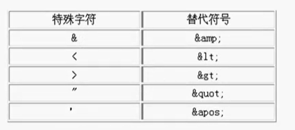
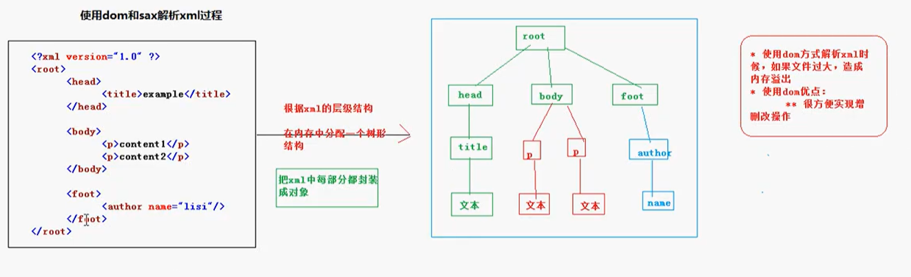
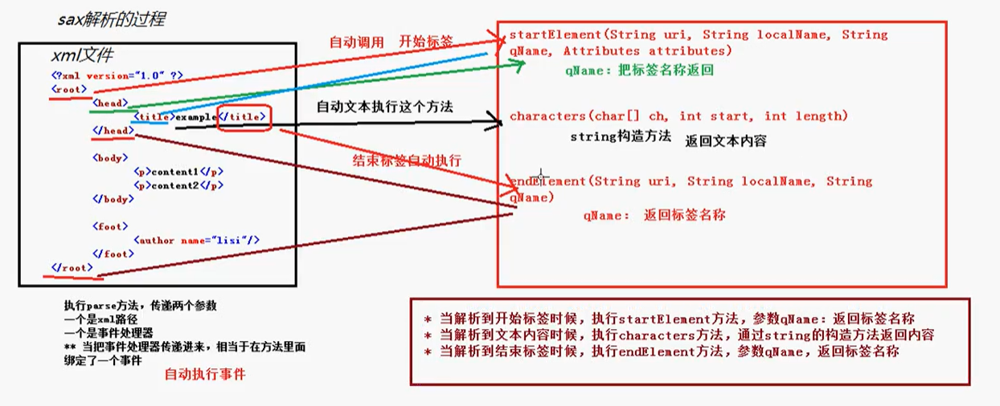

XML (extensible markup Language) 它是一种标记语言，类似 HTML。它被设计的宗旨是传输数据，而非显示数据，主要用来传输数据

XML 的应用
1. 不同的系统之间传输数据
   1. 
2. 用来表示生活中有关的数据
3. 经常用在配置文件

XML 的语法
1. xml 的文档声明
```xml
 <?xml version="1.0" encoding="gbk" standalone="no"?>
```
    - 常用编码有 gbk, utf-8, iso8859-1(不包含中文)
    - standalone: 是否需要依赖其他文件
2. 定义元素
   1. 一个 xml 文档必须有且只有一个根标签
   2. xml 中的标签命名规则： 区分大小写， 不能以数字和下划线开头，不能以xml，XML，Xml等开头，不能包含空格，名称中间不能包含冒号Sche
3. 定义属性
   1. 一个标签上可以有多个属性，属性名称不能相同
   2. 属性的命名规范预元素的命名规范一致
4. 注释  <!--  --> 注释不能有嵌套， 注释不能放在第一行，第一行必须放文档声明
5. 特殊字符 转义字符

6. CDATA 区 可以解决多个字符都需要转义的操作 if(a < b && b < c && d >f) {} 把这些内容放到 CDATA 区里面，不需要转义了。把特殊字符当作文本内容而不是标签了 
```xml
<![CDATA[内容]]>
```
7. PI 指令 （处理字符）  可以在 xml 中设置样式  只能对英文标签起作用，对中文标签不起作用
```xml
<?xml version="1.0" encoding="utf-8"?>
<?xml-stylesheet type="text/css" href="some.css"?> 
```

## xml 的约束
dtd的约束 和 schema约束


# DTD
```dtd
<!ELEMENT person (name, age)>
<!ELEMENT name (#PCDATA)>
<!ELEMENT>
```
1. 简单元素： 没有子元素 
```
<!ELEMENT 元素名称 (#PCDATA)>
```
2. 复杂元素： 有子元素   
```
<!ELEMENT 元素名称 (子元素)>
```
3. 需要在 xml 文件中引入 dtd 文件 
```
<!DOCTYPE 根元素名称 SYSTEM "dtd文件路径">
```
```xml
<?xml version="1.0" encoding="utf-8"?>
<!--只能出现1.dtd 中的标签元素-->
<!DOCTYPE person SYSTEM "1.dtd">
<person>
    <name>zhangsan</name>
    <age>20</age>
</person>
```

dtd的三种引入方式
1. 在xml中外部引入dtd文件
2. 在xml中内部写入dtd约束
```xml
<?xml version="1.0" encoding="utf-8"?>
<!--只能出现1.dtd 中的标签元素-->
<!DOCTYPE person [
    <!ELEMENT person (name, age)>
    <!ELEMENT name (#PCDATA)>
    <!ELEMENT>
]>
<person>
    <name>zhangsan</name>
    <age>20</age>
</person>
``` 
3. 使用外部的 dtd文件（网络上的dtd文件） 
```xml
<!DOCTYPE 根元素 PUBLIC "DTD名称" "DTD文档的URL">
<!--框架 structs2 使用的配置文件使用外部的dtd文件-->
```


## 使用 DTD 定义元素、属性、实体
### 定义元素：
```
<!ELEMENT 元素名 约束>
```
简单元素的约束如下
1. (#PCDATA) 该元素内容字符串类型
2. EMPTY     元素没有内容
3. ANY       元素为任意内容

复杂元素
```xml
<!ELEMENT person (name, age)>
<!--name, age子元素只能出现一次，而且子元素必须按照上述顺序出现-->

<!ELEMENT person (name+, age)>

<!ELEMENT person (name|age)>
```
1. + 子元素出现一次或多次
2. ？子元素出现0次或1次
3. * 子元素出现0次或多次
4. | 子元素出现其中的任意一个

### 定义属性
```xml
<!ATTLIST 元素名称 属性名称 属性类型 属性的约束>
```
属性值类型
1. CDATA: 表示属性的取值为普通的文本字符串
2. ENUMERATED(DTD 没有此关键字)：表示枚举，只能从枚举列表中任选其一，如（鸡肉|牛肉|猪肉|鱼肉）
3. ID: 表示属性的取值不能重复，属性的值只能由字母，下划线开始，不能出现空白字符

属性约束设置说明
1. #REQUIRED: 表示该属性必须出现
2. #IMPLIED: 表示该属性可有可无
3. #FIXED: 表示属性的取值为一个固定值。语法: #FIXED "固定值"
4. 直接值： 表示属性的取值为该默认值

### 定义实体
```
<!ENTITY 实体名称 "实体内容">
```
引用方式 &实体名称;

# XML 解析

XML 解析方式分为两种 : DOM 方式和 SAX 方式
1. DOM:  Document Object Model, 文档对象模型。这种方式是 W3C 推荐的处理 XML 的一种方式
2. SAX： Simple API for XML. 这种方式不是官方标准，属于开源社区 XML-DEV，几乎所有的XML解析器都支持它。

使用 dom 方式解析 xml 的时候，在xml的层级结构在内存中分配一个树形结构，把xml中每部分都封装成对象。如果文件过大，造成内存溢出。 使用dom的优点：很方便实现增删改操作


sax 解析过程：采用事件驱动，边读边解析。从上到下，一行一行解析，解析到某一个对象，把对象名称返回

使用 sax 方式不会造成内存溢出，实现查询，但是不能实现增删改操作。

不同的公司和组织提供了针对 dom 和 sax 方式的解析器，通过 api 方式提供
1. JAXP: 是 SUN 公司推出的解析标准实现
2. Dom4J: 是开源组织推出的解析开发包。 （在实际开发中使用最多）
3. JDOM： 是开源组织推出的解析开发包

## JAXP API 的查看
jaxp （Java API for XML Processing) 开发包是 JavaSE 的一部分，它由以下几个包及其子包组成：
1. org.w3c.dom: 提供 DOM 方式解析 XML 的标准接口
2. org.xml.sax: 提供 SAX 方式解析 XML 的标准结构
3. javax.xml:   提供了解析 XML 文档的类

javax.xml.parsers 包中，定义了几个工厂类。我们可以通过调用这些工厂类，得到对 XML 文档进行解析的 DOM 和 SAX 解析对象。
1. DocumentBuilderFactory
2. SAXParserFactory

jaxp 解析器在 jdk 的 javax.xml.parsers 包里面，里面有四个类，分别是 针对 dom 和 sax 解析使用的类
1. DocumentBuilder
2. DocumnetBuilderFactory
3. SAXParser
4. SAXParserFactory

### DocumentBuilder
public abstract class DocumentBuilder extends Object

此类实例可以通过 DocumentBuilderFactory.newDocumentBuilder() 方法获取

1. public Document parse(File f) throws SAXException, IOException
2. public Document parse(String uri) throws SAXException, IOException
3. public Document parse(InputStream is, String systemId) throws SAXException, IOException


### DocumentBuilderFactory 
public abstract class DocumentBuilderFactory extends Object

此类实例可以通过 DocumentBuilderFactory.newInstance() 方法获取


### org.w3c.dom.Document
public interface Document extends Node

1. NodeList getElementsByTagName(String tagname)
2. Element createElement(String tagName) throws DOMException
3. Text createTextNode(String data)
   
Node 接口中提供有如下方法
1. Node appendChild(Node newChild) throws DOMException 
2. Node removeChild(Node oldChild) throws DOMException
3. Node replaceChild(Node newChild, Node oldChild) throws DOMException
4. Node getParentNode()
5. Node getFirstChild()
6. Node getLastChild()
7. NodeList getChildNodes()
8. Node cloneNode(boolean deep)

NodeList 接口中提供有如下方法
1. Node item(int index)
2. int getLength()

```java
package cn.mldn.demo;

import javax.xml.parsers.DocumentBuilder;
import javax.xml.parsers.DocumentBuilderFactory;

import org.w3c.dom.Document;
import org.w3c.dom.NodeList;

public class Main {
    public static void main(String [] args) throws Exception{
    	DocumentBuilderFactory factory = DocumentBuilderFactory.newInstance();
    	DocumentBuilder builder = factory.newDocumentBuilder();
    	Document document  = builder.parse("src/1.xml");
    	NodeList list = document.getElementsByTagName("name");
    	for (int i = 0; i < list.getLength(); i++) {
    		System.out.println(list.item(i).getTextContent());
    	}
    }
}
```

### javax.xml.transform.Transformer
public abstract class Transformer extends Object

此类实例可以通过 TransformerFactory.newTransformer() 对象方法获取。 TransformerFactory 是抽象类，该类实例可以通过 TransformerFactory.newInstance() 获取

1. public abstract void transform(Source xmlSource, Result outputTarget) throws TransformerException 。将操作的 Document 对象回写到 xml文档中

如： tra.transform(new DOMSource(document), new StreamResult("src/1.xml"));

```java
import javax.xml.parsers.DocumentBuilder;
import javax.xml.parsers.DocumentBuilderFactory;
import javax.xml.transform.Transformer;
import javax.xml.transform.TransformerFactory;
import javax.xml.transform.dom.DOMSource;
import javax.xml.transform.stream.StreamResult;

import org.w3c.dom.Document;
import org.w3c.dom.Element;
import org.w3c.dom.Node;
import org.w3c.dom.Text;

public class Main {
    public static void main(String [] args) throws Exception{
    	DocumentBuilderFactory factory = DocumentBuilderFactory.newInstance();
    	DocumentBuilder builder = factory.newDocumentBuilder();
    	Document document  = builder.parse("src/1.xml");
    	Node node = document.getElementsByTagName("p1").item(0);
    	Element sex = document.createElement("sex");
    	Text text = document.createTextNode("female");
    	sex.appendChild(text);
    	node.appendChild(sex);
    	//回写xml
    	TransformerFactory traFactory = TransformerFactory.newInstance();
    	Transformer tra = traFactory.newTransformer();
    	tra.transform(new DOMSource(document), new StreamResult("src/1.xml"));
    }
}
```


使用 jaxp 删除节点
```java
import javax.xml.parsers.DocumentBuilder;
import javax.xml.parsers.DocumentBuilderFactory;
import javax.xml.transform.Transformer;
import javax.xml.transform.TransformerFactory;
import javax.xml.transform.dom.DOMSource;
import javax.xml.transform.stream.StreamResult;

import org.w3c.dom.Document;
import org.w3c.dom.Element;
import org.w3c.dom.Node;
import org.w3c.dom.Text;

public class Main {
    public static void main(String [] args) throws Exception{
    	DocumentBuilderFactory factory = DocumentBuilderFactory.newInstance();
    	DocumentBuilder builder = factory.newDocumentBuilder();
    	Document document  = builder.parse("src/1.xml");
    	Node person = document.getElementsByTagName("sex").item(0);
    	person.getParentNode().removeChild(person);
    	TransformerFactory traFactory = TransformerFactory.newInstance();
    	Transformer tra = traFactory.newTransformer();
    	tra.transform(new DOMSource(document), new StreamResult("src/1.xml"));
    }
}
```

遍历节点
```java
import javax.xml.parsers.DocumentBuilder;
import javax.xml.parsers.DocumentBuilderFactory;

import org.w3c.dom.Document;
import org.w3c.dom.Node;
import org.w3c.dom.NodeList;

public class Main {
    public static void main(String [] args) throws Exception{
    	DocumentBuilderFactory factory = DocumentBuilderFactory.newInstance();
    	DocumentBuilder builder = factory.newDocumentBuilder();
    	Document document  = builder.parse("src/1.xml");
    	recursive(document);
    }
    
    public static void recursive(Node node) {
    	if (node.getNodeType() == Node.ELEMENT_NODE)
    		System.out.println(node.getNodeName());
    	NodeList childs = node.getChildNodes();
    	for (int i = 0; i < childs.getLength(); i++) {
    		recursive(childs.item(i));
    	}
    }
}
```


# schema 约束
XML Schema 也是一种用于定义和描述 XML 文档结构与内容的模式语言，其出现是为了客服 DTD 的局限性

XML Schema 与 DTD 相比：
1. XML Schema 符合 XML 语法结构
2. DOM、SAX 等 XML API 很容易解析出 XML Schema 文档中的内容
3. XML Schema 对名称空间的支持很好
4. XML Schema 比 XML DTD 支持更多的数据类型，并支持用户自己定义新的数据类型
5. XML Schema 定义约束的能力非常强大，可以对 XML 实例文档做出细致的语义限制
6. XML Schema 不能像 DTD 一样定义实体，比 DTD 更复杂，但 XML Schema 现在已是w3c组织的标准，不能替代DTD

一个 xml 中可以使用多个 schema ，使用命名空间区分。（类似于 Java 里面的包名）.根节点的名称为 schema


## schema 基本语法
所有的 Schema 文档都使用 schema 标签作为其根元素，且其声明通常如下：
```xml
<?xml version="1.0" encoding="UTF-8"?>
<!--xmlns 表示创建的是约束文档-->
<!--targetNamespace 通过什么路径引入schema约束-->
<!--elementFormDefault-->
<schema xmlns="http://www.w3.org/2001/XMLSchema" targetNamespace="http://www.itcast.cn/20140213" elementFormDefault="qualified">
</schema>
```
在 schema 文件里面是有 w3c 提供的属性和标签，约束 xml 文件

创建一个schema文件 1.xsd 
```xml
<?xml version="1.0" encoding="UTF-8"?>
<schema xmlns="http://www.w3.org/2001/XMLSchema" targetNamespace="http://www.example.org/1" xmlns:tns="http://www.example.org/1" elementFormDefault="qualified">
<element name="person">
	<complexType>
		<sequence>
			<element name="name" type="string"></element>
			<element name="age" type="int"></element>
		</sequence>
		<attribute name="id1" type="int" use="required"></attribute>
	</complexType>
</element>
</schema>
```
在xml文件中引入 schema 约束文件
```xml
<?xml version="1.0" encoding="UTF-8"?>
<person xmlns:xsi="http://www.w3.org/2001/XMLSchema-instance" xmlns="http://www.example.org/1"  
xsi:schemaLocation="http://www.example.org/1 1.xsd" id1="12">
	<name>zhangSan</name>
	<age>20</age>
</person>
```
1. xmlns:xsi="http://www.w3.org/2001/XMLSchema-instance" 表示该 xml 文件是被约束的
2. xmlns="http://www.example.org/1"  是约束文档里的 targetNamespace
3. xsi:schemaLocation="http://www.example.org/1 1.xsd"  xsi:schemaLocation 的值为 targetNamespace 空格 约束文档的地址路径


标签：
1. sequence 表示元素出现的顺序
2. all 表示元素只能出现一次
3. choice 表示元素元素只能出现其中的一个
4. element属性值 maxOccurs="unbounded" 表示出现次数没限制
5. any 引用任意元素
6. 定义属性（必须是复杂元素）：
```xml
<attribute name="p1" type="int" use="required"></attribute>
```


# sax 解析的原理
javax.xml.parse.SAXParser 提供方法 ： public void parse(File f, DefaultHandler dh) throws SAXException, IOException 传入文件路径，和事件处理器

DefaultHandler 有以下三个重要方法
1. public void startElement(String uri, String localName, String qName, Attributes attributes) throws SAXException
2. public void characters(char[] ch, int start, int length) throws SAXException
3. public void endElement(String uri, String localName, String qName) throws SAXException

person.xml 文档内容如下：
```xml
<?xml version="1.0" encoding="UTF-8"?>
<person>
	<p1>
		<name>zhangSan</name>
		<age>20</age>
	</p1>
	<p2>
		<name>liSi</name>
		<age>18</age>
	</p2>
</person>
```
```java
import javax.xml.parsers.SAXParser;
import javax.xml.parsers.SAXParserFactory;

import org.xml.sax.Attributes;
import org.xml.sax.SAXException;
import org.xml.sax.helpers.DefaultHandler;

class myDefaultHandler extends DefaultHandler {

	@Override
	public void startElement(String uri, String localName, String qName, Attributes attributes) throws SAXException {
		// TODO Auto-generated method stub
		System.out.println("[start]uri: " + uri + " , localName: " + localName + " , qName: " + qName + " , attributes: " + attributes);
		super.startElement(uri, localName, qName, attributes); 
	}

	@Override
	public void endElement(String uri, String localName, String qName) throws SAXException {
		// TODO Auto-generated method stub
		System.out.println("[end]uri: " + uri + " , localName: " + localName + " , qName: " + qName);
		super.endElement(uri, localName, qName);
	}

	@Override
	public void characters(char[] ch, int start, int length) throws SAXException {
		// TODO Auto-generated method stub
		System.out.println("[text]" + new String(ch, start, length));
		super.characters(ch, start, length);
	}
}

public class Main {
    public static void main(String [] args) throws Exception{
    	SAXParserFactory factory = SAXParserFactory.newInstance();
    	SAXParser parser = factory.newSAXParser();
    	parser.parse("src/person.xml", new myDefaultHandler());
    }
    
}
```


# dom4j
导入dom4j jar 包

解析 xml 过程
```java
import java.net.URL;

import org.dom4j.Document;
import org.dom4j.DocumentException;
import org.dom4j.io.SAXReader;

public class Foo {
	public Document parse(URL url) throws DocumentException {
		SAXReader reader = new SAXReader();
		Document document = reader.read(url);
		return document;
	}
}
```

使用 Iterators
```java
public void bar(Document document) throws DocumentException {
	Element root = document.getRootElement();
	for (Iterator i = root.elementIterator(); i.hasNext();) {
		Element element = (Element)i.next();
		//do something
	}
	for (Iterator i = root.elementIterator("foo"); i.hasNext();) {
		Element element = (Element)i.next();
		//do something
	}
	for (Iterator i = root.attributeIterator(); i.hasNext();) {
		Attribute attribute = (Attribute) i.next();
		//do something
	}
}
```

递归得到所有元素
```java
public void treeWalk(Document document) {
	treeWalk(document.getRootElement());
}
public void treeWalk(Element element) {
	for (int i = 0, size = element.nodeCount(); i < size; i++) {
		Node node = element.node(i);
		if (node instanceof Element) {
			treeWalk((Element)node);
		} else {
			// do somthing
		}
	}
}
```

生成一个xml 文档
```java
import org.dom4j.Document;
import org.dom4j.DocumentHelper;
import org.dom4j.Element;

public class Foo {
	public Document createDocument() {
		Document document = DocumentHelper.createDocument();
		Element root = document.addElement("root");
		Element author1 = root.addElement("author")
			.addAttribute("name", "James")
			.addAttribute("location", "UK")
			.addText("James Strachan");
		return document;
	}
}
```

将 一个 document 写入文件
```java
FileWriter out = new FileWriter("foo.xml");
document.write(out);
```

如果想将document按一定格式写入文件
```java
public void write(Document document) throws IOException {
	XMLWriter writer = new XMLWriter(new FileWriter("output.xml"));
	writer.write(document);
	writer.close();

	OutputFormat format = OutputFormat.createPrettyPrint();
	writer = new XMLWriter(System.out, format);
	writer.write(document);

	format = OutputFormat.createCompactFormat();
	writer = new XMLWriter(System.out, format);
	writer.write(document);
}
```

## 使用dom4j 实现在末尾添加节点的操作
```java
import java.io.FileOutputStream;

import org.dom4j.Document;
import org.dom4j.Element;
import org.dom4j.io.OutputFormat;
import org.dom4j.io.SAXReader;
import org.dom4j.io.XMLWriter;

public class Main {
    public static void main(String [] args) throws Exception{
    	SAXReader reader = new SAXReader();
    	Document document = reader.read("src/person.xml");
    	Element root = document.getRootElement();
    	Element p1 = root.element("p1");
    	Element sex = p1.addElement("sex");
    	sex.setText("female");
    	XMLWriter writer = new XMLWriter(new FileOutputStream("src/person.xml"), OutputFormat.createPrettyPrint());
    	writer.write(document);
    	writer.close();
    }
}
```

# 使用 dom4j 在特定位置添加节点的操作
```java
import java.io.FileOutputStream;
import java.util.List;

import org.dom4j.Document;
import org.dom4j.DocumentHelper;
import org.dom4j.Element;
import org.dom4j.io.OutputFormat;
import org.dom4j.io.SAXReader;
import org.dom4j.io.XMLWriter;

public class Main {
    public static void main(String [] args) throws Exception{
    	SAXReader reader = new SAXReader();
    	Document document = reader.read("src/person.xml");
    	Element root = document.getRootElement();
    	Element p1 = root.element("p1");
    	@SuppressWarnings("unchecked")
		List<Element> list = p1.elements();
    	Element school = DocumentHelper.createElement("school");
    	school.setText("ecit");
    	list.add(1, school);
    	XMLWriter writer = new XMLWriter(new FileOutputStream("src/person.xml"), OutputFormat.createPrettyPrint());
    	writer.write(document);
    	writer.close();
    }
}
```

# XPATH
dom4j 支持 XPATH 的操作，可以直接获取到某个元素，不需要一层层解析

书写形式:
1. /AAA/BBB  查找 AAA下的BBB
2. //BBB 查找所有的BBB标签
3. /AAA/* 查找AAA下的所有标签
4. /AAA/BBB[1] 查找AAA下的第一个BBB
5. /AAA/BBB[last()] 查找AAA下的最后一个BBB
6. //@id 查找有属性 id 的标签
7. //BBB[@id] 查找有属性 id 的BBB标签
8. //BBB[@id='b1']

如果想要在 dom4j 里面使用大 xpath，需要导入支持 xpath 的 jar 包 jaxen-1.1-beta-6.jar

dom4j 中提供了有两个方法来支持 xpath
1. selectNodes("xpath 表达式")
2. selectSingleNode("xpath 表达式")

```java
import java.util.List;

import org.dom4j.Document;
import org.dom4j.Node;
import org.dom4j.io.SAXReader;

public class Main {
    public static void main(String [] args) throws Exception{
    	SAXReader reader = new SAXReader();
    	Document document = reader.read("src/person.xml");
    	@SuppressWarnings("unchecked")
		List<Node> list = document.selectNodes("//name");
    	list.forEach((node)->{
    		System.out.println(node.getText());
    	});
    }
}
```