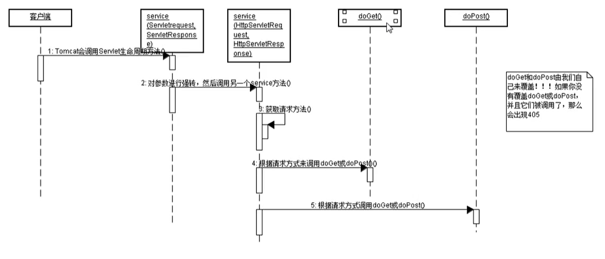

Java Web 三大组件：Servlet, Filter, Listener

Servlet 的作用是处理请求，服务器会把接收到的请求交给 Servlet 来处理，在Servlet 种通常需要：
1. 接收请求数据
2. 处理请求
3. 完成响应

例如客户端发出登录请求，或者输出注册请求，这些请求都应该由 Servlet 来完成处理！Servlet 需要我们自己来编写，每个 Servlet 必须实现 javax.servlet.Servlet 接口。

在 Java Web b/s 架构种， Servlet 扮演了重要的角色，作为一个中转处理的容器，他连接了客户端和服务器端的信息交互和处理。简单来说，客户端发送请求，传递到 servlet 容器，而servlet将数据转换成服务器端可以处理的数据再发送给服务器端，再数据处理之后，再传递到servlet容器，servlet再转译到客户端，完成了一次客户端和服务器端的信息交互。

Servlet是通过Java编写的，因为他也具备了Java的一些特点，比如跨平台性，可扩展性高，然而他的优点不仅仅是局限于语言方面，因为Servlet的出现，可以使我们将JSP页面中的一些JAVA代码移植到Servlet中来，可无疑使前端人员深受喜欢，方便了项目的修改完善，而Servlet的使用也是非常的简单

Servlet的生命周期有四个阶段
1. 实例化，调用构造函数
2. 初始化， 调用 init() 方法
3. 请求处理，调用 service 方法
4. 服务终止也就是销毁阶段，调用 destroy 方法

前台如何将数据传递给Servlet？也是非常简单的，只需表单提交就可以轻松完成，Servlet可以使用request.getParameter来接受，传递给前台就可以使用request.setA什么的来赋值。

页面提交的时候有get和post两种方式，这俩种方式都会在Servlet中处理，如果是get则会调用doget，post则会dopost，而同时使用，只需要post调用doget方法就可以。

# 实现 Servlet 方式
实现 Servlet 有三种方式
1. 实现 javax.servlet.Servlet 接口
2. 继承 javax.servlet.GenericServlet 类
3. 继承 javax.servlet.http.HttpServlet 类

## javax.servlet.Servlet
Servlet 接口源码如下：
```java
public interface Servlet {
    public void init(ServletConfig config) throws ServletException;
    public ServletConfig getServletConfig();
    public void service(ServletRequest req, ServletResponse res) throws ServletException, IOException;
    public String getServletInfo();
    public void destroy();
}
```
Servlet 中的方法大多数不由我们调用，由 tomcat 调用，并且Servlet 对象也不由我们创建， 由 tomcat 创建

### Servlet 生命周期
如何让浏览器访问 Servlet
1. 给 Servlet 指定一个 Servlet 路径 （让 Servlet 与一个路径绑定在一起）
2. 浏览器访问 Servlet 路径

给 Servlet 配置 Servlet 路径， 需要在 web.xml 中对 Servlet 进行配置
```xml
<servlet>
    <servlet-name>xxx</servlet-name>
    <servlet-class>cn.web.servlet.AServlet</servlet-class>
    <init-param>
    	<param-name>p1</param-name>
    	<param-value>v1</param-value>
    </init-param>
    <init-param>
    	<param-name>p2</param-name>
    	<param-value>v2</param-value>
    </init-param>
</servlet>

<servlet-mapping>
    <servlet-name>xxx</servlet-name>
    <url-pattern>/AServlet</url-pattern>
</servlet-mapping>
```
生命周期方法
1. void init() 创建之后初始化
2. void service(ServletRequest request, ServletResponse response) 每次处理请求都会被执行,
3. void destroy() 销毁之前执行
 
特性：
1. 单例，一个类只有一个对象，当然可能存在多个 Servlet 类
2. 线程不安全的，所以它的效率是高的


## javax.servlet.ServletConfig
ServletConfig 的源码如下
```java
public interface ServletConfig {
    public String getServletName();
    public ServletContext getServletContext();
    public String getInitParameter(String name);
    public Enumeration<String> getInitParameterNames();
}
```
1. String getServletName(); 返回 <servlet-name> 中的内容， <servlet-class>中的内容无法被获取
2. ServletContext getServletContext(); 获取 Servlet 上下文对象
3. String getInitParameter(String name); 获取指定初始化参数值
4. public Enumeration<String> getInitParameterNames(); 获取所有初始化参数名称

## Servlet 相关类之 ServletRequest 和 ServletResponse 对象的简单介绍
javax.servlet.ServletRequest


javax.servlet.ServletResponse


## javax.servlet.GenericServlet 介绍
public abstract class GenericServlet extends Object implements Servlet, ServletConfig, Serializable


## javax.servlet.http.HttpServlet 介绍
public abstract class HttpServlet extends GenericServlet


必须重写 doGet 或者 doPost 方法要不然访问该 Servlet 会出现 405 错误，方法不允许


# Servlet 细节

## 让服务器启动时就创建 Servlet （平时不会使用）
一般都是第一次请求的时候创建
```xml
<servlet>
	<servlet-name>BServlet</servlet-name>
    <servlet-class>cn.web.servlet.BServlet</servlet-class>
    <!--在 load-on-startup 中配置一个非负整数，就可以使 Servlet 在服务器启动时就创建(按值大小顺序创建)-->
    <load-on-startup>0</load-on-startup>
</servlet>
```

## url-pattern
url-pattern 是 servlet-mapping 的子元素，用来指定 Servlet 的访问路径，即 URL。它必须是以 “/” 开头
1. 可以在 servlet-mapping 中给出多个 url-pattern
2. 还可以在 url-pattern 中使用通配符 “*”， 注意通配符要么为前缀，要么为后缀，且一个 URL 中最多只能出现一个 通配符。
```xml
<!--路径匹配-->
<url-pattern>/servlet/*<url-pattern>
<!--扩展名匹配-->
<url-pattern>*.do</url-pattern>
<url-pattern>/*<url-pattern>
```

# web.xml 文件的继承 （了解）
每个完整的 JavaWeb 应用中都需要有 web.xml, 但我们不知道所有的 web.xml 文件都有一个共同的父文件，它在 Tomcat 的 conf/web.xml 路径


# servlet 与反射


# ServletContext
一个项目只有一个 ServletContext 对象， 使用它可以给多个 Servlet 传递数据

## ServletContext 概述
服务器会为每个应用创建一个 ServletContext 对象
1. ServletContext 对象的创建是在服务器启动时完成的；
2. ServletContext 对象的销毁是在服务器关闭时完成的；

ServletConfig, GenericServlet, HttpSession, ServletContextEvent 中有 getServletContext() 方法

# 域对象
ServletContext是 JavaWeb 四大域对象之一，域对象就是用来在多个 Servlet 中传递数据，域对象必须有要存取数据功能，因为域对象内部有一个 Map，用来存储数据

JavaWeb三大域对象： PageContext, ServletContext, HttpSession, ServletRequest

## ServletContext
1. void setAttribute(String name, Object value) 用来存储一个对象，也可以称之为存储一个域属性
2. Object getAttribute(String name) 用来获取 ServletContext 中的数据。
3. void removeAttribute(String name)
4. Enumeration getAttributeNames() 获取所有域属性的名称


# 获取应用初始化参数
Servlet 也可以获取初始化参数，但它是局部的参数；也就是说，一个 Servlet 只能获取自己的初始化参数，不能获取别人的，即初始化参数只为一个 Servlet 准备！

可以配置公共的初始化参数，为所有的 Servlet 使用， 这需要 ServletContext 才能使用
```xml
<web-app ...>
...
    <context-param>
        <param-name>paramName1</param-name>
        <param-value>paramValue1</param-value>
    </context-param>
```

# ServletContext 获取资源的相关方法

## 获取真实路径
String realPath = servletContext.getRealPath("/a.txt");

## 获取资源流
InputStream in = servletContext.getResourceAsStream("/a.txt");

## 获取指定目录下的所有资源路径
Set set = sevletContext.getResourcePaths("/WEB-INF")

# 获取类路径下资源
1. Class
2. ClassLoader

类路径对一个 JavaWeb 项目而言，就是 /WEB-INF/classes 和 /WEB-INF/lib/每个jar包
