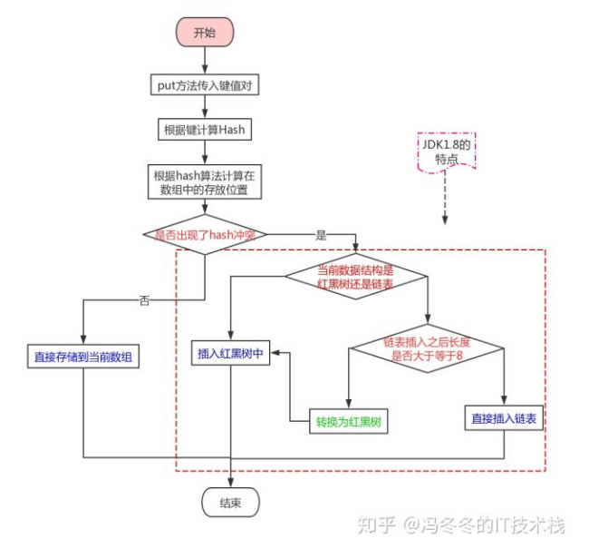
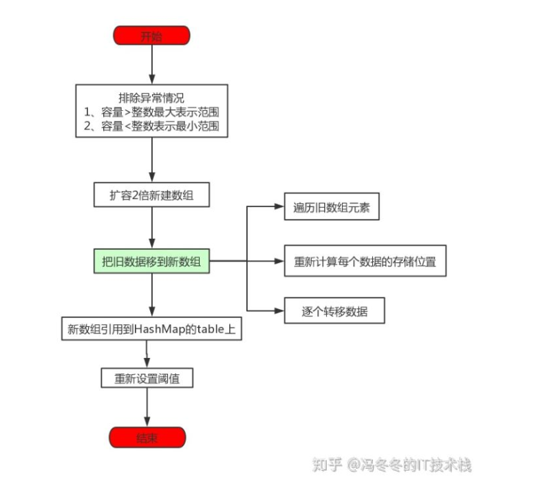

# 底层数据结构
jdk1.7中，“拉链式”存储方法。

jdk1.8改良，只有在链表长度不小于8，而且数组的长度不小于64的时候才会将链表转化为红黑树

改良后优点：查找效率从O(n)降低为O(logn)

为什么需要判断链表长度进行改良
1. 构造红黑树比构造链表复杂。
2. HashMap的频繁扩容，会造成底部红黑树不断的进行拆分和重组，这是非常耗时的。

## 存储元素put

流程：
1. 调用put方法传入键值对
2. 使用hash算法计算hash值
3. 根据hash值确定存放的位置，判断是否和其他键值对位置发生了冲突
4. 若没有发生冲突，直接存放在数组中即可
5. 若发生了冲突，还要判断此时的数据结构是什么？
6. 若此时的数据结构是红黑树，那就直接插入红黑树中
7. 若此时的数据结构是链表，判断插入之后是否大于等于8
8. 插入之后大于8了，就要先调整为红黑树，在插入
9. 插入之后不大于8，那么就直接插入到链表尾部即可。


### hash算法
1. string类hashcode算法：
```java
public int hashCode() {
    int h = hash;
    if (h == 0 && value.length > 0) {
        char val[] = value;

        for (int i = 0; i < value.length; i++) {
            h = 31 * h + val[i];
        }
        hash = h;
    }
    return h;
}
```
2. 数值类型hashcode算法：
整型值直接返回原值，double类的hashcode首先会将它的值转为long类型，然后返回底32位和高32位的异或的结果作为hashCode。
```java
@Override
public int hashCode() {
    return Double.hashCode(value);
}
public int hashCode(double value) {
    long bits = doubleToLongBits(value);
    return (int)(bits^(bits >>> 32));
}
```
3. Date类的hashcode算法：
只是返回了Date对象所封装的时间的低32位和高32位的异或结果
```java
public int hashCode() {
    long ht = this.getTime();
    return (int) ht ^ (int) (ht >> 32);
}
```
4. 由hashcode获取桶号：
前面我们介绍了计算对象hashCode的一些方法，那么我们获取了hashCode之后，如何进一步得到桶号呢？一个直接的办法就是直接拿得到的hashCode除以capacity（桶的数量），然后用所得的余数作为桶号。不过在Java中，hashCode是int型的，而Java中的int型均为有符号，所以我们要是直接使用返回的hashCode的话可能会得到一个负数，显然桶号是不能为负的。所以我们先将返回的hashCode转变为一个非负整数，再用它除以capacity取余数，作为key的对应桶号，具体代码如下：
```java
private int hash(K key) {

    return (x.hashCode() & 0x7fffffff) % M;

} 
```

## 扩容

键值对数量size大于阙值（threshold）开始扩容
1. 排除异常情况（容量>整数最大表示范围，或小于整数最小表示范围）
2. 扩容两倍新建数组
3. 把旧数据移到新数组（1. 遍历旧数组元素， 2. 重新计算每个数据的存储位置，3. 逐个转移数组）
4. 新数组引用到HashMap的table上
5. 重新设置阙值
扩容源码：
```java
    final Node<K,V>[] resize() {
        Node<K,V>[] oldTab = table;
        int oldCap = (oldTab == null) ? 0 : oldTab.length;
        int oldThr = threshold;
        int newCap, newThr = 0;
        //第一部分：扩容
        if (oldCap > 0) {
            if (oldCap >= MAXIMUM_CAPACITY) {
                threshold = Integer.MAX_VALUE;
                return oldTab;
            }
            else if ((newCap = oldCap << 1) < MAXIMUM_CAPACITY &&
                     oldCap >= DEFAULT_INITIAL_CAPACITY)
                newThr = oldThr << 1; // double threshold
        }
        //第二部分：设置阈值
        else if (oldThr > 0) // initial capacity was placed in threshold
            newCap = oldThr;
        else {               // zero initial threshold signifies using defaults
            newCap = DEFAULT_INITIAL_CAPACITY;
            newThr = (int)(DEFAULT_LOAD_FACTOR * DEFAULT_INITIAL_CAPACITY);
        }
        if (newThr == 0) {
            float ft = (float)newCap * loadFactor;
            newThr = (newCap < MAXIMUM_CAPACITY && ft < (float)MAXIMUM_CAPACITY ?
                      (int)ft : Integer.MAX_VALUE);
        }
        threshold = newThr;
        @SuppressWarnings({"rawtypes","unchecked"})
            Node<K,V>[] newTab = (Node<K,V>[])new Node[newCap];
        table = newTab;
        //第三部分：旧数据保存在新数组里面
        if (oldTab != null) {
            for (int j = 0; j < oldCap; ++j) {
                Node<K,V> e;
                if ((e = oldTab[j]) != null) {
                    oldTab[j] = null;
                    //只有一个节点，通过索引位置直接映射
                    if (e.next == null)
                        newTab[e.hash & (newCap - 1)] = e;
                    //如果是红黑树，需要进行树拆分然后映射
                    else if (e instanceof TreeNode)
                        ((TreeNode<K,V>)e).split(this, newTab, j, oldCap);
                    else {
                         //如果是多个节点的链表，将原链表拆分为两个链表
                        Node<K,V> loHead = null, loTail = null;
                        Node<K,V> hiHead = null, hiTail = null;
                        Node<K,V> next;
                        do {
                            next = e.next;
                            if ((e.hash & oldCap) == 0) {
                                if (loTail == null)
                                    loHead = e;
                                else
                                    loTail.next = e;
                                loTail = e;
                            }
                            else {
                                if (hiTail == null)
                                    hiHead = e;
                                else
                                    hiTail.next = e;
                                hiTail = e;
                            }
                        } while ((e = next) != null);
                        //链表1存于原索引
                        if (loTail != null) {
                            loTail.next = null;
                            newTab[j] = loHead;
                        }
                        //链表2存于原索引加上原hash桶长度的偏移量
                        if (hiTail != null) {
                            hiTail.next = null;
                            newTab[j + oldCap] = hiHead;
                        }
                    }
                }
            }
        }
        return newTab;
    }
```
