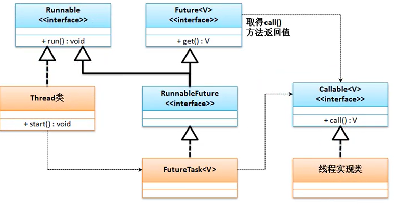

# 继承Thread类实现多线程
java里面提供有一个java.lang.Thread的程序类，那么一个类只要继承了此类就表示这个类为线程的主题类，但是要想实现多线程，还需要覆写Thread类中提供的一个run()方法
```java
class MyThread extends Thread {
	private String title;
	public MyThread(String title) {
		this.title = title;
	}
	@Override
	public void run() {
		for (int x = 0; x < 10; x++) {
			System.out.println(this.title + "运行， x = " + x);
		}
	}
}

public class ThreadDemo {

	public static void main(String[] args) {
		// TODO Auto-generated method stub
		new MyThread("线程A").start();
		new MyThread("线程B").start();
		new MyThread("线程C").start();
	}

}
```

## 为什么多线程的启用不直接采用run()方法，而必须使用Thread类中的start()方法呢？
首先查看start()方法的源码
```java
	public synchronized void start() {
        if (threadStatus != 0)                                              //判断线程的状态
            throw new IllegalThreadStateException();                        //如果线程已经启动了，抛出了异常

        group.add(this);

        boolean started = false;
        try {
            start0();                          
            started = true;
        } finally {
            try {
                if (!started) {
                    group.threadStartFailed(this);
                }
            } catch (Throwable ignore) {
                /* do nothing. If start0 threw a Throwable then
                  it will be passed up the call stack */
            }
        }
    }
	private native void start0();
```
发现在 start() 方法里抛出了一个 "IllegalThreadStateException" 的异常类对象，但是整个程序并没有明确的使用 throws 或者是 try...catch 处理。因为该异常是RuntimeException的子类。每一个线程的对象只允许启动一次，如果重复启动，则抛出此异常。

在Java程序执行的过程中，考虑到对于不同层次开发者的要求，所以其支持有本地的操作系统函数调用，而这项技术则被称为 JNI（Java Native Interface） 技术，但是Java开发过程之中并不推荐这样使用.利用这项技术可以使用一些操作系统底层的函数进行一些特殊处理，而在 Thread 类里面提供的start0()就表示需要将此方法依赖于不同的操作系统实现。

任何情况下，只要定义了多线程，多线程的启动方法永远只有一种方案: Thread 类中的 start() 方法

# 基于 Runnable 接口实现多线程
虽然可以通过Thread类的继承来实现多线程的定义，但是在Java程序里面对于继承永远都是存在有单继承局限的，Java里面又提供有第二种多线程的主体定义结构：实现java.lang.Runnable 接口。源码定义如下:
```java
@FunctionalInterface
public interface Runnable {
	void run();
}
```
使用如下
```java
class MyThread implements Runnable {
	private String title;
	public MyThread(String title) {
		this.title = title;
	}
	@Override
	public void run() {
		for (int x = 0; x < 10; x++) {
			System.out.println(this.title + "运行， x = " + x);
		}
	}
}

public class ThreadDemo {

	public static void main(String[] args) {
		// TODO Auto-generated method stub
		Thread threadA = new Thread(new MyThread("线程A"));
		Thread threadB = new Thread(new MyThread("线程B"));
		Thread threadC = new Thread(new MyThread("线程C"));
		threadA.start();
		threadB.start();
		threadC.start();
	}

}
```
这个时候的多线程实现里面可以发现，由于只是实现了Runnable接口对象，所以线程主体类上就不再有单继承的局限。那么这样的设计才是一个标准的设计。
可以发现从 JDK1.8 开始， Runnable 接口使用了函数式接口定义，所以也可以直接利用 Lamda 表达式进行线程类的实现。
```java
public class ThreadDemo {

	public static void main(String[] args) {
		for(int x = 0; x < 3; x++) {
			String title = "线程对象-" + x;
			Runnable run = ()->{
				for (int y = 0; y < 10; y++) {
					System.out.println(title + "运行,  y = " + y);            //这里传进去的title必须是final类型的
				}
			};
			new Thread(run).start();
		}
	}
}

```
在以后的开发之中对于多线程的实现，优先考虑的就是Runnable接口实现，并且永恒都是通过 Thread 类对象启用多线程。

# Thread 与 Runnable 的关系
Thread的定义
```
public class Thread extends Object implements Runnable {}
```

多线程开发的本质实质上是多个线程可以进行同一资源的抢占，Thread主要描述线程，而资源的描述主要通过Runnable


# Callable 接口实现多线程
Runnable 接口有一个缺点，当线程执行完毕后我们无法获得一个返回值。所以从 JDK1.5 之后就提出了一个新的线程实现接口: java.util.concurrent.Callable
定义如下
```java
@FunctionalInterface 
public interface Callable<V> {
	public V call() throws Exception;
}

public class FutureTask<V> extends Object implements RunnableFuture<V>{}

public interface RunnableFuture<V> extends Runnable, Future<V> {
	void run();
}
```

```java
package cn.mldn.thread;

import java.util.concurrent.Callable;
import java.util.concurrent.FutureTask;

class MyCallable implements Callable<String> {
	@Override
	public String call() throws Exception {
		for (int x = 0; x < 10; x++) {
			System.out.println("****** 线程执行、x = " + x);
		}
		return "线程执行完毕。";
	}
}

public class CallableDemo {
	public static void main(String[] args) throws Exception {
		FutureTask<String> task = new FutureTask<>(new MyCallable());
		new Thread(task).start();
		System.out.println("[线程返回数据]" + task.get());
	}
}
```

# 线程运行状态
对于线程的开发而言，编写程序的过程之中总是按照：定义线程主体类，而后通过 Thread 类进行线程的启动，但是并不意味着你调用了start() 方法，线程就已经开始运行了，因为整体的线程处理有自己的一套运行状态。

1. 任何的对象都应该使用 Thread 类进行封装，所以线程的启动使用的是start(), 但是启动的时候，实际上若干个线程都将进入就绪状态，现在并没有执行
2. 进入到就绪状态后，就需要等待进行资源调度，当某一个线程调度成功之后则进入到运行状态(run()方法)，不可能一直持续执行下去，中间需要产生一些暂停状态，例如：某个线程执行一段时间之后就需要让出资源；随后进入阻塞状态，然后重新回归到就绪状态
3. 当run()方法执行完毕之后，实际上该线程的主要任务也就结束了，那么此时就可以直接进入到停止状态。


多线程的主要操作方法都在Thread类中定义
# 线程的命名和取得
多线程的运行状态是不确定的，那么在程序的开发之中为了可以获取需要使用到的线程，就只能依靠线程的名字来进行我们的操作，在 Thread 类中就提供有线程名称的处理

1. Thread 的构造方法： public Thread(Runnable target, String name);
2. 取得名字:           public final String getName();
3. 设置名字:           public final void setName(String name);
4. 获取当前线程：      public static Thread currentThread();


# 线程的休眠
如果现在希望某一个线程可以暂缓执行一次，这个时候可以使用线程的休眠来处理，在Thread中定义的休眠方法如下：
1. public static void sleep(long millis) throws InterruptedException
2. public static void sleep(long millis, int nanos) throws InterruptedException

在进行休眠的时候有可能会产生中断异常  InterruptedException 属于Exception的子类，必须进行处理


# 线程的中断
在Thread类里面提供有这种中断执行的处理方法
1. 判断线程是否被中断: public boolean isInterrupted();
2. 中断线程执行：      public void interrupt();

所有正在执行的线程都是可以被中断的，中断线程必须进行异常处理

# 线程强制运行
所谓的线程的强制执行指的是当满足某些条件之后，某一个线程对象可以一直独占资源，一直到该线程的程序执行结束。
```
public final void join() throws InterruptedException
```
使用如下
```java
public class ThreadDemo {

	public static void main(String[] args) throws Exception {
		Thread mainThread = Thread.currentThread();
		Thread thread = new Thread(()-> {
			for(int x = 0; x < 100; x++) {
				if (x == 3) {
					try {
						mainThread.join();
					} catch (InterruptedException e) {
						// TODO Auto-generated catch block
						e.printStackTrace();
					}
				}
				System.out.println(Thread.currentThread().getName() + "执行、x = " + x);
			}
		}, "玩耍的线程");
		thread.start();
		for (int x = 0; x < 100; x++) {
			System.out.println("【主线程】 number = " + x);
		}
	}
}
```

# 线程礼让
先将资源让出去让别的线程先执行。线程的礼让可以使用Thread中提供的yield方法
```
public static void yield()
```
礼让执行的时候每一次调用yield()方法都只会礼让一次当前的资源。


# 线程的优先级
从理论上，线程的优先级越高越有可能先执行（越有可能先抢占到资源）。在Thread类里面针对优先级提供有两个处理方法
1. 设置优先级： public final void setPriority(int newPriority)
2. 获取优先级： public final int getPriority()

在进行优先级定义的时候都是通过 int 型的数字来完成的,而对此数字的选择在Thread里面就定义有三个常量
1. public static final int MAX_PRIORITY;   10
2. public static final int NORM_PRIORITY;   5
3. public static final int MIN_PRIORITY;    1

主线程和默认的线程的优先级都是中等优先级

