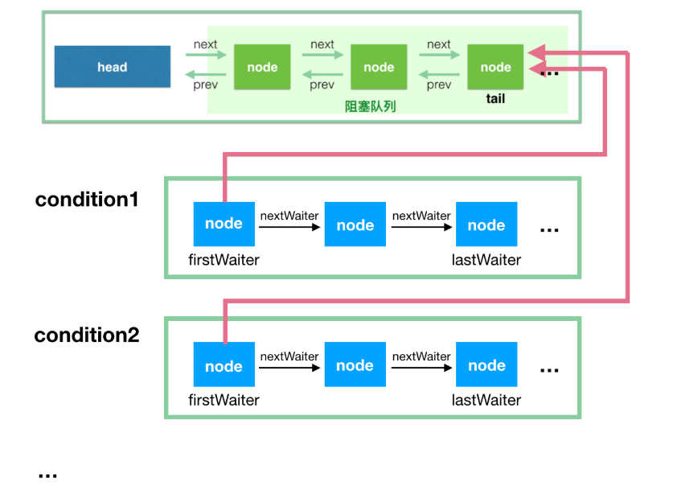

# 框架
.png)
它维护了一个 volatile int state (代表共享资源)和一个 FIFO 线程等待队列（多线程争用资源被阻塞时会进入此队列） 。这里volatile是核心关键词，具体volatile的语义，在此不述。state的访问方式有三种:
1. getState()
2. setState()
3. compareAndSetState()

AQS定义两种资源共享方式：Exclusive（独占，只有一个线程能执行，如ReentrantLock）和Share（共享，多个线程可同时执行，如Semaphore/CountDownLatch）。

不同的自定义同步器争用共享资源的方式也不同。自定义同步器在实现时只需要实现共享资源state的获取与释放方式即可，至于具体线程等待队列的维护（如获取资源失败入队/唤醒出队等），AQS已经在底层实现好了。自定义同步器实现时主要实现以下几种方法：
1. isHeldExclusively(): 该线程是否正在独占资源。只有用到condition才需要去实现它。
2. tryAcquire(int): 独占方式。尝试获取资源，成功则返回true，失败则返回false。
3. tryRelease(int): 独占方式。尝试释放资源，成功则返回true，失败则返回false。
4. tryAcquireShared(int): 共享方式。尝试获取资源。负数表示失败；0表示成功，但没有剩余可用资源；正数表示成功，且有剩余资源。
5. tryReleaseSahred(int): 共享方式。尝试释放资源，如果释放后允许唤醒后续等该结点返回 true, 否则返回 false;

以ReentrantLock为例，state初始化为0，表示未锁定状态。A线程lock()时，会调用tryAcquire()独占该锁并将state+1。此后，其他线程再tryAcquire()时就会失败，直到A线程unlock()到state=0（即释放锁）为止，其它线程才有机会获取该锁。当然，释放锁之前，A线程自己是可以重复获取此锁的（state会累加），这就是可重入的概念。但要注意，获取多少次就要释放多么次，这样才能保证state是能回到零态的。

再以 CountDownLatch 为例，任务分为N个子线程去执行，state也初始化为N（注意N要与线程个数一致）。这 N 个子线程是并行执行的，每个子线程执行完成后countDown() 一次， state 会 CAS 减 1.等到所有子线程都执行完成后(即state = 0),会 unpark() 主调用线程，然后主调用线程就会从 await() 函数返回，继续后余动作。

一般来说，自定义同步器要么是独占方法，要么是共享方式，他们也只需实现tryAcquire-tryRelease、tryAcquireShared-tryReleaseShared中的一种即可。但AQS也支持自定义同步器同时实现独占和共享两种方式，如ReentrantReadWriteLock。


# 源码详解
本节开始讲解 AQS 的源码实现。依照 acquire-release、acquireShared-releaseShared 的次序来
## acquire(int)
此方法是独占模式下线程获取共享资源的顶层入口。如果获取到资源，线程直接返回，否则进入等待队列，直到获取到资源为止，且整个过程忽略中断的影响。这也正是lock()的语义，当然不仅仅只限于lock()。获取到资源后，线程就可以去执行其临界区代码了。下面是acquire()的源码：
```java
public final void acquire(int arg) {
    if (!tryAcquire(arg) && acquireQueued(addWaiter(Node.EXCLUSIVE), arg)) {
        selfInterrupt();
    }
}
```
函数流程如下：
1. tryAcquire() 尝试直接去获取资源，如果成功则直接返回；
2. addWaiter() 将线程加入等待队列的尾部，并标记为独占模式
3. acquireQueued() 使线程在等待队列中获取资源，只是获取资源后才再进行自我中断 selfInterrupt(), 将中断补上

### tryAcquire(int)
此方法尝试去获取独占资源。如果获取成功，则直接返回 true, 否则直接返回 false。这也是 tryLock()的语义，还是那句话，当然不仅仅只限于tryLock()。如下是tryAcquire()的源码：
```java
protected boolean tryAcquire(int arg) {
    throw new UnsupportedOperationException();
}
```
什么？直接throw异常？说好的功能呢？好吧，还记得概述里讲的AQS只是一个框架，具体资源的获取/释放方式交由自定义同步器去实现吗？就是这里了！！！AQS这里只定义了一个接口，具体资源的获取交由自定义同步器去实现了（通过state的get/set/CAS）！！！至于能不能重入，能不能加塞，那就看具体的自定义同步器怎么去设计了！！！当然，自定义同步器在进行资源访问时要考虑线程安全的影响。

这里之所以没有定义成abstract，是因为独占模式下只用实现tryAcquire-tryRelease，而共享模式下只用实现tryAcquireShared-tryReleaseShared。如果都定义成abstract，那么每个模式也要去实现另一模式下的接口。说到底，Doug Lea还是站在咱们开发者的角度，尽量减少不必要的工作量。

### addWaiter(Node)
此方法用于将当前线程加入到等待队列的队尾，并返回当前线程所在的结点。源码：
```java
private Node addWaiter(Node mode) {
    // 以给定模式构造结点。mode有两种：EXCLUSIVE（独占）和SHARED（共享）
    Node node = new Node(Thread.currentThread(), mode);

    //尝试快速方式直接放到队尾
    Node pred = tail;
    if (pred != null) {
        node.prev = pred;
        if (compareAndSetTail(pred, node)) {
            pred.next = node;
            return node;
        }
    }
    // 上一步失败则通过enq入队。
    enq(node);
    return node;
}
```
Node 结点是对每一个访问同步代码的线程的封装，其中包含了需要同步的线程本身以及线程的状态，是否被阻塞，是否等待唤醒，是否已经被取消等。变量 waitStatus 则表示当前被封装成 Node 结点的等待状态，共有 4 种取值 CANCELLED、SIGNAL、CONDITION、PROPAGATE
1. CANCELLED: 值为1， 在同步队列种等待的线程等待超时或被中断，需要从同步队列种取消该 Node 的结点，其结点的 waitStatus 为CANCELLED，即结束状态，进入该状态后的结点将不会再变化。
2. SIGNAL：值为-1，被标识为该等待唤醒状态的后继结点，当其前继结点的线程释放了同步锁或被取消，将会通知该后继结点的线程执行。说白了，就是处于唤醒状态，只要前继结点释放锁，就会通知标识为SIGNAL状态的后继结点的线程执行。
3. CONDITION：值为-2，与Condition相关，该标识的结点处于等待队列中，结点的线程等待在Condition上，当其他线程调用了Condition的signal()方法后，CONDITION状态的结点将从等待队列转移到同步队列中，等待获取同步锁。
4. PROPAGATE: 值为-3，与共享模式相关，在共享模式种，该状态标识结点的线程处于可运行状态。
5. 0状态：值为0，代表初始状态。

AQS在判断状态时，通过用waitStatus>0表示取消状态，而waitStatus<0表示有效状态。

#### enq(Node)
此方法用于将node加入队尾。源码如下：
```java
private Node enq(final Node node) {
    // CAS"自旋"，直到成功加入队尾
    for(;;) {
        Node t = tail;
        if (t == null) {
            //队列为空，创建一个空的标志结点作为head结点，并将tail指向它
            if (compareAndSetHead(new Node())) {
                tail = head;
            }
        } else {
            //正常流程，放入队尾
            node.prev = t;
            if (compareAndSetTail(t, node)) {
                t.next = node;
                return t;
            }
        }
    }
}
```

## acuquireQueue(Node, int)
OK，通过tryAcquire()和addWaiter()，该线程获取资源失败，已经被放入等待队列尾部了。聪明的你立刻应该能想到该线程下一部该干什么了吧：进入等待状态休息，直到其他线程彻底释放资源后唤醒自己，自己再拿到资源，然后就可以去干自己想干的事了。没错，就是这样！是不是跟医院排队拿号有点相似~~acquireQueued()就是干这件事：在等待队列中排队拿号（中间没其它事干可以休息），直到拿到号后再返回。这个函数非常关键，还是上源码吧：
```java
final boolean acqiureQueued(final Node node, int arg) {
    boolean failed = true;// 标记是否成功拿到资源
    try {
        boolean interrupted = false; //标记等待过程种是否被中断过
        //又是一个自旋
        for (;;) {
            final Node p = node.predecessor();//拿到前驱

            //如果前驱是 head，即该结点已成老二，那么便有资格去尝试获取资源（可能是老大释放完资源唤醒自己的，当然也可能被interrupt了）。
            if (p == head && tryAcquire(arg)) {
                setHead(node); // 拿到资源后，将head指向该结点。所以head所指的标杆结点，就是当前获取到资源的那个结点或null。
                p.next = null; // setHead中node.prev已置为null，此处再将head.next置为null，就是为了方便GC回收以前的head结点。也就意味着之前拿完资源的结点出队了！
                failed = false;
                return interrupted;// 返回等待过程中是否被中断过
            }

            // 如果自己可以休息了，就进入waiting状态，直到被unpark()
            if (shouldParkAfterFailedAcquire(p, node) && parkAndCheckInterrupt()) {
                interrupted = true; // 如果等待过程中被中断过，哪怕只有那么一次，就将interrupted标记为true
            }
        }
    } finally {
        if (failed)
            cancelAcquire(node);
    }
}
```

### shouldParkAfterFailedAcquire
　此方法主要用于检查状态，看看自己是否真的可以去休息了（进入waiting状态，如果线程状态转换不熟，可以参考本人上一篇写的Thread详解），万一队列前边的线程都放弃了只是瞎站着，那也说不定，对吧！
```java
private static boolean shouldParkAfterFailedAcquire(Node pred, Node node) {
    int ws = pred.waitStatus;
    if (ws == Node.SIGNAL) 
        return true;
    if (ws > 0) {
        /*
        * 如果前驱放弃了，那就一直往前找，直到找到最近一个正常等待的状态，并排在它的后边。
        * 注意：那些放弃的结点，由于被自己“加塞”到它们前边，它们相当于形成一个无引用链，稍后就会被保安大叔赶走了(GC回收)！
        */
        do {
            node.prev = pred = pred.prev;
        } while (pred.waitStatus > 0);
        pred.next = node;
    } else {
        // 如果前驱正常，那就把前驱的状态设置成SIGNAL，告诉它拿完号后通知自己一下。有可能失败，人家说不定刚刚释放完呢！
        compareAndSetWaitStatus(pred, ws, Node.SIGNAL);
    }
    return false;
}
```

### parkAndCheckInterrupt()
如果线程找好安全休息点后，那就可以安心去休息了。此方法就是让线程去休息，真正进入等待状态。
```java
private final boolean parkAndCheckInterrupt()
    {
        LockSupport.park(this);// 调用park()使线程进入waiting状态
        return Thread.interrupted();// 如果被唤醒，查看自己是不是被中断的。
    }
```
park()会让当前线程进入waiting状态。在此状态下，有两种途径可以唤醒该线程：1）被unpark()；2）被interrupt()。（再说一句，如果线程状态转换不熟，可以参考本人写的Thread详解）。需要注意的是，Thread.interrupted()会清除当前线程的中断标记位。 
#### 小结
1. 结点进入队尾后，检查状态，找到安全休息点；
2. 调用park()进入waiting状态，等待unpark()或interrupt()唤醒自己；
3. 被唤醒后，看自己是不是有资格能拿到号。如果拿到，head指向当前结点，并返回从入队到拿到号的整个过程中是否被中断过；如果没拿到，继续流程1。

#### 小结
再来总结下 acquire 流程
1. 调用自定义同步器的 tryAcquire() 尝试直接去获取资源，如果成功则直接返回；
2. 没成功，则addWaiter()将该线程加入等待队列的尾部，并标记为独占模式；
3. acquireQueued()使线程在等待队列中休息，有机会时会去尝试获取资源。获取到资源后才返回。如果在整个等待过程中被中断过，则返回true，否则返回false。
4. 如果线程在等待过程中被中断过，它是不响应的。只是获取资源后才再进行自我中断selfInterrupt()，将中断补上。


## release(int)
上一小节已经把acquire()说完了，这一小节就来讲讲它的反操作release()吧。此方法是独占模式下线程释放共享资源的顶层入口。它会释放指定量的资源，如果彻底释放了（即state=0）,它会唤醒等待队列里的其他线程来获取资源。这也正是unlock()的语义，当然不仅仅只限于unlock()。下面是release()的源码：
```java
public final boolean release(int arg) {
    if (tryRelease(arg)) {
        Node h = head; // 找到头结点
        if (h != null && h.waitStatus != 0) {
            unparkSuccessor(h);
        }
        return true;
    }
    return false;
}
```
逻辑并不复杂。它调用tryRelease()来释放资源。有一点需要注意的是，它是根据tryRelease()的返回值来判断该线程是否已经完成释放掉资源了！所以自定义同步器在设计tryRelease()的时候要明确这一点！！
### tryRelease(int)
```java
 protected boolean tryRelease(int arg)
    {
        throw new UnsupportedOperationException();
    }
```
跟tryAcquire()一样，这个方法是需要独占模式的自定义同步器去实现的。正常来说，tryRelease()都会成功的，因为这是独占模式，该线程来释放资源，那么它肯定已经拿到独占资源了，直接减掉相应量的资源即可(state-=arg)，也不需要考虑线程安全的问题。但要注意它的返回值，上面已经提到了，release()是根据tryRelease()的返回值来判断该线程是否已经完成释放掉资源了！所以自义定同步器在实现时，如果已经彻底释放资源(state=0)，要返回true，否则返回false。
### unparkSuccessor(Node)
```java
private void unparkSuccessor(Node node) {
    //这里， node一般为当前线程所在的结点
    int ws = node.waitStatus;
    if (ws < 0)// 置零当前线程所在的结点状态，允许失败。
        compareAndSetWaitStatus(node, ws, 0);
    Node s = node.next; // 找到下一个需要唤醒的结点s
    if (s == null || s.waitStatus > 0) {
        s = null;
        for (Node t = tail; t != null && t != node; t = t.prev) {
            if (t.waitStatus <= 0)
                s = t;
        }
    }
    if (s != null) {
        LockSupport.unpark(s.thread);// 唤醒
    }
}
```
这个函数并不复杂。一句话概括：用unpark()唤醒等待队列中最前边的那个未放弃线程，这里我们也用s来表示吧。此时，再和acquireQueued()联系起来，s被唤醒后，进入if (p == head && tryAcquire(arg))的判断（即使p!=head也没关系，它会再进入shouldParkAfterFailedAcquire()寻找一个安全点。这里既然s已经是等待队列中最前边的那个未放弃线程了，那么通过shouldParkAfterFailedAcquire()的调整，s也必然会跑到head的next结点，下一次自旋p==head就成立啦），然后s把自己设置成head标杆结点，表示自己已经获取到资源了，acquire()也返回了！！And then, DO what you WANT!

release()是独占模式下线程释放共享资源的顶层入口。它会释放指定量的资源，如果彻底释放了（即state=0）,它会唤醒等待队列里的其他线程来获取资源。

## acquireShared(int)
此方法是共享模式下线程获取共享资源的顶层入口。它会获取指定量的资源，获取成功则直接返回，获取失败则进入等待队列，直到获取到资源为止，整个过程忽略中断。下面是acquireShared()的源码：
```java
public final void acquireShared(int arg) {
    if (tryAcquireShared(arg) < 0)
        doAcquireShared(arg);
}
```
这里tryAcquireShared()依然需要自定义同步器去实现。但是AQS已经把其返回值的语义定义好了：负值代表获取失败；0代表获取成功，但没有剩余资源；正数表示获取成功，还有剩余资源，其他线程还可以去获取。所以这里acquireShared()的流程就是：
1. tryAcquireShared()尝试获取资源，成功则直接返回；
2. 失败则通过doAcquireShared()进入等待队列，直到获取到资源为止才返回。

### doAcquireShared(int)
```java
private void doAcquireShared(int arg)
    {
        final Node node = addWaiter(Node.SHARED);// 加入队列尾部
        boolean failed = true;// 是否成功标志
        try
        {
            boolean interrupted = false;// 等待过程中是否被中断过的标志
            for (;;)
            {
                final Node p = node.predecessor();// 前驱
                if (p == head)
                {// 如果到head的下一个，因为head是拿到资源的线程，此时node被唤醒，很可能是head用完资源来唤醒自己的
                    int r = tryAcquireShared(arg);// 尝试获取资源
                    if (r >= 0)
                    {// 成功
                        setHeadAndPropagate(node, r);// 将head指向自己，还有剩余资源可以再唤醒之后的线程
                        p.next = null; // help GC
                        if (interrupted)// 如果等待过程中被打断过，此时将中断补上。
                            selfInterrupt();
                        failed = false;
                        return;
                    }
                }

                // 判断状态，寻找安全点，进入waiting状态，等着被unpark()或interrupt()
                if (shouldParkAfterFailedAcquire(p, node) && parkAndCheckInterrupt())
                    interrupted = true;
            }
        }
        finally
        {
            if (failed)
                cancelAcquire(node);
        }
    }
```
有木有觉得跟acquireQueued()很相似？对，其实流程并没有太大区别。只不过这里将补中断的selfInterrupt()放到doAcquireShared()里了，而独占模式是放到acquireQueued()之外，其实都一样，不知道Doug Lea是怎么想的。

　　跟独占模式比，还有一点需要注意的是，这里只有线程是head.next时（“老二”），才会去尝试获取资源，有剩余的话还会唤醒之后的队友。那么问题就来了，假如老大用完后释放了5个资源，而老二需要6个，老三需要1个，老四需要2个。老大先唤醒老二，老二一看资源不够，他是把资源让给老三呢，还是不让？答案是否定的！老二会继续park()等待其他线程释放资源，也更不会去唤醒老三和老四了。独占模式，同一时刻只有一个线程去执行，这样做未尝不可；但共享模式下，多个线程是可以同时执行的，现在因为老二的资源需求量大，而把后面量小的老三和老四也都卡住了。当然，这并不是问题，只是AQS保证严格按照入队顺序唤醒罢了（保证公平，但降低了并发）。

#### setHeadAndPropagate(Node node, int propagate)
```java
private void setHeadAndPropagate(Node node, int propagate) {
    Node h = head;
    setHead(node);
    // 如果还有剩余量，继续唤醒下一个邻居线程
    if (propagate > 0 || h == null || h.waitStatus < 0) {
        Node s = node.next;
        if (s == null || s.isShared()) {
            doReleaseShared();
        }
    }
}
```
### 小结
OK，至此，acquireShared()也要告一段落了。让我们再梳理一下它的流程：
1. tryAcquireShared()尝试获取资源，成功则直接返回
2. 失败通过 doAcquireShared() 进入进入等待队列Park(), 直到被 unpark()/interrupte() 成功获取到资源才返回。整个等待过程也是忽略中断的。

## releaseShared()
上一小节已经把acquireShared()说完了，这一小节就来讲讲它的反操作releaseShared()吧。此方法是共享模式下线程释放共享资源的顶层入口。它会释放指定量的资源，如果成功释放且允许唤醒等待线程，它会唤醒等待队列里的其他线程来获取资源。下面是releaseShared()的源码：
```java
public final boolean releaseShared(int arg) {
    //尝试释放资源
    if (tryReleaseShared(arg)) {
        //唤醒后继结点
        doReleaseShared();
        return true;
    }
    return false;
}
```
此方法的流程也比较简单，一句话：释放掉资源后，唤醒后继。跟独占模式下的release()相似，但有一点稍微需要注意：独占模式下的tryRelease()在完全释放掉资源（state=0）后，才会返回true去唤醒其他线程，这主要是基于独占下可重入的考量；而共享模式下的releaseShared()则没有这种要求，共享模式实质就是控制一定量的线程并发执行，那么拥有资源的线程在释放掉部分资源时就可以唤醒后继等待结点。例如，资源总量是13，A（5）和B（7）分别获取到资源并发运行，C（4）来时只剩1个资源就需要等待。A在运行过程中释放掉2个资源量，然后tryReleaseShared(2)返回true唤醒C，C一看只有3个仍不够继续等待；随后B又释放2个，tryReleaseShared(2)返回true唤醒C，C一看有5个够自己用了，然后C就可以跟A和B一起运行。而ReentrantReadWriteLock读锁的tryReleaseShared()只有在完全释放掉资源（state=0）才返回true，所以自定义同步器可以根据需要决定tryReleaseShared()的返回值。

### doReleaseShared()
此方法主要用于唤醒后继
```java
private void doReleaseShared()
    {
        for (;;)
        {
            Node h = head;
            if (h != null && h != tail)
            {
                int ws = h.waitStatus;
                if (ws == Node.SIGNAL)
                {
                    if (!compareAndSetWaitStatus(h, Node.SIGNAL, 0))
                        continue;
                    unparkSuccessor(h);// 唤醒后继
                }
                else if (ws == 0 && !compareAndSetWaitStatus(h, 0, Node.PROPAGATE))
                    continue;
            }
            if (h == head)// head发生变化
                break;
        }
    }
```
本节我们详解了独占和共享两种模式下获取-释放资源(acquire-release、acquireShared-releaseShared)的源码，相信大家都有一定认识了。值得注意的是，acquire()和acquireShared()两种方法下，线程在等待队列中都是忽略中断的。AQS也支持响应中断的，acquireInterruptibly()/acquireSharedInterruptibly()即是，

# 简单应用
不同的自定义同步器争用共享资源的方式也不同。自定以同步器在实现时只需要实现共享资源 state 的获取和释放即可，至于具体的线程等待队列的维护（如获取资源失败入队/唤醒出队等），AQS已经在底层实现好了。自定义同步器实现时主要实现以下几种方法：
1. isHeldExclusively(): 该线程是否正在独占资源。只有用到condition才需要去实现它
2. tryAcquire(int): 独占方式。尝试获取资源，成功则返回 true, 失败则返回 false
3. tryRelease(int)：独占方式。尝试释放资源，成功则返回true，失败则返回false。
4. tryAcquireShared(int)：共享方式。尝试获取资源。负数表示失败；0表示成功，但没有剩余可用资源；正数表示成功，且有剩余资源。
5. tryReleaseShared(int)：共享方式。尝试释放资源，如果释放后允许唤醒后续等待结点返回true，否则返回false。

下面我们就以AQS源码里的Mutex为例，讲一下AQS的简单应用。
## Mutex （互斥锁）
```java
package cn.mldn.demo;

import java.io.Serializable;
import java.util.concurrent.TimeUnit;
import java.util.concurrent.locks.AbstractQueuedSynchronizer;
import java.util.concurrent.locks.Condition;
import java.util.concurrent.locks.Lock;

public class Mutex implements Lock, Serializable {
	
	//自定义同步器
	private static class Sync extends AbstractQueuedSynchronizer {
		//判断是否为锁定状态
		@Override
		protected boolean isHeldExclusively() {
			return getState() == 1;
		}
		
		//尝试获取资源，立即返回。成功则返回 true, 否则 false
		@Override
		public boolean tryAcquire(int acquires) {
			assert acquires == 1; //这里限定只能为1个量
			if (compareAndSetState(0, 1)) {
				//设置当前线程为独占线程
				setExclusiveOwnerThread(Thread.currentThread());
				return true;
			}
			return false;
		}
		
		//尝试释放资源，立即返回。成功则为 true, 否则false
		@Override
		public boolean tryRelease(int release) {
			assert release == 1;
			if (getState() == 0) // 既然来释放，那肯定就是已占有状态了。只是为了保险，多层判断！
				throw new IllegalMonitorStateException();
			setExclusiveOwnerThread(null);
			setState(0);
			return true;
		}
	}
	
	//真正同步类的实现都依赖于AQS的自定义同步器
	private final Sync sync = new Sync();

	@Override
	public void lock() {
		sync.acquire(1);
	}

	@Override
	public void lockInterruptibly() throws InterruptedException {
	}

	@Override
	public boolean tryLock() {
		return sync.tryAcquire(1);
	}

	@Override
	public boolean tryLock(long time, TimeUnit unit) throws InterruptedException {
		return false;
	}

	@Override
	public void unlock() {
		sync.release(1);
	}

	@Override
	public Condition newCondition() {
		return null;
	}
	
	// 锁是否占有状态
    public boolean isLocked()
    {
        return sync.isHeldExclusively();
    }

}
```
同步类在实现时一般都将自定义同步器（sync）定义为内部类，供自己使用；而同步类自己（Mutex）则实现某个接口，对外服务。当然，接口的实现要直接依赖sync，它们在语义上也存在某种对应关系！！而sync只用实现资源state的获取-释放方式tryAcquire-tryRelelase，至于线程的排队、等待、唤醒等，上层的AQS都已经实现好了，我们不用关心。

# Condition
Condition 经常可以用在 生产者-消费者 的场景中
```java
package cn.mldn.thread;

import java.util.concurrent.locks.Condition;
import java.util.concurrent.locks.Lock;
import java.util.concurrent.locks.ReentrantLock;

public class BoundedBuffer {
	final Lock lock = new ReentrantLock();
	//Condition 依赖于 lock 来产生
	final Condition notFull = lock.newCondition();
	final Condition notEmpty = lock.newCondition();
	
	final Object[] items = new Object[100];
	int putptr, takeptr, count;
	
	//生产
	public void put(Object x) throws InterruptedException {
		lock.lock();
		try {
			while (count == items.length) 
				notFull.await();              //队列已满，等待，直到  not full 才能继续生产
			items[putptr] = x;
			if (++putptr == items.length) putptr = 0;
			++count;
			notEmpty.signal();              //生产成功，队列已经 not empty了，发个通知出去
		} finally {
			lock.unlock();
		}
	}
	//消费
	public Object take() throws InterruptedException {
		lock.lock();
		try {
			while (count == 0)
				notEmpty.await();        //队列为空，直到 not Empty 才能继续消
			Object x = items[takeptr];
			if (++takeptr == items.length) takeptr = 0;
			--count;
			notFull.signal();  // 被我消费掉一个，队列  not full 了，发个通知出去
			return x;
		} finally {
			lock.unlock();
		}
	}
}
```
我们首先来关注 Condition 的实现类 AbstractQueuedSynchronizer 类中的 ConditionObject
```java
public class ConditionObject implements Condition, java.io.Serializable {
    private static final long serialVersionUID = 1173984872572414699L;

    //条件队列的第一个节点
    // 不要管这里的关键字 transient，是不参与序列化的意思
    private transient Node firstWaiter;
    // 条件队列的最后一个节点
    private transient Node lastWaiter;
}
```
在上一篇介绍 AQS 的时候，我们有一个阻塞队列，用于保存等待获取锁的线程的队列。这里我们引入另一个概念，叫条件队列（condition queue），我画了一张简单的图用来说明这个。

这里的阻塞队列如果叫做同步队列（sync queue）其实比较贴切，不过为了和前篇呼应，我就继续使用阻塞队列了。记住这里的两个概念，阻塞队列和条件队列。

这里，我们简单回顾下 Node 的属性
```java
volatile int waitStatus; // 可取值 0、CANCELEED（1）、SIGNAL（-1）、CONDITION（-2）、PROPAGATE（-3）
volatile Node prev;
volatile Node next;
volatile Thread thread;
Node nextWaiter;
```
prev 和 next 用于实现阻塞队列的双向链表，这里的 nextWaiter 用于实现条件队列的单向链表
1. 条件队列和阻塞队列的节点，都是 Node 的实例，因为条件队列的节点是需要转移到阻塞队列中去的
2. 我们知道一个 ReentrantLock 实例可以通过多次调用 newCondition() 来产生多个 Condition实例.ConditionObject 只有两个属性 firstWaiter 和 lastWaiter;
3. 每个 condition 都有一个关联的条件队列，如线程1调用 condition1.await() 方法即可将当前线程1 包装成 Node 后加入到条件队列中，然后阻塞在这里，不继续往下执行，条件队列是一个单向链表；
4. 调用 condition1.signal() 触发一次唤醒，此时唤醒的是队头，会将 condition1 对应的条件队列的firstWaiter（队头）移到阻塞队列的队尾，等待获取锁，获取锁后 await 方法才能返回，继续往下执行。

首先看 await() 方法
```java
// 首先，这个方法是可被中断的，不可被中断的是另一个方法 awaitUninterruptibly()
// 这个方法会阻塞，直到调用 signal 方法（指 signal() 和 signalAll()，下同），或被中断
public final void await() throws InterruptedException {
    // 老规矩，既然该方法要响应中断，那么在最开始就判断中断状态
    if (Thread.interrupted())
        throw new InterruptedException();
    //添加到 condition 的条件队列中
    Node node = addConditionWaiter();

    //释放锁， 返回值是释放锁之前的 state 值
    //await() 之前，当前线程是必须持有锁的，这里肯定要释放掉
    int saveState = fullyRelease(node);

    int interruptMode = 0;
    //这里退出循环有两种情况
    //1.isOnSyncQueue(node) 返回 ture，即当前 node 已经转移到 阻塞队列中了
    //2.chekInterruptWhileWaiting(node) != 0 会退出循环，线程中断
    while (!isOnSyncQueue(node)) {
        LockSupport.park(this);
        if ((interruptMode = checkInterruptWhileWaiting(node)) != 0) break;
    }
    //被唤醒后，将进入阻塞队列，等待获取锁
    if (acquireQueued(node, saveState) && interruptMode != THROW_IE) interruptMode = REINTERRUPT;
    if (node.nextWaiter != null) unlinkCancelledWaiters(); //clean up if cancelled
    if (interruptMode != 0) reportInterruptAfterWait(interruptMode);
```
### addConditionWaiter() 
将当前节点加入到条件队列。
```java
// 将当前线程对应的节点入队，插入队尾
private Node addConditionWaiter() {
    Node t = lastWaiter;
    //如果条件队列的最后一个节点取消了，将其清除出去
    if (t != null && t.waitStatus != Node.CONDITION) {
        unlinkCancelledWaiters();
        t = lastWaiter;
    }
    //node 在初始化的时候，指定 waitStatus 为 Node.CONDITION
    Node node = new Node(Thread.currentThread(), Node.CONDITION);

    if (t == null) firstWaiter = node;
    else t.nextWaiter = node;
    lastWaiter = node;
    return node;
}
```
### unlinkCancelledWaiters()
该方法用于清除队列中已经取消等待的节点。当 await 的时候发生了取消操作（这点之后会说），或者是在节点入队的时候，发现最后一个节点是被取消的，会调用一次这个方法
```java
// 等待队列是一个单向链表，遍历链表将已经取消等待的节点清除出去
private void unlinkCancelledWaiters() {
    Node t = firstWaiter;
    Node trail = null;
    while (t != null) {
        Node next = t.nextWaiter;
        //如果节点的状态不是 Node.CONDITION 的话，这个节点就是被取消的
        if (t.waitStatus != Node.CONDITION) {
            t.nextWaiter = null;
            if (trail == null) firstWaiter = next;
            else trail.nextWaiter = next;
            if (next == null) lastWaiter = trail;
        } else trail = t;
        t = next;
    }
}
```
### 完全释放独占锁 fullRelease()
```java
final int fullyRelease(Node node) {
    boolean failed = true;
    try {
        int savedState = getState();
        if (release(savedState)) {
            failed = false;
            return saveState;
        } else throw new IllegalMonitorStateException();
    } finally {
        if (failed) node.waitStatus = Node.CANCELLED;
    }
}
```
考虑一下，如果一个线程在不持有 lock 的基础上，就去调用 condition1.await() 方法，它能进入条件队列，但是在上面的这个方法中，由于它不持有锁，release(savedState) 这个方法肯定要返回 false，进入到异常分支，然后进入 finally 块设置 node.waitStatus = Node.CANCELLED，这个已经入队的节点之后会被后继的节点”请出去“。

# 等待进入阻塞队列
释放掉锁后，会自旋，如果发现自己还没到阻塞队列，那么挂起，等待被转移到阻塞队列
```java
int interruptMode = 0;
// 如果不在阻塞队列中，注意了，是阻塞队列
while (!isOnSyncQueue(node)) {
    // 线程挂起
    LockSupport.park(this);

    // 这里可以先不用看了，等看到它什么时候被 unpark 再说
    if ((interruptMode = checkInterruptWhileWaiting(node)) != 0)
        break;
}
```
isOnSyncQueue(Node node) 用于判断节点是否已经转移到阻塞队列了：
```java
final boolean isOnSyncQueue(Node node) {
    // 移动过去的时候，node 的 waitStatus 会置为 0，这个之后在说 signal 方法的时候会说到
    // 如果 waitStatus 还是 Node.CONDITION，也就是 -2，那肯定就是还在条件队列中
    // 如果 node 的前驱 prev 指向还是 null，说明肯定没有在 阻塞队列(prev是阻塞队列链表中使用的)
    if (node.waitStatus == Node.CONDITION || node.prev == null)
        return false;
    // 如果 node 已经有后继节点 next 的时候，那肯定是在阻塞队列了
    if (node.next != null) 
        return true;
    
    // 下面这个方法从阻塞队列的队尾开始从后往前遍历找，如果找到相等的，说明在阻塞队列，否则就是不在阻塞队列

    // 可以通过判断 node.prev() != null 来推断出 node 在阻塞队列吗？答案是：不能。
    // 这个可以看上篇 AQS 的入队方法，首先设置的是 node.prev 指向 tail，
    // 然后是 CAS 操作将自己设置为新的 tail，可是这次的 CAS 是可能失败的。

    return findNodeFromTail(node);
}

// 从阻塞队列的队尾往前遍历，如果找到，返回 true
private boolean findNodeFromTail(Node node) {
    Node t = tail;
    for (;;) {
        if (t == node)
            return true;
        if (t == null)
            return false;
        t = t.prev;
    }
}
```
回到前面的循环，isOnSyncQueue(node) 返回 false 的话，那么进到 LockSupport.park(this); 这里线程挂起。

# Signal 唤醒线程，转移到阻塞队列
```java
// 唤醒等待了最久的线程
// 其实就是，将这个线程对应的 node 从条件队列转移到阻塞队列
public final void signal() {
    // 调用 signal 方法的线程必须持有当前的独占锁
    if (!isHeldExclusively())
        throw new IllegalMonitorStateException();
    Node first = firstWaiter;
    if (first != null)
        doSignal(first);
}

// 从条件队列队头往后遍历，找出第一个需要转移的 node
// 因为前面我们说过，有些线程会取消排队，但是可能还在队列中
private void doSignal(Node first) {
    do {
          // 将 firstWaiter 指向 first 节点后面的第一个，因为 first 节点马上要离开了
        // 如果将 first 移除后，后面没有节点在等待了，那么需要将 lastWaiter 置为 null
        if ( (firstWaiter = first.nextWaiter) == null)
            lastWaiter = null;
        // 因为 first 马上要被移到阻塞队列了，和条件队列的链接关系在这里断掉
        first.nextWaiter = null;
    } while (!transferForSignal(first) &&
             (first = firstWaiter) != null);
      // 这里 while 循环，如果 first 转移不成功，那么选择 first 后面的第一个节点进行转移，依此类推
}

// 将节点从条件队列转移到阻塞队列
// true 代表成功转移
// false 代表在 signal 之前，节点已经取消了
final boolean transferForSignal(Node node) {

    // CAS 如果失败，说明此 node 的 waitStatus 已不是 Node.CONDITION，说明节点已经取消，
    // 既然已经取消，也就不需要转移了，方法返回，转移后面一个节点
    // 否则，将 waitStatus 置为 0
    if (!compareAndSetWaitStatus(node, Node.CONDITION, 0))
        return false;

    // enq(node): 自旋进入阻塞队列的队尾
    // 注意，这里的返回值 p 是 node 在阻塞队列的前驱节点
    Node p = enq(node);
    int ws = p.waitStatus;
    // ws > 0 说明 node 在阻塞队列中的前驱节点取消了等待锁，直接唤醒 node 对应的线程。唤醒之后会怎么样，后面再解释
    // 如果 ws <= 0, 那么 compareAndSetWaitStatus 将会被调用，上篇介绍的时候说过，节点入队后，需要把前驱节点的状态设为 Node.SIGNAL(-1)
    if (ws > 0 || !compareAndSetWaitStatus(p, ws, Node.SIGNAL))
        // 如果前驱节点取消或者 CAS 失败，会进到这里唤醒线程，之后的操作看下一节
        LockSupport.unpark(node.thread);
    return true;
}
```
正常情况下，ws > 0 || !compareAndSetWaitStatus(p, ws, Node.SIGNAL) 这句中，ws <= 0，而且 compareAndSetWaitStatus(p, ws, Node.SIGNAL) 会返回 true，所以一般也不会进去 if 语句块中唤醒 node 对应的线程。然后这个方法返回 true，也就意味着 signal 方法结束了，节点进入了阻塞队列。

假设发生了阻塞队列中的前驱节点取消等待，或者 CAS 失败，只要唤醒线程，让其进到下一步即可。
# 唤醒后检查中断状态
上一步 signal 之后，我们的线程由条件队列转移到了阻塞队列，之后就准备获取锁了。只要重新获取到锁了以后，继续往下执行。

等线程从挂起中恢复过来，继续往下看
```java
int interruptMode = 0;
while (!isOnSyncQueue(node)) {
    // 线程挂起
    LockSupport.park(this);

    if ((interruptMode = checkInterruptWhileWaiting(node)) != 0)
        break;
}
```
先解释下 interruptMode。 interruptMode 可以取值为 REINTERRUPT(1), THROW_IE(-1), 0
1. REINTERRPUT: 代表 await 返回的时候，需要重新设置中断状态。
2. THROW_IE: 代表 await 返回的时候，需要抛出 InterruptedException 异常。
3. 0：说明在 await 期间，没有发生中断。

有以下三种情况会让 LockSupport.park(this);这句继续往下执行
1. 常规路径。signal -> 转移节点到阻塞队列 -> 获取了锁(unpark)
2. 线程中断。在 park 的时候，另外一个线程对这个线程进行了中断
3. signal的时候我们说过了，转移以后的前驱节点取消了，或者对前驱节点的 CAS 操作失败了
4. 假唤醒。这个也是存在的，和 Object.wait() 类似，都有这个问题。

线程唤醒后第一步是调用 checkInterruptWhileWaiting(node) 这个方法，此方法用于判断是否在线程挂起期间发生了中断，如果发生了中断，是 signal 调用之前中断的，还是 signal 之后发生的中断
```java
//1. 如果在 signal 之前已经中断，返回 THROW_IE
//2. 如果是 signal 之后中断，返回 REINTERRUPT
//3. 没有中断， 返回 0
private int checkInterruptWhileWaiting(Node node) {
    return Thread.interrupted()? (transferAfterCancelledWait(node) ? THROW_IE : REINTERRUPT) : 0;
}
//只有线程处于中断状态，才会调用此方法
//如果有需要的话，将这个已经取消等待的节点转移到阻塞队列
//返回 true：如果此线程在 signal 之前被取消
final boolean transferAfterCancelledWait(Node node) {
    //用CAS将节点状态设置为0
    //如果这步 CAS 成功，说明是 signal 方法之前发生的中断，因为如果 signal 先发生的话，signal 中会将 waitStatus 设置为0
    if (compareAndSetWaitStatus(node, Node.CONDITION, 0)) {
        //将节点放入阻塞队列
        //这里我们看到，即使中断了，依然会转移到阻塞队列
        enq(node);
        return true;
    }
    //到这里是因为 CAS 失败，肯定是因为 signal 方法已经将 waitStatus 设置为了 0
    // signal 方法会将节点转移到阻塞队列，但是可能还没完成，这边自旋等待其完成
    // 当然，这种事情还是比较少的吧：signal 调用之后，没完成转移之前，发生了中断
    while (!isOnSyncQueue(node))
        Thread.yield();
    return false;
}
```
到这里，大家应该都知道这个 while 循环怎么退出了吧。要么中断，要么转移成功。

这里描绘了一个场景，本来有个线程，它是排在条件队列的后面的，但是因为它被中断了，那么它会被唤醒，然后它发现自己不是被 signal 的那个，但是它会自己主动去进入到阻塞队列。
# 获取独占锁
while 循环出来以后，下面是这段代码：
```
if (acquireQueued(node, savedState) && interruptMode != THROW_IE)
    interruptMode = REINTERRUPT;
```

继续往下：
```java
if (node.nextWaiter != null) // clean up if cancelled
    unlinkCancelledWaiters();
if (interruptMode != 0)
    reportInterruptAfterWait(interruptMode);
```
# 处理中断状态
1. 0：什么都不做，没有被中断过；
2. THROW_IE：await 方法抛出 InterruptedException 异常，因为它代表在 await() 期间发生了中断；
3. REINTERRUPT：重新中断当前线程，因为它代表 await() 期间没有被中断，而是 signal() 以后发生的中断
```java
private void reportInterruptAfterWait(int interruptMode)
    throws InterruptedException {
    if (interruptMode == THROW_IE)
        throw new InterruptedException();
    else if (interruptMode == REINTERRUPT)
        selfInterrupt();
}
```
# 带超时机制的 await
```java
public final long awaitNanos(long nanosTimeout) throws InterruptedException
public final boolean awaitUntil(Date deadline) throws InterruptedException
public final boolean await(long time, TimeUnit unit) throws InterruptedException
```
```java
public final boolean await(long time, TimeUnit unit) throws InterruptedException {
    //等待这么多纳秒
    long nanosTimeout = unit.toNanos(time);
    if (Thread.interrupted()) throw new InterruptedException;
    Node node = addConditionWaiter();
    int saveState = fullyRelease(node);
     // 当前时间 + 等待时长 = 过期时间
    final long deadline = System.nanoTime() + nanosTimeout;
    // 用于返回 await 是否超时
    boolean timedout = false;
    int interruptMode = 0;
    while (!isOnSyncQueue(node)) {
        // 时间到啦
        if (nanosTimeout <= 0L) {
            // 这里因为要 break 取消等待了。取消等待的话一定要调用 transferAfterCancelledWait(node) 这个方法
            // 如果这个方法返回 true，在这个方法内，将节点转移到阻塞队列成功
            // 返回 false 的话，说明 signal 已经发生，signal 方法将节点转移了。也就是说没有超时嘛
            timedout = transferAfterCancelledWait(node);
            break;
        }
        // spinForTimeoutThreshold 的值是 1000 纳秒，也就是 1 毫秒
        // 也就是说，如果不到 1 毫秒了，那就不要选择 parkNanos 了，自旋的性能反而更好
        if (nanosTimeout >= spinForTimeoutThreshold)
            LockSupport.parkNanos(this, nanosTimeout);
         if ((interruptMode = checkInterruptWhileWaiting(node)) != 0)
            break;
        // 得到剩余时间
        nanosTimeout = deadline - System.nanoTime();
    }
    if (acquireQueued(node, savedState) && interruptMode != THROW_IE)
        interruptMode = REINTERRUPT;
    if (node.nextWaiter != null)
        unlinkCancelledWaiters();
    if (interruptMode != 0)
        reportInterruptAfterWait(interruptMode);
    return !timedout;
}
```
超时的思路还是很简单的，不带超时参数的 await 是 park，然后等待别人唤醒。而现在就是调用 parkNanos 方法来休眠指定的时间，醒来后判断是否 signal 调用了，调用了就是没有超时，否则就是超时了。超时的话，自己来进行转移到阻塞队列，然后抢锁。

# 不抛出 InterruptedException 的 await
```java
public final void awaitUninterruptibly() {
    Node node = addConditionWaiter();
    int savedState = fullyRelease(node);
    boolean interrupted = false;
    while (!isOnSyncQueue(node)) {
        LockSupport.park(this);
        if (Thread.interrupted())
            interrupted = true;
    }
    if (acquireQueued(node, savedState) || interrupted)
        selfInterrupt();
}
```
# AbstractQueuedSynchronizer 独占锁的取消排队
