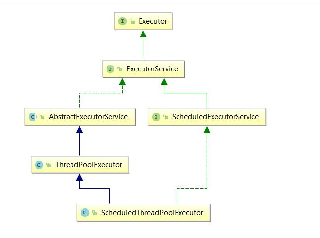

# Executor 源码
```java
public interface Executor {
    void execute(Runnable command);
}
```

# Executor 框架
## 简介
Executor 框架是 Java5 之后引进的，在 Java5 之后，通过 Executor 来启动线程比使用 Thread 的 start 方法更好，除了更易管理，效率更好（用线程池实现，节约开销）外，还有关键的一点：有助于避免 this 逃逸问题。

补充： this 逃逸是指在构造函数返回之前其他线程就持有该对象的引用。调用尚未构造完全的对象的方法可能引发令人疑惑的错误。

Executor 框架不仅包括了线程池的管理，还提供了线程工厂、队列以及拒绝策略等，Executor框架让并发编程变得更加简单。

## Executor 框架结构（主要由三大部分组成）
1. 任务（Runnable/Callable）

执行任务需要实现的 Runnable 接口 或 Callable接口。Runnable 接口或 Callable 接口 实现类都可以被 ThreadPoolExecutor 或 ScheduledThreadPoolExecutor 执行。


2. 任务的执行 （Executor）

如上图所示，包括任务执行机制的核心接口 Executor， 以及继承自 Executor 接口的 ExecutorService 接口。ThreadPoolExecutor 和 ScheduleThreadPoolExecutor 这两个关键类实现了 ExecutorService 接口。

ThreadPoolExecutor 类描述
```java
//AbstractExecutorService 实现了 ExecutorService 接口
public class ThreadPoolExecutor extends AbstractExecutorService
```
SheduledThreadPoolExecutor 类描述
```java
//ScheduledExecutorService实现了ExecutorService接口
public class ScheduledThreadPoolExecutor extends ThreadPoolExecutor implements ScheduledExecutorService;
```

3. 异步计算结果
Future 接口以及 Future 接口的实现类 FutureTask 类可以代表异步计算结果

当我们把 Runnable 接口或 Callable 接口的实现类提交给 ThreadPoolExecutor 或 ScheduledThreadPoolExecutor 执行。（调用 submit() 方法时会返回一个 FutureTask 对象）


## Excutor 框架的使用示意图

1. 主线程首先要创建实现 Runnable 或者 Callable 接口的任务对象。
2. 把创建完成的实现 Runnable/Callable接口的 对象直接交给 ExecutorService 执行: ExecutorService.execute（Runnable command））或者也可以把 Runnable 对象或Callable 对象提交给 ExecutorService 执行（ExecutorService.submit（Runnable task）或 ExecutorService.submit（Callable <T> task））
3. 如果执行 ExecutorService.submit（…），ExecutorService 将返回一个实现Future接口的对象（我们刚刚也提到过了执行 execute()方法和 submit()方法的区别，submit()会返回一个 FutureTask 对象）。由于 FutureTask 实现了 Runnable，我们也可以创建 FutureTask，然后直接交给 ExecutorService 执行。
4. 最后，主线程可以执行 FutureTask.get() 方法来等待任务执行完成。主线程亦可以执行 FutureTask.cancel(boolean mayInterruptIfRunning) 来取消此次任务的执行。

# （重要）ThreadPoolExecutor 类简单介绍
线程池实现类 ThreadPoolExecutor 是 Executor 框架最核心的类。

ThreadPoolExecutor 类中提供的四个构造方法。我们来看最长的那个，其余三个都是在这个构造方法的基础上产生
```java
    /**
    * 用给定的参数创建一个新的 ThreadPoolExecutor
    * @param corePoolSize 线程池的核心线程数量
    * @param maximumPoolSize 线程池的最大线程数量
    * @param keepAliveTime 当线程数大于核心线程数时，多余的空闲线程存活的最长时间
    * @param unit 时间单位
    * @param workQueue 任务队列，用来存储等待执行任务的队列
    * @param threadFactory 线程工厂，用来创建线程，一般默认即可
    * @param RejectedExcutionHandler handler 拒绝策略，当提交的任务过多而不能及时处理时，我们可以定制策略来处理任务
    **/
    public ThreadPoolExecutor(int corePoolSize,
                              int maximumPoolSize,
                              long keepAliveTime,
                              TimeUnit unit,
                              BlockingQueue<Runnable> workQueue,
                              ThreadFactory threadFactory,
                              RejectedExecutionHandler handler) {
        if (corePoolSize < 0 ||
            maximumPoolSize <= 0 ||
            maximumPoolSize < corePoolSize ||
            keepAliveTime < 0)
            throw new IllegalArgumentException();
        if (workQueue == null || threadFactory == null || handler == null)
            throw new NullPointerException();
        this.acc = System.getSecurityManager() == null ?
                null :
                AccessController.getContext();
        this.corePoolSize = corePoolSize;
        this.maximumPoolSize = maximumPoolSize;
        this.workQueue = workQueue;
        this.keepAliveTime = unit.toNanos(keepAliveTime);
        this.threadFactory = threadFactory;
        this.handler = handler;
    }
```
ThreadPoolExecutor 3 个最重要的参数
1. corePoolSize : 核心线程数线程数定义了最小可以同时运行的线程数量
2. maximumPoolSize : 当队列中存放的任务达到队列容量的时候，当前可以同时运行的线程数量变为最大线程数。
3. workQueue: 当新任务来的时候会先判断当前运行的线程数量是否达到核心线程数，如果达到的话，新任务就会被存放在队列中。

ThreadPoolExecutor 其他常见参数
1. KeepAliveTime: 当线程池中的线程数量大于 corePoolSize 的时候，如果这时还没有新任务提交，核心线程外的线程不会立即销毁，而是会等待，直到等待时间超过了 keepAliveTime 才会被回收销毁
2. unit: keepAliveTime 参数的时间单位
3. threadFactory: executor 创建新线程的时候会用到
4. handler：饱和策略。关于饱和策略下面单独介绍一下

ThreadPoolExecutor 饱和策略定义：如果当前同时运行的线程数量到达最大线程数量并且队列也已经被放满了任务时，ThreadPoolTaskExecutor 定义一些策略：
1. ThreadPoolExecutor.AbortPolicy: 抛出 RejectedExecutionException 来拒绝新任务的处理
2. ThreadPoolExecutor.CallerRunsPolicy: 调用执行自己得线程运行任务，也就是直接在调用 execute 方法得线程中运行被拒绝得任务，如果执行程序已经关闭，则会丢弃该任务。因此这种策略会降低对于新任务提交速度，影响程序的整体性能。另外，这个策略喜欢增加队列容量。如果您的应用程序可以承受此延迟并且你任务不能丢弃任何一个任务请求的化，你可以选择这个策略。
3. ThreadPoolEexcutor.DiscardPolicy:不处理新任务，直接丢弃掉。
4. ThreadPoolExecutor.DiscardOldestPolicy:此策略将丢弃最早的未处理的任务请求。

Spring 通过 ThreadPoolTaskExecutor 或者我们直接通过 ThreadPoolExecutor 的构造函数创建线程池的时候，当我们不指定 RejectedExecutionHandler 饱和策略的话来配置线程池的时候默认使用的是 ThreadPoolExecutor.AbortPolicy。在默认情况下，ThreadPoolExecutor 将抛出 RejectedExecutionException 来拒绝新来的任务 ，这代表你将丢失对这个任务的处理。 对于可伸缩的应用程序，建议使用 ThreadPoolExecutor.CallerRunsPolicy。当最大池被填满时，此策略为我们提供可伸缩队列。（这个直接查看 ThreadPoolExecutor 的构造函数源码就可以看出，比较简单的原因，这里就不贴代码了。）
