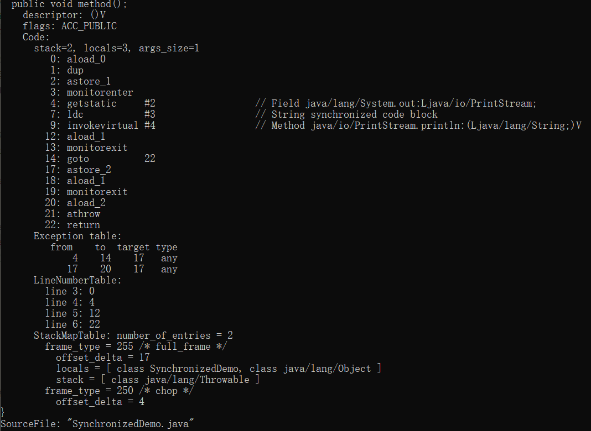
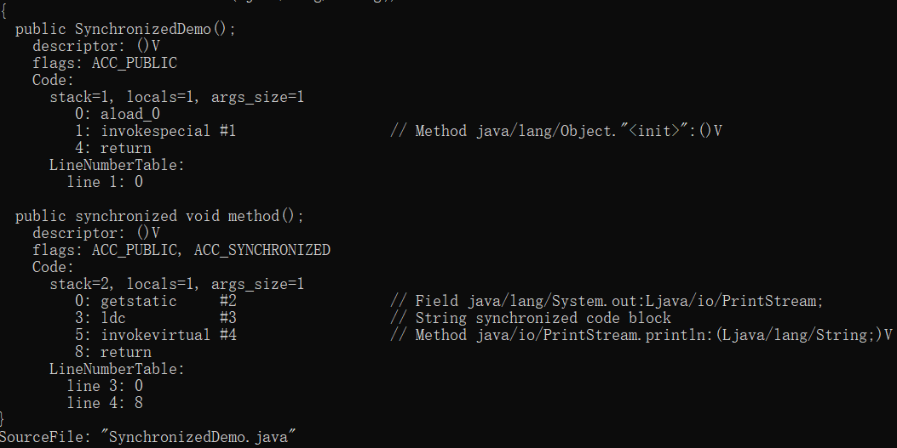

# synchronized 关键字

## 说一说自己对于 synchronized 关键字的了解
synchronized 关键字解决的是多个线程之间访问资源的同步性，synchronized 关键字可以保证被它修饰的方法或者代码块在任意时刻只能有一个线程执行。

另外，在 java 早期版本中，synchronized 属于重量级锁，效率低下，因为监视器锁(monitor) 是依赖于底层的操作系统的 Mutex Lock 实现的，Java 的线程是映射到操作系统的原生线程之上的。如果要挂起或者唤醒一个线程，都需要操作系统帮忙完成，而操作系统实现线程之间的切换时需要从用户态转换到内核态，这个状态之间的转换需要相对比较长的时间，时间成本相对较高，这也是为什么早期的 synchronized 效率低的原因。庆幸的是在 Java 6 之后 Java 官方对 JVM 层面对 synchronized 较大优化，所以现在的 synchronized 锁效率也优化得很不错了。JDK1.6 对锁的实现引入了大量的优化，如自旋锁、适应性自旋锁、锁消除、锁粗话、偏向锁、轻量级锁等技术来减少锁操作的开销。


## 说说自己是怎么使用 synchronized 关键字，在项目中用到了吗？
synchronized 关键字最主要的三种使用方法：
1. 修饰实例方法：作用于当前对象实例加锁，进入同步代码前就要获得当前对象实例的锁
2. 修饰静态方法：也就是给当前类加锁，会作用于类的所有对象实例，因为静态成员不属于任何一个实例对象，是类成员。
3. 修饰代码块： 指定加锁对象，对给定对象加锁，进入同步代码库前要获得给定对象的锁。

总结： synchronized 关键字加到 static 静态方法和 synchronized(class)代码块上都是是给 Class 类上锁。synchronized 关键字加到实例方法上是给对象实例上锁。尽量不要使用 synchronized(String a) 因为 JVM 中，字符串常量池具有缓存功能。

双重检验锁实现单例模式
```java
public class Singleton {
    private volatile static Singleton singleton;
    private Singleton();
    public static Singleton getInstance() {
        if (singleton == null) {
            sychronized(singleton) {
                if (singleton == null) {
                    singleton = new Singleton();
                }
            }
        }
        return singleton
    }
}
```
singleton = new Singleton() 这段代码其实是分三步执行：
1. JVM 为对象分配一块内存M
2. 在内存M 上为对象进行初始化
3. 将 singleton 指向分配的内存地址

但是由于 JVM 具有指令重排的特性，执行顺序有可能变成 1->3->2。指令重排在单线程环境下不会出现问题，但是在多线程环境下会导致一个线程获得还没有初始化的实例。

使用 volatile 可以禁止 JVM 的指令重排，保证在多线程环境下也能正常运行。

## 讲一下 synchronized 关键字的底层原理
synchronized 关键字底层原理属于 JVM 层面

### synchronized 同步语句块的情况
```java
public class SynchronizedDemo {
    public void method() {
        synchronized(this) {
            System.out.println("synchronized 代码块")
        }
    }
}
```
通过 JDK 自带的 javap 命令查看 SynchronizedDemo 类的相关字节码信息：首先切换到类的对应目录执行 javac SynchronizedDemo.java 命令生成编译后的 .class 文件，然后执行 javap -c -s -v -l SynchronizedDemo.class

从上面可以看出： synchronized 同步语句块的实现使用的是 monitorenter 和 monitorexit 指令,其中 monitorenter 指令指向同步代码块的开始位置，monitorexit 指令则指明同步代码块的结束位置。 当执行 monitorenter 指令时，线程试图获取锁也就是获取 monitor(monitor 对象存在于每个Java对象的对象头中， synchronized 锁便是通过这种方式获取锁的，也就是为什么 Java 中任意对象可以作为锁的原因)的持有权。当计数器为0则可以成功获取，获取后将计数器设为1。 相应的在执行monitorexit指令后，将锁计数器设为0， 表明锁被释放。如果获取对象锁失败，那当前线程就要阻塞等待，直到锁被另外一个线程释放为止。

### synchronized 修饰方法的情况
```java
public class SynchronizedDemo {
    public synchronized void method() {
        System.out.println("synchronized 方法");
    }
}
```

synchronized 修饰的方法并没有 monitorenter 指令和 monitorexit 指令，取得代之的是 ACC_SYNCHRONIZED 标识，该标识指明了该方法是一个同步方法， JVM 通过该 ACC_SYNCHRONIZED 访问标志来辨别一个方法是否声明为同步方法，从而执行相应的同步调用


## 说说 JDK1.6 之后的关键字 synchronized 关键字底层做了哪些优化，可以详细介绍一下这些优化吗？
JDK1.6 对锁的实现引入了大量优化，如偏向锁、轻量级锁、自旋锁、适应性锁、锁消除、锁粗话等技术来减少锁操作的开销

锁主要存在四种状态，依次是：无锁状态、偏向锁状态、轻量级锁状态、重量级锁状态，他们会随着竞争的激烈而逐渐升级。注意锁可以升级不可降级，这种策略是为了提高获得锁和释放锁的效率
