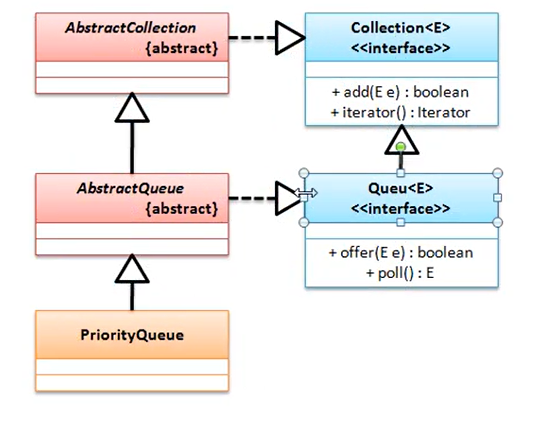

# Stack 操作类
public class Stack<E> extends Vector<E>

Stack 是 Vector子类， 但是它使用的并不是 Vector 类之中所提供的方法，而是采用如下的方法：
1. public int search(Object o)
2. public boolean empty()
3. public E peek()
4. public E pop()
5. public E push(E item)


# Queue 队列
public interface Queue<E> extends Collection<E>

队列的实现可以使用 LinkedList 类来实现的 public class LinkedList<E> extends AbstractSequentialList<E> implements List<E>, Deque<E>, Cloneable, Serializable

Queue 接口中提供有如下方法：
1. E peek()      the head of this queue, or null if this queue is empty， 返回对头元素，不删除此队列的头
2. E element()   NoSuchElementException - if this queue is empty          返回对头元素，不删除此队列的头
3. E poll()      the head of this queue, or null if this queue is empty   返回对头元素，并删除此队列的头，
4. E remove()    NoSuchElementException - if this queue is empty          返回对头元素，并删除此队列的头，
5. boolean offer(E e)   如果没有空间不会抛出 IllegalStateException
6. Boolean add(E e)     如果没有空间抛出 IllegalStateException

offer 与 add 方法都有可能抛出一下三种异常
1. ClassCastException - if the class of the specified element prevents it from being added to this queue
2. NullPointerException - if the specified element is null and this queue does not permit null elements
3. IllegalArgumentException - if some property of this element prevents it from being added to this queue

## 优先级队列 PriorityQueue
public class PriorityQueue<E> extends AbstractQueue<E> implements Serializable


E 一定要实现 Comparable 接口


# Properties 属性操作
资源文件 *.properties, 这类文件的存储结构是按照 key = value 的形式存储的，这种结构与 map集合很相似，其区别在于其保存的内容只能是字符串。

public class Properties extends Hashtable<Object,Object>

可以发现在继承 Hashtable 的时候为 Hashtable 定义的泛型是 Object 类， Properties 是不需要操作泛型的，应为它可以接收的类只能是 String 类型的。 在 Properties 之中如果要想实现属性的操作可以采用如下的方法来实现。
1. public Object setProperty(String key, String value)
2. public String getProperty(String key)    key不存在返回空
3. public String getProperty(String key, String defaultValue) key不存在返回 default Value
4. public void store(OutputStream out, String comments) throws IOException
5. public void load(InputStream inStream) throws IOException

使用 Properties 最大的特点是可以进行资源的输入与输出的处理操作，但是在实际的开发之中，Properties 往往用于读取配置资源的信息，这一点主要是在标准设计中做程序初始化准备的时候使用。

# Collections 类
Collections 是java提供的一组集合数据的操作工具类，也就是说利用它可以实现各个集合的操作 public class Collections extends Object

能处理 Collections， Map， 必须实现 Comparable 接口
```java
public class JavaAPIDemo {
	
	public static void main(String[] args) {
		List<String> list = new ArrayList<String>();
		Collections.addAll(list, "hello", "world");
		System.out.println(list);
	}
	
}
```
1. 实现数据的反转： public static void reverse(List<?> list)
2. 实现二分查找：   public static <T> int binarySearch(List<? extends Comparable<? super T>> list, T key)
```java
public static void main(String[] args) {
		List<String> list = new ArrayList<String>();
		Collections.addAll(list, "hello", "world", "mldn");
		Collections.sort(list);
		Collections.sort(list, (String o1, String o2)->{
			return o2.compareTo(o1);
		});
		System.out.println(Collections.binarySearch(list, "mldn"));
		System.out.println(list);
	}
```


