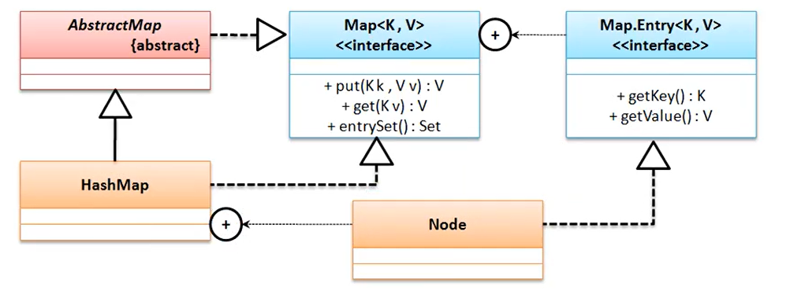

Collection 的集合保存数据的目的是为了输出， Map 集合保存数据的目的是为了进行 key 的查找

# Map 接口
public interface Map<K,V>
1. V put(K key, V value)     返回重复的时候的旧数据，如果key不存在的话返回 null
2. V get(Object key)
3. Set<Map.Entry<K, V>> entrySet()   将 Map 集合转为 Set 集合
4. public boolean containsKey(Object key)
5. public boolean containsValue(Object value)
6. Set<K> keySet()  将 Map 集合中的 key 转为 Set 集合
7. public V remove(Object key) 

最常用的子类： HashMap, HashTable, TreeMap, LinkedHashMap

## HashMap
该类的主要特点是无序存储

public class HashMap<K, V> extends AbstractMap<k, V> implements Map<K, V>, Cloneable, Serializable

源码如下：
```java
static final int TREEIFY_THRESHOLD = 8;
static final int DEFAULT_INITIAL_CAPACITY = 1 << 4;
static final float DEFAULT_LOAD_FACTOR = 0.75f;
public HashMap() {
    this.loadFactor = DEFAULT_LOAD_FACTOR; // all other fields defaulted
}
public V put(K key, V value) {
    return putVal(hash(key), key, value, false, true);
}
final V putVal(int hash, K key, V value, boolean onlyIfAbsent,
                   boolean evict) {
        Node<K,V>[] tab; Node<K,V> p; int n, i;
        if ((tab = table) == null || (n = tab.length) == 0)
            n = (tab = resize()).length;
        if ((p = tab[i = (n - 1) & hash]) == null)
            tab[i] = newNode(hash, key, value, null);
        else {
            Node<K,V> e; K k;
            if (p.hash == hash &&
                ((k = p.key) == key || (key != null && key.equals(k))))
                e = p;
            else if (p instanceof TreeNode)
                e = ((TreeNode<K,V>)p).putTreeVal(this, tab, hash, key, value);
            else {
                for (int binCount = 0; ; ++binCount) {
                    if ((e = p.next) == null) {
                        p.next = newNode(hash, key, value, null);
                        if (binCount >= TREEIFY_THRESHOLD - 1) // -1 for 1st
                            treeifyBin(tab, hash);
                        break;
                    }
                    if (e.hash == hash &&
                        ((k = e.key) == key || (key != null && key.equals(k))))
                        break;
                    p = e;
                }
            }
            if (e != null) { // existing mapping for key
                V oldValue = e.value;
                if (!onlyIfAbsent || oldValue == null)
                    e.value = value;
                afterNodeAccess(e);
                return oldValue;
            }
        }
        ++modCount;
        if (++size > threshold)
            resize();
        afterNodeInsertion(evict);
        return null;
    }
```
在使用 put方法进行数据保存的时候会调用一个 putVal() 方法， 同时会将 key 进行 hash 处理（生成一个 hash 码），而对于 putVal 方法里面提供一个 Node<K, V> 进行数据保存，而在使用 putVal() 方法操作的过程之中会调用一个 resize() 方法可以进行容量的扩充

基于Map接口实现、允许null键/值、非同步(synchronized)、不保证有序(比如插入的顺序)、也不保证序不随时间变化


## LinkedHashMap
public class LinkedHashMap<K,V> extends HashMap<K,V> implements Map<K,V>   

LinkedhashMap底层是散列表+双向链表实现的，在保存（每次调用put函数时）数据时，新数据会被插入到链表尾部。

一般在使用 LinkedHashMap 类的时候往往数据量都不要特别大，因为会造成时间复杂度攀升

当使用了 LinkedHashMap 存储之后所有的数据保存数据为添加顺序。

## Hashtable 子类
Hashtable 类是从 JDK1.0 的时候提供的，与 Vector、 Enumeration 属于最早的一批动态数组的实现类，后来为了将其继续实现下来，让其实现了 Map 接口

public class Hashtable<K, V> extends Dictionary<K, V> implements Map<K, V>, Cloeable, Serializable

Hashtable 中不允许 key， value值为空，否则会出现 NullPointerException 的异常


## Map.Entry 接口
HashMap 中的静态内部类 Node 实现了 Map.Entry 接口  static class Node <K, V> implements Map.Entry<K, V> {}

public static interface Map.Entry<K,V> 并且在这个接口里面提供有两个重要的方法：
1. 获取 key： public K getKey()
2. 获取value： public V getValue()

在 JDK 1.9 以前的开发之中，使用者基本上都不会去考虑创建 Map.Entry 的对象，实际上在正常的开发过程之中，使用者也不需要关心 Map.Entry 的创建，可是从 jdk1.9 之后 Map 接口中追加有 public static <K, V> Map.Entry<K, V> entry(K k, V, v)

Map.Entry 的主要作用就是作为一个 Key 和 Value 的包装类型使用

### 遍历输出Map集合
1. HashMap
```java
   public static void main(String[] args) {
		Map<Integer, String> map = new HashMap<Integer, String>();
		map.put(1, "hello");
		map.put(null, "world");
		map.put(0, "mldn");
		map.put(3, null);
		map.put(2, "cn");
		Set<Map.Entry<Integer, String>> set = map.entrySet();
		for (Map.Entry<Integer, String> entry : set) {
			System.out.println(entry.getKey() + ", " + entry.getValue());
		}
		System.out.println();
		set.forEach((entry)->{
			System.out.println(entry.getKey() + ", " + entry.getValue());
		});
		System.out.println();
		Iterator<Map.Entry<Integer, String>> iter = set.iterator();
		while (iter.hasNext()) {
			Map.Entry<Integer, String> entry = iter.next();
			System.out.println(entry.getKey() + ", " + entry.getValue());
		}
	}
```

2. HashTable
```java
	public static void main(String[] args) {
		Hashtable<Integer, String> map = new Hashtable<Integer, String>();
		map.put(1, "hello");
//		map.put(null, "world");
		map.put(0, "mldn");
//		map.put(3, null);
		map.put(2, "cn");
		Set<Map.Entry<Integer, String>> set = map.entrySet();
		for (Map.Entry<Integer, String> entry : set) {
			System.out.println(entry.getKey() + ", " + entry.getValue());
		}
		System.out.println();
		set.forEach((entry)->{
			System.out.println(entry.getKey() + ", " + entry.getValue());
		});
		System.out.println();
		Iterator<Map.Entry<Integer, String>> iter = set.iterator();
		while (iter.hasNext()) {
			Map.Entry<Integer, String> entry = iter.next();
			System.out.println(entry.getKey() + ", " + entry.getValue());
		}
		System.out.println();
		Enumeration<Integer> keys = map.keys();
		Enumeration<String> values = map.elements();
		while (keys.hasMoreElements()) {
			System.out.print(keys.nextElement() + ",");
		}
		System.out.println();
		while (values.hasMoreElements()) {
			System.out.print(values.nextElement() + ",");
		}
	}
```

# HashMap 底层实现
在HashMap中有两个很重要的参数，容量(Capacity)和负载因子(Load factor)：容量默认为16， 负载因子默认为0.75

## put() 源码分析
```java
public V put(K key, V value) {
    // 对key的hashCode()做hash
    return putVal(hash(key), key, value, false, true);
}
final V putVal(int hash, K key, V value, boolean onlyIfAbsent,
               boolean evict) {
    Node<K,V>[] tab; Node<K,V> p; int n, i;
    // tab为空则创建
    if ((tab = table) == null || (n = tab.length) == 0)
        n = (tab = resize()).length;
    // 计算index，并对null做处理
    if ((p = tab[i = (n - 1) & hash]) == null)
        tab[i] = newNode(hash, key, value, null);
    else {
        Node<K,V> e; K k;
        // 节点存在
        if (p.hash == hash &&
            ((k = p.key) == key || (key != null && key.equals(k))))
            e = p;
        // 该链为树
        else if (p instanceof TreeNode)
            e = ((TreeNode<K,V>)p).putTreeVal(this, tab, hash, key, value);
        // 该链为链表
        else {
            for (int binCount = 0; ; ++binCount) {
                if ((e = p.next) == null) {
                    p.next = newNode(hash, key, value, null);
                    if (binCount >= TREEIFY_THRESHOLD - 1) // -1 for 1st
                        treeifyBin(tab, hash);
                    break;
                }
                if (e.hash == hash &&
                    ((k = e.key) == key || (key != null && key.equals(k))))
                    break;
                p = e;
            }
        }
        // 写入
        if (e != null) { // existing mapping for key
            V oldValue = e.value;
            if (!onlyIfAbsent || oldValue == null)
                e.value = value;
            afterNodeAccess(e);
            return oldValue;
        }
    }
    ++modCount;
    // 超过load factor*current capacity，resize
    if (++size > threshold)
        resize();
    afterNodeInsertion(evict);
    return null;
}
```
1. 对key的hashCode()做hash，然后再计算index;
2. 如果没碰撞直接放到bucket里；
3. 如果碰撞了，以链表的形式存在buckets后；
4. 如果碰撞导致链表过长(大于等于TREEIFY_THRESHOLD)，就把链表转换成红黑树
5. 如果节点已经存在就替换old value(保证key的唯一性)
6. 如果size(超过load factor*current capacity)，就要resize。

## get() 函数实现
```java
public V get(Object key) {
    Node<K,V> e;
    return (e = getNode(hash(key), key)) == null ? null : e.value;
}
final Node<K,V> getNode(int hash, Object key) {
    Node<K,V>[] tab; Node<K,V> first, e; int n; K k;
    if ((tab = table) != null && (n = tab.length) > 0 &&
        (first = tab[(n - 1) & hash]) != null) {
        // 直接命中
        if (first.hash == hash && // always check first node
            ((k = first.key) == key || (key != null && key.equals(k))))
            return first;
        // 未命中
        if ((e = first.next) != null) {
            // 在树中get
            if (first instanceof TreeNode)
                return ((TreeNode<K,V>)first).getTreeNode(hash, key);
            // 在链表中get
            do {
                if (e.hash == hash &&
                    ((k = e.key) == key || (key != null && key.equals(k))))
                    return e;
            } while ((e = e.next) != null);
        }
    }
    return null;
}
```

## hash 函数实现
```java
static final int hash(Object key) {
    int h;
    return (key == null) ? 0 : (h = key.hashCode()) ^ (h >>> 16);
}
```
如果key值为空返回0，否则，将该 key 的 hash 值（高16位不变， 将低16位与高16位异或的值为低16位的值）


## resize() 函数实现

## HashMap 与 Hashtable 的区别
1. 线程是否安全： HashMap 是非线程安全的，HashTable 是线程安全的；HashTable 内部的方法基本都经过synchronized 修饰。（如果你要保证线程安全的话就使用 ConcurrentHashMap 吧！）；
2. 效率： 因为线程安全的问题，HashMap 要比 HashTable 效率高一点。另外，HashTable 基本被淘汰，不要在代码中使用它；
3. Null key 和Null value的支持： HashMap 中，null 可以作为键，这样的键只有一个，可以有一个或多个键所对应的值为 null。。但是在 HashTable 中 put 进的键值只要有一个 null，直接抛出 NullPointerException。
4. 初始容量大小和每次扩充容量大小的不同 ： ①创建时如果不指定容量初始值，Hashtable 默认的初始大小为11，之后每次扩充，容量变为原来的2n+1。HashMap 默认的初始化大小为16。之后每次扩充，容量变为原来的2倍。②创建时如果给定了容量初始值，那么 Hashtable 会直接使用你给定的大小，而 HashMap 会将其扩充为2的幂次方大（HashMap 中的tableSizeFor()方法保证，下面给出了源代码）。也就是说 HashMap 总是使用2的幂作为哈希表的大小。
```java
static final int tableSizeFor(int cap) {
        int n = cap - 1;
        n |= n >>> 1;
        n |= n >>> 2;
        n |= n >>> 4;
        n |= n >>> 8;
        n |= n >>> 16;
        return (n < 0) ? 1 : (n >= MAXIMUM_CAPACITY) ? MAXIMUM_CAPACITY : n + 1;
    }
```
5. 底层数据结构： JDK1.8 以后的 HashMap 在解决哈希冲突时有了较大的变化，当链表长度大于阈值（默认为8）时，将链表转化为红黑树，以减少搜索时间。Hashtable 没有这样的机制。

## HashMap 与 HashSet 的区别 ？

