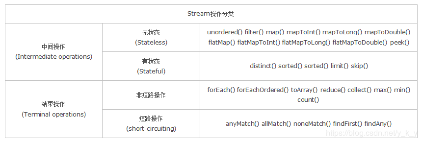

因为进入到了大数据时代，所以在类集里面也支持有数据的流式分析处理操作, 所以提供了 Stream 接口，同时在Collection接口里面提供了有为此实例化的方法

Collections 提供有如下两个方法
1. default Stream<E> parallelStream()  获取 并行Stream 接口对象（多个线程参与分析）
2. default Stream<E> Stream()          获取 Stream 接口对象 （一个线程参与分析）

# Stream 基础操作
Stream 主要功能是进行数据的分析处理，同时主要是针对集合中的数据进行分析操作。
```java
public class JavaAPIDemo {
	
	public static void main(String[] args) {
		List<String> all = new ArrayList<String>();
		Collections.addAll(all, "Java", "JavaScript", "Python", "Rudy", "Go");
		Stream<String> stream = all.stream();      
//		System.out.println(stream.count());
		System.out.println(stream.filter((ele)->ele.toLowerCase().contains("j")).count());
	}
	
}
```
但是以上的程序只实现了数据的个数统计，但是更多情况下，需要获取满足数据条件的内容，实现数据的采集操作。
```java
public class JavaAPIDemo {
	
	public static void main(String[] args) {
		List<String> all = new ArrayList<String>();
		Collections.addAll(all, "Java", "JavaScript", "Python", "Rudy", "Go");
		Stream<String> stream = all.stream();      
//		System.out.println(stream.count());
		List<String> list = stream.filter((ele)->ele.toLowerCase().contains("j")).collect(Collectors.toList());
		System.out.println(list);
	}
	
}
```
在Stream 数据流处理的过程之中，还允许数据的分页处理，提供有两个方法
1. public Stream<T> limit(long maxSize) 设置取出的最大的数据量
2. Stream<T> skip(long n)               跳过指定数据
```java
public class JavaAPIDemo {
	
	public static void main(String[] args) {
		List<String> all = new ArrayList<String>();
		Collections.addAll(all, "Java", "JavaScript", "JSP", "Json", "Python", "Rudy", "Go");
		Stream<String> stream = all.stream();      
//		System.out.println(stream.count());
		List<String> list = stream.filter((ele)->ele.toLowerCase().contains("j")).skip(2).limit(2).collect(Collectors.toList());
		System.out.println(list);
	}
	
}
```
输出为： [JSP, Json]


## 为什么需要 Stream ？
Stream 作为 Java 8 的一大亮点， 它与 Java.io 包里的 InputStream 和 OutputStream 是完全不同的概念。 它也不同于StAX 对 XML解析的Stream，也不是 Amazon Kinesis 对大数据实时处理的 Stream。 Java 8 中的Stream是对集合（Collection）对象功能的加强，它专注于对集合对象进行各种非常便利、高效的聚合操作（aggregate operation），或者大批量数据操作（bulk data operation）。Stream API 借助于同样出现的 Lamda 表达式，极大的提高编程效率和程序可读性。同时它提供串行和并行两种模式进行汇聚操作，并发模式能够充分利用多核处理器的优势，使用 fork/join 并行方式来拆分任务和加速处理过程。通常编写并行代码很难而且容易出错，但使用 Stream API 无需编写一行多线程的代码，就可以很方便地写出高性能地并发程序。所以说， Java 8 中首次出现地java.util.Stream 是一个函数式语言 + 多核时代综合影响的产物

## 什么是聚合操作
在传统的 J2EE 应用中， Java 代码经常不得不依赖于关系型数据库的聚合操作完成诸如：
1. 客户每月平均消费金额
2. 最昂贵的在售商品
3. 本周完成的有效订单（排除了无效的）
4. 取十个数据样本作为首页推荐

这类操作

但是在当今这个数据大爆炸的时代，在数据来源多样化、数据海量化的今天，很多时候不得不脱离RDBMS， 或者以底层返回的数据为基础进行更上层的数据统计。而 Java 的集合 API 中，仅仅有极少量的辅助型方法，更多的时候是程序员需要用 Iterator 来遍历集合，完成相关的聚合应用逻辑。这是一种远不够高效、笨拙的方法。

## Stream 总览
### 什么是流
Stream 不是集合元素，它不是数据结构并不保存数据，它是有关算法和计算的，它更像一个高级版本的 Iterator。原始版本的 Iterator， 用户只能显式地一个一个遍历元素并对其执行某些操作；高级版本的 Stream，用户只要给出需要对其包含的元素执行什么操作，比如“过滤掉长度大于10的字符串”、“获取每个字符串的首字母”等， Stream 会隐式的在内部遍历，做出相应的数据转换。

Stream就如同一个迭代器（Iterator）单向，不可往复，数据只能遍历一次，遍历过一次后即用尽了，

而和迭代器又不同的是， Stream可以并行化操作，迭代器只能命令地、串行化操作。顾名思义，当使用串行方式去遍历时，每个 item 读完后再读下一个 item。而使用并行去遍历时，数据会被分成多个段，其中每一个都在不同的线程中处理，然后将结构一起输出。Stream 的并行操作依赖于 Java7 中引入的 Fork/Join 框架（JSR166y）来拆分任务和加速处理过程。Java 的并行 API 演变历程基本如下：
1. 1.0-1.4 中的 java.lang.Thread
2. 5.0 中的 java.util.concurrent
3. 6.0 中的 Phasers 等
4. 7.0 中的 Fork/Join 框架
5. 8.0 中的 Lambda

Stream 的另外一大特点是，数据源本身可以是无限的。

### 流的构成
当我们使用一个流的时候，通常包括三个基本步骤： 获取一个数据源（source），数据转换， 执行操作获取想要的结果。

每次转换原有 Stream 对象不改变，返回一个新的 Stream 对象（可以有多次转换），这就允许对其操作可以像链条一样排列，变成一个管道，

有多种方式生成 Stream Source
1. Collection.stream();
2. Collection.parallelStream()
3. Arrays.stream(T array) or Stream.of()
4. java.io.BufferedReader.lines()
5. java.util.stream.IntStream.range()
6. java.nio.file.Files.walk()
7. java.util.Spliterator
8. Random.ints()
9. BitSet.stream()
10. Pattern.splitAsStream(java.lang.CharSequence)
11. JarFile.stream()

# MapReduce
在进行数据分析的处理之中， 有一个最重要的基础模型： MapReduce 模型，对于这个模型一共是分为两个部分， Map 处理部分， Reduce分析部分
```java
public class JavaAPIDemo {
	
	public static void main(String[] args) {
		List<Order> all = new ArrayList<Order>();
		all.add(new Order("小强娃娃", 9.9, 10));
		all.add(new Order("手机", 2000, 3));
		all.add(new Order("不强牌笔记本电脑", 8000, 8));
		all.add(new Order("若强牌茶杯", 2.9, 800));
		all.add(new Order("煎饼", 0.9, 138));
		
		DoubleSummaryStatistics stat = all.stream().filter((ele)->{
			return ele.getName().contains("强");
		}).mapToDouble((ele)->{
			return ele.getPrice() * ele.getAmount();
		}).summaryStatistics();
		
		System.out.println("商品购买数量:" + stat.getCount());
		System.out.println("商品购买总价: " + stat.getSum());
		System.out.println("平均花费: " + stat.getAverage());
		System.out.println("最低花费: " + stat.getMin());
		System.out.println("最高花费: " + stat.getMax());
	}
	
}
```


java8中的stream的特点：
1. 不是数据结构，不会保存数据
2. 不会修改原来的数据源，它会将操作后的数据保存到另外一个对象中。（保留：peek方法可以修改流中的元素）
3. 惰性求值，流在中间处理过程中，只是对操作进行了记录，并不会立即执行，需要等到执行终止操作的时候才会进行计算


# stream 操作分类


无状态：指元素的处理不受之前元素的影响 unordered() filter() map() mapToInt() mapToLong() mapToDouble() flatMap() flatMaptToInt() flatMapToLong() flatMapToDouble() peek()

有状态：指该操作只有拿到所有元素之后才能继续下去 distinct() sorted() limit() skip()

非短路操作： 指必须处理所有元素才能得到最终结果 forEach() forEachOrdered() toArray() reduce() collect() max() min() count()

短路操作：指遇到某些符合条件的元素就可以得到最终结果。如 A || B, 只要A为true，则无需判断B的结果。 anyMatch() allMatch() noneMatch() findFirst() findAny()

# 流的常用创建方法

## 使用Collection下的 stream() 和 parallelStream() 方法
```java
List<String> list = new ArrayList<>();
Stream<String> stream = list.stream(); //获取一个顺序流
Stream<String> parallelStream = list.parallelStream(); //获取一个并行流
```

## 使用Arrays 中的 stream() 方法，将数组转成流
```java
Integer[] nums = new Integer[10];
Stream<Integer> stream = Arrays.stream(nums);
```

## 使用BufferedReader.lines() 方法，将每行内容转成流
```java
BufferedReader reader = new BufferedReader(new FileReader("F:\\text_stream.txt"));
Stream<String> stream = reader.lines();
```

## 使用Pattern.splitAsStream()方法，将字符串分隔成流
```java
Pattern pattern = Pattern.compile(",");
Stream<String> stream = pattern.splitAsStream("a,b,c,d");
```

# 流的中间操作
## 筛选与切片
1. filter() 过滤流中的某些元素
2. limit(n) 获取 n 个元素
3. skip(n) 跳过 n 元素， 配合 limit(n) 可以实现分页
4. distinct() 通过流中元素的 hashCode() 和 equals() 去除重复元素

## 映射
1.  map：接收一个函数作为参数，该函数会被应用到每个元素上，并将其映射成一个新的元素。
2.  flatMap：接收一个函数作为参数，将流中的每个值都换成另一个流，然后把所有流连接成一个流。
```java
List<String> list = Arrays.asList("a,b,c", "1,2,3");
Stream<String> s1 = list.stream().map(s->s.replace(",", "")); // abc 123
Stream<String> s2 = list.stream().flatMap((String s)->{
    String[] splits = s.split(",");
    return Arrays.stream(splits);
});// a b c 1 2 3
```

## 排序
1. sorted() 自然排序，流中元素实现Comparable接口
2. sorted(Comparator com): 自定义Comparator排序器

# 流的终止操作
## 匹配、聚合操作
1. allMatch： 接收一个 Predicate 函数，当流中每个元素都符合该断言时才返回true, 否则返回 false
2. noneMatch: 同上
3. anyMatch: 接收一个 Predicate 函数，当流中只要有一个元素符合该断言时返回true, 否则返回 false
4. findFirst: 返回第一个元素
5. findAny：返回流中的任意元素
6. count：返回流中元素的总个数
7. max：返回流中元素最大值
8. min：返回流中元素最小值

## 规约操作
Optional<T> reduce(BinaryOperator<T> accumulator)：第一次执行时，accumulator函数的第一个参数为流中的第一个元素，第二个参数为流中元素的第二个元素；第二次执行时，第一个参数为第一次函数执行的结果，第二个参数为流中的第三个元素；依次类推。

T reduce(T identity, BinaryOperator<T> accumulator)：流程跟上面一样，只是第一次执行时，accumulator函数的第一个参数为identity，而第二个参数为流中的第一个元素。

<U> U reduce(U identity, BiFunction<U, ? super T, U>accumulator, BinaryOperator<U> combiner): 在串行流中，该方法跟第二个方法一样，即第三个参数combiner不会起作用。在并行流中，我们知道流被fork join出多个线程进行执行，此时每个线程的执行流就跟第二个方法reduce(identity, accumulator)一样，而第三个参数，combiner函数，则是将每个线程的执行结果当成一个新的流，然后使用第一个方法reduce(accumulator)流程进行规约

## 收集操作
1. collect： 接收一个Collector实例，将流中元素收集成另外一个数据结构。

### Collector 工具库：Collectors
```java

Student s1 = new Student("aa", 10,1);
Student s2 = new Student("bb", 20,2);
Student s3 = new Student("cc", 10,3);
List<Student> list = Arrays.asList(s1, s2, s3);
 
//装成list
List<Integer> ageList = list.stream().map(Student::getAge).collect(Collectors.toList()); // [10, 20, 10]
 
//转成set
Set<Integer> ageSet = list.stream().map(Student::getAge).collect(Collectors.toSet()); // [20, 10]
 
//转成map,注:key不能相同，否则报错
Map<String, Integer> studentMap = list.stream().collect(Collectors.toMap(Student::getName, Student::getAge)); // {cc=10, bb=20, aa=10}
 
//字符串分隔符连接
String joinName = list.stream().map(Student::getName).collect(Collectors.joining(",", "(", ")")); // (aa,bb,cc)
 
//聚合操作
//1.学生总数
Long count = list.stream().collect(Collectors.counting()); // 3
//2.最大年龄 (最小的minBy同理)
Integer maxAge = list.stream().map(Student::getAge).collect(Collectors.maxBy(Integer::compare)).get(); // 20
//3.所有人的年龄
Integer sumAge = list.stream().collect(Collectors.summingInt(Student::getAge)); // 40
//4.平均年龄
Double averageAge = list.stream().collect(Collectors.averagingDouble(Student::getAge)); // 13.333333333333334
// 带上以上所有方法
DoubleSummaryStatistics statistics = list.stream().collect(Collectors.summarizingDouble(Student::getAge));
System.out.println("count:" + statistics.getCount() + ",max:" + statistics.getMax() + ",sum:" + statistics.getSum() + ",average:" + statistics.getAverage());
 
//分组
Map<Integer, List<Student>> ageMap = list.stream().collect(Collectors.groupingBy(Student::getAge));
//多重分组,先根据类型分再根据年龄分
Map<Integer, Map<Integer, List<Student>>> typeAgeMap = list.stream().collect(Collectors.groupingBy(Student::getType, Collectors.groupingBy(Student::getAge)));
 
//分区
//分成两部分，一部分大于10岁，一部分小于等于10岁
Map<Boolean, List<Student>> partMap = list.stream().collect(Collectors.partitioningBy(v -> v.getAge() > 10));
 
//规约
Integer allAge = list.stream().map(Student::getAge).collect(Collectors.reducing(Integer::sum)).get(); //40
```

