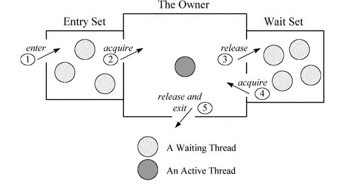

在多线程的定义之中，volatile关键字主要是在属性定义上使用的，表示此属性为直接数据操作，而不进行副本的拷贝处理。这样的话在一些书上错误的理解为同步属性

在正常进行变量处理的时候往往会经历如下的几个步骤
1. 获取变量原有的数据内容
2. 利用副本为变量进行数学计算
3. 将计算后的变量，保存到原始空间中

而使用volatile关键字，表示的就是未使用副本，而是直接操作原始变量，相当于节约了:拷贝副本、重新保存的步骤

```java
public class Singleton {
    private volatile static Singleton singleton;
    private Singleton(){}
    public static Singleton getSingleton() {
        if (singleton == null) {
            synchronized(Singleton.class) {
                if (singleton == null) {
                    singleton = new Singleton();
                }
            }
        }
        return singleton;
    }
}
```
如以上的代码，是一个比较典型的使用双重锁校验的形式实现单例的，其中使用volatile关键字修饰可能被多个线程同时访问到的singleton。

为了提高处理器的执行速度，在处理器和内存之间增加了多级缓存来提升。但是由于引入了多级缓存，就存在缓存数据不一致问题。

但是，对于volatile变量，当对volatile变量进行写操作的时候，JVM会向处理器发送一条lock前缀的命令，将这个缓存中的变量回写到系统主存中。但是，就算写回到内存，如果其他处理器缓存的值还是旧的，再执行计算操作就会有问题，所以在多处理器下，为了保证各个处理器的缓存是一致的，就会实现缓存一致性协议。

## 缓存一致性协议
每个处理器通过嗅探在总线上传播的数据来检查自己缓存的值是不是过期了，当处理器发现自己缓存行对应的内存地址被修改，就会将当前处理器的缓存行设置成无效状态，当处理器要对这个数据进行修改操作的时候，会强制重新从系统内存里把数据读到处理器缓存里。

所以，如果一个变量被volatile修饰的话，每次数据变化之后，其值都会被强制刷入主存，而其他处理器的缓存由于遵守了缓存一致性协议，也会把这个变量的值从主存加载到自己的缓存中。这就保证了一个volatile在并发编程之中，其值在多个缓存中是可见的。

# volatile 与可见性
可见性是指当多个线程访问同一个变量时，一个线程修改了这个变量的值，其他线程能够立即看得到修改的值

JVM内存模型规定可所有的变量都存储在主内存中，每条线程还有自己得工作内存，线程得工作内存中保存了该线程中是用到得变量的主内存副本拷贝，线程对变量的所有操作都必须在工作内存中进行，而不能直接读写主内存.不同的线程之间也无法直接访问对方工作内存中的变量，线程间变量的传递均需要自己的工作内存和主存之间进行数据同步进行。所以，就可能出现线程1改了某个变量的值，但是线程2不可见的情况。


# volatile 与有序性
除了引入了时间片以外，由于处理器优化和指令重排等，CPU还可能对输入代码进行乱序执行，比如 load->add->save 有可能被优化成 load->save->add。这就可能存在有序性问题。而volatile除了可以保证数据的可见性之外，还有一个强大的功能，那就是他可以禁止指令重排优化等。普通的变量仅仅会保证在该方法的执行过程中所依赖的赋值结果的地方都能获得正确的结果，而不能保证变量的赋值操作的顺序与程序代码中的执行顺序一致。

volatile可以禁止指令重排，这就保证了代码的程序会严格按照代码的先后顺序执行。这就保证了有序性。被volatile修饰的变量的操作，会严格按照代码顺序执行，load->add->save 的执行顺序就是：load、add、save。


# volatile 与原子性
原子性是指一个操作是不可中断的，要全部执行完毕，要不就都不执行。volatile是不能保证原子性的。在以下场景中可以使用volatile来代替 synchronized
1. 运算结果并不依赖变量的当前值，或者能够确保只有单一的线程会修改变量的值
2. 变量不需要与其他状态变量共同参与不变约束
```java
public class Test {
    public volatitle int inc = 0;

    public void increase() {
        inc++;
    }

    public static void main(String [] args) {
        final Test test = new Test();
        for(int i = 0; i < 10; i++) {
            new Thread() {
                public void run() {
                    for(int j = 0; j < 1000; j++) {
                        test.increase();
                    }
                }
            }.start();
        }

        while(Thread.activeCount() > 1) {                        //保证前面的线程都执行完成。
            Thread.yield();
        }
        System.out.println(test.inc);

    }
}
```
以上代码比较简单，就是创建10个线程，然后分别执行1000次i++操作。正常情况下，程序的输出结果应该是10000，但是，多次执行的结果都小于10000。这其实就是volatile无法满足原子性的原因。

为什么会出现这种情况呢，那就是因为虽然volatile可以保证inc在多个线程之间的可见性。但是无法inc++的原子性。


# 既然synchronized是 “万能” 的， 为什么还需要 volatile 呢？
##  synchronized 的问题
synchronized 其实是一种加锁机制，那么既然是锁，天然就具备以下几个缺点
1. 有性能损耗

虽然在 JDK1.6 中对 synchronized做了很多优化，如适应性自旋，锁消除、锁粗化、轻量级锁和偏向锁，以上这几种优化，都是尽量想办法避免对 Monitor 进行加锁，但是，并不是所有情况都可以优化的，况且就算是经过优化，优化的过程也是有一定的耗时。所以，无论是使用同步方法还是同步代码块，在同步操作之前还是要进行加锁，同步操作之后需要进行解锁，这个加锁、解锁的过程是要有性能损耗的。

关于二者的性能对比，由于虚拟机对锁实行的许多消除和优化，使得我们很难量化这两者之间的性能差距，但是我们可以确定的一个基本原则是：volatile变量的读操作的性能小号普通变量几乎无差别，但是写操作由于需要插入内存屏障所以会慢一些，即便如此，volatile在大多数场景下也比锁的开销要低。

2. 产生阻塞

synchronized的实现原理，无论是同步方法还是同步代码块，无论是ACC_SYNHRONIZED还是mointorenter、monitorexit都是基于Monitor实现的。

基于Monitor对象，当多个线程同时访问一段同步代码时，首先会进入Entry Set，当有一个线程获取到对象的锁之后，才能进行The Owner区域，其他线程还会继续在Entry Set等待。并且当某个线程调用了wait方法后，会释放锁并进入Wait Set等待。

所以，synchronized实现的锁的本质上是一种阻塞锁，也就是说多个线程要排队访问同一个共享对象。而 volatile 是Java虚拟机提供的一种轻量级同步机制，他是基于内存屏障实现的。说到底，它并不是锁，所以他不会有synchronized带来的阻塞和性能损耗问题。

## volatile 的附加功能
除了前面我们提到的volatile比synchronized性能好以外，volatile其实还有一个很好的附加功能，那就是禁止指令重排。
我们先来举一个例子，看一下如果只使用synchronized而不使用volatile会发生什么问题，就拿我们比较熟悉的单例模式来看。
```java
public class Singleton {
    private static Singleton singleton;
    private Singleton() {}
    public static Singleton getSingleton() {
        if (singleton == null) {
            synchronized(Singleton.class) {
                if (singleton == null) {
                    singleton = new Singleton();
                }
            }
        }
        return singleton;
    }
}
```
以上代码，我们通过使用synchronized对Singleton.class进行加锁，可以保证同一时间只有一个线程可以执行到同步代码块中的内容，也就是说singleton = new Singleton() 这个操作只会执行一次，这就是实现了一个单例。

但是，当我们在代码中使用上述单例对象的时候有可能发生空指针异常。原因如下，singleton = new Singleton() 代码做了如下工作
1. 虚拟机遇到 new 指令，到常量池定位到这个类的符号引用
2. 检查符号引用代表的类是否被加载、解析、初始化过
3. 虚拟机为对象分配内存
4. 虚拟机将分配到的内存空间都初始化为零值
5. 虚拟机对对象进行必要的设置。
6. 执行方法，成员变量进行初始化。
7. 将对象的引用指向这个内存区域。

我们将这个过程简化以下，简化成3个步骤：
1. JVM 为对象分配一块内存M
2. 在内存M上位对象进行初始化
3. 将内存M的地址复制给singleton变量

但是编译器可能会对上述步骤进行重排变为 1, 3, 2.当线程a执行到2步骤的时候，此时来一个线程b则直接判断singleton不为null，返回该singleton，则返回了一个不完整的singleton对象。使用volatile则可以避免该问题的出现。因为volatile可以避免指令重排。

## 那synchronized的有序性保证呢？
首先可以明确的一点是：synchronized是无法禁止指令重排和处理器优化的。那么他是如何保证的有序性呢？

那么，我们可以说，synchronized保证的有序性是多个线程之间的有序性，即被加锁的内容要按照顺序被多个线程执行。但是其内部的同步代码还是会发生重排序，只不过由于编译器和处理器都遵循as-if-serial语义，所以我们可以认为这些重排序在单线程内部可忽略。

as-if-serial语义的意思指：不管怎么重排序，单线程程序的执行结果都不能被改变。编译器和处理器无论如何优化，都必须遵守as-if-serial语义。


