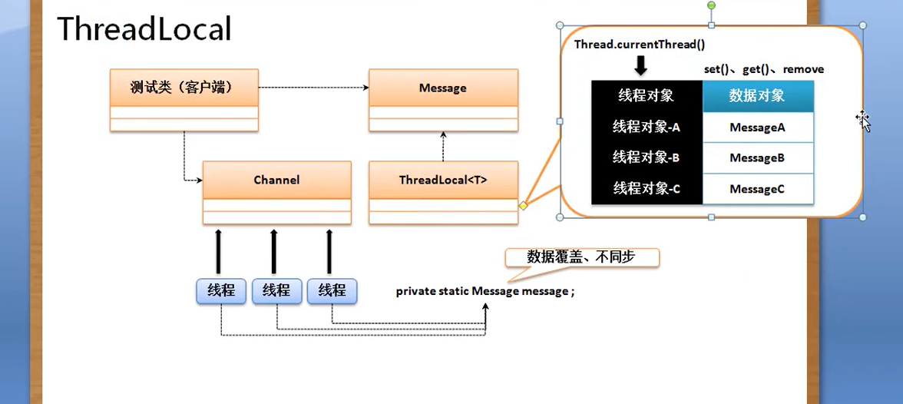

# UUID
生成无重复字符串的一种程序类，这种程序类的主要功能是根据时间戳实现一个自动的无重复的字符串定义。

在对一些文件进行自动命名处理的情况下，一般使用UUID

## 获取 UUID 对象
public static UUID randomUUID();


## 根据字符串获取 UUID 内容
public static UUID fromString(String name);


# Optional 类
主要是进行 null 的相关处理
1. 返回空数据 public static <T> Optional<T> empty()
2. 获取数据   public T get()
3. 保存数据，但是不允许出现null    public static <T> Optional<T> of(T value)   (throws NullPointerException - if value is null)
4. 保存数据，允许为空             public static <T> Optional<T> ofNullable(T value)
5. 空的时候返回其他数据           public T orElse(T other);

```java
package cn.mldn.demo;

import java.util.Optional;

interface IMessage {
	public String getContent();
}

class MessageImpl implements IMessage {
	@Override
	public String getContent() {
		return "www.mldn.cn";
	}
}

class MessageUtil {
	private MessageUtil() {}
	
	public static IMessage getMessage1() {
		return new MessageImpl();
	}
	
	public static Optional<IMessage> getMessage2() {
		//如果返回的数据为空，在此处报错。
		return Optional.of(new MessageImpl());
	}
	
	public static Optional<IMessage> getMessage3() {
		return Optional.ofNullable(new MessageImpl());
	}
	
	public static void useMessage(IMessage msg) {
		System.out.println(msg.getContent());
	}
}

public class JavaAPIDemo {

	public static void main(String[] args) {
		IMessage msg1 = MessageUtil.getMessage1();
		MessageUtil.useMessage(msg1);
		IMessage msg2 = MessageUtil.getMessage2().get();
		MessageUtil.useMessage(msg2);
		//如果MessageUtil.getMessage3()返回的数据为空，在此处报错。
		IMessage msg3 = MessageUtil.getMessage3().get();
		MessageUtil.useMessage(msg3);
		IMessage msg4 = MessageUtil.getMessage3().orElse(new MessageImpl());
		MessageUtil.useMessage(msg4);
	}
}
```

# ThreadLocal 类
java.lang.ThreadLocal;

1. 构造方法： public ThreadLocal();
2. 设置数据： public void set(T value);
3. 取出数据:  public void get();
4. 删除数据： public void remove();


## 分析
```java
package cn.mldn.demo;

import java.lang.ThreadLocal;

class Message {
	private String info;
	public Message(String info) {
		this.info = info;
	}
	public void setInfo(String info) {
		this.info = info;
	}
	public String getInfo() {
		return this.info;
	}
}

class Channel {
	private static Message message;
	public static void setMessage(Message m) {
		message = m;
	}
	public static void send() {
		System.out.println("[" + Thread.currentThread().getName() + " 发送消息]" + message.getInfo());
	}
}

public class JavaAPIDemo {

	public static void main(String[] args) {
		new Thread(()->{
			Channel.setMessage(new Message("消息a"));
			Channel.send();
		}, "线程a").start();
		new Thread(()->{
			Channel.setMessage(new Message("消息b"));
			Channel.send();
		}, "线程b").start();
		new Thread(()->{
			Channel.setMessage(new Message("消息c"));
			Channel.send();
		}, "线程c").start();
	}
}
```
上述代码可能输出为
```
[线程a 发送消息]消息b
[线程c 发送消息]消息c
[线程b 发送消息]消息b
```

以上代码改为如下：

```java
package cn.mldn.demo;

import java.lang.ThreadLocal;

class Message {
	private String info;
	public Message(String info) {
		this.info = info;
	}
	public void setInfo(String info) {
		this.info = info;
	}
	public String getInfo() {
		return this.info;
	}
}

class Channel {
	private static final ThreadLocal<Message> THREADLOCAL = new ThreadLocal<Message>();
	public static void setMessage(Message m) {
		THREADLOCAL.set(m);
	}
	public static void send() {
		System.out.println("[" + Thread.currentThread().getName() + " 发送消息]" + THREADLOCAL.get().getInfo());
	}
}

public class JavaAPIDemo {

	public static void main(String[] args) {
		new Thread(()->{
			Channel.setMessage(new Message("消息a"));
			Channel.send();
		}, "线程a").start();
		new Thread(()->{
			Channel.setMessage(new Message("消息b"));
			Channel.send();
		}, "线程b").start();
		new Thread(()->{
			Channel.setMessage(new Message("消息c"));
			Channel.send();
		}, "线程c").start();
	}
}

```

每一个线程通过ThreadLocal只允许保存一个数据

# 定时调度
定时器的主要操作是进行定时任务的处理 

如果想要实现定时的处理操作主要有一个定时操作的主体类，以及一个定时任务的控制
1. java.util.TimerTask     (public abstract class TimerTask extends Object implements Runnable) 实现定时任务处理
2. java.util.Timer         (public class Timer extends Object) 进行任务的启动

Timer启动任务的方法有如下：
1. public void schedule(TimerTask task, long delay); 延迟单位为毫秒
2. public void schedule(TimerTask task, Date time)
3. public void schedule(TimerTask task, Date firstTime, long period)
4. public void scheduleAtFixedRate(TimerTask task, long delay, long period)  间隔触发

```java
package cn.mldn.demo;

import java.util.Date;
import java.util.Timer;
import java.util.TimerTask;

class MyTask extends TimerTask {

	@Override
	public void run() {
		// TODO Auto-generated method stub
		System.out.println("[定时任务]" + Thread.currentThread().getName() + " 运行， 时间： " + new Date(System.currentTimeMillis()));
	}
	
}

public class JavaAPIDemo {

	public static void main(String[] args) {
		MyTask task = new MyTask();
		Timer timer = new Timer();
		timer.schedule(task, 0, 1000);
//		timer.scheduleAtFixedRate(task, 0, 1000);
	}
}

```


# Base64 加密与解密
1. Base64.Encoder 进行加密处理 public byte[] encode(byte[] src)   没有String类型的参数加密方式
2. Base64.Decoder 进行解密处理 public byte[] decode(String src)

```java
String msg = "www.mldn.cn";
Base64.getEncoder().encode(msg.getBytes());
```

虽然 Base64 可以进行加密与解密操作，但是运用的是公共加密操作，所以还是不安全的，可以进行盐值操作
```java
String salt = "mldnjava";
String msg = "www.mldn.cn" + "{" + salt + "}";
Base64.getEncoder().encode(msg.getBytes());
```

多次加密
```java
```
