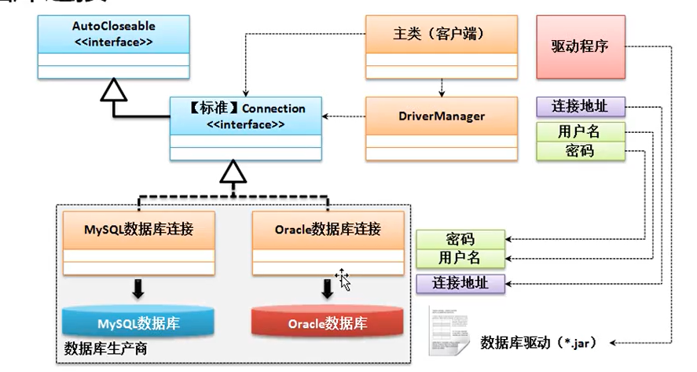
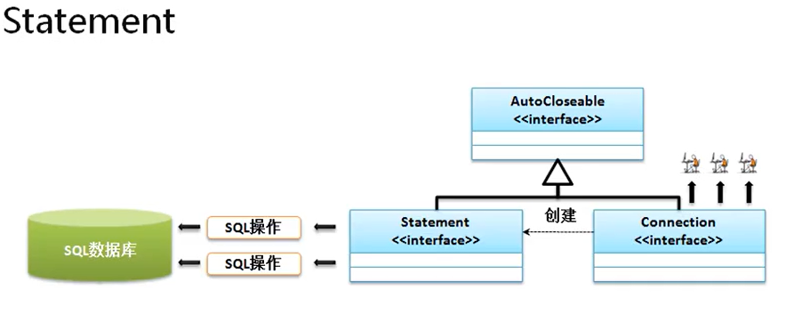

数据库的开发标准 JDBC （Java Database Connectivity）

再Java里面专门为 JDBC 提供有一个包 （java.sql)，里面核心的组成包括 DriverManager 类以及若干接口（Statement、Connection、PreparedStatement、ResultSet）

对于 JDBC 的程序数据库访问也分为如下四种形式： 
1. JDBC-ODBC 桥连接：  利用微软的 ODBC 技术进行数据库的连接，而后再利用 JDBC 技术访问 ODBC 技术进行数据库的开发 处理流程为（程序，JDBC， ODBC，数据库)，这种技术为 Java 默认的技术，不需要任何的额外操作，即可实现
2. JDBC 连接：   直接利用 JDBC 进行数据库的连接处理  处理流程为（程序，JDBC，数据库)， 这种连接一般只连接本地数据库服务器
3. JDBC 网络连接： 通过特定的网络协议连接指定的数据库服务， 处理流程为（程序，JDBC，网络数据库（IP地址与端口号））
4. JDBC 协议连接： 自己通过编写指定的协议操作实现数据库的访问；

## Statement 接口对象
要想获得 Statement 对象必须从 Connection 中获取。public Statement createStatement() throws SQLException;   此时抛出的 SQLException 是 JDBC 数据库开发中的最大异常。

当获取了 Statement 接口对象之后，就可以使用 SQL 进行处理了，而这里面需要两个方法的支持
1. 数据的更新处理 （INSERT、UPDATE、DELETE）
2. 数据的查询处理 （SELECT、统计查询、复杂查询）

1. public int executeUpdate(String sql) throws SQLException  返回修改的行数
2. public ResultSet executeQuery(String sql) throws SQLException

