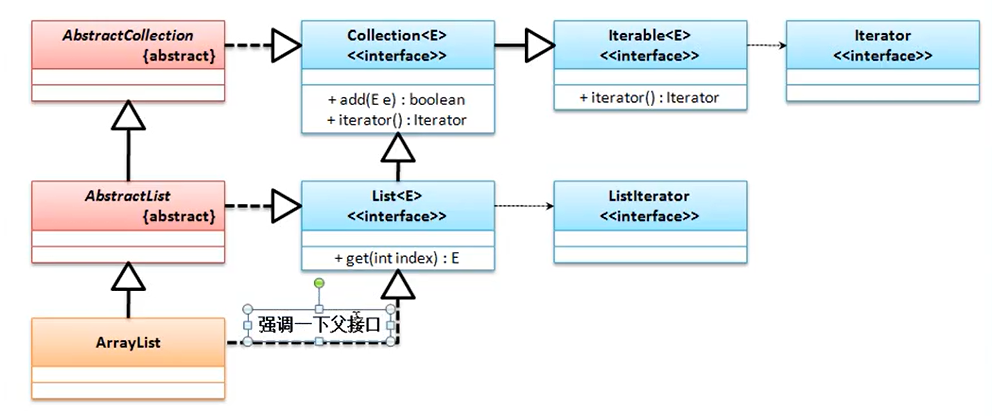
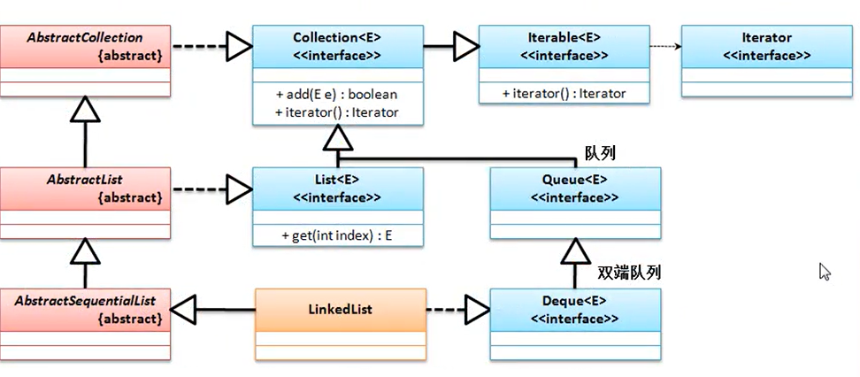
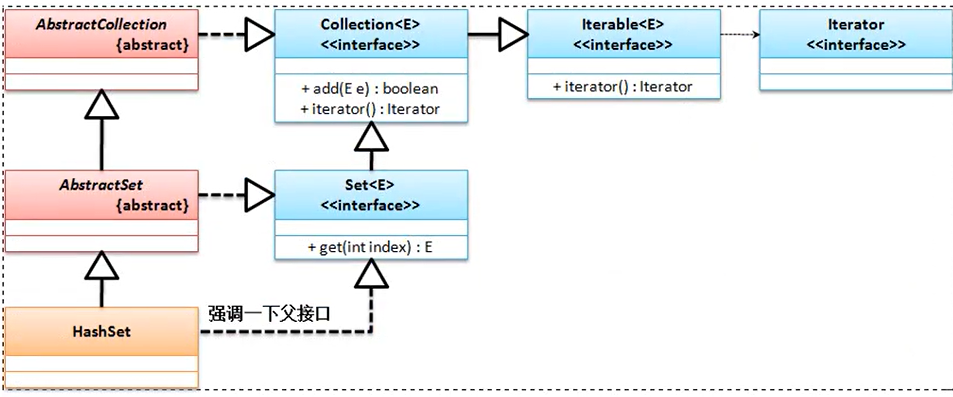
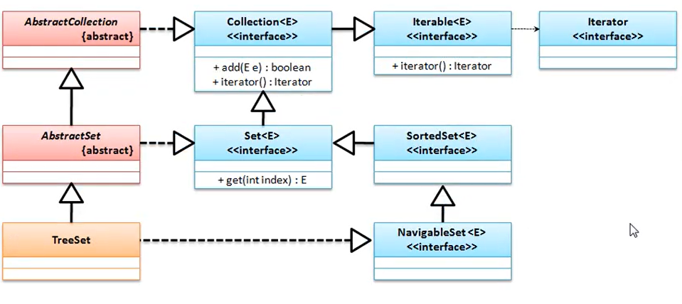

从 JDK 1.2 开始 Java 引入了类集开发框架，所谓的类集指的就是一套动态对象数组的实现方案，传统的数组长度是固定的。最初就只能依靠一些数据结构来实现动态的数组处理，而其中最为重要的两个结构就是链表与树，但是这些数据结构的实现又不得不面对如下问题
1. 数据结构的代码实现困难，对于一般的开发者是无法进行使用的；
2. 对于链表或二叉树当进行更新处理的时候的维护是非常麻烦的
3. 对于链表和二叉树还需要尽可能保证其操作的性能

类集主要就是对常见的数据结构进行完整的实现包装，提供了一系列的接口与实现子类来帮助用户减少数据结构所带来的开发困难。但是最初的类集实现由于Java本身技术所限，所以对于数据的控制并不严格，全部采用了 Object 类型进行数据接收。而在 JDK1.5 之后，由于泛型技术的推广，所以类集本身也得到了良好的改进，可以直接用泛型来保存相同类型的数据。并且随着数据量的不断增加，从JDK1.8开始类集中的实现算法也得到了良好的性能提升。

在整个类集框架里面提供有如下的几个核心接口: Collection、 List、 Set、 Map、 Iterator、 Enumeration、 Queue、 ListIterator。


# Java.util.Collection
public interface Collection<E> extends Iterable<E>

是单值集合最大的父接口，在该接口之中定义有所有的单值数据的处理操作，在这个接口之中定义有如下的核心操作方法：
1. boolean add(E e) 向集合保存单个数据
2. boolean addAll(Collection<? extends E> c) 向集合之中增加一组数据
3. public void clear()    清空集合，让根节点为空，同时进行gc处理
4. boolean contains(Object o) 查询数据是否存在，需要equals方法支持
5. boolean remove(Object o) 数据删除，需要equals方法支持
6. int size()  获取数据长度
7. Object [] toArray()   将集合变为对象数组返回
8. Iterator<E> iterator() 将集合变为 Iterator 接口返回
9. boolean isEmpty()

在 JDK 1.5 之前 Collection是独立的接口，但是在 JDK1.5 之后，将提供有 java.lang.Iterable 父接口，并且在 JDK1.8 的之后针对于 Iterable 接口也得到了一些扩充

在 JDK1.2 ~ JDK1.4的时代里面如果要进行集合的使用往往会直接操作 Collection 接口，但是从 JDK1.5 开始更多的时候使用的时候使用的是 Collection 的两个子接口 允许重复的 List, 不允许重复的 Set

## List 集合
public interface List<E> extends Collection<E> 

List 接口对于 Collection 接口扩充了
1. void add(int index, E element)
2. E get(int index)
3. E set(int index, E element)
4. ListIterator<E> listIterator()  返回 ListIterator 接口对象

在实现 List 类中，有三个常见子类 : ArrayList、Vector、LinkedList

从 JDK1.9 开始 List子接口里面追加有一些 static 方法，以方便用户的处理，如下
```java
List<String> all = List.of("Hello", "world", "你好");
```

### ArrayList
public class ArrayList<E> extends AbstractList<E> implements List<E>, RandomAccess, Cloneable, Serializable

ArrayList 子类的继承关系如下:


1. 保存的数据就是其存储的顺序
2. List集合里面允许存在有重复数据

从 jdk 1.8及之后 iterable 有一个方法支持 default voif forEach(Consumer<? super T> action);
```java
package cn.mldn.demo;

import java.util.ArrayList;
import java.util.List;

public class JavaAPIDemo {
	
	public static void main(String[] args) throws Exception {
		List<String> list = new ArrayList<String>();
		list.add("hello");
		list.add("hello");
		list.add("world");
		list.forEach((str)->{
			System.out.print(str + ",");
		});;
	}
	
}
```
ArrayList 封装的是数组， ArrayList构造方法
```java
public ArrayList() {
    this.elementData = DEFAULTCAPACITY_EMPTY_ELEMENTDATA;
}
public ArrayList(int initialCapacity) {
    if (initialCapacity > 0) {
        this.elementData = new Object[initialCapacity];
    } else if (initialCapacity == 0) {
        this.elementData = EMPTY_ELEMENTDATA;
    } else {
        throw new IllegalArgumentException("Illegal Capacity: "+initialCapacity);
    }
}
public ArrayList(Collection<? extends E> c) 
```
如果ArrayList 集合里面保存的对象数组的长度不够的时候，那么会进行新的数组的开辟，同时将原始的旧数组内容拷贝到新数组中。

如果在实例化 ArrayList 类对象的时候并没有传递初始化的长度，则默认情况下会使用一个空数组， 发现数组容量不够，则会判断当前增长的容量与默认的容量大小，使用较大的数组进行新的数组开辟。得出一个结论：在 JDK1.8 之后 ArrayList 默认的构造只会使用默认的空数组，使用的时候才会开辟数组，默认大小为10，而在 JDK1.8 之前 默认的构造实际上默认开辟大小为 10 的数组

在 ArrayList 之中保存的容量不足的时候会采用成倍的方式进行增长
```java
 private void grow(int minCapacity) {
    // overflow-conscious code
    int oldCapacity = elementData.length;
    int newCapacity = oldCapacity + (oldCapacity >> 1);
    if (newCapacity - minCapacity < 0)
        newCapacity = minCapacity;
    if (newCapacity - MAX_ARRAY_SIZE > 0)
        newCapacity = hugeCapacity(minCapacity);
    // minCapacity is usually close to size, so this is a win:
    elementData = Arrays.copyOf(elementData, newCapacity);
}
```


### LinkedList
public class LinkedList<E> extends AbstractSequentialList<E> implements List<E>, Deque<E>, Cloneable, Serializable

构造方法
1. public LinkedList(Collection<? extends E> c)
2. public LinkedList()

观察 LinkedList 的 add方法,
```java
public boolean add(E e) {
    linkLast(e);
    return true;
}
```
LinkedList封装的就是一个链表实现

### Vector
public class Vector<E> extends AbstractList<E> implements List<E>, RandomAccess, Cloneable, Serializable

Vector 是一个原始古老的程序类，在 JDK1.0 的时候就已经出现了， 到了 JDK1.2 的时候由于许多开发者已经习惯使用 Vector， 并且许多系统类也是基于 Vector 实现的，考虑到其使用的广泛性，所以类集框架将其保存了下来，并且将其实现了一个List接口。它的继承结构与 ArrayList 是相同的，

通过 Vector 源码发现 Vector 类之中的操作方法采用的都是 synchronized 同步处理


## Set 集合
public interface<E> Set extends Collection<E>
无法使用 List 集合提供的 get 方法，无法实现指定索引数据的获取， 从 JDK1.9 之后， Set集合也提供有像 List 集合之中类似的 of 静态方法


### HashSet 子类
public class HashSet<E> extends AbstractSet<E> implements Set<E>, Cloneable, Serializable

HashSet 是 Set 接口里面使用最多的一个子类，其最大的特点就是保存的数据是无序的, 继承结构如下



### TreeSet 子类
public class TreeSet<E> extends AbstractSet<E> implements NavigableSet<E>, Cloneable, Serializable

保存的结构是有序的（按照升序） ,继承结构如下：



### hashcode
TreeSet 子类是利用了 Comparable 接口来实现了重复元素的判断，但是 Set 集合的整体特征就是不允许保存重复元素。但是 HashSet 判断重复元素的方式 并不是 Comparable 来实现的，而是利用 Object 中的 hashCode() 方法完成的。你把对象加入 HashSet 时，HashSet 会先计算对象的 hashcode 值来判断对象加入的位置，同时也会与其他已经加入的对象的 hashcode 值作比较，如果没有相符的hashcode，HashSet会假设对象没有重复出现。但是如果发现有相同 hashcode 值的对象，这时会调用 equals()方法来检查 hashcode 相等的对象是否真的相同。如果两者相同，HashSet 就不会让其加入操作成功。如果不同的话，就会重新散列到其他位置。
1. 对象编码: public int hashCode();
2. 对象比较：public boolean equals(Object obj);

在进行重复元素判断的时候首先利用 hashCode() 进行编码判断，如果该编码不存在则表示数据不存在，证明没有重复，如果该编码存在了，则进一步进行对象比较处理，如果发现重复了，则此数据是不允许保存的。如果使用的 eclipse 开发工具，则可以帮助开发者去自动创建hashCode()与equals()以简化开发。

在 Java 程序之中真正的重复元素的判断处理利用的就是 hashCode() 与 equals() 方法 共同作用完成的，而只有在排序的要求下才会利用 Comparable 接口来实现


## 集合输出
实际上从 JDK1.8 开始 就在 Iterable 方法里面提供有 forEach 方法，但是这个方法的迭代输出并不是传统意义上的开发形式，也很难在开发之中出现，对于集合操作而言，一共有四种形式输出： Iterator 迭代输出， ListIterator 双向迭代输出， Enumeration 枚举输出， forEach 输出（与Iterator 相当）

### Iterator 输出
从 jdk1.5 开始 Collection 多继承了一个 Iterable 父接口，并且定义了 iterator() 操作方法，通过此方法可以获取 Iterator 接口对象， 在 JDK1.5 之前这以方法直接定义在 Collection 的接口之中， 

获取 Iterator 接口对象：  Iterator<T> iterator(), 有如下四个方法
1. default void forEachRemaining(Consumer<? super E> action)
2. default void remove()
3. E next()
4. boolean hasNext()

对于 Iterator 接口中的 remove() 方法使用需要特别注意一下， 在Collection 接口里面定义有 remove 方法， 但是在迭代输出中如果使用 Collection 定义的 remove 方法就会出错，此时使用 Iterator 迭代器中的 remove 方法
```java
public class JavaAPIDemo {
	
	public static void main(String[] args) {
		List<String> all = new ArrayList<String>();
		all.add("Hello");
		all.add("world");
		all.add("mldn");
		Iterator<String> iter = all.iterator();
		while(iter.hasNext()) {
			String str = iter.next();
			if ("world".equals(str)) {
				iter.remove();
			}
			else {
				System.out.println(str);
			}
		}
		System.out.println(all);
	}
}
``` 
输出为:
```
Hello
mldn
[Hello, mldn]
```

### ListIterator 输出
使用 Iterator 进行的迭代输出操作有一个特点：只允许向前向后实现输出，而如果说 现在需要双向迭代的处理，必须利用 Iterator 的子接口 ListIterator. Collection并没有提供获取此接口的方法， List接口中提供有

含有如下方法
1. void add(E e)
2. void set(E e)
3. void remove()
4. int previousIndex()
5. int nextIndex()
6. E previous()
7. boolean hasPrevious()
8. E next()
9. boolean hasNext()

由后向前输出必须先有前向后找到最后一个指针

### Enumeration
Enumeration 是在 JDK 1.0 的时候旧使用的输出接口，这个输出接口，主要是为了 Vector 类提供的服务， Enumeration只为 Vector 一个类服务 

Vector对象中获取 Enumeration 接口对象： public Enumeration<E> elements();

Enumeration 只提供有两个操作方法， 不提供remove 等方法
1. boolean hasMoreElements()
2. E nextElement()


### Iterator 方法中的 forEach() 输出


   
