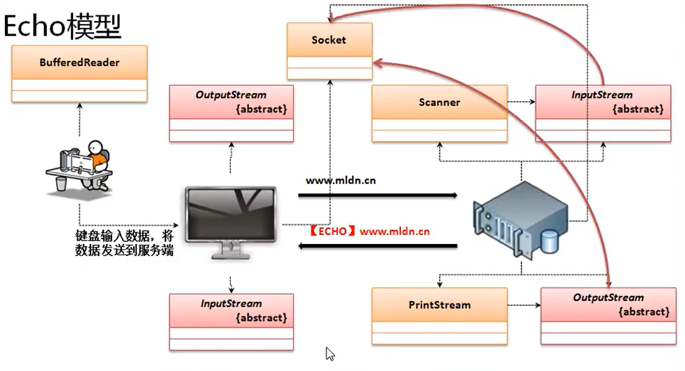

网络的核心定义在于： 有两台以上的电脑就称为网络。

通讯的实现上就产生了一系列的处理协议：IP、TCP、UDP等，，通讯操作需要分为客户端与服务端

于是针对于网络程序的开发有两种模型：
1. C/S (Client/Server、 客户端与服务端器)：要开发两套程序，一套程序为服务端，一套程序为客户端，现在服务器端发生了改变之后客户端也应该进行更新处理，这种开发可以由开发者自定义传输协议，并且使用一些比较私密的端口，安全性比较高，但是开发与维护成本比较高
2. B/S (Browser/Server、浏览器与服务器端)：只开发一套服务器端的程序，而后利用浏览器作为客户端进行访问，这种开发与维护的成本较低（只有一套程序），但是由于其使用的是公共的 HTTP 协议并且使用的是公共的 80 端口，所以其安全性较差。现在的开发基本上以 B/s 程序为主

本次所要讲解的网络编程主要就是 C/S 程序模型，其分为两种开发：TCP（可靠的数据连接）、UDP（不可靠的数据连接）

## Echo 程序模型

TCP 的程序开发是网络程序的最基本的开发模型，其核心的特点使用两个类实现数据的交互处理：ServerSocket、Socket

ServerSocket 主要目的是设置服务器的监听端口，而 Socket 需要指明要连接的服务器地址与端口