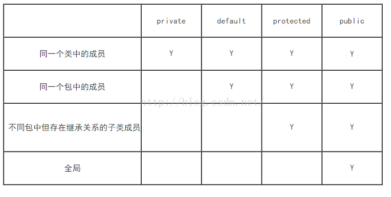

面向对象设计有三个特点：
1. 封装性： 内部的操作对外部而言不可见，当内部的操作都不可直接使用的时候才算安全
2. 继承性： 在已有结构的基础上继续进行功能的扩充；
3. 多态性： 是在继承的基础上扩充而来的概念，指的是类型的转换处理

在进行面向对象程序的开发之中一般还有三个步骤：
1. OOA：面向对象分析
2. OOD: 面向对象设计
3. OOP：面向对象编程

# 类和对象
类是对某一类事物的共性的抽象概念，而对象描述的是一个具体的产物。类是一个模板，而对象才是类可以使用的实例。类中一般都会有两个组成
1. 成员属性（Field） 
2. 操作方法（Method）：定义对象具有的处理行为

java之中属性是一个个具体的变量，方法是可以重复执行的代码

声明对象最好初始化一个默认值null，如果没有对对象的属性赋值，则该属性内容为其对应数据类型的默认值。

# 对象内存分析
引用数据类型最大的困难之处在于要进行内存的管理，同时在进行操作的时候也会发生有内存管理的变换
1. 堆内存：保存的对象的具体信息，在程序之中堆内存的空间分配是通过new完成的
2. 栈内存：保存的是堆内存的地址，通过地址找到堆内存，而后找到对象内容，简单理解（对象的名称存在了栈之中）

# 引用与垃圾产生分析
垃圾 ：没有任何栈内存所指向的堆内存。所有的垃圾将被GC定期进行回收并且释放无用内存空间，但是如果垃圾过多，一定将影响到GC的处理性能，在开发之中垃圾的产生应该越少越好。

# 构造方法与匿名对象
构造方法的定义要求：
1. 构造方法必须和类名称保持一致
2. 构造方法不允许设置任何的返回值类型
3. 构造方式是使用关键字new实例化对象时自动调用的。

如果无构造方法，程序编译后自动创建一个无参构造方法，如果类中定义了构造方法，程序不会自动创建一个无参构造方法

## 匿名对象
只是通过实例化对象来进行类的操作，没有对该对象声明变量名称，称为匿名对象,如下：
```
new Person().print()
```
该对象使用没有引用，使用一次之后成为垃圾

# this
1. 当前类中的属性：this.属性
2. 当前类中的方法（普通方法、构造方法）：this.方法名称()m、this();
3. 描述当前对象

## 对于本类构造方法的互相调用需要注意以下几点重要问题
1. 构造方法必须在实例化新对象的时候调用，所以"this()"只允许放在构造方法的首行
2. 构造方法互相调用时，请保留有程序的出口，别形成死循环。

## 对于简单java类而言，其核心的开发结构如下
1. 类名称一定要有意义，可以明确的描述某一类事物；
2. 类中的所有属性必须有private封装，同时封装后的属性必须要提供有setter、getter方法
3. 类之中可以提供有无数多个构造方法，但是必须保留有无参构造方法
4. 类之中不允许出现任何的输出语句，所有内容的获取必须返回
5. 【非必须】可以提供有一个获取对象详细信息的方法（getInfo()）

# Java中public、private、protected、默认四种访问权限

类的成员变量的访问权限：
1. public
2. private: 只有类本身内部的方法可以访问类的private属性，内部类也可以访问其外部类的成员
3. 默认(friendly): 包级可见，同一个包内的类可以访问到这个属性。
4. protected： 关键字所处理的是所谓“继承”的观念。对于同一包的其他类，protected = 默认，其他类可以访问protected。对于不同包的类，如果存在继承关系，而baseClass存在protected属性，则可以被其自继承，而不同包的其他类则不能访问类的protected属性

类的成员方法的访问权限
1. public 所有类可见
2. private 只有同一类内部的方法可见，在有就是内部类也可以访问到
3. 默认(friendly) 包内可见
4. protected 继承可见

 
# 继承
如果父类里面没有提供无参构造，则子类必须调用super()明确调用有参构造

Java中不允许多重继承，只允许多层继承，理论上层次不应该超过三层。

## 覆写
虽然利用方法的覆写可以很好的扩充父类的功能，但是对于覆写也是有其自身要求的：被覆写的方法不能比父类方法更严格的访问控制权限

# final 关键字
定义不能够被覆写的类，以及不能够被覆写的方法和常量
定义全局常量：public static final int ON = 1; 在定义全局 常量时，每一个字母必须大写表示


