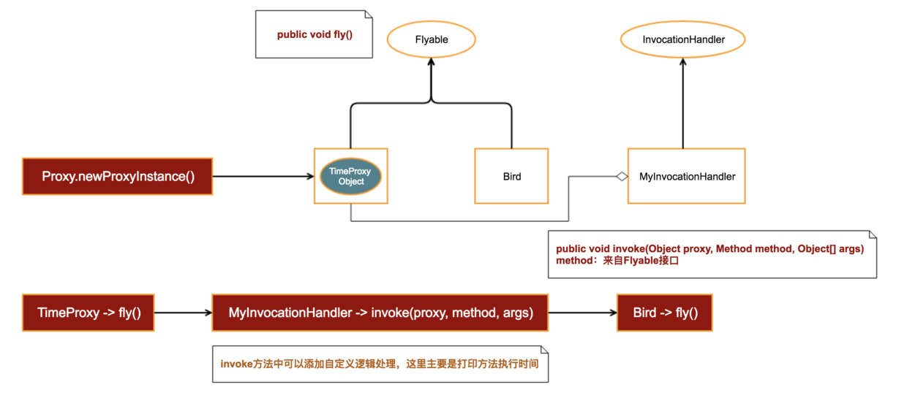

```java
package cn.mldn.demo;

import java.util.Random;

interface Flyable {
    void fly();
}

class Bird implements Flyable {

    @Override
    public void fly() {
        System.out.println("Bird is flying...");
        try {
            Thread.sleep(new Random().nextInt(1000));
        } catch (InterruptedException e) {
            e.printStackTrace();
        }
    }
}

class BirdTimeProxy implements Flyable {
    private Flyable flyable;

    public BirdTimeProxy(Flyable flyable) {
        this.flyable = flyable;
    }

    @Override
    public void fly() {
        long start = System.currentTimeMillis();

        flyable.fly();

        long end = System.currentTimeMillis();
        System.out.println("Fly time = " + (end - start));
    }
}

class BirdLogProxy implements Flyable {
    private Flyable flyable;

    public BirdLogProxy(Flyable flyable) {
        this.flyable = flyable;
    }

    @Override
    public void fly() {
        System.out.println("Bird fly start...");

        flyable.fly();

        System.out.println("Bird fly end...");
    }
}

public class JavaAPIDemo {
	
	public static void main(String[] args) throws Exception {
		Bird bird = new Bird();
        BirdLogProxy p1 = new BirdLogProxy(bird);
        BirdTimeProxy p2 = new BirdTimeProxy(p1);

        p2.fly();
	}
	
}
```
# 静态代理
接下来，观察上面的类BirdTimeProxy，在它的fly方法中我们直接调用了flyable->fly()方法。换而言之，BirdTimeProxy其实代理了传入的Flyable对象，这就是典型的静态代理实现。

从表面上看，静态代理已经完美解决了我们的问题。可是，试想一下，如果我们需要计算SDK中100个方法的运行时间，同样的代码至少需要重复100次，并且创建至少100个代理类。往小了说，如果Bird类有多个方法，我们需要知道其他方法的运行时间，同样的代码也至少需要重复多次。因此，静态代理至少有以下两个局限性问题：
1. 如果同时代理多个类，依然会导致类无限扩展
2. 如果类中有多个方法，同样的逻辑需要反复实现

那么，我们是否可以使用同一个代理类来代理任意对象呢？我们以获取方法运行时间为例，是否可以使用同一个类（例如：TimeProxy）来计算任意对象的任一方法的执行时间呢？甚至再大胆一点，代理的逻辑也可以自己指定。比如，获取方法的执行时间，打印日志，这类逻辑都可以自己指定。这就是本文重点探讨的问题，也是最难理解的部分：动态代理。

# 动态代理
继续回到上面这个问题：是否可以使用同一个类（例如：TimeProxy）来计算任意对象的任一方法的执行时间呢。

这个部分需要一定的抽象思维，我想，你脑海中的第一个解决方案应该是使用反射。反射是用于获取已创建实例的方法或者属性，并对其进行调用或者赋值。很明显，在这里，反射解决不了问题。但是，再大胆一点，如果我们可以动态生成TimeProxy这个类，并且动态编译。然后，再通过反射创建对象并加载到内存中，不就实现了对任意对象进行代理了吗？为了防止你依然一头雾水，我们用一张图来描述接下来要做什么：

动态生成Java源文件并且排版是一个非常繁琐的工作，为了简化操作，我们使用 JavaPoet 这个第三方库帮我们生成TimeProxy的源码。

## 第一步、生成 TimeProxy 源码
```java
class Proxy {
	public static Object newProxyInstance() throws IOException {
		TypeSpec.Builder typeSpecBuilder = TypeSpec.classBuilder("TimeProxy").addSuperinterface(Flyable.class);
		
		FieldSpec fieldSpec = FieldSpec.builder(Flyable.class, "flyable", Modifier.PRIVATE).build();
		typeSpecBuilder.addField(fieldSpec);
		
		MethodSpec constructorMethodSpec = MethodSpec.constructorBuilder().addModifiers(Modifier.PUBLIC)
				.addParameter(Flyable.class, "flyable").addStatement("this.flyable = flyable").build();
		typeSpecBuilder.addMethod(constructorMethodSpec);
		
		Method[] methods = Flyable.class.getDeclaredMethods();
		for (Method method : methods) {
			MethodSpec methodSpec = MethodSpec.methodBuilder(method.getName())
					.addModifiers(Modifier.PUBLIC)
					.addAnnotation(Override.class)
					.returns(method.getReturnType())
					.addStatement("long start = $T.currentTimeMillis()", System.class)
					.addCode("\n")
					.addStatement("this.flyable." + method.getName() + "()")
					.addCode("\n")
					.addStatement("long end = $T.currentTimeMillis()", System.class)
                    .addStatement("$T.out.println(\"Fly Time =\" + (end - start))", System.class)
                    .build();
			typeSpecBuilder.addMethod(methodSpec);
		}
		JavaFile javaFile = JavaFile.builder("cn.mldn.demo", typeSpecBuilder.build()).build();
		javaFile.writeTo(new File("C:\\Users\\estelle\\eclipse-workspace\\FirstProject\\src"));
		return null;
	}
}
```
在main方法中调用Proxy.newProxyInstance(),你将看到已经生成了TimeProxy.java文件,如下
```java
package cn.mldn.demo;

import java.lang.Override;
import java.lang.System;

class TimeProxy implements Flyable {
  private Flyable flyable;

  public TimeProxy(Flyable flyable) {
    this.flyable = flyable;
  }

  @Override
  public void fly() {
    long start = System.currentTimeMillis();

    this.flyable.fly();

    long end = System.currentTimeMillis();
    System.out.println("Fly Time =" + (end - start));
  }
}
```

## 第二步、编译TimeProxy源码
编译TimeProxy源码我们直接使用JDK提供的编译工具即可，为了使你看起来更清晰，使用一个新的辅助类来完成编译操作：
```java
public class JavaCompiler {

    public static void compile(File javaFile) throws IOException {
        javax.tools.JavaCompiler javaCompiler = ToolProvider.getSystemJavaCompiler();
        StandardJavaFileManager fileManager = javaCompiler.getStandardFileManager(null, null, null);
        Iterable iterable = fileManager.getJavaFileObjects(javaFile);
        javax.tools.JavaCompiler.CompilationTask task = javaCompiler.getTask(null, fileManager, null, null, null, iterable);
        task.call();
        fileManager.close();
    }
}
```
在Proxy->newProxyInstance()方法中调用该方法，
```java
JavaCompiler.compile(new File("C:\\Users\\estelle\\eclipse-workspace\\FirstProject\\src\\cn\\mldn\\demo\\TimeProxy.java"));
```

## 第三步、加载到内存中并创建对象
自定义类加载器
```java
class MyClassLoader extends ClassLoader {
	private String classPath;
	
	public MyClassLoader() {}
	
	public MyClassLoader(String classPath) {
		this.classPath = classPath;
	}
	
	public Class<?> loadData(String className) throws Exception {
		byte [] data = this.loadClassData();
		if (data != null) {
			return super.defineClass(className, data, 0, data.length);
		}
		return null;
	}
	
	private byte[] loadClassData() throws Exception {
		InputStream input = null;
		ByteArrayOutputStream out = null;
		byte[] res = null;
		try {
			input = new FileInputStream(new File(classPath));
			out = new ByteArrayOutputStream();
			byte [] datas = new byte[1024];
			int len = 0;
			while ((len = input.read(datas)) != -1) {
				out.write(datas, 0, len);
			}
			res = out.toByteArray();
		} catch (Exception e) {
			e.printStackTrace();
		} finally {
			if (input != null) input.close();
			if (out != null) out.close();
		} 
		return res;
	}
}
```
并在Proxy的newProxyInstance()加入以下代码：
```java
String classFilePath = "C:\\Users\\estelle\\eclipse-workspace\\FirstProject\\src\\cn\\mldn\\demo\\TimeProxy.class";
//将类加载到内存中
MyClassLoader myClassLoader = new MyClassLoader(classFilePath);
Class<?> clazz = null;
Flyable flyable = null;
try {
	clazz = myClassLoader.loadClass("cn.mldn.demo.TimeProxy");
	flyable = (Flyable) clazz.getConstructor(Flyable.class).newInstance(new Bird());
} catch (Exception e) {
	// TODO Auto-generated catch block
	e.printStackTrace();
}
return flyable;
```

通过以上三个步骤，我们至少解决了下面两个问题
1. 不再需要手动创建 TimeProxy
2. 可以任意实现了 Flyable 接口的类对象，并获取接口方法的执行时间

可是，上述指定了实现类Bird() ，我们可以在 Proxy.newProxyInstance()的源码内指定参数Class (接口类)

如上，接口的灵活性问题解决了， TimeProxy的局限性依然存在，它只能用户获取方法的执行时间，而如果要在方法执行前后打印日志则又需要重新创建一个代理类。

为了增加控制的灵活性，我们考虑针将代理的处理逻辑也抽离出来（这里的处理就是打印方法的执行时间）。新增InvocationHandler接口，用于处理自定义逻辑：
```java
public interface InvocationHandler {
    void invoke(Object proxy, Method method, Object[] args);
}
```
1. Proxy 这个参数指定动态生成的代理类，这里是 TimeProxy
2. method 这个参数表示传入接口的所有 Method 对象
3. args   这个参数当前method方法中的参数

为此，我们需要在Proxy.newProxyInstance()方法中做如下改动：
1. 在newProxyInstance方法中传入InvocationHandler
2. 在生成的代理类中增加成员变量handler
3. 在生成的代理类方法中，调用invoke方法
```java
class Proxy {
	public static Object newProxyInstance(Class inf, InvocationHandler handler) throws IOException {
		TypeSpec.Builder typeSpecBuilder = TypeSpec.classBuilder("TimeProxy")
				.addSuperinterface(inf);
		
		FieldSpec fieldSpec = FieldSpec.builder(InvocationHandler.class, "handler", Modifier.PRIVATE).build();
		typeSpecBuilder.addField(fieldSpec);
		
		MethodSpec constructorMethodSpec = MethodSpec.constructorBuilder()
				.addModifiers(Modifier.PUBLIC)
				.addParameter(InvocationHandler.class, "handler")
				.addStatement("this.handler = handler").build();
		typeSpecBuilder.addMethod(constructorMethodSpec);
		
		Method[] methods = inf.getDeclaredMethods();
		for (Method method : methods) {
			MethodSpec methodSpec = MethodSpec.methodBuilder(method.getName())
					.addModifiers(Modifier.PUBLIC)
					.addAnnotation(Override.class)
					.returns(method.getReturnType())
					.addCode("try {\n")
					.addStatement("\t$T method = " + inf.getName() + ".class.getMethod(\"" + method.getName() + "\")", Method.class)
					.addStatement("\tthis.handler.invoke(this, method, null)")
					.addCode("} catch(Exception e) {\n")
                    .addCode("\te.printStackTrace();\n")
                    .addCode("} catch(Throwable e) {\n")
                    .addCode("\te.printStackTrace();\n")
                    .addCode("}\n")
                    .build();
			typeSpecBuilder.addMethod(methodSpec);
		}
		JavaFile javaFile = JavaFile.builder("cn.mldn.demo", typeSpecBuilder.build()).build();
		javaFile.writeTo(new File("C:\\Users\\estelle\\eclipse-workspace\\FirstProject\\src"));
		//编译
		String javaFilePath = "C:\\Users\\estelle\\eclipse-workspace\\FirstProject\\src\\cn\\mldn\\demo\\TimeProxy.java";
		JavaCompiler.compile(new File(javaFilePath));
		
		String classFilePath = "C:\\Users\\estelle\\eclipse-workspace\\FirstProject\\src\\cn\\mldn\\demo\\TimeProxy.class";
		//将类加载到内存中
		MyClassLoader myClassLoader = new MyClassLoader(classFilePath);
		Class<?> clazz = null;
		Object object = null;
		try {
			clazz = myClassLoader.loadClass("cn.mldn.demo.TimeProxy");
			object = (Object) clazz.getConstructor(InvocationHandler.class).newInstance(handler);
		} catch (Exception e) {
			// TODO Auto-generated catch block
			e.printStackTrace();
		}
		return object;
	}
}

class MyInvocationHandler implements InvocationHandler {
    private Bird bird;

    public MyInvocationHandler(Bird bird) {
        this.bird = bird;
    }

    @Override
    public Object invoke(Object proxy, Method method, Object[] args) {
        long start = System.currentTimeMillis();

        try {
            method.invoke(bird);
        } catch (IllegalAccessException e) {
            e.printStackTrace();
        } catch (InvocationTargetException e) {
            e.printStackTrace();
        }

        long end = System.currentTimeMillis();
        System.out.println("Fly time = " + (end - start));
        return null;
    }
}
```

生成的 TimeProxy 源码如下：
```java
package cn.mldn.demo;

import java.lang.Override;
import java.lang.reflect.InvocationHandler;
import java.lang.reflect.Method;

class TimeProxy implements Flyable {
  private InvocationHandler handler;

  public TimeProxy(InvocationHandler handler) {
    this.handler = handler;
  }

  @Override
  public void fly() {
    try {
    	Method method = cn.mldn.demo.Flyable.class.getMethod("fly");
    	this.handler.invoke(this, method, null);
    } catch(Exception e) {
    	e.printStackTrace();
    } catch(Throwable e) {
    	e.printStackTrace();
    }
  }
}
```
至此， 整个方法栈的调用栈变成了这样：

看到这里，估计很多同学已经晕了，在静态代理部分，我们在代理类中传入了被代理对象。可是，使用newProxyInstance生成动态代理对象的时候，我们居然不再需要传入被代理对象了。我们传入了的实际对象是InvocationHandler实现类的实例，这看起来有点像生成了InvocationHandler的代理对象，在动态生成的代理类的任意方法中都会间接调用InvocationHandler->invoke(proxy, method, args)方法。

其实的确是这样。TimeProxy真正代理的对象就是InvocationHandler，不过这里设计的巧妙之处在于，InvocationHandler是一个接口，真正的实现由用户指定。另外，在每一个方法执行的时候，invoke方法都会被调用 ，这个时候如果你需要对某个方法进行自定义逻辑处理，可以根据method的特征信息进行判断分别处理。

# JDK 实现动态代理模式
见/java语言高级特性/反射与代理设计模式.md
