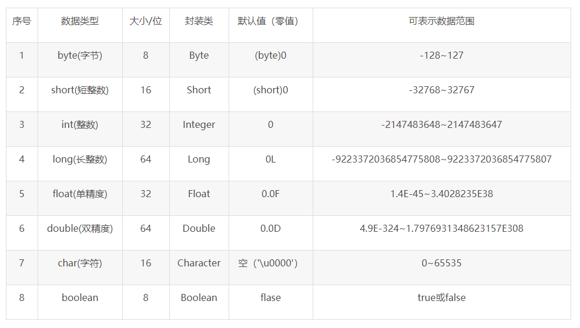

# 八种基本数据类型

对应包装类
1. byte     java.lang.Byte
2. short    java.lang.Short
3. int      java.lang.Integer
4. long     java.lang.Long
5. float    java.lang.Float
6. double   java.lang.Double
7. boolean  java.lang.Boolean         (1字节)
8. char     java.lang.Character       (2字节)

# String类型
## String的构造方法
1. String() 初始化一个新创建的 String 对象，使其表示一个空字符序列。 
2. String(byte[] bytes) 通过使用平台的默认字符集解码指定的 byte 数组，构造一个新的 String。
3. String(byte[] bytes, int offset, int length) 通过使用平台的默认字符集解码指定的byte子数组，构造一个新的String。
4. String(byte[] bytes, int offset, int length, String charsetName) 通过使用指定的字符集解码指定的 byte 子数组，构造一个新的 String。 
5. String(byte[] bytes, String charsetName) 通过使用指定的 charset 解码指定的 byte 数组，构造一个新的 String。
6. String(char[] value) 分配一个新的 String，使其表示字符数组参数中当前包含的字符序列。 
7. String(char[] value, int offset, int count) 分配一个新的 String，它包含取自字符数组参数一个子数组的字符。
8. String(int[] codePoints, int offset, int count) 分配一个新的 String，它包含 Unicode 代码点数组参数一个子数组的字符。 
9. String(String original) 初始化一个新创建的 String 对象，使其表示一个与参数相同的字符序列；换句话说，新创建的字符串是该参数字符串的副本。
10. String(StringBuffer buffer) 分配一个新的字符串，它包含字符串缓冲区参数中当前包含的字符序列。 
11. String(StringBuilder builder) 分配一个新的字符串，它包含字符串生成器参数中当前包含的字符序列。