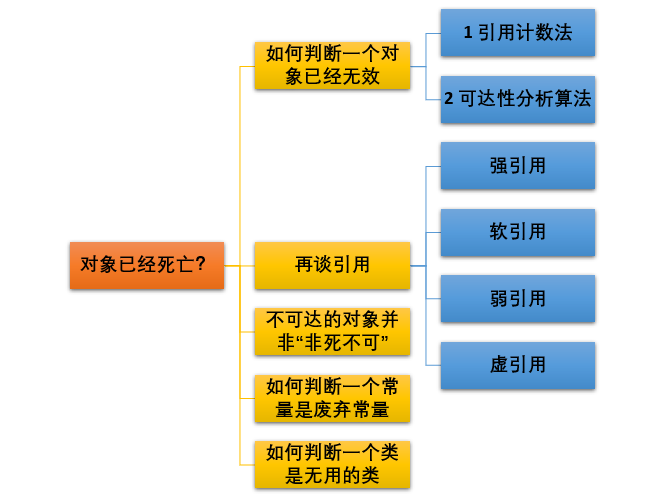
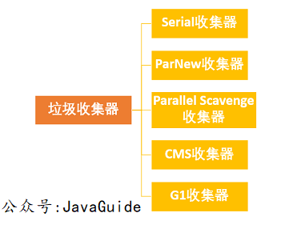

# 常见面试题
1. 如何判断对象是否死亡（两种方法）
2. 简单地介绍一下强引用、软引用、弱引用、虚引用（虚引用与软引用和弱引用的区别、使用软引用能带来的好处）。
3. 如何判断一个常量是废弃常量
4. 如何判断一个类是无用的类
5. 垃圾收集有哪些算法，各自的特点？
6. HotSpot 为什么要分为新生代和老年代？
7. 常见的垃圾回收器有哪些？
8. 介绍一下 CMS、G1 收集器
9. Minor GC 和 Full GC 有什么不同？

# 揭开 JVM 内存分配与回收的神秘面纱
Java 堆是垃圾收集器管理的主要区域，因此也被称作GC 堆（Garbage Collected Heap）.从垃圾回收的角度，由于现在收集器基本都采用分代垃圾收集算法，所以 Java 堆还可以细分为：新生代和老年代：再细致一点有：Eden 空间、From Survivor、To Survivor 空间等。进一步划分的目的是更好地回收内存，或者更快地分配内存。

堆空间的基本结构：

上图所示的 eden 区、s0("From") 区、s1("To") 区都属于新生代，tentired 区属于老年代。大部分情况，对象都会首先在 Eden 区域分配，在一次新生代垃圾回收后，如果对象还存活，则会进入 s1("To")，并且对象的年龄还会加 1(Eden 区->Survivor 区后对象的初始年龄变为 1)，当它的年龄增加到一定程度（默认为 15 岁），就会被晋升到老年代中。对象晋升到老年代的年龄阈值，可以通过参数 -XX:MaxTenuringThreshold 来设置。经过这次GC后，Eden区和"From"区已经被清空。这个时候，"From"和"To"会交换他们的角色，也就是新的"To"就是上次GC前的“From”，新的"From"就是上次GC前的"To"。不管怎样，都会保证名为To的Survivor区域是空的。Minor GC会一直重复这样的过程，直到“To”区被填满，"To"区被填满之后，会将所有对象移动到老年代中。

## 对象优先在 eden 区分配
目前主流的垃圾收集器都会采用分代回收算法，因此需要将堆内存分为新生代和老年代，这样我们就可以根据各个年代的特点选择合适的垃圾收集算法。

大多数情况下，对象在新生代中 eden 区分配。当 eden 区没有足够空间进行分配时，虚拟机将发起一次 Minor GC.下面我们来进行实际测试以下。

在测试之前我们先来看看 Minor GC 和 Full GC 有什么不同呢？

1. 新生代 GC（Minor GC）:指发生新生代的的垃圾收集动作，Minor GC 非常频繁，回收速度一般也比较快。
2. 老年代 GC（Major GC/Full GC）:指发生在老年代的 GC，出现了 Major GC 经常会伴随至少一次的 Minor GC（并非绝对），Major GC 的速度一般会比 Minor GC 的慢 10 倍以上。

## 大对象直接进入老年代
大对象就是需要大量连续内存空间的对象（比如：字符串、数组），这样可以避免为大对象分配内存时由于分配担保机制带来的复制而降低效率。

## 长期存活的对象进入老年代
既然虚拟机采用了分代收集的思想来管理内存，那么内存回收时就必须能识别哪些对象应放在新生代，哪些对象应放在老年代中。为了做到这一点，虚拟机给每个对象一个对象年龄（Age）计数器。

如果对象在 Eden 出生并经过第一次 Minor GC 后仍然能够存活，并且能被 Survivor 容纳的话，将被移动到 Survivor 空间中，并将对象年龄设为 1.对象在 Survivor 中每熬过一次 MinorGC,年龄就增加 1 岁，当它的年龄增加到一定程度（默认为 15 岁），就会被晋升到老年代中。对象晋升到老年代的年龄阈值，可以通过参数 -XX:MaxTenuringThreshold 来设置。

## 动态对象年龄判定
大部分情况，对象都会首先在 Eden 区域分配，在一次新生代垃圾回收后，如果对象还存活，则会进入 s0 或者 s1，并且对象的年龄还会加 1(Eden 区->Survivor 区后对象的初始年龄变为 1)，当它的年龄增加到一定程度（默认为 15 岁），就会被晋升到老年代中。对象晋升到老年代的年龄阈值，可以通过参数 -XX:MaxTenuringThreshold 来设置。

还有一种情况进行动态对象年龄判断：按照年龄从小到大对其占用的大小进行累积，当累积的某个年龄大小超过了 survivor 区的一般时，，取这个年龄和MaxTenuringThreshold中更小的一个值，作为新的晋升年龄阈值”。

# 对象已经死亡？


## 引用计数法
给对象中添加一个引用计数器，每当有一个地方引用它，计数器就加 1；当引用失效，计数器就减 1；任何时候计数器为 0 的对象就是不可能再被使用的。

这个方法实现简单，效率高，但是目前主流的虚拟机中并没有选择这个算法来管理内存，其最主要的原因是它很难解决对象之间相互循环引用的问题。
## 可达性分析算法
这个算法的基本思想就是通过一系列的称为 “GC Roots” 的对象作为起点，从这些节点开始向下搜索，节点所走过的路径称为引用链，当一个对象到 GC Roots 没有任何引用链相连的话，则证明此对象是不可用的。

## 再谈引用
无论是通过引用计数法判断对象引用数量，还是通过可达性分析法判断对象的引用链是否可达，判定对象的存活都与“引用”有关。

JDK1.2 之前，Java 中引用的定义很传统：如果 reference 类型的数据存储的数值代表的是另一块内存的起始地址，就称这块内存代表一个引用

JDK1.2 之后，Java 对引用概念进行了扩充，将引用分为强引用、软引用、弱引用、虚引用四种（引用强度逐渐减弱）
### 1. 强引用
以前我们使用的大部分引用实际上都是强引用，这是使用最普遍的引用。如果一个对象具有强引用，那就类似于必不可少的生活用品，垃圾回收器绝不会回收它。当内存空间不足，Java 虚拟机宁愿抛出 OutOfMemoryError 错误，使程序异常终止，也不会靠随意回收具有强引用的对象来解决内存不足问题。如下：
```java
Object strongReference = new Object();
```
如果强引用对象不使用时，需要弱化从而使 GC 能够回收，如下：
```java
strongReference = null;
```
显示地设置 strongReference 对象为 null， 或让其超出对象地生命周期范围，则 gc 认为该对象不存在引用，这时就可以回收这个对象。

### 2. 软引用
如果一个对象只具有软引用，那就类似于可有可无的生活用品。如果内存空间足够，垃圾回收器不会回收它，如果内存空间不足了，就会回收这些对象的内存。只要垃圾回收器没有回收它，该对象就可以被程序使用。软引用可用来实现内存敏感的高速缓存。
```java
String str = new String("abc");
SoftReference<String> softReference = new SoftReference<>(str);
```
软引用可以和一个引用队列（ReferenceQueue)联合使用。如果软引用所引用对象被垃圾回收，JAVA虚拟机就会把这个软引用加入到与之关联的引用队列中。
```java
ReferenceQueue<String> referenceQueue = new ReferenceQueue<>();
String str = new String("abc");
SoftReference<String> softReference = new SoftReference<>(str, referenceQueue);
str = null;
System.gc();
System.out.println(softReference.get()); //abc
Reference<? extends String> reference = referenceQueue.poll();
System.out.println(reference); //null
```
注意：软引用对象是在jvm内存不够的时候才会被回收，我们调用System.gc()方法只是起通知作用，JVM什么时候扫描回收对象是JVM自己的状态决定的。就算扫描到软引用对象也不一定会回收它，只有内存不够的时候才会回收。

当内存不足时，JVM首先将软引用中的对象引用置为null，然后通知垃圾回收器进行回收：
```java
   if(JVM内存不足) {
        // 将软引用中的对象引用置为null
        str = null;
        // 通知垃圾回收器进行回收
        System.gc();
    }
```
也就是说，垃圾收集线程会在虚拟机抛出 OutOfMemoryError 之前回收软件引用对象，而且虚拟机会尽可能优先回收长时间闲置不用的软引用对象。对那些刚构建的或刚使用过的“较新的”软引用对象会被虚拟机尽可能保留，这就是引入引用队列 ReferenceQueue 的原因。

### 3. 弱引用(WeakReference)
弱引用与软引用的区别在于：只具有弱引用的对象拥有更短暂的生命周期。在垃圾回收器线程扫描它所管辖的内存区域的过程中，一旦发现了只具有弱引用的对象，不管当前内存空间足够与否，都会回收它的内存。不过，由于垃圾回收器是一个优先级很低的线程，因此不一定会很快发现那些只具有弱引用的对象。
```java
String str = new String("abc");
WeakReference<String> weakReference = new WeakReference<>(str);
str = null;
System.gc();
```
JVM首先将软引用中的对象引用置为null，然后通知垃圾回收器进行回收：

下面的代码会让一个弱引用再次变为一个强引用
```java
String str = new String("abc");
WeakReference<String> weakReference = new WeakReference<>(str);
//弱引用转强引用
String strongReference = weakReference.get();
```
同样，弱引用可以和一个引用队列(ReferenceQueue)联合使用，如果弱引用所引用的对象被垃圾回收，Java虚拟机就会把这个弱引用加入到与之关联的引用队列中。

### 4. 虚引用
虚引用与其他引用不同，虚引用并不会决定对象的生命周期。如果一个对象仅持有虚引用，那么它就和没有任何引用一样，在任何时候都可能被垃圾回收器回收。

应用场景：
1. 虚引用主要用来跟踪对象被垃圾回收器回收的活动。
2. 虚引用与软引用和弱引用的一个区别在于：虚引用必须和引用队列联合使用。当垃圾回收器准备回收一个对象时，如果发现它还有虚引用，就会在回收对象的内存之前，把这个虚引用加入到与之关联的引用队列中。
```java
String str = new String("abc");
ReferenceQueue queue = new ReferenceQueue();
//创建虚引用，要求必须与一个引用队列关联
PhantomReference pr = new PhantomReference(str, queue);
```
程序可以通过判断引用队列中是否已经加入了虚引用，来了解被引用的对象是否将要进行垃圾回收。如果程序发现某个虚引用已经被加入到引用队列，那么就可以在所引用的对象的内存被回收之前采取必要的行动。

## 不可达的对象并非“非死不可”
即使在可达性分析法中不可达的对象，也并非是“非死不可”的，这时候它们暂时处于“缓刑阶段”，要真正宣告一个对象死亡，至少要经历两次标记过程；可达性分析法中不可达的对象被第一次标记并且进行一次筛选，筛选的条件是此对象是否有必要执行 finalize 方法。当对象没有覆盖 finalize 方法，或 finalize 方法已经被虚拟机调用过时，虚拟机将这两种情况视为没有必要执行。

被判定为需要执行的对象将会被放在一个队列中进行第二次标记，除非这个对象与引用链上的任何一个对象建立关联，否则就会被真的回收。

## 如何判断一个常量是废弃常量
运行时常量池主要回收的是废弃的常量。假如在常量池中存在字符串 “abc”，如果当前没有任何 String 对象引用该字符串常量的话，就说明常量“abc”就是废弃常量，如果这时候发生内存回收的话而且有必要的话，“abc”就会被系统清理出常量池。

## 如何判断一个类是无用的类
方法区主要回收的是无用的类，那么如何判断一个类是无用的类的呢？

判断一个常量是否是“废弃常量”比较简单，而要判定一个类是否是“无用的类”的条件则相对苛刻许多。类需要同时满足下面 3 个条件才能算是 “无用的类” ：
1. 该类所有的实例都已经被回收，也就是堆中不存在该类的任何实例
2. 加载该类的 ClassLoader 已经被回收
3. 该类对应的 java.lang.Class 对象没有在任何地方被引用，无法在任何地方通过反射访问该类的方法。

虚拟机可以对满足上述 3 个条件的无用类进行回收，这里说的仅仅是“可以”，而并不是和对象一样不使用了就会必然被回收。

# 垃圾收集算法

## 标记-清除算法
该算法分为“标记”和“清除”阶段：首先比较出所有需要回收的对象，在标记完成后统一回收掉所有被标记的对象。它是最基础的收集算法，后续的算法都是对其不足进行改进得到。这种垃圾收集算法会带来两个明显的问题：
1. 效率问题
2. 空间问题（标记清除后会产生大量不连续的碎片）

## 复制算法
为了解决效率问题，“复制”收集算法出现了。它可以将内存分为大小相同的两块，每次使用其中的一块。当这一块的内存使用完成后，就将还存活的对象复制到另一块去，然后再把使用的空间一次清理掉。这样就使每次的内存回收都是对内存区间的一半进行回收。

## 标记-整理算法
根据老年代的特点提出的一种标记算法，标记过程仍然与“标记-清除”算法一样，但后续步骤不是直接对可回收对象回收，而是让所有存活的对象向一端移动，然后直接清理掉端边界以外的内存。

## 分代收集算法
当前虚拟机的垃圾收集都采用分代收集算法，这种算法没有什么新的思想，只是根据对象存活周期的不同将内存分为几块。一般将 java 堆分为新生代和老年代，这样我们就可以根据各个年代的特点选择合适的垃圾收集算法

比如在新生代中，每次收集都会有大量对象死去，所以可以选择复制算法，只需要付出少量对象的复制成本就可以完成每次垃圾收集。而老年代的对象存活几率是比较高的，而且没有额外的空间对它进行分配担保，所以我们必须选择“标记-清除”或“标记-整理”算法进行垃圾收集。

# 垃圾收集器

如果说收集算法是内存回收的方法论，那么垃圾收集器就是内存回收的具体实现。

虽然我们对各个收集器进行比较，但并非要挑选出一个最好的收集器。因为直到现在为止还没有最好的垃圾收集器出现，更加没有万能的垃圾收集器，我们能做的就是根据具体应用场景选择适合自己的垃圾收集器。试想一下：如果有一种四海之内、任何场景下都适用的完美收集器存在，那么我们的 HotSpot 虚拟机就不会实现那么多不同的垃圾收集器了。

## Serial 收集器
Serial（串行）收集器收集器是最基本、历史最悠久的垃圾收集器了。大家看名字就知道这个收集器是一个单线程收集器了。它的“单线程”的意义不仅仅意味着它只会使用一条垃圾收集线程去完成垃圾收集工作，更重要的是它在进行垃圾收集工作的时候必须暂停其他所有的工作线程（“Stop the World”），直到它收集结束。

新生代采用复制算法，老年代采用标记-整理算法

但是 Serial 收集器有没有优于其他垃圾收集器的地方呢？当然有，它简单而高效（与其他收集器的单线程相比）。Serial 收集器由于没有线程交互的开销，自然可以获得很高的单线程收集效率。Serial 收集器对于运行在 Client 模式下的虚拟机来说是个不错的选择。

## ParNew 收集器
ParNew 收集器其实就是 Serial 收集器的多线程版本，除了使用多线程进行垃圾收集外，其余行为（控制参数、收集算法、回收策略等等）和Serial 收集器完全一样

新生代采用复制算法，老年代采用标记-整理算法

它是许多运行在 Server 模式下的虚拟机的首要选择，除了 Serial 收集器外，只有它能与 CMS 收集器（真正意义上的并发收集器，后面会介绍到）配合工作。

## Parallel Scavenge 收集器
Parallel Scavenge 收集器也是使用复制算法的多线程收集器，它看上去几乎和ParNew都一样。 那么它有什么特别之处呢？
```
-XX:+UseParallelGC 
    使用 Parallel 收集器+ 老年代串行
-XX:+UseParallelOldGC
    使用 Parallel 收集器+ 老年代并行
```

Parallel Scavenge 收集器关注点是吞吐量(高效率的利用 CPU)。CMS 等垃圾收集器的关注点更多的是用户线程的停顿时间（提高用户体验）。所谓吞吐量就是 CPU 中用于运行用户代码的时间与 CPU 总消耗时间的比值。Parallel Scavenge 收集器提供了很多参数供用户找到最合适的停顿时间或最大吞吐量，如果对于收集器运作不太了解的话，手工优化存在困难的话可以选择把内存管理优化交给虚拟机去完成也是一个不错的选择。

新生代采用复制算法，老年代采用标记-整理算法

## Serial Old 收集器
Serial 收集器的老年代版本，它同样是一个单线程收集器。它主要有两大用途：一种用途是在 JDK1.5以及以前的版本中与 Parallel Scavenge 收集器搭配使用，另一种用途是作为 CMS 收集器的后配方案。

## Parallel Old 收集器
Parallel Scavenge收集器的老年代版本。使用多线程和“标记-整理”算法。在注重吞吐量以及 CPU 资源的场合，都可以优先考虑 Parallel Scavenge 收集器和 Parallel Old 收集器。

## CMS 收集器
CMS（Concurrent Mark Sweep）收集器是一种以获取最短回收停顿时间为目标的收集器，它非常符合在注重用户体验的应用上使用。

CMS（Concurrent Mark Sweep）收集器是 HotSpot 虚拟机第一款真正意义上的并发收集器，它第一次实现了让垃圾收集线程与用户线程（基本上）同时工作。

从名字中的Mark Sweep这两个词可以看出，CMS 收集器是一种 “标记-清除”算法实现的，它的运作过程相比于前面几种垃圾收集器来说更加复杂一些。整个过程分为四个步骤：
1. 初始标记：暂停所有的其他线程，并记录下直接与 root 相连的对象，速度很快
2. 并发标记：同时开启 GC 和用户线程，用一个闭包结构去记录可达对象。但在这个阶段结束，这个闭包结构并不能保证包含当前所有的可达对象。因为用户线程可能会不断更新引用域，所以 GC 线程无法保证可达性分析的实时性。所以这个算法会跟踪记录这些发生引用更新的地方。
3. 重新标记：重新标记阶段就是为了修正并发标记期间因为用户程序继续运行而导致标记产生变动的那一部分对象的标记记录，这个阶段的停顿时间一般会比初始标记阶段的时间稍长，远远比并发标记阶段时间短。
4. 并发清除：开启用户线程，同时 GC 线程开始对未标记的区域做清扫。

从它的名字就可以看出它是一款优秀的垃圾收集器，主要优点：并发收集、低停顿。但是它有下面三个明显的缺点：
1. 对 CPU 资源敏感
2. 无法处理浮动垃圾
3. 它使用的“标记-清除”算法会导致收集结束时会有大量空间碎片产生。

# G1 收集器
G1（Garbage-First）是一款面向服务器的垃圾收集器，主要针对配备多颗处理器及大容量内存的机器，以极高概率满足 GC 停顿时间要求的同时，还具备高吞量性能特征。

被视为 JDK1.7 中 HotSpot 虚拟机的一个重要进化特征。它具备一下特点：

1. 并行与并发：G1 能充分利用 CPU、多核环境下的硬件优势，使用多个 CPU（CPU 或者 CPU 核心）来缩短 Stop-The-World 停顿时间。部分其他收集器原本需要停顿 Java 线程执行的 GC 动作，G1 收集器仍然可以通过并发的方式让 java 程序继续执行。
2. 分代收集：虽然 G1 可以不需要其他收集器配合就能独立管理整个 GC 堆，但是还是保留了分代的概念。
3. 空间整合：与 CMS 的“标记--清理”算法不同，G1 从整体来看是基于“标记整理”算法实现的收集器；从局部上来看是基于“复制”算法实现的。
4. 可预测的停顿：这是 G1 相对于 CMS 的另一个大优势，降低停顿时间是 G1 和 CMS 共同的关注点，但 G1 除了追求低停顿外，还能建立可预测的停顿时间模型，能让使用者明确指定在一个长度为 M 毫秒的时间片段内。

G1 收集器的运作大致分为以下几个步骤：
1. 初始标记
2. 并发标记
3. 最终标记
4. 筛选回收

G1 收集器在后台维护了一个优先列表，每次根据允许的收集时间，优先选择回收价值最大的 Region （这也就是它的名字 Garbage-First 的由来）。这种使用 Region 划分内存空间以及有优先级的区域回收方式，保证了 G1 收集器在有限时间内可以尽可能高的收集效率（把内存化整为零）。