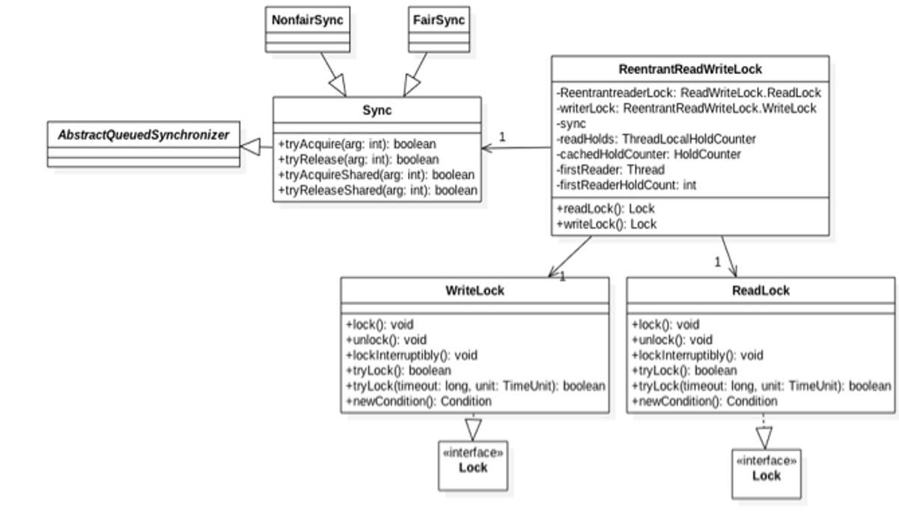
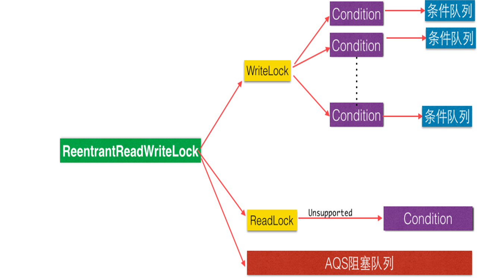

ReentrantReadWriteLock 巧妙的使用 state 的高 16 位表示读状态，

也就是获取改读锁的线程个数，低 16 位 表示获取到写锁的线程的可重入次数。并通过CAS对其进行操作实现了读写分离，在读多写少的场景下比较适用。

接下来用一张图来加深对 ReentrantReadWriteLock 的理解：


首先我们先看ReentrantReadWriteLock 的内部类Sync的一些关键属性和方法，源码如下：
```java
static final int SHARED_SHIFT   = 16;

//共享锁（读锁）状态单位值65536 
static final int SHARED_UNIT    = (1 << SHARED_SHIFT);
//共享锁线程最大个数65535
static final int MAX_COUNT      = (1 << SHARED_SHIFT) - 1;

//排它锁(写锁)掩码 二进制 15个1
static final int EXCLUSIVE_MASK = (1 << SHARED_SHIFT) - 1;
//用来记录最后一个获取读锁的线程获取读锁的可重入次数
private transient HoldCounter cachedHoldCounter;
//用来记录第一个获取到读锁的线程
private transient Thread firstReader；
//用来记录第一个获取到读锁的线程获取读锁的可重入次数
private transient int firstReadHoldCount;
//用来存放除去第一个获取读锁线程外的其他线程获取读锁的可重入次数
private transient ThreadLocalHoldCounter readHolds = new ThreadLocalHoldCounter();

/** 返回读锁线程数  */
static int sharedCount(int c)    { return c >>> SHARED_SHIFT; }
/** 返回写锁可重入个数 */
static int exclusiveCount(int c) { return c & EXCLUSIVE_MASK; }
```
用 firstReader 用来记录第一个获取到读锁的线程，firstReadHoldCounter 则记录第一获取到读锁的线程获取读锁的可重入数。cachedHoldCounter用来记录最后一个获取读锁的线程获取读锁的可重入次数。

接下我们进入ReentrantReadWriteLock 的内部类Sync的内部类HoldCounter类的源码，如下：
```java
    static final class HoldCounter {
       int count = 0;
       //线程id
       final long tid = getThreadId(Thread.currentThread());
    }
```
readHolds 是ThreadLocal 变量，用来存放第一个获取读锁线程外的其他线程获取读锁的可重入次数，可知 ThreadLocalHoldCounter 继承了 ThreadLocal, 里面 initialValue 方法返回一个 HoldCounter 对象，源码如下：
```java
    static final class ThreadLocalHoldCounter
       extends ThreadLocal<HoldCounter> {
       public HoldCounter initialValue() {
           return new HoldCounter();
       }
    }
```
## 写锁的获取与释放
接下来进行写锁的获取与释放讲解，如下：

ReentrantReadWriteLock 中写锁是使用的 WriteLock 来实现的。我们先看一下写锁WriteLock的获取与释放方法，如下：
1. void lock() void lock() 写锁是个独占锁，同时只有一个线程可以获取该锁。 如果当前没有线程获取到读锁和写锁则当前线程可以获取到写锁然后返回。 如果当前已经有线程取到读锁和写锁则当前线程请求写锁会被阻塞挂起。
```java
public void lock() {
    sync.acquire(1);
}
public final void acquire(int arg) {
    if (!tryAcquire(arg) && acquireQueued(addWaiter(Node.EXCLUSIVE), arg))
        selfInterrupt();
}
```
tryAcquire 重写：
```java
protected final boolean tryAcquire(int acquires) {
    Thread current = Thread.currentThread();
    int c = getState();
    int w = exclusiveCount(c);
    //c != 0说明读锁或者写锁已经被某线程获取
    if (c != 0) {
        //已经有线程获取了读锁 或者 w ！= 0 但是获取写锁的不是该线程
        if (w == 0 || current != getExclusiveOwnerThread()) return false;
        if (w + exclusiveCount(acquires) > MAX_COUNT) throw new Error("Maximum lock count exceeded");
        setState(c + acquires);
        return true;
    }

    if (writeShouldBlock() || !compareAndSetState(c, c + acquires)) return false;
    setExclusiveOwnerThread(current);
    return true;
}
```
其中对于ReentrantReadWriteLock的子类NofairSync的writerShouldBlock方法的非公平锁的实现源码如下：
```java
final boolean writerShouldBlock() {
       return false; // writers can always barge
   }
```
对于对于ReentrantReadWriteLock的子类FairSync的writerShouldBlock方法的公平锁的实现源码如下：
```java
final boolean writerShouldBlock() {
  return hasQueuedPredecessors();
}
```
boolean tryLock() 尝试获取写锁，如果当前没有其他线程持有写锁或读锁，则当前线程获取写锁会成功，然后返回 true。 如果当前已经其它线程持有写锁或者读锁则该方法直接返回 false，当前线程并不会被阻塞。
```java
public boolean tryLock( ) {
    return sync.tryWriteLock();
}
final boolean tryWriteLock() { 
    Thread current = Thread.currentThread();
    int c = getState();
    if (c != 0) {
        int w = exclusiveCount(c);
        if (w == 0 || current != getExclusiveOwnerThread()) return false;
        if (w == MAX_COUNT) throw new Error("Maximum lock count exceeded");
    }
    if (!compareAndSetState(c, c + 1)) return false;
    setExclusiveOwnerThread(current);
    return true;
}
```
void unlock() 尝试释放锁，如果当前线程持有该锁，调用该方法会让该线程对该线程持有的 AQS 状态值减一，如果减去 1 后当前状态值为 0 则当前线程会释放对该锁的持有，否者仅仅减一而已。

如果当前线程没有持有该锁调用了该方法则会抛出 IllegalMonitorStateException 异常 ，源码如下：

## 读锁的获取与释放
读锁的 tryAcquireShared 方法源码如下：
```java
protected final int tryAcquireShared(int unused) {
    //(1)获取当前状态值
    Thread current = Thread.currentThread();
    int c = getState();

    //(2)判断是否写锁被占用
    if (exclusiveCount(c) != 0 &&
        getExclusiveOwnerThread() != current)
        return -1;
    //（3）获取读锁计数
    int r = sharedCount(c);
    //（4）尝试获取锁，多个读线程只有一个会成功，不成功的进入下面fullTryAcquireShared进行重试
    if (!readerShouldBlock() && r < MAX_COUNT && compareAndSetState(c, c + SHARED_UNIT)) {
        //(5)第一个线程获取读锁
        if (r == 0) {
            firstReader = current;
            firstReaderHoldCount = 1;
        } else if (firstReader == current) {
            firstReaderHoldCount++;
        } else {
            //（7）记录最后一个获取读锁的线程或记录其它线程读锁的可重入数
            holdCounter rh = cachedHoldCounter;
            if (rh == null || rh.tid != current.getId()) cachedHoldCounter = rh = readHolds.get();
            else if (rh.count == 0) readHolds.set(rh);
            rh.counts++;
        }
        return 1;
    }
    //(8)类似tryAcquireShared，但是是自旋获取
    return fullTryAcquireShared(current);
}
```
