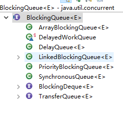

# JDK 提供的并发容器总结
JDK 提供的这些容器大部分在 java.util.concurrent 包中
1. ConcurrentHashMap: 线程安全的 HashMap
2. CopyOnWriteArrayList: 线程安全的 List， 在读多写少的场合性能非常好，远远好于 Vector
3. ConcurrentLinkedQueue: 高效的并发队列，使用链表实现。可以看作一个线程安全的 LinkedList, 这是一个非阻塞队列。
4. BlockingQueue: 这是一个接口，JDK 内部通过链表、数据等方式实现了这个接口。表示阻塞队列，非常适合用于作为数据共享的通道。
5. ConcurrentSkipListMap: 跳表的实现，这是一个 Map， 使用跳表的数据结构进行快速查找。

# CopyOnWriterArrayList
```java
public class CopyOnWriteArrayList<E> extends Object implements List<E>, RandomAccess, Cloneable, Serializable
```
在很多应用场景中，读操作可能会远远大于写操作。由于读操作根本不会修改原有的数据，因此对于每次读取都进行加锁其实是一种资源浪费。我们应该允许多个线程同时访问 List 的内部数据，毕竟读取操作是安全的。

这和我们之前在多线程章节讲过 ReentrantReadWriteLock 读写锁的思想非常类似，也就是读读共享、写写互斥、读写互斥、写读互斥。JDK 中提供了 CopyOnWriteArrayList 类比相比于在读写锁的思想又更进一步。为了将读取的性能发挥到极致，CopyOnWriteArrayList 读取是完全不用加锁的，并且更厉害的是：写入也不会阻塞读取操作。只有写入和写入之间需要进行同步等待。这样一来，读操作的性能就会大幅度提升。那它是怎么做的呢？

## CopyOnWriterArrayList 读取和写入源码简单分析
### 读取操作的实现
读取操作没有任何同步控制和锁操作，理由就是内部数据 array 不会发生修改,只会被另外一个 array 替换，因此可以保证数据安全。
```java
/** The array, accessed only via getArray/setArray. */
    private transient volatile Object[] array;
    public E get(int index) {
        return get(getArray(), index);
    }
    @SuppressWarnings("unchecked")
    private E get(Object[] a, int index) {
        return (E) a[index];
    }
    final Object[] getArray() {
        return array;
    }
    final void setArray(Object[] a) {
        array = a;
    }
```
## 写操作的实现
```java
public boolean add(E e) {
    final ReentrantLock = this.lock;
    lock.lock();
    try {
        Object[] Elements = getArray();
        int len = elements.length;
        Object[] newElements = Arrays.copyOf(elements, len + 1);
        newElements[len] = e;
        setArray(newElements);
        return true;
    } finally {
        lock.unlock();
    }
}
```

# ConcurrentLinkedQueue
Java 提供的线程安全的 Queue 可以分为阻塞队列和非阻塞队列，其中阻塞队列的典型例子是 BlockingQueue，非阻塞队列的典型例子是 ConcurrentLinkedQueue，在实际应用中要根据实际需要选用阻塞队列或者非阻塞队列。 阻塞队列可以通过加锁来实现，非阻塞队列可以通过 CAS 操作实现。

从名字可以看出，ConcurrentLinkedQueue这个队列使用链表作为其数据结构．ConcurrentLinkedQueue 应该算是在高并发环境中性能最好的队列了。它之所有能有很好的性能，是因为其内部复杂的实现。

ConcurrentLinkedQueue 内部代码我们就不分析了，大家知道 ConcurrentLinkedQueue 主要使用 CAS 非阻塞算法来实现线程安全就好了。

ConcurrentLinkedQueue 适合在对性能要求相对较高，同时对队列的读写存在多个线程同时进行的场景，即如果对队列加锁的成本较高则适合使用无锁的 ConcurrentLinkedQueue 来替代。

# BlockingQueue
阻塞队列（BlokingQueue已被广泛用在“生产者-消费者”问题中，其原因是 BlockingQueue 提供了可阻塞的插入和移除的方法。当队列容器已满，生产者线程会被阻塞，直到队列未满；当队列容器为空时，消费者线程会被阻塞，直至队列非空。

BlockingQueue 是一个接口，继承自 Queue，所以其实现类也可以作为 Queue 的实现来使用，而 Queue 又继承自 Collection 接口。下面是 BlockingQueue 的相关实现类：


下面主要介绍一下：ArrayBlockingQueue、LinkedBlockingQueue、PriorityBlockingQueue，这三个 BlockingQueue 的实现类

## ArrayBlockingQueue
ArrayBlockingQueue 是 BlockingQueue 接口的有界队列实现类，底层采用数组来实现。ArrayBlockingQueue 一旦创建，容量不能改变。其并发控制采用可重入锁来控制，不管是插入操作还是读取操作，都需要获取到锁才能进行操作。当队列容量满时，尝试将元素放入队列将导致操作阻塞。尝试从一个空队列中取一个元素也同样会阻塞。

ArrayBlockingQueue 默认情况下不能保证线程访问队列的公平性。如果需要获得公平性的 ArrayBlockingQueue, 可采用如下代码：
```java
private static ArrayBlockingQueue<Integer> blockingQueue = new ArrayBlockingQueue<Integer>(10, true);
```

## LinkedBlockingQueue
LinkedBlockingQueue 底层基于单向链表实现的阻塞队列，可以当作无界队列也可以当作有界队列来使用，同样满是 FIFO 的特性，与 ArrayBlockingQueue 相比起来具有更高的吞吐量，为了防止 LinkedBlockingQueue 扩增，损耗大量内存。通常在创建 LinkedBlockingQueue对象时，会指定其大小，如果未指定，容量等于 Integer.MAX_VALUE。
```java
public LinkedBlockingQueue() {
    this(Integer.MAX_VALUE);
}

public LinkedBlockingQueue(int capacity) {
    if (capacity <= 0) throw new IllegalArgumentException();
    this.capacity = capacity;
    last = head = new Node<E>(null);
}
```

## PriorityBlockingQueue
PriorityBlockingQueue 是一个支持优先级的无阻塞队列。默认情况下元素采用自然顺序进行排序，也可以通过自定义类实现 compareTo() 方法来指定元素排序规则，或者初始化时通过构造器参数 Comparator 来指定排序规则。

PriorityBlockingQueue 并发控制采用的是 ReentrantLock，队列为无界队列（ArrayBlockingQueue 是有界队列，LinkedBlockingQueue 也可以通过在构造函数中传入 capacity 指定队列最大的容量，但是 PriorityBlockingQueue 只能指定初始的队列大小，后面插入元素的时候，如果空间不够的话会自动扩容）。

简单地说，它就是 PriorityQueue 的线程安全版本。不可以插入 null 值，同时，插入队列的对象必须是可比较大小的（comparable），否则报 ClassCastException 异常。它的插入操作 put 方法不会 block，因为它是无界队列（take 方法在队列为空的时候会阻塞）。

# ConcurrentSkipListMap
## 跳表
对于一个单链表，即使链表有序，如果我们想要在其中查找某个数据，也只能从头到尾遍历链表，这样效率自然就会很低，跳表就不一样了。跳表是一种可以用来快速查找的数据结构，有点类似于平衡树。它们都可以对元素进行快速的查找。但一个重要的区别是：对平衡树的插入和删除往往很可能导致平衡树进行一次全局的调整。而对跳表的插入和删除只需要对整个数据结构的局部进行操作即可。这样带来的好处是：在高并发的情况下，你会需要一个全局锁来保证整个平衡树的线程安全。而对于跳表，你只需要部分锁即可。这样，在高并发环境下，你就可以拥有更好的性能。而就查询的性能而言，跳表的时间复杂度也是 O(logn) 所以在并发数据结构中，JDK 使用跳表来实现一个 Map。

跳表的本质是同时维护了多个链表，并且链表是分层的，

最低层的链表维护了跳表内所有的元素，每上面一层链表都是下面一层的子集

跳表内的所有链表的元素都是排序的。查找时，可以从顶级链表开始找。一旦发现被查找的元素大于当前链表中的取值，就会转入下一层链表继续找。这也就是说在查找过程中，搜索是跳跃式的。如上图所示，在跳表中查找元素 18。


从上面很容易看出，跳表是一种利用空间换时间的算法。

使用跳表实现 Map 和使用哈希算法实现 Map 的另外一个不同之处是：哈希并不会保存元素的顺序，而跳表内所有的元素都是排序的。因此在对跳表进行遍历时，你会得到一个有序的结果。所以，如果你的应用需要有序性，那么跳表就是你不二的选择。JDK 中实现这一数据结构的类是 ConcurrentSkipListMap。
