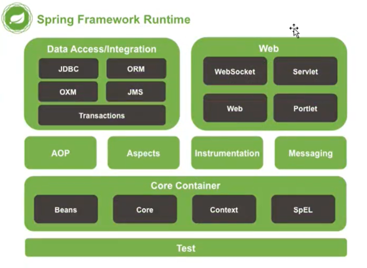

# IOC （inversion of control 控制反转）
1. 对象由原来程序本身创建，变为了程序接收对象
2. 程序员主要精力集中于业务实现
3. 实现了 service 和 dao 的解耦工作。 Service 层和 dao 层实现了分离。没有直接依赖关系。
4. 如果 dao 的实现发生改变，应用程序本身不用该表

## Spring IOC 的实现
### 代码示例
导入相关jar包
1. spring-aop-4.1.6.RELEASE.jar
2. spring-aspects-4.1.6.RELEASE.jar
3. spring-beans-4.1.6.RELEASE.jar
4. spring-context-4.1.6.RELEASE.jar
5. spring-context-support-4.1.6.RELEASE.jar
6. spring-core-4.1.6.RELEASE.jar
7. spring-expression-4.1.6.RELEASE.jar
8. spring-jdbc-4.1.6.RELEASE.jar
9. spring-orm-4.1.6.RELEASE.jar
10. spring-tx-4.1.6.RELEASE.jar
11. spring-web-4.1.6.RELEASE.jar
12. spring-webmvc-4.1.6.RELEASE.jar
13. commons-logging-1.2.jar
14. Hello.java
```java
public class Hello {
	private String name;
	public void setName(String name) {
		this.name = name;
	}
	public void show() {
		System.out.println("hello,"+name);
	}
}
```
beans.xml
```xml
<?xml version="1.0" encoding="UTF-8"?>
<beans xmlns="http://www.springframework.org/schema/beans"
    xmlns:xsi="http://www.w3.org/2001/XMLSchema-instance"
    xsi:schemaLocation="http://www.springframework.org/schema/beans
        http://www.springframework.org/schema/beans/spring-beans.xsd">
	<!-- bean 是一个java对象 由spring容器来创建和管理 -->
	<bean name="hello" class="cn.sxt.bean.Hello">
		<property name="name" value="张三"/>
	</bean>
</beans>
```
Test.java
```java
public class Test {
	public static void main(String[] args) {
		//解析 beans.xml 文件生成管理相应的 bean 对象
		ApplicationContext context = new ClassPathXmlApplicationContext("beans.xml");
		Hello hello = (Hello)context.getBean("hello");
		hello.show();
	}
}
```
Hello 对象是由 spring 对象创建的， Hello 对象属性是由 spring 容器来设置的

这个过程就叫做控制反转
1. 控制的内容： 指谁来控制对象的创建，传统的应用程序对象的创建是由程序本身控制。使用 spring 后，是由 spring 来创建对象的。
2. 反转：正转指程序创建对象，反转指程序本身不去创建对象，而变为被动接收的对象。
3. 总结：以前对象是由程序本身来创建，使用 spring 后，程序变为被动接收 spring 创建好的对象。

控制反转----依赖注入（dependency injection）

IOC 是一种编程思想，由主动编程变为被动接收

IOC 的实现是通过 IOC 容器来实现的。IOC 容器---BeanFactory

## 使用 IOC 来创建对象有三种方式
1. 通过无参的构造方法来创建
```java
public class User {
	private String name;
    public Hello() {
        System.out.println("User的无参构造方法");
    }
	public void setName(String name) {
		this.name = name;
	}
	public void show() {
		System.out.println("name="+name);
	}
}
```
2. 通过有参构造方法来创建

Bean.xml 配置：根据参数的下标来设置
```xml
<bean>
    <constructor-arg index="0" value="李四" />
</bean>
```
根据参数名称来设置
```xml
<bean>
    <constructor-arg name="name" value="李四" />
</bean>
```
根据参数类型来设置
```xml
<bean>
    <constructor-arg type="java.lang.String" value="李四" />
</bean>
```

3. 通过工厂方法来创建对象

静态工厂类UserFactory
```java
public class UserFactory {
    public static User newInstance(String name) {
        return new User(name);
    }
}
```
bean.xml
```xml
<bean id="user" class="cn.sxt.factory.UserFactory" factory-method="newInstance"> 
    <constructor-arg index="0" value="李四" />
</bean>
```

动态工厂类UserDynamicFactory
```java
public class UserFactory {
    public User newInstance(String name) {
        return new User(name);
    }
}
```
```xml
<bean id="userFactory" class="cn.sxt.factory.UserDynamicFactory"/>
<bean id="user" factory-bean="userFactory" factory-method="newInstance">
    <constructor-arg index="0" value="李四" />
</bean>
```

## bean 的作用域 scope
1. singleton 单例 整个容器中只有一个对象实例
2. prototype 原型 每次获取 bean 都产生一个新的对象
3. request 每次请求时创建一个新的对象
4. session 在会话的范围内是一个对象
5. global session 只在 portlet 下有用，表示是 application
6. application 在应用范围内是一个对象

在整合 structs2 和 spring 时需要将 action 设为 scope="prototype"

## bean 的自动装配
autowire = "byName"  根据 set 方法名去查找。 "byType" 根据类型自动装配，但是同一类型的 bean 只能有一个。constructor 当通过构造器实例化 bean。

也可以在 beans 标签头里添加 default-autowire="byName"