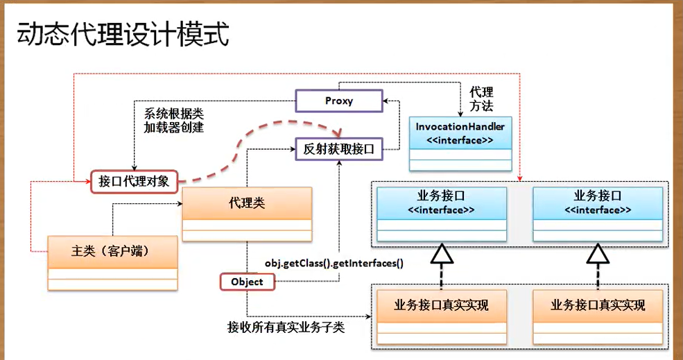

通过静态代理设计模式的缺陷可以发现，最好的做法是为所有功能一致的业务操作接口提供有统一的代理处理操作，而这可以通过动态代理机制来实现，但是在动态代理机制里面需要考虑到如下几点问题：
1. 不管是动态代理类还是静态代理类都一定要接收真实业务实现子类对象
2. 由于动态代理类不再与某一个具体的接口进行捆绑，所以应该可以动态获取类的接口信息，

# CGLIB 动态代理
```java
public class JavaAPIDemo {
    public static void main(String[] args) throws Exception {
        Message realObject = new Message();
        Enhancer enhancer = new Enhancer();
        enhancer.setSuperClass(realObject.getClass());
        enhancer.setCallback(new MLDNProxy(realObject));
        Message proxy = (Message) enhancer.create();
        proxy.send();
    }
}

class MLDNProxy implements MethodIntercepter { //拦截器配置
    private Object target;
    public MLDNProxy(Object target) {
        this.target = target;
    }
    @Override
    public Object intercept(Object proxy, Method method, Object[] args, MethodProxy methodProxy) throws Throwable {
        Object returnData = null;
        returnData = method.invoke(this.target, args);
        return returnData;
    }
}

Class Message {
    public void send() {
        System.out.pringln("发送消息");
    }
}
```
