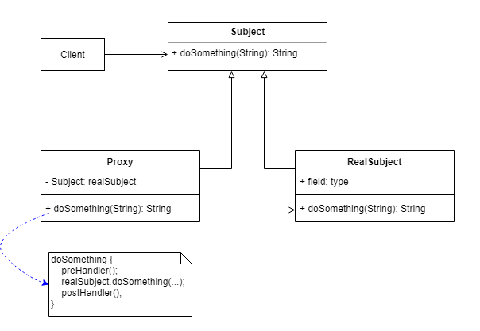

　所谓代理，就是一个人或者一个机构代表另一个人或者另一个机构采取行动。在一些情况下，一个客户不想或者不能直接引用一个对象，而代理对象可以在客户端和目标对象之间起到中介的左右。

代理模式：给某一个对象提供一个代理或占位符，并由代理对象来控制对原对象的访问，通过代理访问目标对象，这样可以在不修改原目标对象的前提下，提供额外的功能操作，扩展目标对象的功能。说简单点，代理模式就是设置一个中间代理来控制访问原目标对象，以达到增强原对象的功能和简化访问方式。一般而言会分三种：静态代理、动态代理和CGLIB代理。

代理模式结构如下：


# 静态代理
优点：可以在不修改目标对象的前提下扩展目标对象的功能

缺点：如果需要代理多个类，每个类都会有一个代理类，会导致代理类无限制扩展；如果类中有多个方法，同样的代理逻辑需要反复实现、应用到每个方法上，一旦接口增加方法，目标对象与代理对象都要进行修改

# 动态代理
代理类在程序运行时创建的代理方式被成为动态代理。 也就是说，这种情况下，代理类并不是在Java代码中定义的，而是在运行时根据我们在Java代码中的“指示”动态生成的。下面我们一步一步手动来实现动态代理。下面的示例都是直接针对接口的，就不是针对接口的具体实现类了，静态代理示例中，UserDaoProxy代理的是IUserDao的实现类：UserDaoImpl，那么动态代理示例就直接针对接口了，下面示例针对的都是UserMapper接口，模拟的mybatis，但不局限于UserMapper接口

## 原理源码剖析
**首先我们先来讲一下 JDK 动态代理的实现原理**

1. 拿到被代理对象的引用，然后获取他的接口
2. JDK 代理重新生成一个类，同时实现我们给的代理对象所实现的接口
3. 把被代理对象引用拿到了
4. 重新动态生成一个 class 字节码
5. 然后编译

```java
public class jdkInvocationHandler implements InvocationHandler {
    private ProductService target;

    public Object getInstance(ProductService target) {
        this.target = target;
        Class clazz = this.target.getClass();
        return Proxy.newProxyInstance(clazz.getClassLoader(), clazz.getInterfaces(), this);
    }

    public Object invoke(Object proxy, Method method, Object[] args) throws Throwable {
        SimpleDateFormat simpleDataFormat = new SimpleDateFormat("yyyy-MM-dd");
        String currentDate = simpleDateFormat.format(new Date());
        System.out.println("日期[" + currentDate +"]添加了一款产品");
        return method.invoke(this.target, args);
    }
}

public interface ProductService {
    void addProduct(String productName);
}

public class ProductServiceImpl implements ProductService{
    public void addProduct(String productName) {
        System.out.println("正在添加"+productName);
    }
}

public class Test {
    public static void main(String[] args) throws Exception {
        ProductService productService = new ProductServiceImpl();
        ProductService proxy = (ProductService) new jdkInvocationHandler().getInstance(productService);
        proxy.addProduct("iphone");
        // 这里我们将jdk生成的代理类输出了出来，方便后面分析使用
        byte[] bytes = ProxyGenerator.generateProxyClass("$Proxy0",new Class[]{productService.getClass()});

        FileOutputStream os = new FileOutputStream("Proxy0.class");
        os.write(bytes);
        os.close();
    }
}
```

## 自己手写一个动态代理
