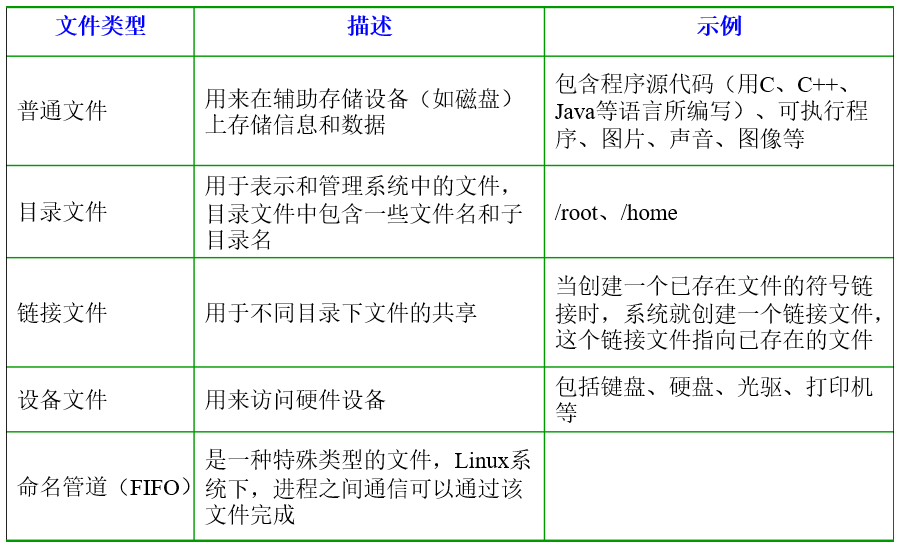

# 一、从认识操作系统开始
## 操作系统简介
1. 操作系统是管理就算及硬件与软件资源的程序，是计算机系统的内核与基石
2. 操作系统本质上是运行在计算机上的软件程序
3. 为用户提供一个与系统交互的操作界面。
4. 操作系统分内核与外壳（我们可以把外壳理解成围绕着内核的应用程序，而内核就是能操作硬件的程序）

## 操作系统的内核
操作系统的内核是操作系统的核心部分，它负责系统的内存管理，硬件设备的管理，文件系统的管理以及应用程序的管理

### 操作系统的用户态与内核态
unix 与 linux的体系架构：分为用户态与内核态。用户态与内核态是操作系统对执行权限进行分级后的不同运行模式

**为什么要有用户态与内核态？**

在 cpu 所有指令中，有些指令是非常危险的，如果使用不当，将会造成系统崩溃等后果。为了避免这种情况发生。cpu将指令划分为特权级(内核态)指令和非特权级(用户态)指令。

对于那些危险的指令只允许内核及其相关模块调用，对于那些不会造成危险的指令，就允许用户应用程序调用。
1. 内核态(核心态,特权态): 内核态是操作系统内核运行的模式。 内核态控制计算机的硬件资源，如硬件设备，文件系统等等，并为上层应用程序提供执行环境。
2. 用户态是用户应用程序运行的状态。 应用程序必须依托于内核态运行,因此用户态的操作权限比内核态是要低的， 如磁盘，文件等，访问操作都是受限的。
3. 系统调用：系统调用是操作系统为应用程序提供能够访问到内核态的资源的接口。

**用户态切换到内核态的几种方式**
1. 系统调用：系统调用是用户态主动要求切换到内核态的一种方式，用户应用程序通过操作系统调用内核为上层应用程序开放的接口来执行程序
2. 异常：当cpu在执行用户态的应用程序时，发生了某些不可知的异常。于是当前用户态的应用进程切换到处理异常的内核程序中。
3. 硬件设备的中断：当硬件设备完成用户请求后，会向 cpu 发出相应的中断信号，这时 cpu 会暂停执行下一条即将要执行的指令，转而去执行与中断信号对应的应用程序。如果先前执行的指令是用户态下程序的指令，那么这个转换过程也是用户态到内核态的转换。

**Swap交换空间**

简单理解：当某个应用程序所需的内存空间不够了， 那么系统会判断当前物理内存是否还有足够的空闲可以分配给应用程序。 如果有，则应用程序直接进入内存运行；如果没有，系统就根据某种算法(如:LRU)挂起一个进程， 将挂起的进程交换到虚拟内存Swap中等待，并将应用程序调入内存执行。 虚拟内存是被虚拟出来的，可以使用硬盘(不仅仅是硬盘)来作为虚拟内存。

这就是为什么当我们运行一个所需内存比我们计算机内存还大的程序时，仍然可以正常运行，并感受不到内存的限制的原因。

# 二、文件系统概览
在 Linux 操作系统中，所有被操作系统管理的资源，例如网络接口卡、磁盘驱动器、打印机、输入输出设备、普通文件或是目录都被看做是一个文件。

## Inode
inode 是 Linux/unix 文件系统和硬盘存储的基础。

**Inode是什么？有什么作用？**

文件存储在硬盘上，硬盘的最小存储单位是扇区（Sector），每个扇区存储 512 字节（0.5kb）。操作系统读取硬盘的数据时，不会一个扇区一个扇区的读取，这样做效率较低，而是一次读取多个扇区， 即一次读取一个块(block)。块由多个扇区组成，是文件读取的最小单位，块的最常见的大小是4kb， 约为8个连续的扇区组成。文件数据存储在块中，但还需要一个空间来存储文件的元信息 metadata, 如文件拥有者，创建时间，权限，大小等。这种存储文件元信息的区域就叫 inode, 译为索引节点。存储文件的元信息。 使用 stat 命令可以查看文件的inode信息。每个inode都有一个号码， Linux/Unix操作系统不使用文件名来区分文件，而是使用inode号码区分不同的文件。

inode也需要消耗硬盘空间，所以在格式化硬盘的时候，操作系统会将硬盘分为2个区域， 一个区域存放文件数据，另一个区域存放inode所包含的信息， 存放inode的区域被称为inode table。

## 文件类型与目录结构
Linux支持很多文件类型，其中非常重要的文件类型有: 普通文件，目录文件，链接文件，设备文件，管道文件，Socket套接字文件等。

1. 普通文件：普通文件是指txt,html,pdf等等的这样应用层面的文件类型， 用户可以根据访问权限对普通文件进行访问，修改和删除。
2. 目录文件：目录也是一种文件，打开目录实际上是打开目录文件。目录文件包含了它目录下的所有文件名以及指向这些文件的指针。
3. 链接文件：链接文件分为符号链接（软链接）文件和硬链接文件。
   1. 硬链接文件（Hard Link）：硬链接的文件拥有相同的inode，因为操作系统是靠inode来区分文件的， 2个inode相同的文件，就代表它们是一个文件。 删除一个文件并不会对其他拥有相同inode的文件产生影响，只有当inode相同的所有文件被删除了， 这个文件才会被删除。换言之，你建立一个文件的硬链接，这个文件和硬链接它们的inode是相同的, 无论你删除的是硬链接还是源文件，都不会对彼此造成影响,除非你把硬链接和源文件都删除， 这个文件才被删除。
   2. 符号链接(软链接)(Symbolic Link): 符号链接类似于 Windows 上的快捷方式，它保存了源文件的路径。当符号链接被删除时，并不会影响源文件。但是当源文件被删除时，符号链接就找不到源文件了。
4. 设备文件：设备文件分为块设备文件和字符设备文件，设备文件一般存于 /dev 目录下
   1. 字符设备文件：字符设备文件是按照先后顺序被存取数据的设备，通常不支持随机存取，此类设备可以按字节/字符来读取数据， 如键盘，串口等等。
   2. 块设备是可以被随机存取数据的设备，应用程序可以访问块设备上任何一块位置。 块设备以块的方式读取数据，在windows下也称为簇，块设备不支持字符的方式寻址。 如硬盘，软盘，光碟等等。
5. 管道文件：管道文件一般用于进程间通信，使用 mkfifo 命令可以创建一个管道文件
6. Socket套接字文件：套接字文件被用于网络进程间的通信，既可以使2台不同的机器进行通信，也可以用于本机的 Socket 网络程序。

## Linux 目录树
所有可操作的计算机资源都存在于目录树这个结构中，对计算资源的访问，可以看做是对这棵目录树的访问。

Linux 目录结构如下：

常见目录说明
1. /bin： 存放二进制可执行文件(ls、cat、mkdir等)，常用命令一般都在这里；
2. /etc： 存放系统管理和配置文件；
3. /home: 存放所有用户文件的根目录，是用户主目录的基点，比如用户user的主目录就是/home/user，可以用~user表示；
4. /usr： 用于存放系统应用程序
5. /opt:  额外安装的可选应用程序包所放置的位置。一般情况下，我们可以把tomcat等都安装到这里；
6. /proc: 虚拟文件系统目录，是系统内存的映射。可直接访问这个目录来获取系统信息
7. /root: 超级用户（系统管理员）的主目录（特权阶级）；
8. /sbin: 存放二进制可执行文件，只有 root 才能访问。这里存放的是系统管理员使用的系统级别的管理命令和程序。如 ifconfig.
9. /dev:  用于存放设备文件；
10. /mnt: 系统管理员安装临时文件系统的安装点，系统提供这个目录是让用户临时挂载其他的文件系统。
11. /boot： 存放用于系统引导时使用的各种文件
12. /lib：  存放着和系统运行相关的库文件
13. /tmp：  用于存放各种临时文件，是公用的临时文件存储点；
14. /var：  用于存放运行时需要改变数据的文件，也是某些大文件的溢出区，比方说各种服务的日志文件（系统启动日志等）
15. /lost+found：这个目录平时是空的，系统非正常关机而留下“无家可归”的文件（windows下叫什么.chk）就在这里。

# 四、Linux 基本命令
## 目录切换命令
1. cd usr： 切换到该目录下usr目录
2. cd ..（或cd../）： 切换到上一层目录
3. cd /： 切换到系统根目录
4. cd ~： 切换到用户主目录
5. cd -： 切换到上一个操作所在目录

## 目录的操作命令(增删改查)
1. mkdir 目录名称： 增加目录
2. ls或者ll（ll是ls -l的别名，ll命令可以看到该目录下的所有目录和文件的详细信息）：查看目录信息
3. find 目录 参数： 寻找目录（查）
    1. 列出当前目录及子目录下所有文件和文件夹: find .
    2. 在/home目录下查找以.txt结尾的文件名:find /home -name "*.txt"
    3. 同上，但忽略大小写: find /home -iname "*.txt"
    4. 当前目录及子目录下查找所有以.txt和.pdf结尾的文件:find . \( -name "*.txt" -o -name "*.pdf" \)或find . -name "*.txt" -o -name "*.pdf"
4. mv 目录名称 新目录名称： 修改目录的名称（改）
5. mv 目录名称 目录的新位置： 移动目录的位置---剪切（改）
6. cp -r 目录名称 目录拷贝的目标位置： 拷贝目录（改），-r代表递归拷贝
7. rm [-rf] 目录: 删除目录（删）

## 文件的操作命令(增删改查)
1. touch 文件名称： 文件的创建（增）
2. cat/more/less/tail 文件名称： 文件的查看
   1. cat： 查看显示文件内容
   2. more： 可以显示百分比，回车可以向下一行， 空格可以向下一页，q可以退出查看
   3. less：可以使用键盘上的PgUp和PgDn向上 和向下翻页，q结束查看
   4. tail-10: 查看文件的后10行，Ctrl+C结束。命令 tail -f 文件 可以对某个文件进行动态监控，例如tomcat的日志文件， 会随着程序的运行，日志会变化，可以使用tail -f catalina-2016-11-11.log 监控 文 件的变化
3. vim 文件： 修改文件的内容（改）

## 压缩文件的操作命令
**打包并压缩文件**

Linux 中的打包文件一般是以 .tar 结尾的，压缩的命令一般是以 .gz 结尾的。

而一般情况下打包和压缩是一起进行的，打包并压缩后的文件的后缀名一般 .tar.gz。命令： tar -zcvf 打包压缩后的文件名 要打包压缩的文件
1. z:  调用 gzip 压缩命令进行压缩
2. c： 打包文件
3. v： 显示运行过程
4. f： 指定文件名

**解压压缩包**

tar -xvf 压缩文件

x： 代表解压

示例
1. 将/test下的test.tar.gz解压到当前目录下可以使用命令：tar -xvf test.tar.gz
2. 将/test下的test.tar.gz解压到根目录/usr下:tar -xvf test.tar.gz -C /usr（- C代表指定解压的位置）

## Linux 的权限命令
操作系统中每个文件都拥有特定的权限、所属用户和所属组。权限是操作系统用来限制资源访问的机制，在Linux中权限一般分为读(readable)、写(writable)和执行(excutable)，分为三组。分别对应文件的属主(owner)，属组(group)和其他用户(other)，通过这样的机制来限制哪些用户、哪些组可以对特定的文件进行什么样的操作。通过 ls -l 命令我们可以 查看某个目录下的文件或目录的权限

文件的类型：
1. d： 代表目录
2. -： 代表文件
3. l： 代表软链接（可以认为是window中的快捷方式）

Linux中权限分为以下几种：
1. r：代表权限是可读，r也可以用数字4表示
2. w：代表权限是可写，w也可以用数字2表示
3. x：代表权限是可执行，x也可以用数字1表示

对文件和目录而言，读写执行表示不同的意义。

对于文件：

对于目录：

需要注意的是超级用户可以无视普通用户的权限，即使文件目录权限是000，依旧可以访问。 在linux中的每个用户必须属于一个组，不能独立于组外。在linux中每个文件有所有者、所在组、其它组的概念。

1. 所有者。    一般为文件的创建者，谁创建了该文件，就天然的成为该文件的所有者，用 ls -ahl 命令可以看到文件的所有者 也可以使用 chown 用户名 文件名 来修改文件的所有者
2. 文件所在组。 当某个用户创建了一个文件后，这个文件的所在组就是该用户所在的组 用ls ‐ahl命令可以看到文件的所有组 也可以使用 chgrp 组名 文件名来修改文件所在的组。
3. 其他组       除开文件的所有者和所在组的用户外，系统的其它用户都是文件的其它组

**修改文件/目录的权限的命令：chmod**

chmod u=rwx,g=rw,o=r aaa.txt

chmod -R u=rwx,g=rwx,o=rwx ./log // 递归给log目录下的所有文件授权

chmod 764 aaa.txt

**补充一个比较常用的东西:**

假如我们装了一个 zookeeper, 我们每次开机要求其自动启动该怎么办？
1. 新建一个脚本 zookeeper
2. 为新建的脚本 zookeeper 添加可执行权限, 命令是：chmod +x zookeeper
3. 把 zookeeper 这个脚本添加到开机启动项里面，命令是： chkconfig --add zookeeper
4. 如果想看看是否添加成功，命令是：chkconfig --list

## Linux 用户管理
Linux用户管理相关命令:
1. useradd 选项 用户名:添加用户账号
2. userdel 选项 用户名:删除用户帐号
3. usermod 选项 用户名:修改帐号
4. passwd 用户名:更改或创建用户的密码
5. passwd -S 用户名 :显示用户账号密码信息
6. passwd -d 用户名: 清除用户密码

useradd命令用于Linux中创建的新的系统用户。useradd可用来建立用户帐号。帐号建好之后，再用passwd设定帐号的密码．而可用userdel删除帐号。使用useradd指令所建立的帐号，实际上是保存在/etc/passwd文本文件中。

passwd命令用于设置用户的认证信息，包括用户密码、密码过期时间等。系统管理者则能用它管理系统用户的密码。只有管理者可以指定用户名称，一般用户只能变更自己的密码。

## Linux 系统用户组的管理
每个用户都有一个用户组，系统可以对一个用户组中的所有用户进行集中管理。不同Linux 系统对用户组的规定有所不同，如Linux下的用户属于与它同名的用户组，这个用户组在创建用户时同时创建。

用户组的管理涉及用户组的添加、删除和修改。组的增加、删除和修改实际上就是对/etc/group文件的更新。

**Linux系统用户组的管理相关命令:**
1. groupadd 选项 用户组 :增加一个新的用户组
2. groupdel 用户组:要删除一个已有的用户组
3. groupmod 选项 用户组 : 修改用户组的属性

## 其他常用命令
1. grep 要搜索的字符串 要搜索的文件 --color: 搜索命令， --color代表高亮显示
2. ps -ef/ps -aux  这两个命令都是查看当前系统正在运行进程，两者的区别是展示格式不同。如果想要查看特定的进程可以使用这样的格式：ps aux|grep redis (查看包括 redis 字符串的进程), 也可以使用 pgrep redis -a
3. kill -9 进程的 pid: 杀死进程（-9 表示强制终止。）
4. 网络通信命名
   1. 查看当前系统的网卡信息： ifconfig
   2. 查看与某台机器的连接情况：ping
   3. 查看当前系统的端口使用： netstat -an
5. net-tools 和 iproute2： et-tools起源于BSD的TCP/IP工具箱，后来成为老版本Linux内核中配置网络功能的工具。但自2001年起，Linux社区已经对其停止维护。同时，一些Linux发行版比如Arch Linux和CentOS/RHEL 7则已经完全抛弃了net-tools，只支持iproute2。linux ip命令类似于ifconfig，但功能更强大，旨在替代它。
6. shutdown:  shutdown -h now： 指定现在立即关机；shutdown +5 "System will shutdown after 5 minutes"：指定5分钟后关机，同时送出警告信息给登入用户。
7. reboot: reboot： 重开机。reboot -w： 做个重开机的模拟（只有纪录并不会真的重开机）。