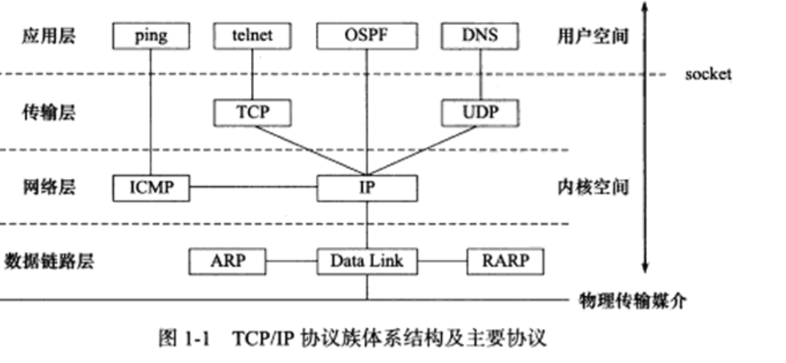
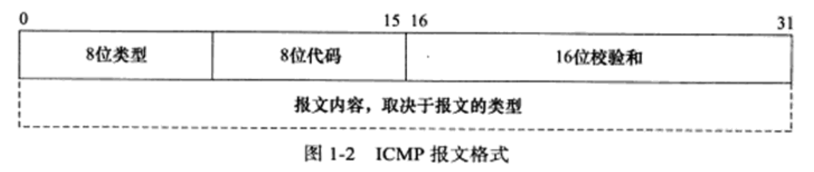
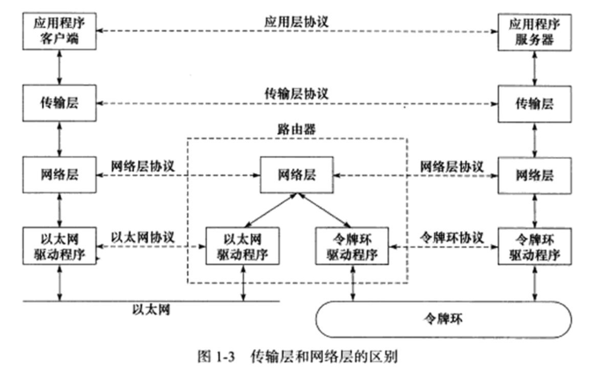
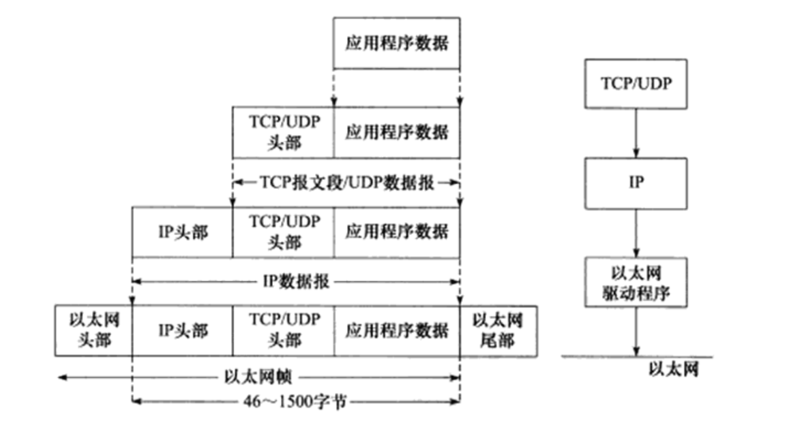
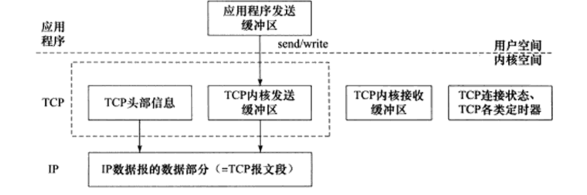
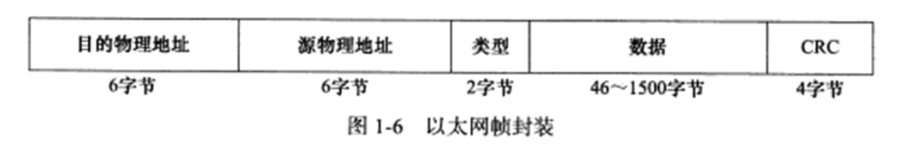

# TCP/IP协议族体系结构以及主要协议

## 数据链路层
数据链路层实现了网卡接口的网络驱动程序，已处理数据在物理媒介（以太网，令牌环等）上的传输

数据链路层两个常用协议：ARP（Address Resolve Protocol，地址解析协议）和RARP协议(Reverse Address Resolve Protocol,逆地址解析协议)实现了IP地址和物理地址的相互转换（通常是MAC地址，以太网，令牌环和802.11无线网络都使用MAC地址）

网络层使用IP地址寻址一台机器，而数据链路层使用物理地址寻址一台机器

RARP协议仅用于网络上的某些无盘工作站。因为缺乏存储设备，无盘工作站无法记录记录自己的IP地址，但它们可以利用于网卡上的物理地址来向网络管理者（服务器或网络管理软件）查询自身的IP地址。运行RARP服务的网络管理者通常存有该网络上所有机器的物理地址到IP地址的映射。

## 网络层
网络层实现数据包的选路和转发。网络层最核心的是IP协议（Internet Protocol，因特网协议）。IP协议根据数据包的目的IP地址来决定如何投递它。如果数据包不能直接发送给目标主机，那么IP协议就为它寻找一个合适的下一跳（next hop)路由器，并将数据包交由该路由器来转发

网络层的另外一个重要的协议是ICMP协议（Internet Control Message Protocol,因特网控制报文协议）。它是IP协议的重要补充，主要用于检测网络连接。ICMP协议使用的报文格式如下：

ICMP报文分为两大类
1. 差错报文 : 目标不可到达（类型值为3）和重定向（类型值为5）
2. 查询报文 : 这类报文用来查询网络信息，比如ping程序就是使用ICMP报文查看目标是否可达（类型这为8）。有的ICMP报文还使用8位代码字段来进一步细分不同的条件。比如重定向报文使用代码值0表示对网络重定向，代码值1表示对主机重定向。

ICMP 报文使用16位校验和字段对整个报文（包括头部和内部部分）进行循环冗余校验（Cyclic Redundancy Check, CRC），以检验报文在传输过程中是否损坏。

需要指出的是，ICMP协议并非严格意义上的网络层协议，因为它使用处于同一层的IP协议提供的服务

## 传输层
传输层为两台主机上的应用程序提供端到端（end to end）的通信。与网络层使用的逐跳通信方式不同，传输层只关心通信的起始端和目的端，而不在乎数据包的中转过程。

可见，数据链路层（驱动程序）封装了物理网络的电气细节；网络层封装了网络连接的细节；传输层则为应用程序封装了一条端到端的逻辑通信链路，它负责数据的收发，链路的超时重连等

传输层协议主要有三个：TCP协议， UDP协议和SCTP协议

TCP协议（Transmission Control Protocol,传输层控制协议）为应用层提供可靠的、面向连接的和基于流（stream）的服务。TCP协议使用超时重传、数据确认等方式来确保数据包被正确地发送至目的端，因此TCP服务是可靠得。使用TCP协议通信得双方必须建立TCP连接，并在内核中为该连接维持一些必要得数据结构，比如连接的状态、读写缓冲区，以及诸多定时器等。当通信结束时，双方必须关闭连接以释放这些内核数据。

UDP协议（User Datagram Protocol，用户数据报协议）则与TCP协议完全相反，它为应用层提供不可靠、无连接和基于数据报的服务。如果数据在途中丢失，或者目的端通过数据校验发现数据错误而将其丢弃，则UDP协议只是简单地通知应用程序发送失败。因此UDP协议通常要自己处理超时重传，数据确认等逻辑。UDP协议是无连接地，即通信双方不保持一个长久地联系，因此应用程序每次发送数据都要明确指定接收端的地址(IP地址等信息)。基于数据报的服务，是相对基于流的服务而言的。每个udp数据报都有一个长度，接收端必须以该长度为最小单位将其所有内容一次性读出，否则数据将被截断。

SCTP协议（Stream Control Transmission Protocol， 流控制传输协议）是一种相对较新的传输层协议。它是为了因特网上传输电话信号而设计的。

## 应用层
ping 是应用程序，而不是协议，它利用ICMP报文检测网络连接，是调试网络环境的必备工具

telnet 协议是一种远程登录协议，它使我们能在本地完成远程任务，

OSPF (Open Shortest Path First, 开放最短路径优先)协议是一种动态路由更新协议，由于路由器之间的通信，已告知对方各自的路由信息。

DNS (Domain Name Service, 域名服务)协议提供机器域名到IP地址的转换。

应用层协议（或程序）可能跳过传输层直接使用网络层提供的服务，比如ping程序和OSPF协议。应用程序（或程序）通常既可以使用TCP服务，又可以使用UDP服务，比如DNS协议。我们可以通过 /etc/services 文件查看所有知名的应用层协议，以及它们都能使用哪些传输层服务。

# 封装

经过TCP封装后的数据称为TCP报文段（TCP message segment）,或者简称TCP段。前文提到，TCP协议为通信双方维持一个连接，并且在内核中存储相关数据。这部分数据中的TCP头部信息和TCP内核缓冲区（发送缓冲区或接收缓冲区）数据一起构成了TCP报文段。

当发送端应用层程序使用send（或者write）函数向一个TCP连接写入数据时，内核中的TCP模块首先把这些数据复制到与该连接对应的TCP内核发送缓冲区中，然后TCP模块调用IP模块提供的服务，传递的参数包括TCP头部信息和TCP发送缓冲区中的数据，即TCP报文段。

经过UDP封装后的数据称为UDP数据报（UDP datagram）。UDP对应用程序数据的封装与TCP类似。不同的是，UDP无须为应用层数据保存副本，因为它提供的服务是不可靠的。当一个UDP数据报被成功发送之后，UDP内核缓冲区中的该数据报就被丢弃了。如果应用程序检测到该数据报未能被接收端正确接收，并打算重发这个数据报，则应用程序需要重新从用户空间将该数据报拷贝到UDP内核发送缓冲区中。

经过IP封装后的数据称为IP数据报（IP datagram）。IP数据报也包括头部信息和数据部分，其中数据部分就是一个TCP报文段、UDP数据报或者ICMP报文。

经过数据链路层封装的数据称为帧（frame）。传输媒介不同，帧的类型也不同。比如以太网上传输的是以太网帧（ethernet frame），而令牌环网络上传输的则是令牌环帧（token ring frame）

以太网帧使用6字节的目的物理地址和6字节的源物理地址来表示通信的双方。

# 分用
当帧到达目的主机时，将沿着协议栈自底向上依次传递。各层协议依次处理帧中本层负责的头部数据，以获取所需的信息，并最终将处理后的帧交给目标应用程序。这个过程称为分用。分用是依靠头部信息中的类型字段实现的。

因为IP协议、ARP协议和RARP协议都使用帧传输数据，所以帧的头部需要提供某个字段（具体情况取决于帧的类型）来区分它们。以以太网帧为例如果类型值为0x800则数据部分为IP数据报， 0x806则为ARP请求或应答报文，以太网驱动程序就将帧交付给ARP模块，0x835，则帧的数据部分为RARP请求或应答报文，

同样，因为ICMP协议、TCP协议和UDP协议都使用IP协议，所以IP数据报的头部采用16位的协议字段来区分它们。

端口号
1. DNS 53
2. HTTP 80

