# 程序编码
```shell
unix> gcc -O2 -o p p1.c p2.c 
```
编译选项-O2告诉编译器使用第二级优化。通常，提高优化级别会使最终程序运行得更快，但是编译时间可能会变长，对代码进行调试会更困难。

C预处理器会扩展源代码，插入所有用#include命令指定的文件，并扩展所有的宏。其次，编译器产生两个源文件的汇编代码，名字分别为p1.s和
p2.s。接下来，汇编器会将汇编代码转化成二进制目标代码文件p1.o和p2.o。最后，链接器将两个目标文件与实现标准Unix库函数的代码合并，并
产生过最终的可执行文件

## 整数寄存器
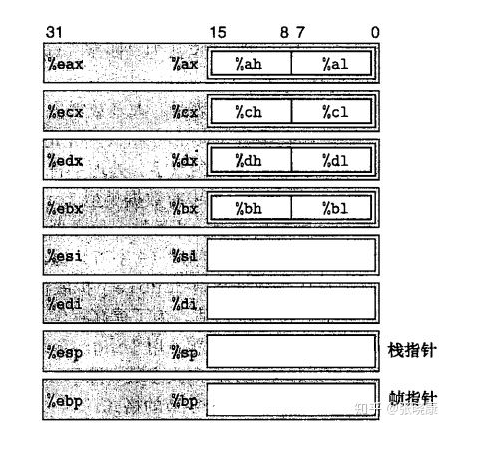

上述八个寄存器主要功能如下
1. %eax，可存放一般数据，而且可以作为累加器使用
2. %ecx, 可存放一般数据，而且可用来做计数器，常常将循环次数用它来存放
3. %edx, 可存放一般数据，而且可用来存放乘法运算产生的部分积，或用来存放输入输出的端口地址（指针）；
4. %ebx，可存放一般数据，而且可用来存放数据的指针（偏移地址）；
5. %esi，可存放一般数据，还可用于串操作中，存放源地址，对一串数据访问；
6. %edi，可存放一般数据，还可用于串操作中，存放目的地址，对一串数据访问；
7. %esp，用于寻址一个称为堆栈的存储区，通过它来访问堆栈数据；
8. %ebp，可存放一般数据，用来存放访问堆栈段的一个数据区，作为基地址； 

一些通常对C程序员屏蔽的处理器状态是可见的：
1. 程序计数器（称为%eip)表示即将要执行的下一条指令在存储器中的地址
2. 整数寄存器文件包含8个被命名的位置，分别存储32位的值。这些寄存器可以存储地址（对应于C的指针）或整型数据。有的寄存器用来记录某些重要的程序状态，而其他的寄存器用来保存临时数据，例如过程的局部变量
3. 条件码寄存器：保存最近执行的算数或逻辑指令的状态信息，它们用来实现控制或数据流中的条件变化，比如用来实现 if 和 while 语句。
4. 浮点寄存器文件包含8个位置，用来存放浮点数据。

程序存储器（program memory）包含程序的目标代码，操作系统需要的一些信息用来管理过程调用和返回的运行时栈，以及用户分配的存储器块（malloc)

```c
int accum = 0;
int sum(int x, int y) {
    int t = x + y;
    accum += t;
    return t;
}
```
在命令上使用“-S”选项，就能看到C编译器产生的汇编代码
```
unix> gcc -O2 -S code.c
```
```
sum:
    pushl %ebp
    movl %esp, %ebp
    movl 12(%ebp), %eax
    addl 8(%ebp), %eax
    addl %ebp, accum
    movl %ebp, %esp
    popl %ebp
    ret
```

要查看目标代码文件的内容，有一类称为反汇编器，
```
unix> objdump -d code.o
```

## 操作数指示符
1. 立即数
2. 寄存器
3. 存储器引用

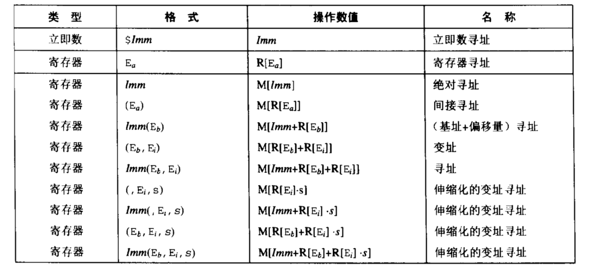

操作数可以表示立即数（常数）值、寄存器值或是来自存储器的值。伸缩因子s必须是1，2，4，8

### 数据传送指令
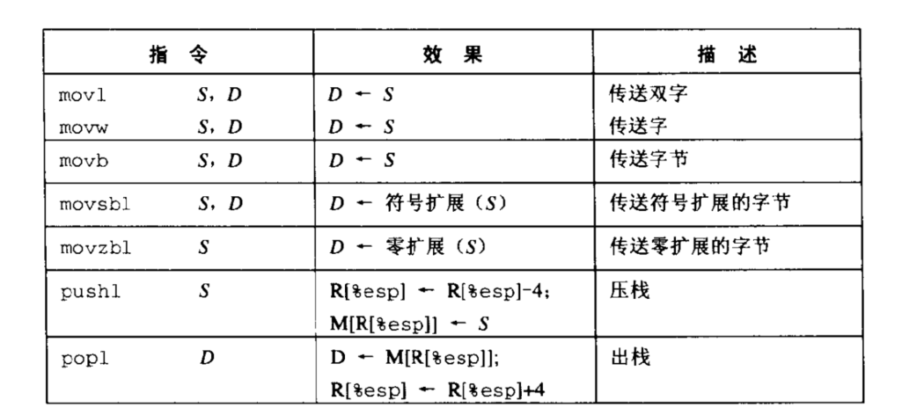

movsbl和movzbl指令负责拷贝一个字节，并设置目的操作数中其余的位。movsbl指令的原操作数是单字节的，它执行符号扩展到32位，然后拷贝到双字的目的中。类似地，movbl指令的原操作数是单字节的，在前面加24个0扩展到32位，并将结果拷贝到双字的目的中

指令pushl %ebp的行为等价于下面这两条指令：
```
subl $4, %esp
movl %ebp, (%esp)
```
指令popl %eax的行为等价于下面这样两条指令：
```
movl (%esp), %eax
addl $4, %esp
```

栈操作说明：
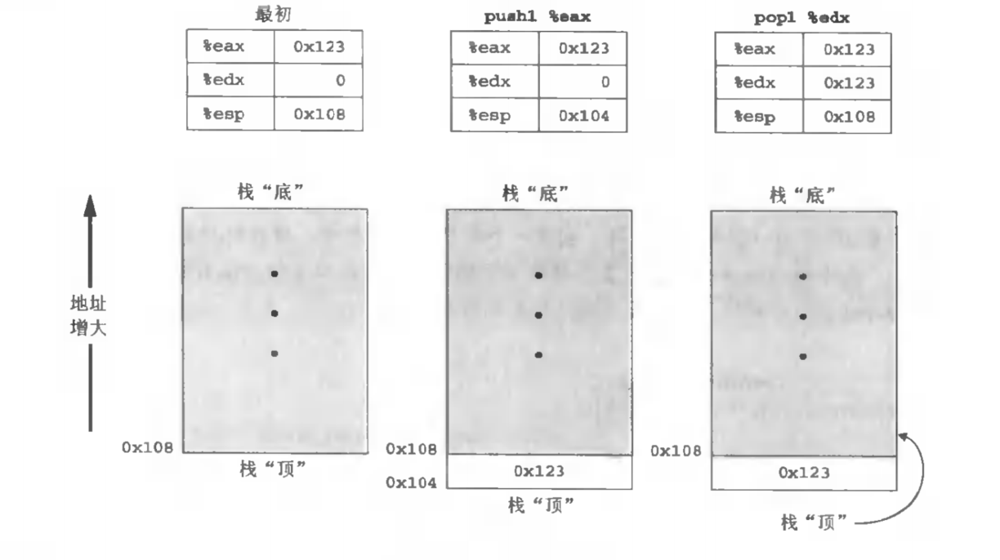

```c++
int exchange(int *xp, int y) {
    int x = *xp;
    *xp = y;
    return x;
}
```
以上代码的汇编代码为：
```
movl 8(%ebp), %eax          GET xp
movl 12(%ebp), %edx         GET y
movl (%eax), %ecx           GET x at *xp
movl %edx, (%eax)           Store y at *xp
movl %ecx, %eax             Set x as return value
```

## 算术和逻辑操作
整数算术操作：
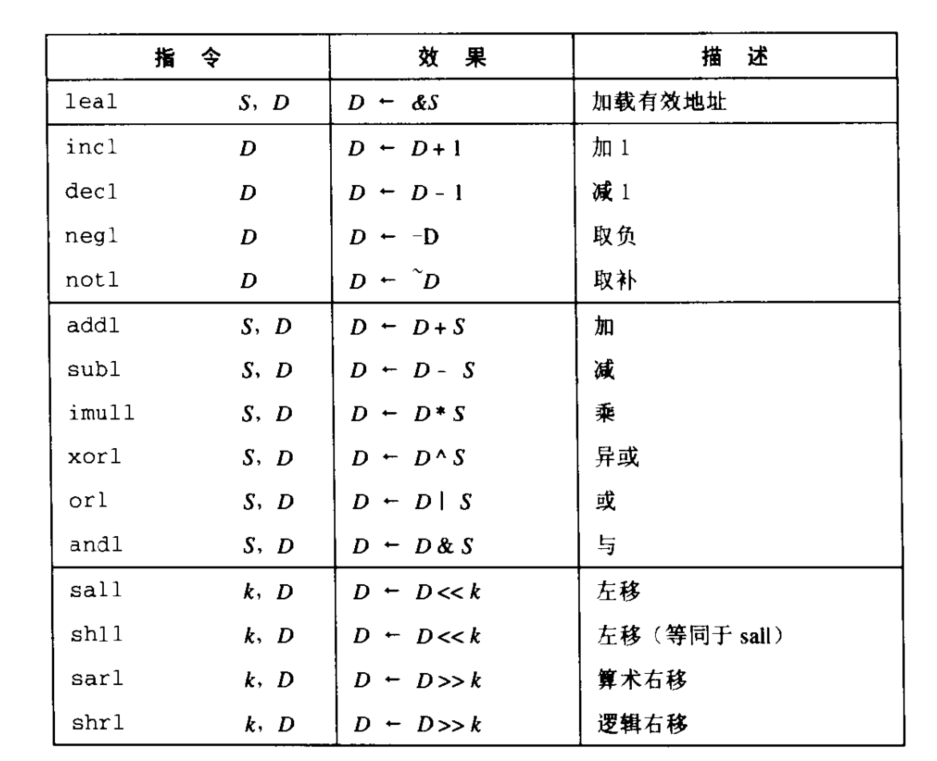

移位操作只允许0-31位的移位，移位量可以是立即数，也可以是放在单字节寄存器元素%cl中。

左移指令：sall ,shll效果一样都是将右边添0

右移指令：sarl（添上符号位）, shrl（添0）


### 特殊的算术操作
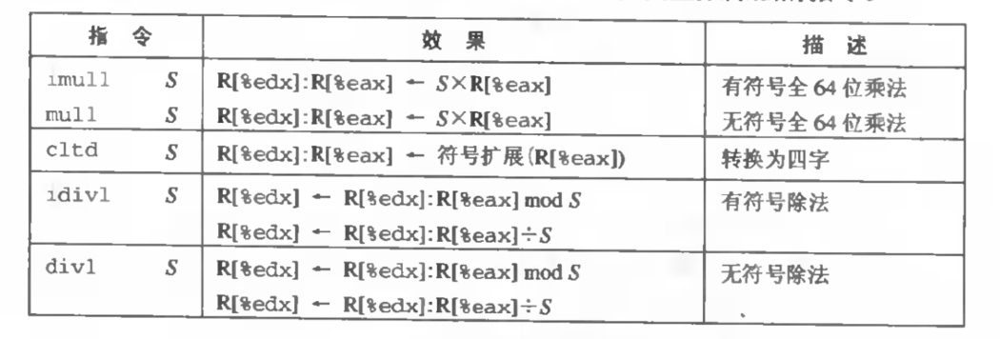
这些操作提供了有符号和无符号数的全64位乘法和除法，一对寄存器%edx和%eax组成一个64位的四字


## 控制
### 条件码

1. CF 进位标志
2. ZF 零标志
3. SF 符号标志
4. OF 溢出标志

比如说，我们用addl指令完成等价于C表达式 t=a + b 会根据下面的表达式设置条件码
```
CF: (unsigned t) < (unsigned a)            无符号溢出
ZF: (t == 0)                               零
SF: (t < 0)                                负数
OF: (a < 0 == b < 0) && (t < 0 != a < 0)   有符号溢出
```
leal指令不改变任何条件码，因为它是用来进行地址计算的。
对于逻辑操作，例如xorl,进位标志和溢出标志设置成0。对于移位操作，进位标志将设置位最后一个被移出的位，而溢出标志设置为0.

下面的表给出了两个操作，它们只设置条件码而不改变任何其他寄存器。
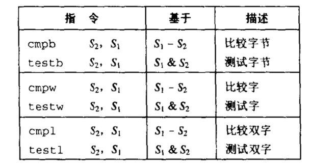
cmpb、cmpw和cmpl指令根据它们的两个操作数之差来设置条件码。如果两个操作数相等，这些指令会将零标志设置为1，而其他的标志可以用来确定两个操作数之间的大小关系。

testb、testw和testl指令会根据它们的两个操作数的与（AND）来设置零标志和负数标志。通常两个操作数是一样的（例如，testl %eax, %eax用来检查%eax是负数、零还是正数），或其中的一个操作数是用来指示哪些位应该被测试的掩码。

### 访问条件码
两种最常用的访问条件码的方法不是直接读取它们，而是根据条件码的某个组合，设置一个整数寄存器或是执行一条件分支指令。

```
Note: a is in %edx, b is in %eax
cmpl %eax, %edx                       Compare a:b
setl %al                              Set low order byte of %eax to 0 or 1          
movzbl %al, %eax                      Set remaining bytes of %eax to 0
```
movzbl用来清零三个高位字节

某些底层的机器指令可能有多个名字，我们称之为“同义名”比如说，“setg”表示“设置大于”，“setnle”表示设置不小于等于

虽然所有的算术操作都会设置条件码，但是各个set命令的描述都适用于这样一种情况：执行比较指令，根据计算t = a - b设置条件码。例如，就sete来说，即“当相等时设置”指令/当a=b时，会得到t=0，因此零标志位就表示相等
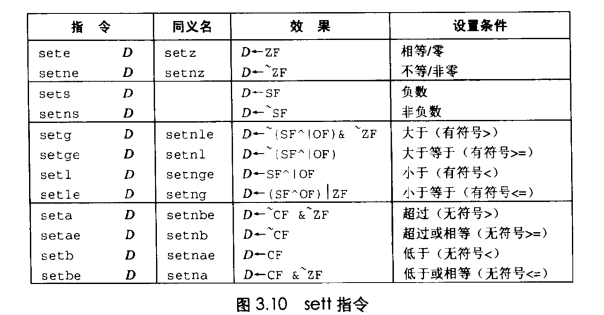

### 跳转指令和它们的编码
考虑下面这样的汇编序列
```
xorl %eax, %eax                        set %eax to 0
jmp .L1                                Goto .L1
movl (%eax), %edx                      Null pointer deference
.L1:
popl %edx
```
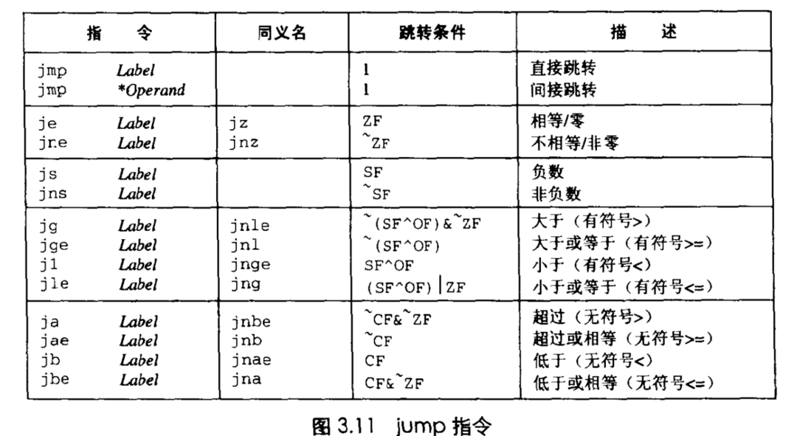
当跳转条件满足时，这些指令会跳转到一条带标号的目的地。有些指令有“同义名”，也就是同一条机器指令的别名。

指令jmp .L1会导致程序跳过movl指令，从popl指令开始继续执行。在产生目标代码文件时，汇编器会确定所有带标号指令的地址，并使跳转目标（目的指令的地址）编码为跳转指令的一部分。

条件跳转只能是直接跳转

在汇编代码中，跳转目标是用符号标号书写的。汇编器，以及后来的链接器，会产生跳转目标的适当编码。跳转指令有几种不同的编码，但是最常用的一些是PC相关的。也就是说，它们会将目标指令的地址与紧跟在跳转指令后面那条指令的地址之间的差作为编码。这些地址偏移量可以编码为一、二或四个字节。第二种编码方式是给出“绝对”地址，用四个字节直接指定目标。汇编器和链接器会选择适当的跳转目的编码。

## 翻译条件分支
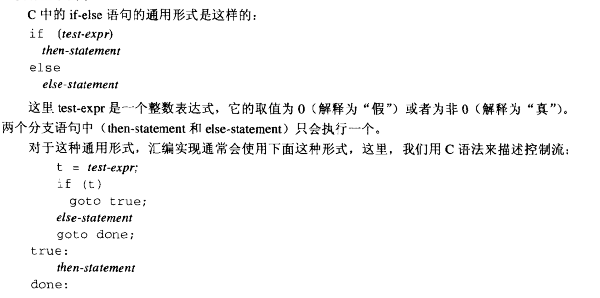

## 循环
C提供了好几种循环结构，即while、for、和do-while。汇编中没有相应的指令存在，将条件测试和跳转组合起来实现循环的效果，大多数编译器根据do-while形式来产生循环代码，但在实际形式中使用do-while相对较少，先转换成do-while形式，在编译成机器代码。

do-while循环
```
do 
    body-statement
    while(test-expr);
```
转换成机器代码，实现如下
```
loop:
    body-statement
    t = test-expr;
    if (t)
        goto loop;
```
例子如下：
```c
int fib_dw(int n) {
    int i = 0;
    int val = 0;
    int nval = nval;
    do {
        int t = val + nval;
        val = nval;
        nval = t;
        i++;
    } while (i < n);
    return val;
}
```
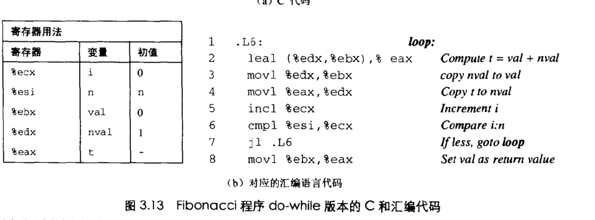
while循环
```
while(test-expr)
    body-statement
```
机器代码的实现如下
```
loop:
    t = test-expr;
    if (!t)
        goto done
    body-statement
    goto loop;
done:
```
这种翻译要求内循环，也就是执行次数最多的代码部分，里有两条控制语句。相反，大多数C编译器将这段代码转换成do-while循环用一个条件分支来在需要时省略循环体的第一次执行：
```
if (!test-expr)
    goto done;
do
    body-statement
    while (test-expr);
done:
```

## switch 语句
switch（开关）语句提供了根据一个整数索引值进行多重分支的能力。在处理具有多中可能结果的测试时，这种语句特别有用。它们不仅提高了C代码的可读性，而且通过使用一种称为跳转表（jump table）的数据结构使得实现更加高效。跳转表是一个数组，表项i是一个代码段的地址，这个代码段实现的是当开关索引值等于i时程序应该采取的动作。程序代码用开关索引值来执行一个跳转表内的数组引用，确定跳转指令的目标。和使用一组很长的if-else语句相比，使用跳转表的优点时执行开关语句的时间与开关情况的数量无关。GCC根据开关情况的数量和开关情况值的稀少程度（sparsity）来翻译开关语句。当开关情况数量比较多（例如，四个或更多），并且值的范围跨度比较小时，就会使用跳转表。
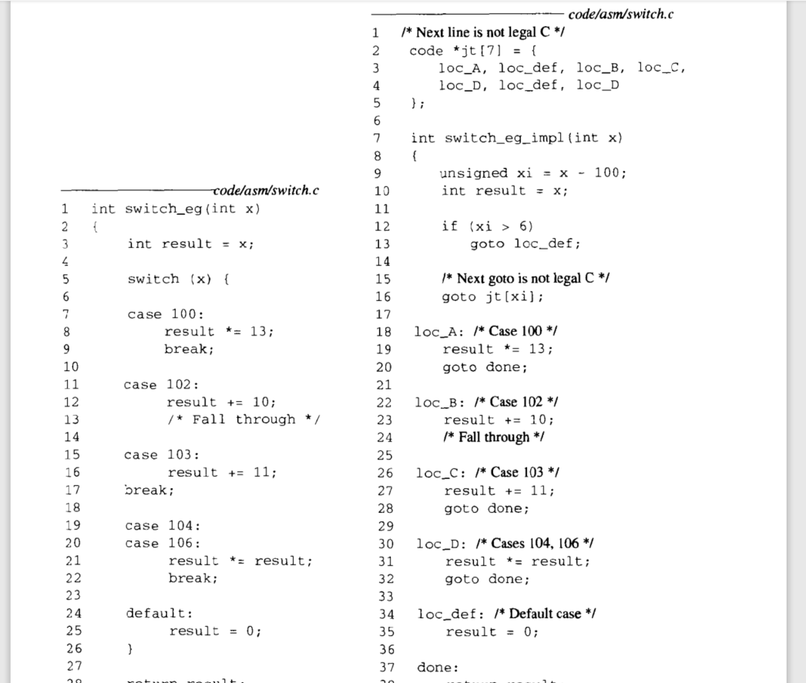
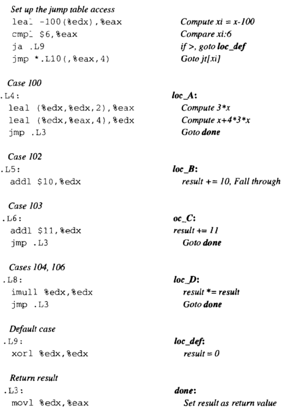
在汇编代码中，跳转表是用下面这样的声明表示的
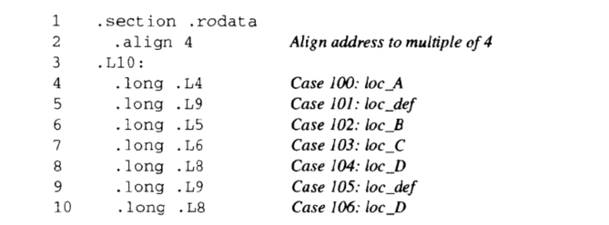
这些声明表明，在叫做“.rodata”（表示“只读数据”，Read-Only Data"）的目标代码文件的段中，应该有一组7个“长”字（4个字节），每个字的值都是与指定的汇编代码标号（例如，.L4）相关的指令地址。标号丄10标志着这段分配的起始。与这个标号相对应的地址会作为间接跳转（指令4）的基地址。

# 调用过程
数据传递、局部变量的分配和释放是通过操作程序栈来实现的。

## 栈帧结构
IA32 程序用程序栈来支持过程调用。栈用来传递过程参数、存储返回信息、保存寄存器以供以后恢复使用，以及用于本地存储。为单个过程分配的那部分称为栈帧。栈帧的最顶端是以两个指针定界的，寄存器%ebp作为帧指针，而寄存器%esp作为栈指针。
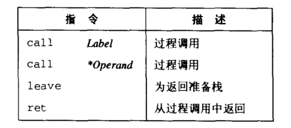
call指令有一个目标，指明被调用过程起使的指令地址。同跳转一样，调用可以是直接的，也可以是间接的。
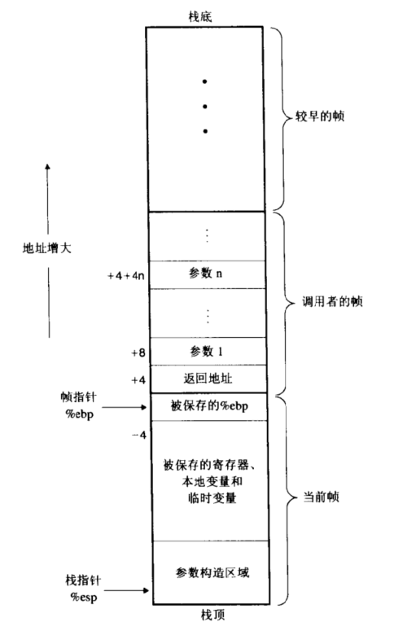
call指令的效果是将返回地址入栈，并跳转到被调用过程的起始处。返回地址是紧跟在程序中call后面的那条指令的地址，这样当被调用过程返回时，执行会从此继续。ret指令从栈中弹出地址，并跳转到那个位置。要正确使用这条指令，就要使栈准备号，栈指针要指向前面call指令存储返回地址的位置。leave指令可以用来使栈做好返回的准备。它等价于下面的代码序列
```
movl %ebp, %esp
popl %ebp
```
另外，这种准备工作也可以通过直接使用传送和弹出操作来完成。寄存器%eax可以用来返回值，如果函数要返回整数或指针的话。

## 寄存器使用惯例
寄存器%eax，%edx，%ecx被划分为调用者保存寄存器。当过程P调用Q时，Q可以覆盖这些寄存器，而不会破坏任何P所需要的数据。另外，寄存器%ebx、%esi和%edi被划分为被调用者保存寄存器。这意味着Q必须在覆盖它们之前，将这些寄存器的值保存在栈中，并在返回前恢复它们。

### 什么叫做“被调用者保存”和“调用者保存”
```
int p() {
    int x = f();
    Q();
    return x;
}
```
过程P希望它计算出来的x的值在调用了Q之后任然有效。如果x放在一个调用者保存寄存器中，而P（调用者）必须在调用Q之前保存这个值，并在Q返回后恢复该值。如果x在一个被调用者保存寄存器中，Q（被调用者）想使用这个寄存器，那么Q在使用这个寄存器之前，必须保存这个值，并在返回前恢复它。在这两种情况下，保存就是将寄存器值压入栈中，而恢复是指从栈中弹出到寄存器中。


## 递归过程
```c++
int fib_rec(int n) {
    int prev_val, val;
    if (n <= 2) return 1;
    prev_val = fib_rec(n - 2);
    val = fib_rec(n - 1);
    return prev_val + val;
}
```
```
fib_rec:
    Setup code
    pushl %ebp
    movl %esp %ebp
    subl $16, %esp
    pushl %esi
    pushl %ebx

    Body Code
    movl 8(%ebp), %ebx
    cmpl $2, %ebx
    jle .L24
    addl $-12, %esp
    leal -2(%ebx), %eax
    pushl %eax
    call fib_rec
    movl %eax, %esi
    addl $-12, %esp
    leal -1(%ebx), %eax
    pushl %eax
    call fib_rec
    addl %esi, %eax
    jmp .L25

    Treminal condition
.L24:
    movl $1, %eax

.L25:
    leal -24(%ebp), %esp
    popl %ebx
    popl %esi
    movl %ebp, %esp
    popl %ebp
    ret
```

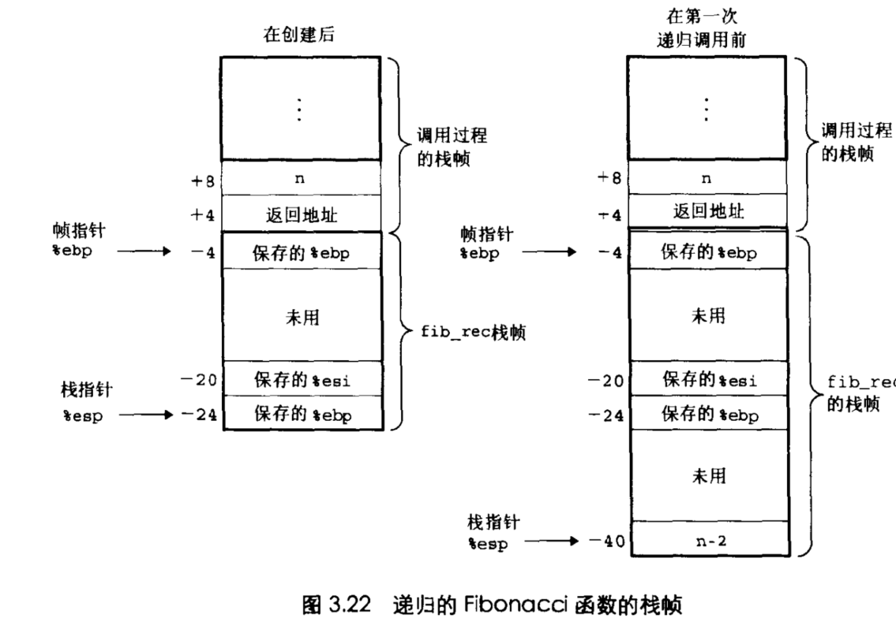

# 数组分配和访问
## 基本原则
T A[N];

首先，他在存储器中分配了L， N字节的连续区域，这里L是数据类型T的大小。

IA32的存储器引用指令被设计用来简化数组访问。例如，假设E是一个整数数组，而我们想计算E[i],在此，E的地址存放在寄存器%edx中，而i存放在寄存器%ecx中，然后指令如下

movl (%edx, %ecx, 4), %eax

## 指针运算
C允许对指针进行运算，而计算出来的值会根据该指针引用的数据类型的大小进行调整

## 数组与循环
在循环代码内，对数组的引用通常有非常规则的模式，优化编译器会使用这些模式。例如，下图(a)中所示的函数decimal,计算的是一个由5个十进制数字的数组表示的整数。在把这
个函数转换成汇编代码的过程中，编译器产生的代码类似于图(b)(中的C函数decimal5_opt。首先，它不会使用循环变量i,而是用指针运算来依次遍历数组元素。它计算岀最后一个数组元素的地址，并且把与这个地址的比较作为循环测试。最后，它能使用do-while循环，因为至少要执行一次循环体。（c)给出了进一步的优化，以避免使用整数乘法指令，使用val + 4 * val来代替5 * val
原始的C代码.png)
等价的指针代码.png)
相应的汇编代码.png)

### 为什么要避免使用整数乘法？
在较老的IA32处理器模型中，整数乘法指令要花费30个时钟周期，所以编译器要尽可能地避免使用它。而在大多数新近地处理器模型中，乘法指令只需要3个时钟周期，所以不一定会进行这样地优化

## 嵌套数组
即使是创建数组时，数组分配和引用的通用原则也是有效的。例如，声明 int A[4][3];等价于声明
typedef int row3_t[3]; row3_t A[4];

要访问多维数组中的元素，编译器产生的代码要计算待访问元素的偏移，然后再用movl指令，以数组的起始地址作为基地址，偏移（可能需要乘以伸缩因子）作为索引，

## 固定大小的数组
对固定大小的多维数组进行操作的代码，C编译器能够进行多种优化。如下：
```c
#define N 16
typedef int fix_matrix[N][N];

/* Compute i, k of fixed matrix product */
int fix_prod_ele (fix_matrix A, fix_matrix B, int i, int k) {
    int j;
    int result = 0;

    for (j = 0; j < N; j++) result += A[i][j] * B[j][k];

    return result;
}
```
优化后
```c
int fix_prod_ele_opt(fix_matrix A, fix_matrix B, int i, int k) {
    int *Aptr = &A[i][0];
    int *Bptr = &B[0][k];
    int cnt = N - 1;
    int result = 0;
    do {
        result += (*Aptr) * (*Bptr);
        Aptr += 1;
        Botr += N;
        cnt--
    }while (cnt >= 0);
    return result;
}
```
实际的汇编代码如下：
```
Aptr is in %edx, Bptr in %ecx, result in %esi, cnt in %ebx
.L23:
    movl (%edx,) %eax
    imull (%ecx), %eax
    addl %eax, %esi
    addl $64 %ecx
    addl $4 edx
    decl %ebx
    jns .L23
```

## 动态分配的数组
C支持大小编译时就能直到的多维数组。在许多应用程序中，我们需要代码能够对动态分配的任意大小的数组进行操作。为此，我们必须显示地写出多维数组到一维数组地映射。我们可以将数据类型var_matrix简单地定义为int *: typedef int *var_matrix;

我们用Unix的库函数calloc来为一个n * n的整数数组分配和初始化存储：
```c
var_matrix new_var_matrix(int n) {
    return (var_matrix) calloc(sizeof(int), n*n);       //如果没有足够的空间则返回null
}
```

### C、C++、Java中的动态存储器分配和释放
在c中，堆（一个可以用来存放数据结构的存储器池）中的存储分配是用库函数malloc,calloc.它们的效果类似于C++和Java中的new操作。C和C++都要求程序显示地用free函数来释放已分配的空间。在Java中,释it是由运行时系统通过一个称为garbage collection （垃圾回收）的进程自动完成

然后，我们用行优先顺序的数组下标来计算方法确定矩阵元素i,j的位置为i * n + j;
```c
int var_ele(var_matrix A, int i, int j, int n) {
    return A[(i * n) + j];
}
```
翻译成汇编代码是这样的：
```
movl 8(%ebp), %edx              Get A
movl 12(%ebp), %eax             Get i
imull 20(%ebp), %eax            Compute n * i
addl 16(%ebp), %eax             Compute n * i + j
movl (%edx, %eax, 4), %eax      Get A[i * n + j]
```

# 异类的数据结构
C提供了两种不同的对象结合到一起来创建数据类型的机制：结构(structure)，用关键字struct来声明，将多个对象集合到一个单位中：联合(union),用关键字union来声明，允许用几种不同的类型来引用一个对象。

## 结构
C的struct声明创建一个数据类型，将可能不同类型的对象聚合到一个对象中。结构的各个组成部分是用名字来引用的，结构的实现类似于数组的实现，因为结构的所有组成部分都存放在存储器中连续的区域内，而指向结构的指针就是结构第一个字节的地址。编译器保存关于每个结构类型的信息，指示每个域的字节偏移。它以这些偏移作为存储器引用指令中的位移，从而产生对结构元素的引用

对结构的各个域的选取完全是在编译时处理的，机器代码不包含关于域声明或域名字的信息。

## 联合

# 对齐（aligment）
许多计算机系统对基本数据类型的可允许地址做出了一些限制，要求某种类型的对象的地址必须是某个值k（通常是2、4或8）的倍数，这种对齐限制简化了处理器和存储器系统之间接口的硬件设计。例如，假设一个处理器总是从存储器中取8个字节岀来，则地址必须为8的倍数。如果我们能保证所有的double都将它们的地址对齐成8的倍数，那么就可以用一个存储器操作来读或者写值了。否则，我们可能需要执行两次存储器访问，因为对象可能分放在两个8字节存储器块中。

无论数据是否对齐，IA32硬件都能正确工作。不过，Intel还是建议要对齐数据以提高存储器系统的性能。Linux沿用的对齐策略是2字节数据类型（例如short）的地址必须是2的倍数，而较大的数据类型（例如int、int*、float和double）的地址必须是4的倍数。注意，这个要求就意味着一个short类型对象的地址的最低位必须等于0。类似地，任何int类型的对象或指针的地址的最低两位必须都是0。

## Microsoft Windows的对齐
MicrosoftWindows对对齐的要求更严格任何k字节（基本）对象的地址都必须是k的倍数.将别地，它要求一个double的地址应该是8的倍数.这种要求提高了存储器性能，代价是浪费了一些空间.Linux中的设计决策可能对i386很好，以前存储畧十分缺乏，而存储器总我只有4个字节宽.对于现代处理器来说，Microsoft的对齐策略就是更好的选择了.

命令行选项-marlign-double会使Linux上的GCC为double类型的数据使用8字节的对齐。这会提高存储器性能，但是在与4字节对齐方式下编译的库代码链接时，会导致不兼容。

# 理解指针
```c
struct str { 
    int t;
    char v;
};

union uni {
    int t;
    char v;
} u;

int g = 15;

void fun (int* xp) {
    void (*f)(int*) = fun;
    struct str s = {1, 'a'};
    union uni *up = (union uni*)malloc(sizeof(union uni));
    int *ip[2] = {xp, &g};
    up->v = s.v + 1;
    printf("ip = %p, *ip = %p, **ip = %d\n", ip, *ip, **ip);
    printf("ip + 1 = %p, ip[1] = %p, *ip[1] = %d\n", ip + 1, ip[1], *ip[1]);
    printf("&s.v = %p, s.v = '%c'\n", &s.v, s.v);
    printf("&up->v = %p, up->v = '%c'\n", &up->v, up->v);
    printf("f = %p\n", f);
    if (--(*xp) > 0) f(xp);
}

int test() {
    int x = 2;
    fun(&x);
    return x;
}
```
输出为
```
ip = 0xbfffefa8, *ip = 0xbfffefe4, **ip = 2
ip + 1 = 0xbfffefac, ip[1] = 0x804965c, *ip[1] = 15
&s.v = 0xbfffefb4, s.v = 'a'                                      // s in stack frame
&up->v = 0x8049760, up->v = 'b'                                   // up points to area in heap
f = 0x8048414
ip = 0xbfffef68, *ip = 0xbffefe4, **ip = 1
ip + 1 = 0xbfffef6c, ip[1] = 0x804965c, *ip[1] = 15
&s.v = 0xbfffef74, s.v = 'a'
&up->v =  0x8049770, up->v = 'b'
f = 0x8048414
```

1. 每个指针都有一个值。这个值是某个指定类型的对象的地址。特殊的NULL (0)值表示该指针没有指向任何地方。
2. 指针是用&运算符创建的。
3. *操作符用于指针的间接引用。其结果是一个值，它的类型与该指针的类型相关。
4. 数组与指针是紧密联系的。可以引用一个数组的名字（但是不能修改），就好像它是一个指针变量一样。数组引用（例如，a[3]）与指针运算和间接引用（例如，*（a+3））有一样的效果。
5. 指针也可以指向函数。这提供了一个很强大的存储（storing）和传递代码引用的功能，这些代码可以被程序的某个其他部分调用。看看变量f （第15行），它被声明为一个指向函数的变量，该函数以一个int*作为参数，并返回void。赋值语句使f指向fun。

## 给C语言的初学者：函数指针
函数指针声明的语法对程序员新手来说是特别难以理解的。对于这样一个声明：void (*f)(int*); 要从里（从“f”开始）往外读。因此，我们看到像“(*f)”表明的那样，f是一个指针。像“(*f)(int *)”表明的那样，它是一个指针，指向一个以一个int *作为参数的函数。最后，我们看到，它是一个指向一个以int *作为参数并返回void的函数的指针。否则声明 void *f(int*); 就要读成(void *) f(int *);也就是，它会被解释成一个函数原型，声明了一个函数f，它以一个int *作为参数并返回一个void *


# 存储器的越界引用和缓冲区溢出
我们已经看到，C对于数组引用不进行任何边界检査，而且局部变量和状态信息（例如寄存器值和返回指针）都存放在栈中。这两种情况结合到一起就能导致严重的程序错误，一个对越界的数组元素的写操作破坏了存储在栈中的状态信息。然后，当程序使用这个被破坏的状态，试图重新加载寄存器或执行ret指令时，就会出现很严重的错误。

一种特别常见的状态破坏称为缓冲区溢出(buffer overflow)。通常，在栈中分配某个字节数组来保存一个字符串，但是字符串的长度超出了为数组分配的空间。下面这个程序示例就说明了这个问题:
```c
char *gets(char *s) {
    int c;
    char *dest = s;
    while ((c = getchar()) != '\n' && c != EOF) {
        *dest++ = c;
    }
    *dest++ = '\0';
    if (c == EOF) return NULL;
    return s;
}

void echo() {
    char buf[4];
    gets(buf);
    puts(buf);
}
```
gets的问题是它没有办法确定是否为保存整个字符串分配了足够的空间。汇编代码如下：
```
echo:
    pushl %ebp
    movl %esp, %ebp
    subl $20, %esp
    pushl %ebx
    addl $-12, %esp
    leal -4(%ebp), %ebx
    pushl %ebx
    call gets
```
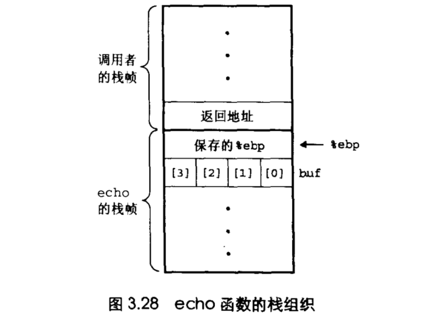
在这个例子中，我们可以看到，程序总共为局部存储（storage）分配了 32个字节（第4行和第6行）。不过，字符数组buf的位置在%ebp下方四个字节处（第7行）。上图给出了得到的栈结构。正如看到的那样，所有对buf[4]〜buf[7]的写都会导致%ebp的保存值被破坏。当程序随后试图以它为栈指针进行恢复时，所有后来的栈引用都会是非法的。所有对buf[8]〜buf[ll]的写都会导致返回地址被破坏。当在函数结尾执行ret指令时，程序会“返回”到错误的地址。像这个示例说明的那样，缓冲区溢出可能导致程序出现严重的错误。

# 浮点代码

## 浮点寄存器
浮点单元包括8个浮点寄存器，但是和普通寄存器不一样，这些寄存器是被当成一个浅栈（shallow stack）来对待的。这些寄存器分别标识为%st(0), %st(1),等等，直到%st(7).其中，%st(0)在栈顶。当压入栈中的值超过8个时，栈底的那些值就会消失。

大多数算术指令不会直接引用寄存器，而是从栈中弹岀它们的源操作数，计算结果，再将结果压入栈中。在20世纪70年代，栈结构还被认为是很聪明的想法，因为它们提供了一种简单的对算术指令求值的机制，同时它们也允许指令的密集编码(dense coding)。随着编译技术的进步，同时,指令编码所需要的存儲器也不再是很关键的资源，这些属性就不再重要了。写编译器的人会更高兴有一组更大的、使用方便的浮点寄存器。

将浮点寄存器组织成一个有界的栈，使得编译器很难用这些寄存器来存放一个调用其他过程的过程的局部变量。对于局部变量的存放，我们已经看到，有些通用寄存器可以被指定为由被调用者保存，因此，可以用来保存跨过程调用的局部变量。这种指定对IA32浮点寄存器来说是不可能的，因为它的标识随着压入栈中和从栈中弹出是变化的。一个压栈操作会使%st(0)中的值现在在%st(1)中。

另一方面，它会将浮点寄存器作为真正的栈来对待，每次过程调用时，都将本地值压入其中。不幸的是，很快就会导致栈溢出，因为只有够放8个值的位置。作为代替，编译器产生的代码会在调用另一个过程之前，将每个本地浮点值都压入到主程序栈中，然后在返回时把它们取出来。这样引起的存储器访问操作会降低程序的性能。

IA32非同一般的属性是，浮点寄存器使用一种特殊的80位的扩展精度格式，这样就比保存在存储器中的值所使用的普通32位单精度和64位双精度格式，提供了更大的表示范围和更高的精度。扩展精度表示类似于具有15位指数（也就是—15）和63位小数（也就是n=63）的IEEE浮点格式。所有的单精度和双精度数在从存储器加载到浮点寄存器中时，都会转换成这种格式。运算总是以扩展精度格式进行的。当数字存储在存储器中时，它们就从扩展精度转换成单精度或者双精度格式。

### 其他基于栈的语言
基于栈的解释器仍然被广泛用作高级语言和它到实际机器上的映射之间的中间表示。其他基于栈的求值程序的示例包括Java字节代码、Java编译器产生的中间格式，以及PostScript页面格式化语言

## 栈的表达式求值
为了理解IA32 是如何用它的浮点寄存器作为栈的，让我们来看看基于栈来求值的一个更加抽象的版本。假设我们有一个算术单元，他用栈来保存中间结果，其指令集如下图：
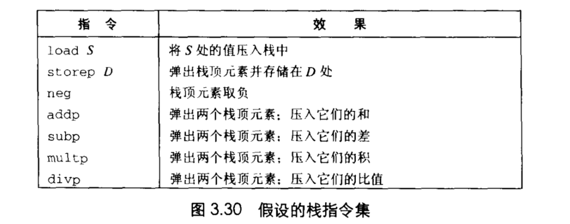

作为一个示例，考虑表达式x=(a-b)/(-b+c)0我们可以将这个表达式翻译成下面的代码。在每一行代码旁边，都给出了浮点寄存器栈的内容。为了与我们前面的惯例保持一致，我们画的栈是向下增长的，所以栈顶实际上是在最底部。
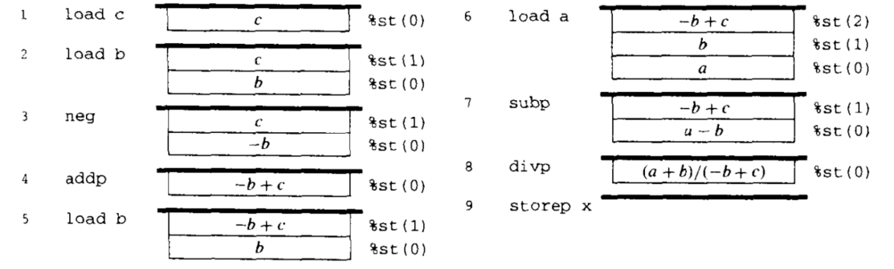

这种方法的缺点就是增加了额外的存储器访问操作，即使是在寄存器栈中有足够的容量存放中间结果时。IA32浮点单元避免了这种低效率，引入了算术指令的变种，将它们的第二个操作数留在栈中，可以用任意栈值作为他们呢的第二个操作数。另外，它还提供了一条指令，可以将栈顶元素与任何其他元素进行交换。虽然这些扩展可以用来产生更有效的代码，但是将算术表达式翻译成代码的简单而优美的算法丢失了。


## 浮点数的传送可转换操作
用记符%st(i)来引用浮点寄存器，这里i代表相对于栈顶的位置。值i的范围为0~7.寄存器%st(0)是栈顶元素，%st(1)是第二个，依次类推。也可以用%st来引用栈顶元素。当一个新值压入栈中时，寄存器%st(7)种的值就丢失了。当从栈中弹出时，%st（7）中的新值是不可预测的。编译器产生的代码必须能在寄存器栈有限的容量中工作。

所有的指令将操作数转换成扩展精度格式，然后压入寄存器栈中
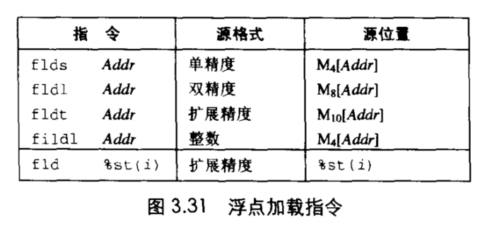
上述指令集用来将值压入浮点寄存器栈中。最后的加载指令fld用来复制一个栈的值。也就是，它将浮点寄存器%st(i)的一个副本压入栈中。例如，指令fld %st(0)将栈顶元素的一个副本压入栈中。

所有的指令将结果从扩展精度格式转换成目标格式。
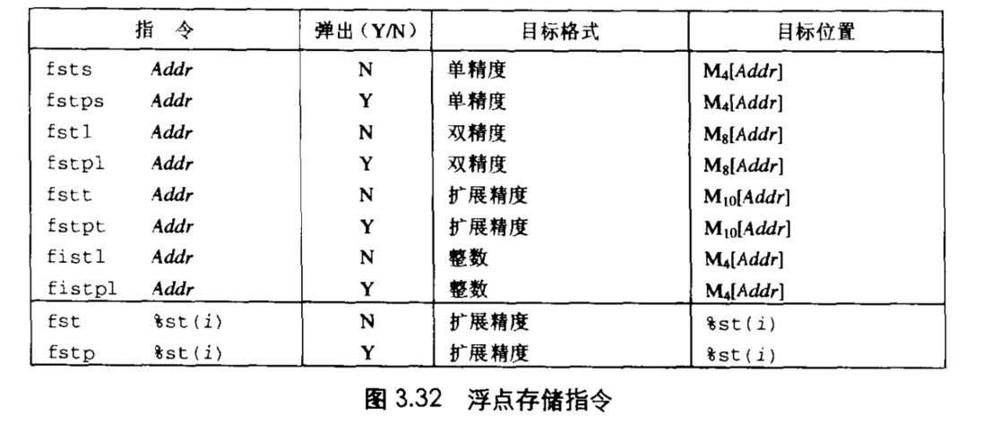
最后两个指令是将栈顶元素拷贝到另外一个浮点寄存器中。

## 浮点算术指令
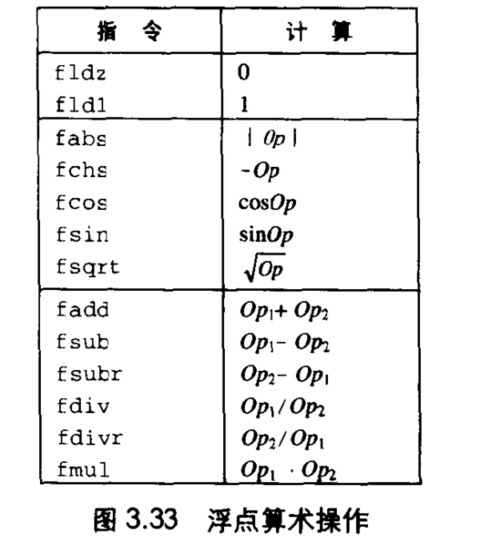
上图说明了一些最常见的浮点算术操作。第一组中的指令没有操作数。它们将某些常数数字的浮点表示压入栈中。对像冗、e和log210这样的常数，也有类似的指令。第二组中的指令有一个操作数。这个操作数总是栈顶的元素，类似于假设的栈求值器中的neg操作，它们会用计算出的值取代这个元素。第三组中的指令有两个操作数。对每个这样的指令，都有关于如何指定操作数的许多不同的变种，待会儿会谈到。对不可交换操作，例如减法和除法，有前向（例如fsub）和反向（例如fsubr）两个版本，这样就可以按照两种顺序中的任一种来使用参数。


# 在C程序中嵌入汇编代码
有时，操作系统必须访问一些特殊的寄存器，它们存放着进程状态信息。执行输入和输出操作要使用特殊的指令或是访问特殊的存储器位置。即使是对应用程序源来说，也有一些机器特性例如条件码的值，是不能直接用C访问的。

现在的问题是要将主要由C组成的代码与少量汇编代码集成到一起。一种方法是用汇编代码写一些关键函数，使用的参数传递和寄存器使用规则与C编译器遵守的一样。这些汇编函数保存在独立的文件中，由链接器将编译好的C代码和汇编好的汇编代码结合起来。例如，如果文件p1.c包含C代码，而文件p2.s包含的是汇编代码，那么编译命令
```
unix> gcc -o p p1.c p2.s
```
会编译文件p1.c和汇编文件p2.s，并将得到的目标代码形成可执行程序p。

## 基本的内嵌汇编
GCC还可以将汇编与C代码混合起来。内嵌汇编允许用户直接往编译器产生的代码序列中插入汇编代码。可以提供一些特性，以指定指令操作数和向编译器说明汇编指令要覆盖哪些寄存器。当然，得到的代码是与机器高度相关的，因为不同类型机器的机器指令是不兼容的。asm命令也是与GCC相关的，它与很多其他编译器是不兼容的。尽管如此，这还是一种有效的方法，将与机器相关的代码数量降低到绝对小。

内嵌汇编是作为GCC信息档案的一部分来说明的，在任何安装了GCC的机器上执行命令info gcc,会得到一个分层的阅读文档阅读器。沿着名为"C Extensions"的链接，然后是名为"Extended Asm"的链接，就能找到内嵌汇编的文档。
```c
asm(code-string);
```
术语code-string表示一个以带括号的字符串形式给出的汇编代码序列。编译器会将这个字符串一字不差地插入到产生地汇编代码中，因此，编译器提供的汇编和用户提供地汇编就合并到一起了。编译器不会检查字符串是否出错，因此，要等到汇编器才会报告错误。

### asm的扩展格式
GCC提供了 asm的一个扩展版本，它允许程序员指定哪些程序值要作为汇编代码序列的操作数，以及哪些寄存器要被汇编代码覆盖。有了这些信息，编译器产生的代码就能正确建立所需要的源值，执行汇编指令，并使用计算出的值。这些信息中还包括编译器所需的关于寄存器使用的信息,这样一来，重要的程序值就不会被汇编代码指令覆盖了。扩展的汇编序列的通用语法是这样的：
```
asm(code-string[:output-list[:input-list[:overwrite-list]]]);
```

