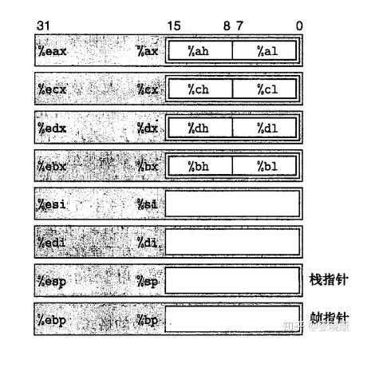
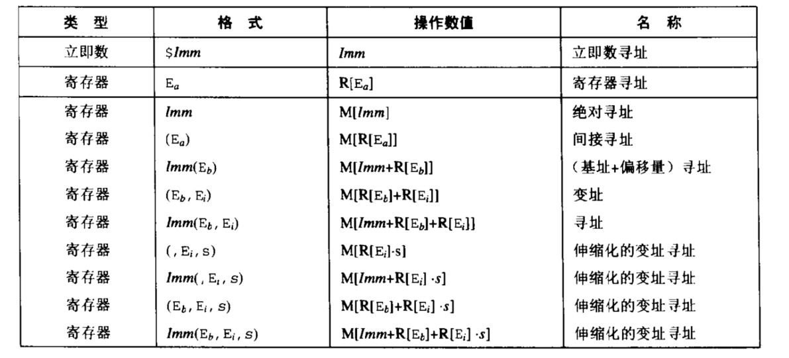
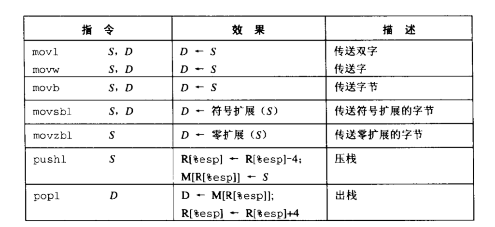

# 程序编码
```shell
unix> gcc -O2 -o p p1.c p2.c 
```
编译选项-O2告诉编译器使用第二级优化。通常，提高优化级别会使最终程序运行得更快，但是编译时间可能会变长，对代码进行调试会更困难。

C预处理器会扩展源代码，插入所有用#include命令指定的文件，并扩展所有的宏。其次，编译器产生两个源文件的汇编代码，名字分别为p1.s和
p2.s。接下来，汇编器会将汇编代码转化成二进制目标代码文件p1.o和p2.o。最后，链接器将两个目标文件与实现标准Unix库函数的代码合并，并
产生过最终的可执行文件

## 整数寄存器


上述八个寄存器主要功能如下
1. %eax，可存放一般数据，而且可以作为累加器使用
2. %ecx, 可存放一般数据，而且可用来做计数器，常常将循环次数用它来存放
3. %edx, 可存放一般数据，而且可用来存放乘法运算产生的部分积，或用来存放输入输出的端口地址（指针）；
4. %ebx，可存放一般数据，而且可用来存放数据的指针（偏移地址）；
5. %esi，可存放一般数据，还可用于串操作中，存放源地址，对一串数据访问；
6. %edi，可存放一般数据，还可用于串操作中，存放目的地址，对一串数据访问；
7. %esp，用于寻址一个称为堆栈的存储区，通过它来访问堆栈数据；
8. %ebp，可存放一般数据，用来存放访问堆栈段的一个数据区，作为基地址； 

一些通常对C程序员屏蔽的处理器状态是可见的：
1. 程序计数器（称为%eip)表示即将要执行的下一条指令在存储器中的地址
2. 整数寄存器文件包含8个被命名的位置，分别存储32位的值。这些寄存器可以存储地址（对应于C的指针）或整型数据。有的寄存器用来记录某些重要的程序状态，而其他的寄存器用来保存临时数据，例如过程的局部变量
3. 条件码寄存器：保存最近执行的算数或逻辑指令的状态信息，它们用来实现控制或数据流中的条件变化，比如用来实现 if 和 while 语句。
4. 浮点寄存器文件包含8个位置，用来存放浮点数据。

程序存储器（program memory）包含程序的目标代码，操作系统需要的一些信息用来管理过程调用和返回的运行时栈，以及用户分配的存储器块（malloc)

```c
int accum = 0;
int sum(int x, int y) {
    int t = x + y;
    accum += t;
    return t;
}
```
在命令上使用“-S”选项，就能看到C编译器产生的汇编代码
```
unix> gcc -O2 -S code.c
```
```
sum:
    pushl %ebp
    movl %esp, %ebp
    movl 12(%ebp), %eax
    addl 8(%ebp), %eax
    addl %ebp, accum
    movl %ebp, %esp
    popl %ebp
    ret
```

要查看目标代码文件的内容，有一类称为反汇编器，
```
unix> objdump -d code.o
```

## 操作数指示符
1. 立即数
2. 寄存器
3. 存储器引用



操作数可以表示立即数（常数）值、寄存器值或是来自存储器的值。伸缩因子s必须是1，2，4，8

### 数据传送指令


movsbl和movzbl指令负责拷贝一个字节，并设置目的操作数中其余的位。movsbl指令的原操作数是单字节的，它执行符号扩展到32位，然后拷贝到双字的目的中。类似地，movbl指令的原操作数是单字节的，在前面加24个0扩展到32位，并将结果拷贝到双字的目的中

指令pushl %ebp的行为等价于下面这两条指令：
```
subl $4, %esp
movl %ebp, (%esp)
```
指令popl %eax的行为等价于下面这样两条指令：
```
movl (%esp), %eax
addl $4, %esp
```

栈操作说明：


```c++
int exchange(int *xp, int y) {
    int x = *xp;
    *xp = y;
    return x;
}
```
以上代码的汇编代码为：
```
movl 8(%ebp), %eax          GET xp
movl 12(%ebp), %edx         GET y
movl (%eax), %ecx           GET x at *xp
movl %edx, (%eax)           Store y at *xp
movl %ecx, %eax             Set x as return value
```

## 算术和逻辑操作
整数算术操作：


移位操作只允许0-31位的移位，移位量可以是立即数，也可以是放在单字节寄存器元素%cl中。

左移指令：sall ,shll效果一样都是将右边添0

右移指令：sarl（添上符号位）, shrl（添0）


### 特殊的算术操作

这些操作提供了有符号和无符号数的全64位乘法和除法，一对寄存器%edx和%eax组成一个64位的四字


## 控制
### 条件码
1. CF 进位标志
2. 