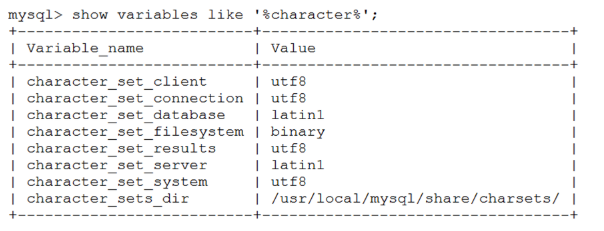

# 一、字符集
是多个字符(英文字符，汉字字符，或者其他国家语言字符)的集合，字符集种类较多，每个字符集包含的字符个数不同。

特点：

　　①字符编码方式是用一个或多个字节表示字符集中的一个字符

　　②每种字符集都有自己特有的编码方式，因此同一个字符，在不同字符集的编码方式下，会产生不同的二进制

常见字符集
1. ASCII字符集：基于罗马字母表的一套字符集，它采用1个字节的低7位表示字符，高位始终为0。
2. LATIN1字符集：相对于ASCII字符集做了扩展，仍然使用一个字节表示字符，但启用了高位，扩展了字符集的表示范围。
3. GBK字符集：支持中文，字符有一字节编码和两字节编码方式
4. UTF8字符集：Unicode字符集的一种，是计算机科学领域里的一项业界标准，支持了所有国家的文字字符，utf8采用1-4个字节表示字符。

## 1、MySQL 与 字符集
MySQL 系统变量值：

## 2、正确使用字符集
数据库字符集具体要看存储什么字符
1. character_set_server   默认的内部操作字符集
2. character_set_client   客户端来源数据使用的字符集
3. character_set_connection 连接层字符集
4. character_set_results  查询结果字符集
5. character_set_database 当前选中数据库的默认字符集
6. character_set_system   系统元数据（字段名等）字符集

