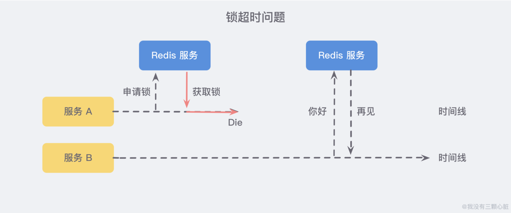

**为何需要分布式锁?**

一般情况下，我们使用分布式锁主要有两个场景：
1. 避免不同节点重复相同的工作：比如用户执行了某个操作有可能不同节点会发送多封邮件
2. 避免破坏数据的正确性：如果两个节点在同一条数据上同时进行操作，可能会造成数据错误或不一致的情况出现；

**Java种实现的常见方式**

上面我们用简单的比喻说明了锁的本质：同一时间只允许一个用户操作。所以理论上，能够满足这个需求的工具我们都能够使用 (就是其他应用能帮我们加锁的)：

1. 基于 MySQL 中的锁：MySQL 本身有自带的悲观锁 for update 关键字，也可以自己实现悲观/乐观锁来达到目的；
2. 基于 Zookeeper 有序节点：Zookeeper 允许临时创建有序的子节点，这样客户端获取节点列表时，就能够当前子节点列表中的序号判断是否能够获得锁；
3. 基于 Redis 的单线程：由于 Redis 是单线程，所以命令会以串行的方式执行，并且本身提供了像 SETNX(set if not exists) 这样的指令，本身具有互斥性；

# Redis 分布式锁的问题
## 1）锁超时
假设现在我们有两台平行的服务 A B，其中 A 服务在 获取锁之后 由于未知神秘力量突然 挂了，那么 B 服务就永远无法获取到锁了：

所以所以我们需要额外设置一个超时时间，来保证服务的可用性。

但是另一个问题随即而来：如果在加锁和释放锁之间的逻辑执行得太长，以至于超出了锁得超时限制，也会出现问题。因为这时候第一个线程持有锁过期了，而临界区的逻辑还没有执行完，与此同时第二个线程就提前拥有了这把锁，导致临界区的代码不能得到严格的串行执行。

为了避免这个问题，Redis 分布式锁不要用于较长时间的任务。如果真的偶尔出现了问题，造成的数据小错乱可能就需要人工的干预。

有一个稍微安全一点的方案是 将锁的 value 值设置为一个随机数，释放时先匹配随机数是否一致，然后再删除 key， 这是为了确保当前线程占有的锁不会被其他线程释放，除非这个锁是因为过期了而被服务器自动释放的。

但是匹配 value 和删除 key 在 Redis 中并不是一个原子性的操作，也没有类似保证原子性的指令，所以可能需要使用像 Lua 这样的脚本来处理了，因为 Lua 脚本可以 保证多个指令的原子性执行。

## 2）单点/多点问题
如果 Redis 采用单机部署模式，那就意味着当 Redis 故障了，就会导致整个服务不可用。

而如果采用主从模式部署，我们想象一个这样的场景：服务 A 申请到一把锁之后，