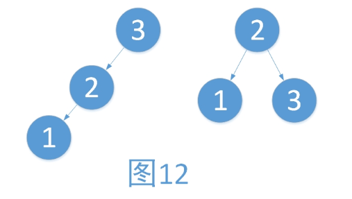
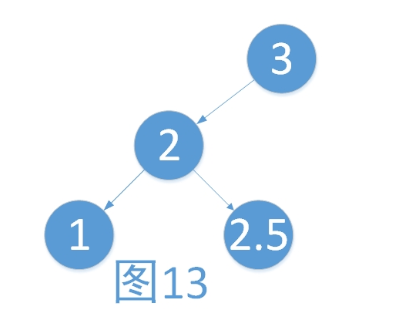
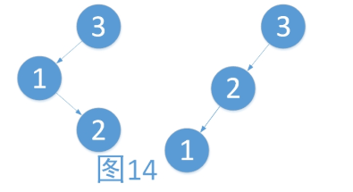
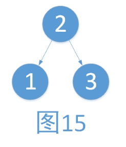
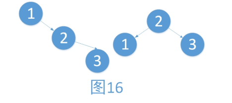
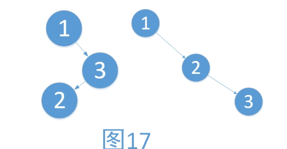
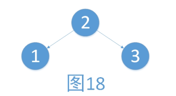

# AVL 树的插入时的失衡与调整

## 左子树过高

### LL 型

1. 将2作为跟节点
2. 将3作为2二点右孩子
3. 将2的右孩子作为3的左孩子

旋转后3与2的平衡因子为EH, 1的平衡因子保持不变

### LE 型
插入的时候是不会出现 LE 的这种情况的。只有在删除的时候才会出现



### LR 型
对于LR, 要分为两步进行旋转，旋转之后“原来根结点的左孩子的右孩子作为新的根结点左子树”

1. 将2的左子树作为1的右子树
2. 将1作为2的左子树
3. 将2作为3的左子树
4. 接着按LL型调整后如下

调整后1， 2， 3的平衡因子都是EH

## 右子树过高

### RR 型

1. 将2的左子树作为1的右子树，
2. 将1作为2的左子树
3. 将2作为根结点

调整后1，2的平衡因子为EH, 3不变

## RL 型
与LR型一样，要分两步进行，第一步

1. 将2的右子树作为3的左子树
2. 将3作为2的右子树
3. 将2作为1的右子树
4. 接着按RR型调整后如下

最后1， 2，3的平衡因子都为EH


# AVL树的删除时的失衡与调整
失衡与调整的最后一种情况 LE 与 RE.在进行调整的时候，和LL与RR型旋转的方式是一致的。只是最后初始根结点的平衡因子不为EH而已。LE，调整后初始根结点的平衡因子为LH，最终根节点为RH。 RE，调整后初始根结点的平衡因子为 RH， 最终根结点为LH。

```c++
typedef char KeyType;           //关键字
typedef struct MyRcdType {      //记录
    KeyType key;
}RcdType, *RcdArr;
typedef enum MyBFStatus {       //为了方便平衡因子的赋值，这里进行枚举  
    RH, EH, LH  
}BFStatus
typedef struct MyBBSTNode {     //树节点定义
    RcdType data;
    BFStatus bf;                //平衡因子
    struct MyBBSTNode *lchild, *rchild;
}BBSTNode, *BBSTree;
```

# 旋转
```c++
// LL型右旋
BBSTree RRotate(BBSTree T) {
    BBSTree lchild = T->lchild;
    T->lchild = lchild->rchild;
    lchild->rchild = T;
    return lchild;
}

//RR 型左旋
BBSTree LRotate(BBSTree T) {
    BBSTree rchild = T->rchild;
    T->rchild = rchild->lchild;
    rchild->lchild = T;
    return rchild;
}
```

# 失衡调整
```c++
//左子树失衡调整
void LeftBalance(BBSTree T) {
    BBSTree lchild = T->lchild;
    switch(lchild->bf) {
        case EH:
            T->bf = LH; 
            lchild->bf = RH;
            RRotate(T);
            break;
        case RH:
            BBSTree rchild = lchild->rchild;
            rchild->bf = EH;
            switch(rchild->bf) {
                case EH:
                    T->bf = lchild->bf = EH;
                case LH:
                    lchild->bf = EH; T->bf = RH;
                case RH:
                    lchild->bf = LH; T->bf = EH;
            }
            T->lchild = LRotate(T->lchild);
            RRotate(T);
            break;
        case LH:
            T->bf = lchild->bf = EH;
            RRotate(T);
            break;
    }
}

//右子树失衡调整
void RightBalance(BBSTree *T)
{          
    BBSTree rchild,lchild;
    rchild = (*T)->rchild;
    switch (rchild->bf)
    {      
    case RH:
        (*T)->bf = rchild->bf = EH;
        LRotate(T);   
        break;
    case EH:
        (*T)->bf = RH;
        rchild->bf = LH;
        LRotate(T);
        break;
    case LH:
        lchild = rchild->lchild;
        switch (lchild->bf)
        {
        case LH:       
            rchild->bf = RH; (*T)->bf = EH;
            break;
        case RH:
            rchild->bf = EH; (*T)->bf = LH;
            break;
        case EH:
            rchild->bf = EH; (*T)->bf = EH;  
            break;           
        }
        lchild->bf = EH; 
        RRotate(&((*T)->rchild));
        LRotate(T);
        break;  
    }      
}

```

# 插入新的结点
在插入新的结点时，我们使用一个taller的变量来记录树的高度是否变化。默认认为树的高度是有增加的。我们在插入新的结点后，首先判断树的高度是否增加了，假如树的高度没有变化，不必进行操作。当树的高度增加时，我们就考虑是否需要对树进行平衡调整。
```c++
Status InsertAVL(BBSTree *T,RcdType e,Status *taller)
{
    if(!(*T))    //新建一个节点
        return CreatBBSTNode(T,e);
    else if(e.key == (*T)->data.key)
    {
        *taller = FALSE;
        return TRUE;
    }
    if(e.key < (*T)->data.key)            //插入到左子树
    {
        Status sign = InsertAVL(&(*T)->lchild,e,taller);
        if(FALSE ==  sign || OVERFLOW == sign)
            return FALSE;
        if(TRUE == *taller)
        {
            switch ((*T)->bf)
            {
            case LH:
                LeftBalance(T);    
*taller = FALSE;     
break;
            case EH:
                (*T)->bf = LH;     
*taller = TRUE;      
break;
            case RH:
                (*T)->bf = EH;     
*taller = FALSE;     
break;
            }
        }        
    }
    else            //插入到了右子树
    {
        Status sign = InsertAVL(&(*T)->rchild,e,taller);
        if(FALSE ==  sign || OVERFLOW == sign)
            return FALSE;    
        if(TRUE == *taller)
        {
            switch ((*T)->bf)
            {
            case LH:
                (*T)->bf = EH;
*taller = FALSE;
                break;
            case EH:
                (*T)->bf = RH;
*taller = TRUE;
                break;
            case RH:
                RightBalance(T);
*taller = FALSE;
                break;
            }
        }   
    }
    return TRUE;
}

```

# 删除
使用 bfChild记录待删除结点的子树的根节点的原平衡因子。
```c++
//参数说明：*T为待进行调整的子树的根结点
//bfChild为*T的右孩子在删除结点前的平衡因子
void DelLeftCase(BBSTree *T,int bfChild)
{        
    //当bf为-1或1变为0，或者孩子为空时说明子树高降低     
    if((!(*T)->lchild) || (EH != bfChild && EH == (*T)->lchild->bf))
    {
        switch ((*T)->bf)//左子树树高降低
        {
        case EH:
            (*T)->bf = RH;
            break;
        case LH:
            (*T)->bf = EH;
            break;
        case RH:        //原本右子树比较高   
            RightBalance(T);
            break;
        }
    }       
}    

void DelRightCase(BBSTree *T,int bfChild)
{     
    //当bf为LH或RH变为EH，或者孩子为空时说明子树高降低
    if((!(*T)->rchild) || (EH != bfChild && EH == (*T)->rchild->bf))
    {
        switch ((*T)->bf)
        {
        case EH:
            (*T)->bf = LH;
            break;
        case RH:
            (*T)->bf = EH;
            break;
        case LH:    //原本左子树比较高    
            LeftBalance(T);
            break;
        }
    }      
}         
BBSTree DeleteNode(BBSTree *T,KeyType key)
{
    int bfChild;
    if(*T)
    {
        if((*T)->data.key > key)
        {
            bfChild = (*T)->lchild->bf;
            (*T)->lchild = DeleteNode(&(*T)->lchild,key);
            DelLeftCase(T,bfChild);
        }
        else if((*T)->data.key < key)
        {
            bfChild = (*T)->rchild->bf;
            (*T)->rchild = DeleteNode(&(*T)->rchild,key);
            DelRightCase(T,bfChild);
        }
        else//当前节点就是要删除的节点
        {  
            if((*T)->lchild)        //*T不是叶子结点并且具有直接前驱
            {
                BBSTree farRight = GofarRight((*T)->lchild);
                (*T)->data = farRight->data;    
                //可以确定，删除的节点为当前节点的左子树的某一个节点
                (*T)->lchild = DeleteNode(&(*T)->lchild,farRight->data.key);
                DelLeftCase(T,bfChild);
            }
            else if((*T)->rchild)    //*T不是叶子结点并且具有直接后驱
            {
                BBSTree farLeft = GofarLeft((*T)->rchild);
                (*T)->data = farLeft->data;      
                (*T)->rchild = DeleteNode(&(*T)->rchild,farLeft->data.key);
                DelRightCase(T,bfChild);
            } 
            else             //*T是叶子结点
            {
                free(*T);
                *T = NULL;
            }    
        }
    }
return (*T);//包含了返回NULL与正常的当前节点
}
```