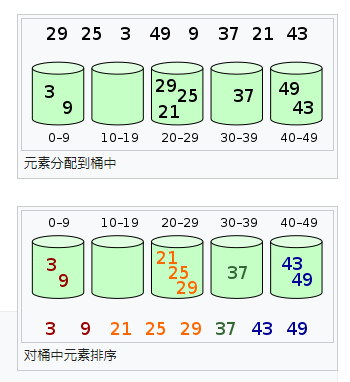

```伪代码
function pigeonhole_sort(array a[n])
    array b[N]
    var i, j
    zero_var(b)
    for i in [0....length(a) - 1]
        b[a[i]] := b[a[i]] + 1
    j := 0
    for i in [0...length(b) - 1]:
        repeat b[i] times;
            a[j] := i
            j := j + 1
```
鸽巢排序（Pigonhole sort）, 也被称为基数分类，是一种时间复杂度为O(n)且在不可避免遍历每一个元素并且排序的情况下效率最好的一种排序算法。但它只有在差值（或者可被映射在差值）很小的范围内的数值排序的情况下实用。

# 桶排序
```伪代码
function bucket-sort(array, n) is
    buckets is new array of n empty lists
    for i = 0 to (length(array) - 1) do
        insert array[i] into buckets[msbits(array[i], k)]
    for i = 0 to n - 1 do
        next-sort(buckets[i])
    return the concatenation of buckets[0],...,buckets[n-1]
```

桶排序（bucket sort）或所谓的箱排序，是一个排序算法，工作的原理是将数组分到有限数量的桶里。每个桶再个别排序（有可能使用别的排序算法或是以递归方式继续使用桶排序进行排序。）。桶排序是鸽巢排序的一种归纳结果。当要被排序的数组内的数值是均匀分配的时候，桶排序使用线形时间（（n））。但桶排序不是比较排序他不受到O(nlogn)下限的影响
1. 设置一定量的数组当作桶子
2. 寻访序列，并且把项目一个一个放到对应的桶子去
3. 对每个不是空的桶子进行排序。从不是空的桶子里把项目再放回原来的序列中。