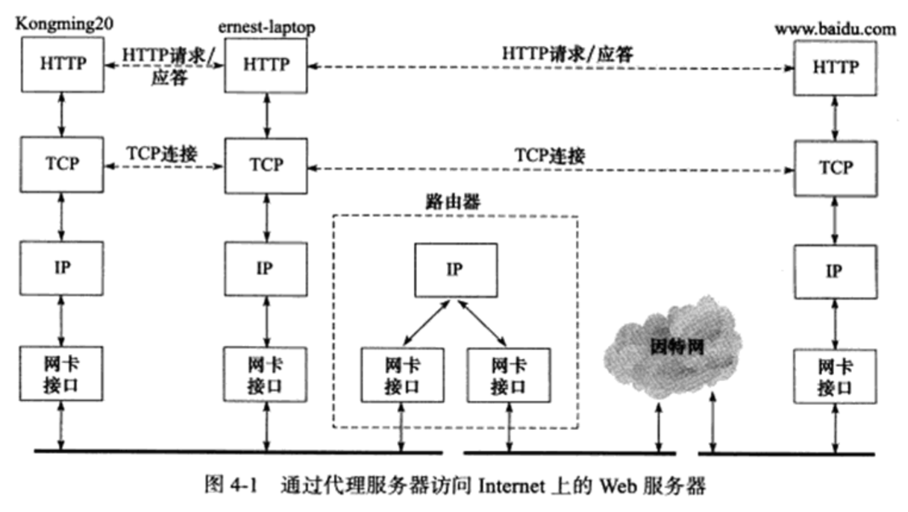
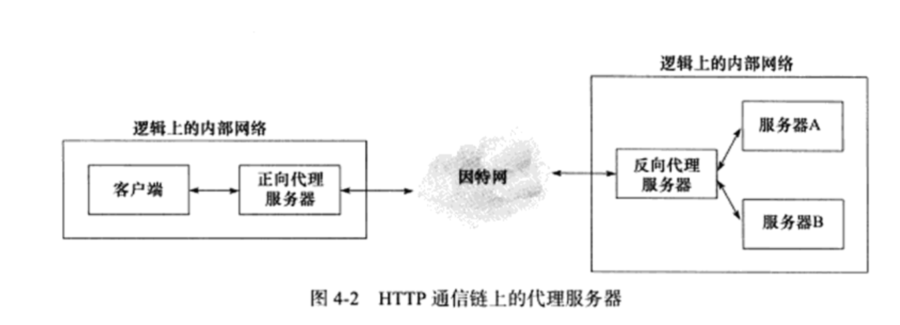
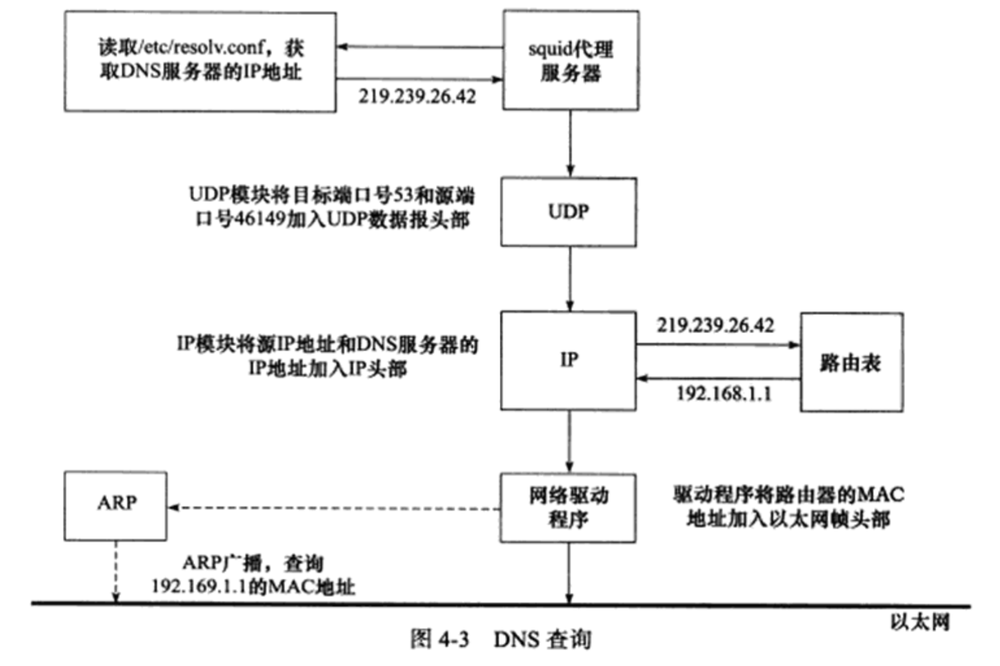
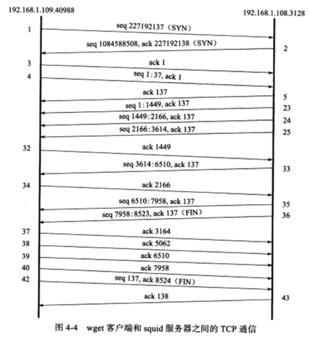

Internet上地Web服务器随处可以获得，我们通过浏览器访问任何一个网站都是在与Web服务器通信

Web客户端和服务器之间使用HTTP协议通信。

# 实例总图
我们按照如下方法来部署通信实例：在Kongming20上运行wget客户端程序，在ernest-laptop上运行squid代理服务器程序.客户端通过代理服务器的中转，获取Internet上的主机www.baidu.com 的首页文档 index.html* 如下图所示.

## 部署代理服务器

### HTTP 代理服务器的工作原理
在HTTP通信链上，客户端和目标服务器之间通常存在某些中转代理服务器，它们提供对目标资源的中转访问・一个HTTP请求可能被多个代理服务器转发，后面的服务器称前面服务器为上游服务器,代理服务器按照其使用方式和作用，分为正向代理服务器、反向代理服务器和透明代理服务器.

正向代理要求客户端自己设置代理服务器的地址.客户的每次请求都将直接发送到该代理服务器，并由代理服务器来请求目标资源。比如处于防火墙内的局域网机器要访Internet,或者要访问一些被屏蔽掉的国外网站，就需要使用正向代理服务器.

反向代理则被设置在服务器端，因而客户端无须进行任何设置.反向代理是指用代理服务器来接收Internet上的连接请求，然后将请求转发给内部网络上的服务器，并将从内部服务器上得到的结果返回给客户端.这种情况下，代理服务器对外就表现为一个真实的服务器。各大网站通常分区域设置了多个代理服务器，所以在不同的地方ping同一个域名可能得到不同的IP地址，因为这些IP地址实际上是代理服务器的1P地址.下图显示了正向代理服务器和反向代理IR务器在HTTP通信链上的逻辑位置.

透明代理只能设置在网关上.用户访问Internet的数据报必然都经过网关，如果在网关上设置代理，则该代理对用户来说显然是透明的.透明代理可以看作正向代理的一种特殊情况。代理服务器通常还提供缓存目标资源的功能（可选），这样用户下次访问同一资源时速度将很快.优秀的开源软件squid、varnish都是提供了缓存能力的代理服务器软件，其中
squid支持所有代理方式，而varnish仅能用作反向代理.

### 在 ernest-laptop 上部署 squid 代理服务器

### 使用 tcpdump 抓取传输数据包
将收到的数据包按照逻辑分为如下四个部分
1. 代理服务器访问 DNS 服务器以查询域名 www.baidu.com 对应的 IP 地址
2. 代理服务器查询路由器 MAC 地址的 ARP 请求
3. wget 客户端 和代理服务器之间的 HTTP 通信
4. 代理服务器和 Web 服务器之家的HTTP 通信

## 访问 DNS 服务器

需要指出的是，虽然IP数据报是先发送到路由器，再由它转发给目标主机，但是其头部的目标IP地址却是最终的目标主机（DNS务器）的IP地址，而不是中转路由器的IP地址（192.168.1.1) 这说明，IP头部的源端IP地址和目的端IP地址在转发过程中是始终不变的（一种例外是源路由选择）.但秘头部的源端物理地址和目的端物理地址在转发过程中则是一直在变化的.

## HTTP 通信

### HTTP 请求
常见的 HTTP 请求方法有9种
1. GET 申请获取资源， 而不对服务器产生任何其他影响
2. HEAD 和GET方法类似，不过仅要求服务器返回头部信息，而不需要传输任何实际内容
3. POST 客户端向服务器提交数据的方法。这种方法会影响服务器：服务器可能根据收到的数据动态创建新的资源，也可能更新原有的资源
4. PUT  上传某个资源
5. DELETE 删除某个资源
6. TRACE 要求目标服务器返回原始 HTTP 请求的内容，它可以用来查看中间服务器（比如代理服务器）对 HTTP请求的影响
7. OPTIONS 查看服务器对某个特定的 URL 都支持哪些请求方法。也可以把 URL 设置为 *， 从而获得服务器支持的所有请求方法。
8. CONNECT 用于某些代理服务器，它们能把请求的连接转化为一个安全隧道
9. PATCH 对某个资源做部分修改

这些方法中，HEAD, GET、OPTIONS和TRACE被视为安全的方法，因为它们只是从服务器获得资源或信息，而不对服务器进行任何修改.而POST、PUT、DELETE和PATCH则影响服务器上的资源

另一方面，GET、HEAD、OPTIONS, TRACE、PUT和 DELETE 等请求方法被认为是等幂的（idempotent）, 即多次连续的、重复的请求和只发送一次该请求具有完全相同的效果。而 POST 方法则不同，连续多次发送同样一个请求可能进一步影响服务器上的资源。

值得一提的是， Linux 上提供了几个命令： Head、GET 和 POST。其含义基本上与 HTTP 协议中的同名请求方法相同。它们适合用来快速测试 Web 服务器。

### HTTP 应答
HTTP 状态码和状态信息及其含义
1. 1XX 信息    100 continue        服务器收到了客户端的请求行和头部信息，告诉客户端继续发送数据部分。客户端通常要先发送 Expect:100-continue 头部字段告诉服务器自己还有数据要发送
2. 2XX 成功    200 OK              请求成功
3. 3XX 重定向  301 Moved Permanently  资源被转移了，请求将被重定向
4. 3XX 重定向  302 Found           通知客户端资源能在其他地方找到，但需要使用 Get 方法来获得
5. 3XX 重定向  304 Not Modified    表示被申请的资源没有更新，和之前获得的相同
6. 3XX 重定向  307 Temporary Redirect 通知客户端资源能在其他地方找到。与 302 不同的是，客户端可以使用和原始请求相同的请求方法来访问目标资源
7. 4XX 客户端错误  400 Bad Request  通用客户请求错误
8. 4XX 客户端错误  401 Unauthorized 请求需要认证信息
9. 4XX 客户端错误  403 Forbidden    访问被服务器禁止，通常是由于客户端没有权限访问该资源
10. 4XX 客户端错误 404 NOT Found    资源没有找到
11. 4XX 客户端错误 407 Proxy Authentication Required 客户端需要先获得代理服务器的认证
12. 5XX 服务器错误 500 Internal Server Error 通用服务器错误
13. 5XX 服务器错误 503 Service Unavailable   暂时无法访问服务器