本章主要从以下四方面讨论TCP协议
1. TCP 头部信息。
2. TCP 状态转移过程。TCP连接的任意一端都是一个状态机。
3. TCP 数据流 （交互数据流和成块数据流。还有一种特殊的数据，称为紧急数据）
4. TCP 数据流的控制（超时重传和拥塞控制）

# TCP 服务的特点
传输层协议主要有两个：TCP协议和UDP协议。TCP协议相对于UDP协议的特点是：面向连接、字节流和可靠传输。

使用TCP协议通信的双方必须先建立连接，然后才能开始数据的读写。双方都必须为该连接分配必要的内核资源，以管理连接的状态和连接上数据的传输。

TCP模块发送出的TCP报文段的个数和应用程序执行的写操作次数之间没有固定的数量关系。

当接受端受到一个或多个TCP报文段后，TCP模块将它们携带的应用程序数据按照TCP报文段的序号依次放入TCP接收缓冲区中，并通知应用程序读取数据。

发送端执行的写操作次数和接收端执行的读操作次数之间没有任何数量关系，这就是字节流的概念：应用程序对数据的发送和接收是没有边界限制的。UDP则不然。发送端应用程序每执行一次写操作，UDP模块就将其封装成一个UDP数据报并发送之。接收端必须及时针对每一个UDP数据报执行读操作（通过recvfrom系统调用），否则就会丢包（这经常发生在较慢的服务器上）。并且，如果用户没有指定足够的应用程序缓冲区来读取UDP数据，则UDP数据将被截断。
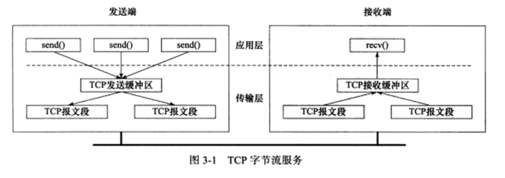
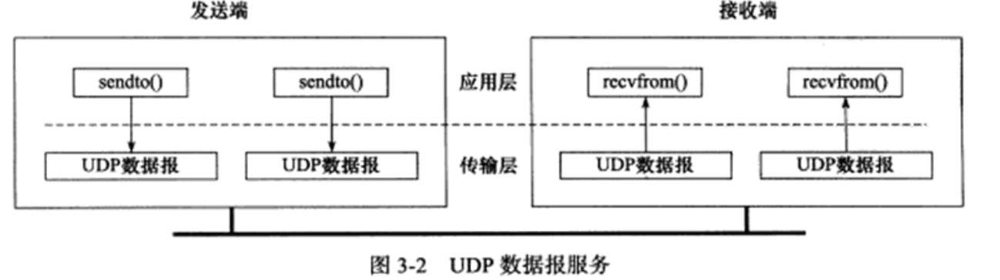

TCP协议采用发送应答机制，即发送端发送的每个TCP报文段都必须得到接收方的应答，才认为这个TCP报文段传输成功。其次，TCP协议采用超时重传机制，发送端在发送出一个TCP报文段之后启动定时器，如果在定时时间内未收到应答，它将重发该报文段。最后，因为TCP报文段最终是以IP数据报发送的，而IP数据报到达接收端可能乱序、重复，所以TCP协议还会对接收到的TCP报文段重排、整理，再交付给应用层。

# TCP头部结构
TCP头部信息出现在每个TCP报文段中，用于指定通信端的源端口，目的端端口，管理TCP连接等。

## TCP固定头部结构
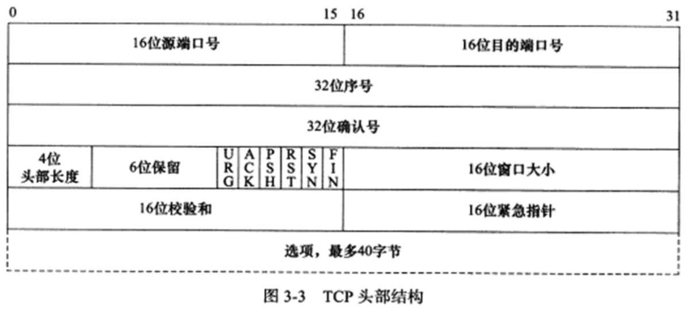
1. 16位端口号  所有知名服务使用的端口号都定义在/etc/services文件中
2. 32位序号    一次TCP通信（从TCP连接建立到断开）过程中某一个传输方向上的字节流的毎个字节的编号.假设主机A和主机B进行TCP通值，A发送给B的第一个TCP报文段中,序号值被系统初始化为某个随机值ISN （Initial SequenceNumber,初始序号值）.那么在该传输方向上（从A到B）.后续的TCP报文段中序号值将被系统设置成ISN加上该报文段所携带數据的第一个字节在整个字节流中的偏移.
3. 32位确认号   用作对另一方发送来的TCP报文段的响应。其值是收到的TCP报文段的序号值加1.
4. 4位头部长度
5. 6位标志位。包含（URG， 表示紧急指针（urgent pointer）是否有效），（ACK，表示确认号是否有效），（PSH， 提示接收端应用程序应该立即从TCP接收缓冲区中读走数据，为接收后续数据腾出空间（如果应用程序不将接收到的数据读走，它们就会一直停留在TCP接收缓冲区中）），（RST， 表示要求对方重新建立连接，我们称携带RST标志的TCP报文段为复位报文段），（SYN，表示请求建立一个连接。 我们陈伟携带SYN标志的TCP报文段为同步报文段），（FIN标志，表示通知对方本段要关闭连接了。我们称携带FIN报文段为结束报文段）
6. 16位窗口大小。是TCP流量控制的一个手段。这里说的窗口，指的是接收通告窗口（Receiver Window, RWND）.它告诉对方本端的TCP接收缓冲区还能容纳多少字节的数据，这样对方就可以控制发送数据的速度
7. 16位校验和（TCP checksum）：由发送端填充，接收端对TCP报文段执行CRC算法以检验TCP报文段在传输过程中是否损坏。注意这个校验不仅包括TCP头部，也包括数据部分
8. 16位紧急指针（urgent pointer）：是一个正的偏移量。它和序号字段的值相加表示最后一个紧急数据的下一字节的序号。因此，确切地说，这个字段是紧急指针相对当前序号的偏移，不妨称之位紧急偏移。TCP的紧急指针是发送端向接收端发送紧急数据的方法。

## TCP头部选项
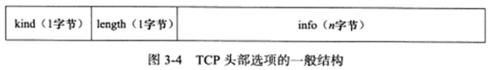
选项的第一个字段kind说明选项的类型。有的TCP选项没有后面两个字段，仅包好1字节的kind字段。第二个字段length（如果有的话）指定该选项的总长度，该长度包括kind字段和length字段占据的2字节。第三个字段info（如果有的话）是选项的具体信息。

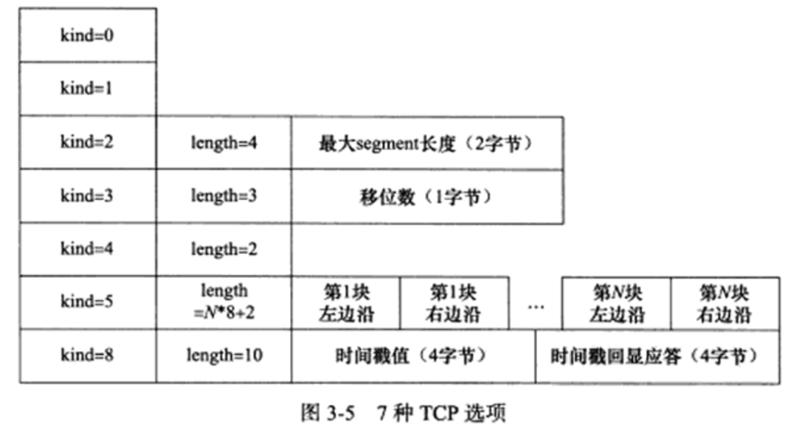
1. kind = 0 是选项表结束选项
2. kind = 1 是空操作（nop）选项，没有特殊含义，一般用于将TCP选项的总长度填充为4字节的整数倍。
3. kind = 2 是最大报文段长度选项。T
4. kind = 3 是窗口扩大因子选项。TCP连接初始化时，通信双方使用该选项来协商接收通告窗口的扩大因子.在TCP的头部中，接收通吿尚口大小是用16位表示的，故最大为65535字节，但实际上TCP模块允许的接收通告歯口大小远不止这个数（为了提高TCP通信的吞吐量）.窗口扩大因子解决了这个问题。假设TCP头部中的接收通吿宜口大小是N,窗口扩大因子（移位数）是M,那么TCP报文段的实际接收通告窗口大小是N左移M位.注意，M的取值范围是0 ~ 14.我们可以通过修改/proc/sys/net/ipv4/tcp_window_scaling内核变量来启用或关闭窗口扩大因子选项•和MSS选项一样，窗口扩大因子选项只能出现在同步报文段种，否则将被忽略。
5. kind = 4 是选择型确认（Selective Acknowledgement， SACK）选项。TCP通信时，如果某个TCP报文段丢失，则TCP模块会重传最后被确认的TCP报文段后续的所有报文段，这样原先已经正确传输的TCP报文段也可能重复发送，从而降低了TCP性能.SACK技术正是为改善这种情况而产生的，它使TCP模块只重新发送丢失的TCP报文段，不用发送所有未被确认的TCP报文段.选择性确认选项用在连接初始化时，表示是否支持SACK技术.我们可以通过修改/proc/sys/net/ipv4/tcp_sack内核变量来启用或关闭选择性确认选项.
6. kind = 5 是SACK实际工作的选项。该选项的参数告诉发送方本端已经收到并缓存的不连续的数据块，从而让发送端可以据此检查并重发丢失的数据块。每个块边沿（edge of block）参数包含一个4字节的序号.其中块左边沿表示不连续块的第一个数据的序号，而块右边沿则表示不连续块的最后一个数据的序号的下一个序号.这样一对参数（块左边沿和块右边沿）之间的数据是没有收到的•因为一个块信息占用8字节，所以TCP头部选项中实际上最多可以包含4个这样的不连续数据块（考虑选项类型和长度占用的2字节）。
7. kind = 8 是时间戳选项。该选项提供了较为准确的计算通信双方之间的回路时间（Round Trip Time， RTT），从而为TCP流量控制提供重要信息。我们可以通过修改/proc/sys/net/ipv4/tcp_timestamps内核变量来启用或关闭时间戳选项。
   
## 半关闭状态
TCP连接时全双工的，所以它允许两个方向的数据传输被独立关闭。换言之，通信的一端可以发送结束报文段给对方，告诉本端已经完成了数据的发送，但允许继续接收来自对方的数据，直到对方也发送结束报文段以关闭连接。TCP连接的这种状态称为半关闭状态。
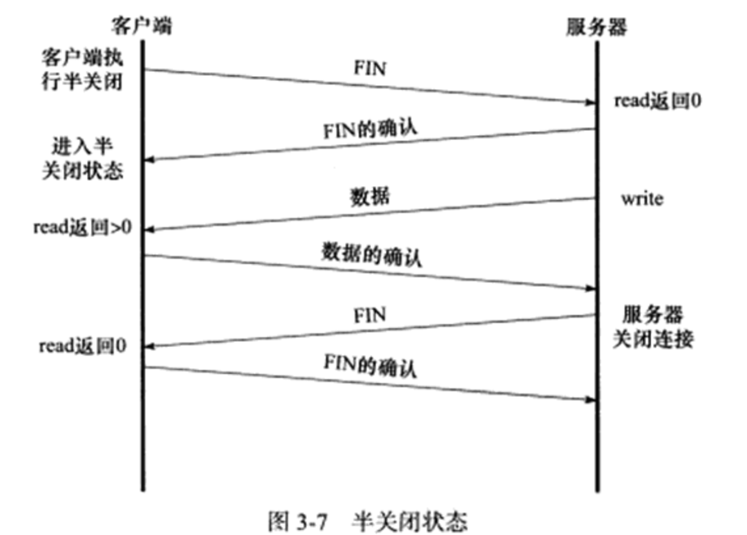
在上图中，服务器和客户端应用程序判断对方是否已经关闭连接的方法是：read系统调用返回0（收到结束报文段）。

# TCP状态转移
TCP连接的任意一端在任一时刻都处于某种状态，当前状态可以通过netstate命令查看，
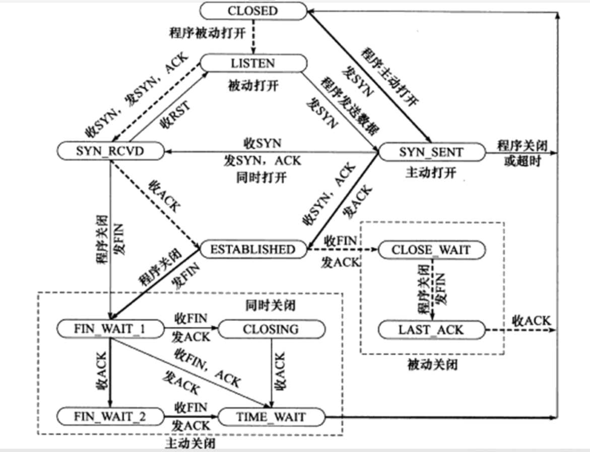
图中粗虚线表示典型的服务器端连接的状态转移；粗实线表示典型的客户端连接的状态转移。CLOSED是一个假想的起始点，并不是一个实际的状态。

## TCP状态转移总图
服务器通过listen系统调用进入LISTEN状态，被动等待客户端连接，因此执行的所谓的被动打开。服务器一旦监听到某个连接请求（收到同步报文段），就将该连接放入内核等待队列中，并向客户端发送带SYN标志的确认报文段。此时该连接处于SYN_RCVD状态。如果服务器成功地接收到客户端发送回地确认报文段，则该连接转移到ESTABLISHED状态。ESTABLISHED状态是连接双方能够进行双向数据传输地状态。

当客户端关闭连接时（通过close或shutdown系统调用向服务器发送结束报文段），服务器通过返回确认报文段使连接进入CLOSE_WAIT状态。通常，服务器检测到客户端关闭连接后，也会立即给客户端发送一个结束报文段来关闭连接。这将使连接转移到LAST_ACK状态，以等待客户端对结束报文段的最后一次确认。一旦确认完成，连接就彻底关闭。

客户端通过connect系统调用主动与服务器建立连接。connect系统调用首先给服务器发送一个同步报文段，使连接转移到SYN_SENT状态。此后，connect系统调用可能因为如下两个原因失败返回：
1. 如果connect连接的目标端口不存在（未被任何进程监听），或者该端口仍被处于TIME_WAIT状态的连接所占用，则服务器将给客服端发送一个复位报文段，connect调用失败
2. 如果目标端口存在，但connect在超时时间内未收到服务器的确认报文段，则connect调用失败

connect调用失败将使连接立即返回到初始的CLOSED状态。如果客户端成功收到服务器的同步报文段和确认，则connect调用成功返回，连接转移至ESTABLISHED状态。

当客户端执行主动关闭时，它将向服务器发送一个结束报文段，同时连接进入FIN_WAIT_1状态。若此时客户端收到服务器专门用于确认目的的确认报文段，则转移至FIN_WAIT_2状态。当客户端处于FIN_WAIT_2状态时，服务器处于CLOSE_WAIT状态，这一对状态是可能发生半关闭的状态。此时如果服务器也关闭连接（发送结束报文段），则客户端给予确认并进入TIME_WAIT状态。

上图给出了客户端从FIN_WAIT_2状态的客户端直接进入TIME_WAIT状态的一条线路（不经过FIN_WAIT_2状态），前提是处于FIN_WAIT_1状态的服务器直接收到带确认信息的结束报文段（而不是先收到确认报文段，再收到结束报文段）

处于FIN_WAIT_2状态的客户端需要等待服务器发送结束报文段，才能转移至TIME_WAIT状态，否则它将一直停留在这个状态。如果不是为了在半关闭状态下继续接收数据，连接长时间地停留在FIN_WAIT_2状态并无益处。连接停留在FIN_WAIT_2状态地情况可能发生在：客户端执行半关闭后，未等待服务器关闭连接就强行退出了。此时客户端连接由内核来接管，可称之为孤儿连接（和孤儿进程类似）。Linux为了防止孤儿连接长时间存留在内核中，定义了两个内核变量：/proc/sys/net/ipv4/tcp_max_orphans和/proc/sys/net/ipv4/tcp_fin_timeout。前者指定内核能接管的孤儿连接数目，后者指定孤儿连接在内核中生存的时间。
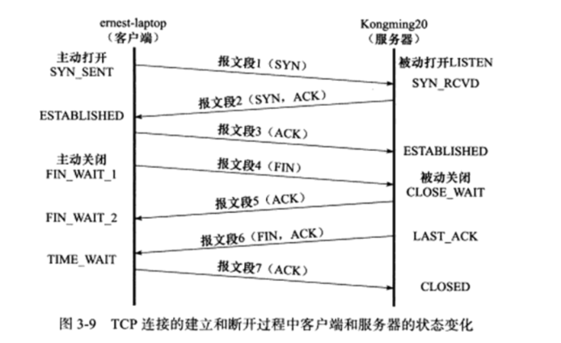

## TIME_WAIT
客户端连接在收到服务器的结束报文段之后，并没有直接进入CLOSED状态，而是转移到TIME_WAIT状态。在这个状态，客户端连接要等待一段长为2MSL（Maximum Segment Life，报文段最大生存时间）的时间，才能完全关闭。 MSL是TCP报文段在网络中的最大生存时间，标准文档RFC 1122的建议值是2min。

TIME_WAIT状态存在的原因有两点：
1. 可靠地终止TCP连接
2. 保证让迟来的TCP报文段有足够的时间被识别并丢弃

第一个原因，假设上图3-9（TCP连接的建立和断开过程中客户端和服务器的状态变化图）用于确认服务器结束报文段6的TCP报文段7丢失，那么服务器将重发结束报文段。因此客户端需要停留在某个状态以处理重复收到的结束报文段（即向服务器发送确认报文段）。否则，客户端将以复位报文段来回应服务器，服务器则认为这是一个错误，因为它期望的是一个像TCP报文段7那样的确认报文段。

在Linux系统上，一个TCP端口不能被同时打开多次（两次及以上）。当一个TCP连接处于TIME_WAIT状态时，我们将无法立即使用该连接占用着的端口来建立一个新连接。当一个TCP连接处于TIME_WAIT状态时，我们无法立即使用该连接占用着的端口来建立一个新连接。反过来思考，如果不存在TIME_WAIT状态，则应用程序能够立即建立一个和刚关闭的连接相似的连接（这里说的相似，是指它们具有相同的IP地址和端口号）。这个新的、和原来相似的连接被称为原来的连接的化身。新的化身可能接收到属于原来的连接的、携带应用程序数据的TCP报文段（迟到的报文段），这显然是不应该发生的。这就是TIME_WAIT状态存在的第二个原因。

另外，因为TCP报文段的最大生存时间是MSL，所以坚持2MSL时间的TIME_WAIT状态能够确保网络上两个传输方向上尚未被接收到的、迟到的TCP报文段都已经消失（被中转路由器丢弃）。因此，一个连接的新的化身可以在2MSL时间之后安全地建立，而绝对不会接收到属于原来连接地应用程序数据，这就是TIME_WAIT状态要持续2MSL时间地原因。

有时候，我们希望避免TIME_WAIT状态，因为当程序退出后，我们希望能够立即重启它。但由于处在TIME_WAIT状态地连接还占用着端口，程序将无法启动（直到2MSL超时时间结束）.考虑一个例子，在测试机器emesUaptop上以客户端方式运行nc （用于创建网络连接的工具，见第17$）命令，登录本机的Web服务，且明确指定客户端使用12345端口与服务器通值，然后从终端输入Ctri+C终止客户端程序，接着又立即重启lie程序，以完全相同的方式再次连接本机的WebflR务.具体操作如下：
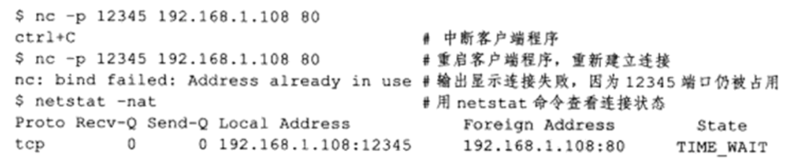
这里我们使用netstat命令査看连接的状态•其输出显示，客户端程序被中断后，连接进入TIME.WAIT状态，12345端口仍被占用，所以客户端重启失败.

对客户端程序来说，我们通常不用担心上面描述的重启问题.因为客户端一般使用系统自动分配的临时端口号来建立连接，而由于随机性，临时端口号一般和程序上一次使用的端
口号（还处于TIME_WAIT状态的那个连接使用的端口号）不同，所以客户端程序一般可以立即重启-上面的例子仅仅是为了说明问题，我们强制客户端使用12345端口，这才导致立
即重启客户端程序失败.

# 复位报文段
    在某些特殊条件下，TCP连接的一端会向另一端发送携带RST标志地报文段，即复位报文段，以通知对方关闭连接或重新建立连接。

## 访问不存在的端口
当客户端程序访问一个不存在的端口时，目标主机将给它发送一个复位报文段。收到复位报文段的一端应该关闭连接或者重新连接，而不能回应这个复位报文段。

实际上，当客户端程序向服务器的某个端口发起连接，而该端口仍被处于TIME_WAIT状态的连接所占用时，客户端程序也将收到复位报文段。

## 异常终止连接
前面讨论的连接终止方式都是正常的终止方式：数据交换完成之后，一方给另一方发送结束报文段。TCP提供了异常终止一个连接的方法，即给对方发送一个复位报文段。一旦发送了复位报文段，发送端所有排队等待发送的数据都将被丢弃。

应用程序可以使用socket选项SO_LINGER来发送复位报文端，以异常终止一个连接。

## 处理半打开连接
考虑下面的情况：服务器（或客户端）关闭或者异常终止了连接，而对方没有接收到结束报文段（比如发生了网络故障），此时，客户端（或服务器）还维持着原来的连接，而服务器（或客户端）即使重启，也已经没有该连接的任何信息了。我们将这种状态称为半打开状态，处于这种状态的连接称为半打开连接。如果客户端（或服务器）往处于半打开状态的连接写入数据，则对方将回应一个复位报文段。

# TCP交互数据流
前面讨论了TCP连接及其状态，从本节开始我们讨论通过TCP连接交换的应用程序数据。TCP报文段所携带的应用程序数据按照长度分为两种：交互数据和成块数据。交互数据仅包含很少的字节。使用交互数据的应用程序(或协议)对实时性要求高，比如telnet、ssh等。成块数据的长度则通常为TCP报文段允许的最大数据长度。使用成块数据的应用程序（或协议）对传输效率要求高，比如ftp.

考虑如下情况：在ernest-laptop上执行telnet命令登录到本机，然后在shell命令提示符后执行ls命令，同时用tcpdump抓取这一过程中telnet客户端和telnet服务器交换的TCP报文段。TCP交互数据流如下：
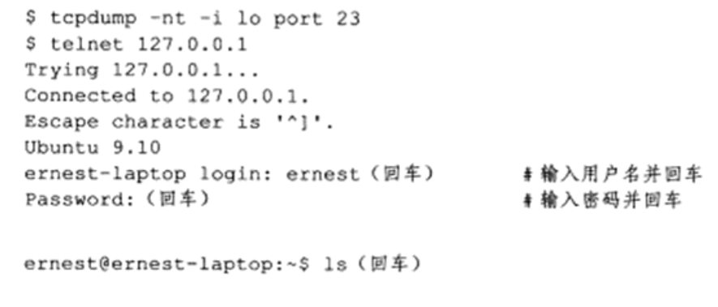
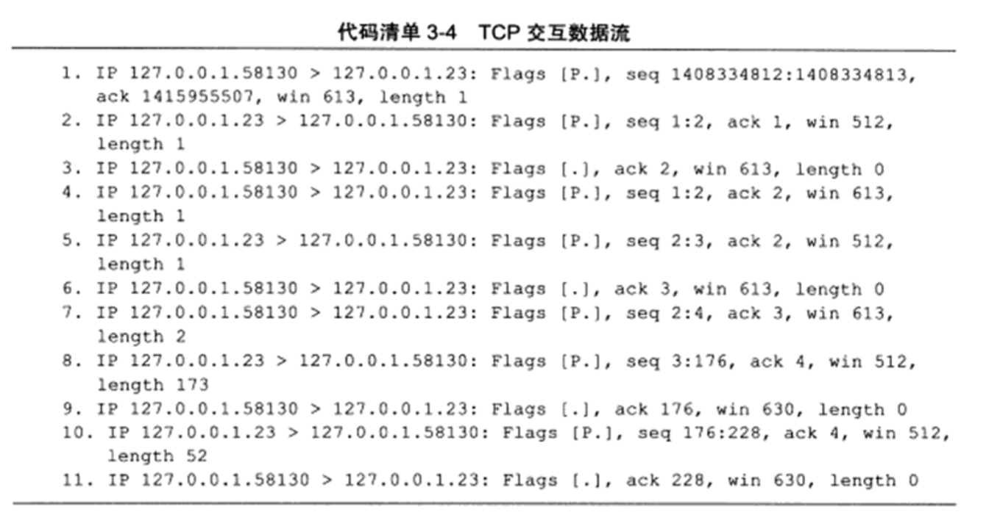
TCP报文段1由客户端发送给服务器，它携带1个字节的应用程序数据，即字毋“1" ,TCP报文段2是服务器对TCP报文段1的确认，同时回显字母“1”.TCP报文段3是客户端对TCP报文段2的确认.第4〜6个TCP报文段是针对字母“s”的上述过程.TCP报文段7传送的2字节数据分别是，客户端键入的回车符和流结束符（EOF,本例中是0x00）. TCP报文段8携带服务器返回的客户査询的目录的内容(ls命令的输出），包括该目录下文件的文件名及其显示控制参数.TCP报文段9是客户端对TCP报文段8的确认. TCP报文段10携带的也是服务器返回给客户端的数据，包括一个回车符，一个换行符、客户端登录用户的PS1环境变量（第一级命令提示符）. TCP报文段11是客户端对TCP报文段10的确认.

在上述过程中，客户端针对服务器返回的数据所发送的确认报文段（TCP报文段6. 9和11）都不携带任何应用程序数据（长度为0）,而服务器每次发送的确认报文段（TCP报文段2、5、8和10）都包含它需要发送的应用程序数据.服务器的这种处理方式称为延迟确认，即它不马上确认上次收到的数据，而是在一段延迟时间后査看本端是否有数据需要发送，如果有，则和确认信息一起发出.因为服务器对客户请求处理得很快，所以它发送确认报文段的时候总是有数据一起发送.延迟确认可以減少发送TCP报文段的數量.而由于用户的输入速度明显慢于客户端程序的处理速度，所以客户端的疏认报文段总是不携带任何应用程序数据・前文曾提到，在TCP连接的建立和断开过程中，也可能发生延迟确认•

上例是在本地回路运行的结果，在局城网中也能得到基本相同的结果，但在广域网就未必如此了.广域网上的交互数据流可能经受很大的延迟，并且，携带交互数据的微小TCP报
文段数量一般很多（一个按键输入就导致一个TCP报文段），这些因素都可能导致拥塞发生.解决该冋題的一个简单有效的方法是使用Nagle算法.

Nagle算法要求一个TCP连接的通信双方在任意时刻都最多只能发送一个未被确认的TCP报文段，在该TCP报文段的确认到达之前不能发送其他TCP报文段。另一方面，发送方在等待确认的同时收集本端需要发送的微量数据，并在确认到来时以一个TCP报文段将它们全部发出。这样就就极大减少了网络上的微小TCP报文的数量。该算法的另一优点在于其自适应性：确认到达得越快，数据也就发送得越快。

# TCP成块数据流
下面考虑用FTP协议传输一个大文件。在ernest-laptop上启动一个vsftpd服务器程序（升级的、安全版的ftp服务器程序），并执行ftp命令登录该服务器上，然后在ftp命令提示符后输入get命令，从服务器下载一个几百兆的大文件，同时用tcpdump抓取这一个过程中ftp客户端和vsftpd服务器交换的TCP报文段。具体操作过程如下：
```
$ sudo tcpdump -nt -i eth0 port 20                       # vsftpd服务器程序使用端口号20
$ ftp 127.0.0.1
Connected to 127.0.0.1
220 (vsFTPd 2.3.0)
Name (127.0.0.1:ernest):ernest(回车)                     # 输入用户名
331 Please specify the password.
Password:(回车)                                          # 输入密码并回车
230 Login Successful
Remote system type is unix.
Using bunary mode to transfer files.
ftp> get bigfile(回车)                                   # 获取大文件bigfile
```
以下是tcpdump输出
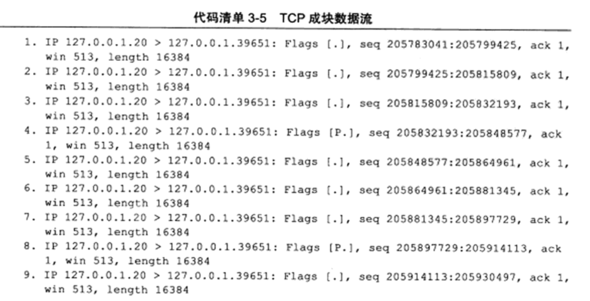
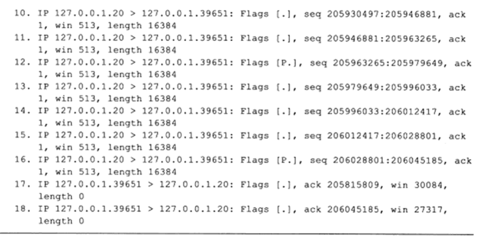
注意，客户端发送的最后两个TCP报文段17和18,它们分别是对TCP报文段2和16的确认（从序号值和确认值来判断）.由此可见，当传输大最大块数据的时候，发送方会连续发送多个TCP报文段，接收方可以一次确认所有这些报文段.那么发送方在收到上一次确认后，能连续发送多少个TCP报文段呢？这是由接收通吿窗口（还需要考虑拥塞窗口，见后文）的大小决定的.TCP报文段17说明客户端还能接收30084 X 64字节（本例中窗口扩大因子为6）,即1925376字节的数据。而在TCP报文段18中，接收通吿窗口大小为1748288字节，即客户端能接收的数据fit变小了.这表明客户端的TCP接收缓冲区有更多的数据未被应用程序读取而停留在其中，这些数据都来自TCP报文段3〜16中的一部分.服务器收到TCP报文段18后，它至少（因为接收通告窗口可能扩大）还能连续发送的未被确认的报文段数量是1748288/16384个，即106个（但一般不会连续发送这么多）.其中，16384是成块数据的长度（见TCP报文段1〜16的length值），很显然它小于但接近MSS规定的16396字节•

# 带外数据
有些传输层协议具有带外(Out Of Band, 00B)数据的概念，用于迅速通告对方本端发生的重要事件•因此，带外数据比普通数据(也称为带内数据)有更高的优先级，它应该总是立即被发送，而不论发送缓冲区中是否有排队等待发送的普通数据.带外数据的传输可以使用一条独立的传输层连接，也可以映射到传输普通数据的连接中.实际应用中，带外数据的使用很少见，已知的仅有telnet、ftp等远程非活跃程序.

UDP没有实现带外数据传输，TCP也没有真正的带外数据.不过TCP利用其头部中的紧急指针标志和紧急指针两个字段，给应用程序提供了一种紧急方式.TCP的紧急方式利用传输普通数据的连接来传输紧急数据.这种紧急数据的含义和帯外数据类似，因此后文也将TCP紧急数据称为带外数据.

我们先来介绍TCP发送带外数据的过程•假设一个进程已经往某个TCP连接的发送缓冲区中写入了N字节的普通数据，并等待其发送•在数据被发送前，该进程又向这个连接写入了 3字节的带外数据“abc”.此时，待发送的TCP报文段的头部将被设置URG标志，并且紧急指针被设置为指向最后一个带外数据的下一字节（进一步减去当前TCP报文段的序号值得到其头部中的紧急偏移值）。如下图所示
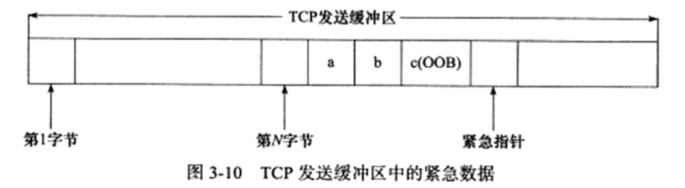
由上图可见，发送端一次发送的多字节的带外数据只有最后一字节被当作带外数据（字母c），其他数据被当成了普通数据。如果TCP模块以多个TCP报文端来发送上图所示TCP缓冲区中的内容，则每个TCP报文段都将设置URG标志，并且它们的紧急指针指向同一个位置（数据流中带外数据的下一个位置），但只有一个TCP报文段真正携带带外数据。

现在考虑TCP接收带外数据的过程,TCP接收端只有在接收到紧急指针标志时才检査紧急指针，然后根据紧急指针所指的位置确定带外数据的位置，并将它读入一个特殊的缓存中。这个緩存只有1字节，称为带外缓存.如果上层应用程序没有及时将带外数据从帯外缓存中读出，则后续的带外数据（如果有的话）将覆盖它・

前面讨论的带外数据的接收过程是TCP模块接收带外数据的默认方式.如果我们给TCP连接设置了 SO_OOBINLINE选项，则带外数据将和普通数据一样被TCP模块存放在TCP接收缓冲区中.此时应用程序需要像读取普通数据一样来读取带外数据。那么这种情况下如何区分带外数据和普通数据呢？显然，紧急指针可以用来指出带外数据的位置，socket编程接口也提供了系统调用来识别带外数据.

# TCP超时重传
TCP服务必须能够重传超时时间内未收到确认的TCP报文段.为此，TCP模块为每个TCP报文段都维护一个重传定时器，该定时器在TCP报文段第一次被发送时启动.如果超时时间内未收到接收方的应答，TCP模块将重传TCP报文段并重置定时器•至于下次重传的超时时间如何选择，以及最多执行多少次重传，就是TCP的重传策略。

在ernest-laptop上启动iperf服务器程序，然后从Kongming20上执行telnet命令登录该服务器。接下来，从telnet客户端发送一些数据（“1234”）给服务器，然后断开服务器的网线并再次从客户端发送一些数据给服务器（此处是“12”）。同时，用tcpdump抓取这一过程中客户端和服务器交换的TCP报文段。具体操作过程如下：
```
$ sudo tcpdump -n -i eth0 port 5001
$ iperf -s                                         # 在ernest-laptop上执行
$ telnet 192.168.1.108 5001                        # 在Kongming20上执行
Trying 192.168.1.108...
Connected to 192.168.1.108.
Escape character is '^]'.
1234                                               # 发送完之后断开服务器网线
12
Connection closed by foreign host
```
iperf是一个测量网络状况的工具，-s选项表示将其作为服务器运行。iperf默认监听5001端口，并丢弃该端口上接收到的所有数据，相当于一个dicard服务器。上述操作过程中tcpdump输出代码如下：
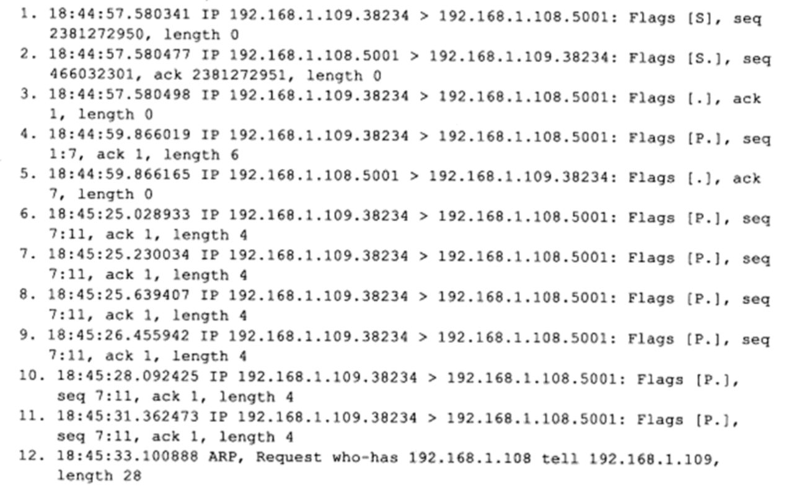
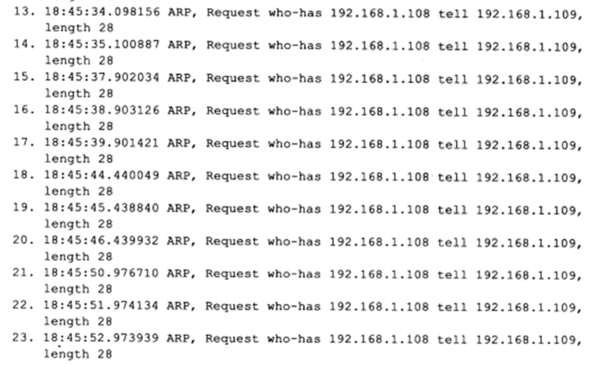

TCP报文段1〜3是三次握手建立连接的过程，TCP报文段4〜5是客户端发送数据“1234”（应用程序数据长度为6,包括回车、换行两个字符，后同）及服务器确认的过程.TCP报文段6是客户端第一次发送数据“12”的过程.因为服务器的网线被断开，所以客户端无法收到TCP报文段6的确认报文段.此后，客户端对TCP报文段6执行了 5次重传,它们是TCP报文段7〜11,这可以从每个TCP报文段的序号得知.此后，数据包12〜23都是ARP模块的输出内容，即KongmingZO査ernest-laptop的MAC地址.

Linux有两个重要的内核参数与TCP超时重传相关：/proc/sys/net/ipv4/tcp_retries1和/proc/sys/net/ipv4/tcp_retrires2.前者指定在底层IP接管之前TCP最少执行的重传次數，默认值是3.后者指定连接放弃前TCP最多可以执行的重传次数，默认值是15 （—般对应13-30 min）.在我们的实例中，TCP超时重传发生了 5次，连接坚持的时间是15 min （可以用date命令来测量）.

# 拥塞控制

## 拥塞控制概述
TCP模块还有一个重要的任务，就是提高网络利用率，降低丢包率，并保证网络資源对每条数据流的公平性.这就是所谓的拥塞控制.

TCP拥塞控制的标准文档是RFC 5681,其中详细介绍了拥塞控制的四个部分：慢启动（slow start）、拥塞避免（congestion avoidance）、快速重传（fast retransmit）和快速恢复（fast recovery）。拥塞控制算法在Linux下有多种实现。比如reno算法、vegas算法和cubic算法等。它们或者部分或者全部实现了上述四个部分。/proc/sys/net/ipv4/tcp_congestion_control文件指示机器当前所拥有的拥塞控制算法。

拥塞控制的最终受控变量是发送端向网络一次连续写入（收到其中第一个数据的确认之前）的数据量，我们称为SWND （Send Window.发送窗口不过，发送端最终以TCP报文段来发送数据，所以SWND限定了发送端能连续发送的TCP报文段数量.这些TCP报文段的最大长度（仅指数据部分）称为SMSS （Sender Maximum Segment Size.发送者最大段大小），其值一般等于MSS.

发送端需要合理地选择SWND的大小，如果SWND太小，会引起明显的网络延迟；反之，如果SWND太大，则容易导致网络拥塞.前文提到，接收方可通过其接收通告窗口（RWND）来控制发送端的SWND.但这显然不够，所以发送端引入了一个称为拥塞窗口（Congestion Window， CWND）的状态变量.实际的SWND值是RWND和CWND中的较小者.下显示了拥塞控制的輸入和输出（可见，它是一个闭环反馈控制）.
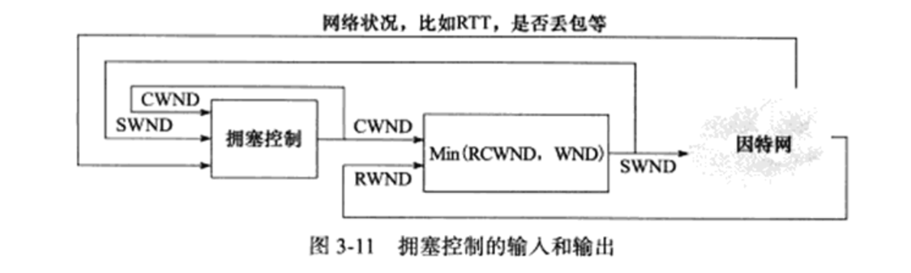

## 慢启动和拥塞避免
TCP连接建立好之后，CWND将被设置成初始值IW(Initial Window),其大小为2-4个SMSS.但新的Linux内核提高了该初始值，以减小传输滞后.此时发送端最多能发送IW字节的数据.此后发送端每收到接收端的一个确认，其CWND就按照下増加：
```
CWND += min(N, SMSS)                                                  （式3-1）
```
其中N是此次确认中包含的之前未被确认的字节数.这样一来，CWND将按照指数形式扩大，这就是所谓的慢启动.慢启动算法的理由是，TCP模块刚开始发送数据时并不知道网络的实际情况，需要用一种试探的方式平滑地増加CWND的大小.但是如果不施加其他手段，慢启动必然使得CWND很快膨胀(可见慢启动其实不慢)并最终导致网络拥塞•因此TCP拥塞控制中定义了另一个重要的状态变量：慢启动门限(slow start threshold size, ssthresh).当CWND的大小超过该值时，TCP拥塞控制将进入拥塞避免阶段。

拥塞避免算法使得CWND按照线形方式增加，从而减缓其扩大。RFC 5681中提到了如下两种实现方式：
1. 每个RTT（Round-Trip Time）时间内按照式(3-1)计算新的CWND，而不论该RTT时间内发送端收到多少个确认。
2. 每收到一个对新数据的确认报文段，就按照式（3-2）来更新CWND。
```
CWND += SMSS * SMSS / CWND                                             (式3-2)
```
下图粗略地描述了慢启动和拥塞避免发生的时机和区别。该图中，我们以SMSS为单位来显示CWND(实际上它是以字节为单位的)，以次数为单位来显示RTT,这只是为了方便讨论问题。此外，我们假设当前的ssthresh是16SMSS大小（当然，实际的ssthresh显然远不止这么大）。
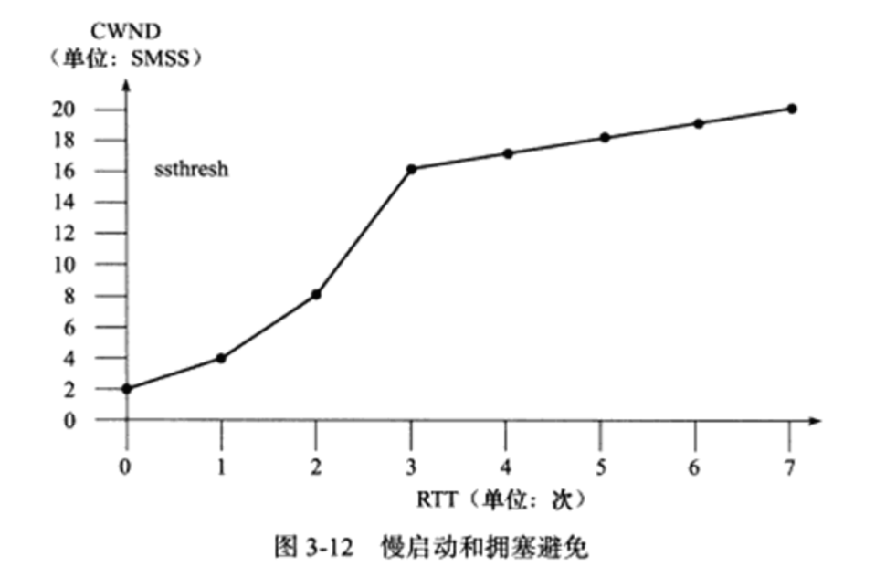

以上我们讨论了发送端在未检测到拥塞时所采用的积极避免拥塞的方法。接下来介绍拥塞发生时（可能发生在慢启动阶段或者拥塞避免阶段）拥塞控制的行为。不过我们先要搞清楚发送端是如何判断拥塞已经发生的。发送端判断拥塞发生的依据有如下两个：
1. 传输超时，或者说TCP重传定时器溢出。
2. 接收到重复的确认报文段。

拥塞控制对这两种情况有不同的处理方式。对第一种情况任然使用慢启动和拥塞避免。对第二种情况则使用快速重传和快速恢复（如果是真的发生拥塞的话），这种情况将在后面讨论。注意，第二种情况如果发生在重传定时器溢出之后，则也被拥塞控制当成第一种情况来对待。

如果发送端检测到拥塞发生是由于传输超时，即上述第一种情况，那么它将执行重传并做如下调整：
```
ssthresh = max(FlightSize/2, 2 * SMSS)          CWMD <= SMSS                                             (3-3)
```
其中FlightSize是已经发送但未收到确认的字节数。这样调整之后，CWMD将小于SMSS,那么也必然小于新的慢启动门限制ssthresh(因为根据式(3-3),它一定不小于SMSS的2倍)，故而拥塞控制再次进入慢启动阶段。

## 快速重传和快速恢复
在很多情况下，发送端都可能接收到重复的确认报文段，比如TCP报文段丢失，或者接收端收到乱序TCP报文段并重排之等。拥塞控制算法需要判断当收到重复的确认报文段时，网络是否真的发生了拥塞，或者说TCP报文段是否真的丢失了。具体做法是：发送端如果连续收到3个重复的确认报文段，就认为是拥塞发生了。然后它启用快速重传和快速恢复算法来处理拥塞，过程如下：
1. 当收到第3个重复的确认报文段时，按照式（3-3）计算ssthresh，然后立即重传丢失的报文段，并按照式(3-4)设置CWND
```
CWND = ssthresh + 3 * SMSS                                                                               (3-4)
```
2. 每次收到1个重复的确认时，设置CWND = CWND + SMSS. 此时发送端可以发送新的TCP报文段（如果新的CWND允许的话）
3. 当收到新数据的确认时，设置CWND = ssthresh(sstresh是新的慢启动门限值，由第一步计算得到)。

快速重传和快速恢复完成之后，拥塞控制将恢复到拥塞避免阶段，这一点由第三步操作可得知。