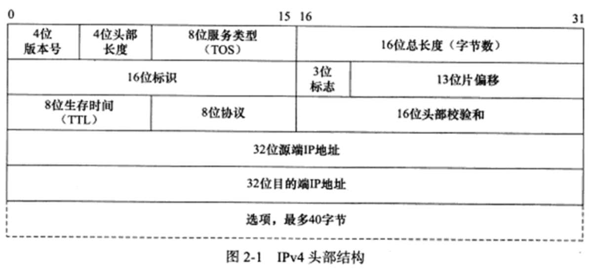
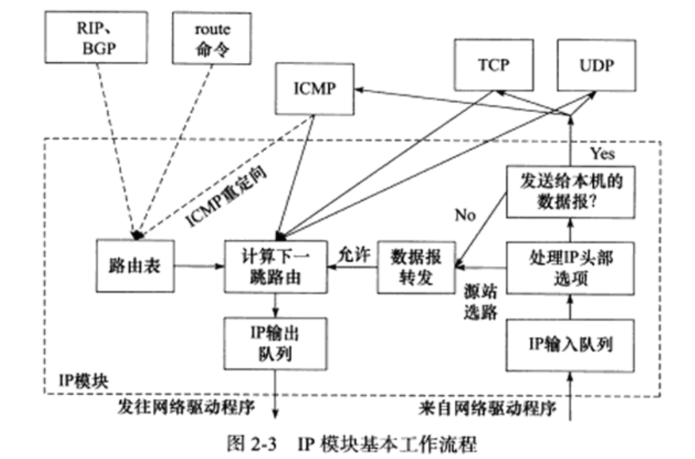

本章主要介绍
1. IP头部信息
2. IP数据报的路由和转发

# IP 服务的特点
IP协议是TCP/IP协议族的动力，它为上层协议提供无状态、无连接、不可靠的服务。

虽然IP数据报头部提供了一个标识字段，用以唯一标识一个IP数据报，但它是被用来处理IP分片和重组的，而不是用来指示接收顺序的。

发送端的IP模块一旦检测到IP数据报发送失败，就通知上层协议发送失败，而不会试图重传。因此，使用IP服务的上层协议（比如TCP协议）需要自己实现数据确认、超时重传等机制以达到可靠传输的目的。

# IPv4 头部结构
## IPv4 头部结构
其长度通常为20字节，除非含有可变长的选项部分。

1. 4位版本号指定IP协议的版本。对IPv4来说，其值是4。其他IPv4协议的扩展版本（如SIP协议和PIP协议）则具有不同的版本号
2. 4位头部长度标识该IP头部有多少个32bit字（IP头部长度最长为60字节）
3. 8位服务类型（Type Of Service， TOS）包括一个3位的优先权字段（现在已经被忽略），4位的TOS字段和1位保留字段（必须设置为0）。4位的TOS字段分别表示：最小延时，最大吞吐量，最高可靠性和最小费用。其中最多有一个能置为1，应用程序应该根据实际需要来设置它。比如像ssh和telnet这样的等了程序需要的是最小延时的服务，而文件传输程序ftp则需要最大吞吐量的服务。
4. 16位总长度是指整个IP数据报的长度，以字节为单位，因此IP数据报的最大长度为65535字节。但由于MTU（maximum transmission unit）的限制，长度超过MTU的数据报都将被分片传输，所以实际传输的IP数据报（或分片）的长度都远远没有达到最大值。接下来的3个字段则描述了如何实现分片。
5. 16位标识，唯一的标识主机发送的每一个数据报。其初始值由系统随机生成；每发送一个数据报，其值就加1.该值在数据报分片时被复制到每个分片中，因此一个数据报的所有分片都具有相同的标识值
6. 3位标志字段的第一位保留，第二位（DF）表示“禁止分片”。如果设置了这个位，IP模块将不对数据报进行分片。在这种情况下，如果IP数据报长度超过MTU的话，IP模块将丢弃该数据报并返回一个ICMP差错报文。第三位（MF， more fragment），除了数据报的最后一个分片外，其他分片都要把它置为1
7. 13位分片偏移（fragmentation offset）是分片相对原始IP数据报开始处（仅指数据部分）的偏移。实际的偏移值是该值左移3位（乘8）后得到的。由于这个原因，除了最后一个IP分片外，每个IP分片的数据部分的长度必须是8的整数倍（这样才能保证后面的IP分片拥有一个合适的偏移值）。
8. 8位生存时间（Time To Live， TTL）是数据报达到目的地之前允许经过的路由器跳数。TTL值被发送端设置（常见的值是64）。数据报在转发过程中每经过一个路由，该值就被路由器减1.当TTL值减为0时，路由器将丢弃数据报，并向源端发送一个ICMP差错报文。TTL值可以防止数据陷入路由循环。
9. 8位协议（protocol）用来区分上层协议，/etc/protocols文件定义了所有上层协议对应的protocol字段的数值。其中，ICMP是1，TCP是6，UDP是17.
10. 16位头部校验和由发送端填充，接收端对其使用CRC算法以检验IP数据报头部（仅检验头部）在传输过程是否损坏
11. 32位的源端IP地址和目的端IP地址用来标识数据的发送端和接收端。一般情况下，这两个地址在整个数据报的传递过程中保持不变，而不论经过多少个中转路由器。
12. 选项字段

可用的IP选项包括（选项字段）
1. 记录路由（record route），吿诉数据报途经的所有路由器都将自己的IP地址填入IP头部的选项部分，这样我们就可以跟踪數据报的传递路径.
2. 时间戳(time stamp),告诉每个路由器都将数据报转发的时间（或时间与IP地址对）填入IP头部的选项部分，这样就可以测量途径路由之间数据报传输的时间。
3. 松散源路由选择（loose source routing）.指定一个路由器IP地址列表，数据报发送过程必须经过其中所有的路由器。
4. 严格源路由选择（strict source routing），和松散源路由选择类似，不过数据报只能经过被指定的路由器。

## 使用tcpdump观察IPv4头部结构
```
$ sudo tcpdump -ntx -i lo                                #抓取本地回路上的数据包
$ telnet 127.0.0.1                                       #开启另一个终端执行telnet命令登录本机
Tring 127.0.0.1...
Connected to 127.0.0.1...
Escape character is '^]'.
Ubuntu 9.10
ernest-laptop login: ernest                              #输入用户名并回车
Password:                                                #输入密码并回车
```
tcpdump输出的第一个数据包，其内容如代码清单2-1所示：
```
IP 127.0.0.1.41612 > 127.0.0.1.23: Flags [s], seq 3499745539, win 32792,
options [mss 16396, sackOK, TS val 40781017 ecr 0, nop, wscale 6], length 0
    0x0000: 4510 003c a5da 4000 4006 96cf 7f00 0001
    0x0010: 7f00 0001 a295 0017 d099 e103 0000 0000
    0x0020: a002 8018 fe30 0000 0204 400c 0402 080a
    0x0030: 0263 44d9 0000 0000 0103 0306
```

该数据包描述的是一个IP数据报.由于我们是使用telnet寰录本机的,所以IP致据报的源端IP地址和目的端IP地址都是“127.0.0.1". telnet K务器程序使用的端口号是23（参见/etc/services文件）,而telnet客户端程序使用临时端口号41621与服务器通信.关于临时端口号，“Flags"、“seq”、“win”和“options”搆述的都是TCP头部信息，“length"指出该IP数据报所携带的应用程序数据的长度。

这次抓包我们开启了 tcpdump的-x选项.使之输出致据包的二进制码.此致据包共包含60字节，其中前20字节是IP头部，后40字节是TCP头部，不包含应用程序数据（length值为0）.现在我们分析IP头部的每个字节。
!IPv4头部各个字段详解](assets/IPv4头部各个字段详解.png)

# IP 路由
IP模块基本工作流程

我们从右往左来分析上图，当IP模块接收到来自数据链路层的IP数据报时，它首先对该数据报的头部做CRC校验，确认无误之后就分析其头部的具体信息。

如果该IP数据报的头部设置了源站选路选项（松散源路由选择或严格源路由选择），则IP模块调用数据报转发子模块来处理该数据报。如果该IP数据报的头部中目标IP地址是本机的某个IP地址，或者是广播地址，即该数据包是发送给本机的，则IP模块就根据数据报头部中的协议字段来决定将它派发给哪个上层应用（分用）。如果IP模块发现这个数据报不是发送给本机的，则也调用数据报转发子模块来处理该数据报。

数据报转发子模块将首先检测系统是否允许转发，如果不允许，IP模块就将数据报丢弃。如果允许，数据报转发子模块将对该数据报执行一些操作，然后将它交给IP数据报输出子模块。

IP数据报应该发送至哪个下一跳路由（或者目标机器），以及经过那个网卡来发送，就是IP路由过程。IP模块实现数据报路由的核心数据结构是路由表。这个表按照数据报的目标IP地址分类，同一类型的IP数据报将被发往相同的下一跳路由器（或者目标机器）。

## 路由机制
我们可以使用route命令或netstat命令查看路由表，执行root命令得到以下内容：
```
Kernel IP routing table
Destination     Gateway         Genmask         Flags   Metric  Ref     Use     Iface
default         192.168.1.1     0.0.0.0         UG      0       0       0       eth0
192.168.1.0     *               255.255.255.0   U       1       0       0       eth0
```
1. Destination  目标网络或主机
2. Gateway      网关地址，*表示目标和本机在同一网络，不需要路由
3. Genmask      网络掩码
4. Flags        路由项标志，常见标志有5种，（U，该路由项是活动的），（H，该路由项的目标是一台主机），（G，该路由项的目标是网关），（D，该路由项由重定向生成的），（M，该路由项被重定向修改过）
5. Metric       路由距离，即到达指定网络所需的中转数
6. Ref          路由项被引用的次数（Linux未使用）
7. Use          该路由项被使用的次数
8. Iface        该路由项对应的输出网卡接口

 