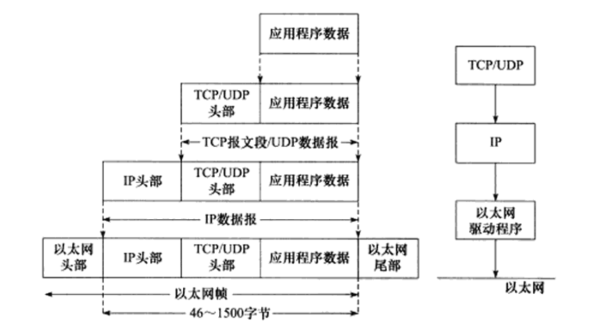

# TCP/IP协议族体系结构以及主要协议


## 数据链路层
数据链路层实现了网卡接口的网络驱动程序，已处理数据在物理媒介（以太网，令牌环等）上的传输

数据链路层两个常用协议：ARP（Address Resolve Protocol，地址解析协议）和RARP协议(Reverse Address Resolve Protocol,逆地址解析协议)实现了IP地址和物理地址的相互转换（通常是MAC地址，以太网，令牌环和802.11无线网络都使用MAC地址）

网络层使用IP地址寻址一台机器，而数据链路层使用物理地址寻址一台机器

RARP协议仅用于网络上的某些无盘工作站。因为缺乏存储设备，无盘工作站无法记录记录自己的IP地址，但它们可以利用于网卡上的物理地址来向网络管理者（服务器或网络管理软件）查询自身的IP地址。运行RARP服务的网络管理者通常存有该网络上所有机器的物理地址到IP地址的映射。

## 网络层
网络层实现数据包的选路和转发。网络层最核心的是IP协议（Internet Protocol，因特网协议）。IP协议根据数据包的目的IP地址来决定如何投递它。如果数据包不能直接发送给目标主机，那么IP协议就为它寻找一个合适的下一跳（next hop)路由器，并将数据包交由该路由器来转发

网络层的另外一个重要的协议是ICMP协议（Internet Control Message Protocol,因特网控制报文协议）。它是IP协议的重要补充，主要用于检测网络连接。ICMP协议使用的报文格式如下：

ICMP报文分为两大类
1. 差错报文 : 目标不可到达（类型值为3）和重定向（类型值为5）
2. 查询报文 : 这类报文用来查询网络信息，比如ping程序就是使用ICMP报文查看目标是否可达（类型这为8）。有的ICMP报文还使用8位代码字段来进一步细分不同的条件。比如重定向报文使用代码值0表示对网络重定向，代码值1表示对主机重定向。

ICMP 报文使用16位校验和字段对整个报文（包括头部和内部部分）进行循环冗余校验（Cyclic Redundancy Check, CRC），以检验报文在传输过程中是否损坏。

需要指出的是，ICMP协议并非严格意义上的网络层协议，因为它使用处于同一层的IP协议提供的服务

## 传输层
传输层为两台主机上的应用程序提供端到端（end to end）的通信。与网络层使用的逐跳通信方式不同，传输层只关心通信的起始端和目的端，而不在乎数据包的中转过程。

可见，数据链路层（驱动程序）封装了物理网络的电气细节；网络层封装了网络连接的细节；传输层则为应用程序封装了一条端到端的逻辑通信链路，它负责数据的收发，链路的超时重连等

传输层协议主要有三个：TCP协议， UDP协议和SCTP协议

TCP协议（Transmission Control Protocol,传输层控制协议）为应用层提供可靠的、面向连接的和基于流（stream）的服务。TCP协议使用超时重传、数据确认等方式来确保数据包被正确地发送至目的端，因此TCP服务是可靠得。使用TCP协议通信得双方必须建立TCP连接，并在内核中为该连接维持一些必要得数据结构，比如连接的状态、读写缓冲区，以及诸多定时器等。当通信结束时，双方必须关闭连接以释放这些内核数据。

UDP协议（User Datagram Protocol，用户数据报协议）则与TCP协议完全相反，它为应用层提供不可靠、无连接和基于数据报的服务。如果数据在途中丢失，或者目的端通过数据校验发现数据错误而将其丢弃，则UDP协议只是简单地通知应用程序发送失败。因此UDP协议通常要自己处理超时重传，数据确认等逻辑。UDP协议是无连接地，即通信双方不保持一个长久地联系，因此应用程序每次发送数据都要明确指定接收端的地址(IP地址等信息)。基于数据报的服务，是相对基于流的服务而言的。每个udp数据报都有一个长度，接收端必须以该长度为最小单位将其所有内容一次性读出，否则数据将被截断。

SCTP协议（Stream Control Transmission Protocol， 流控制传输协议）是一种相对较新的传输层协议。它是为了因特网上传输电话信号而设计的。

## 应用层
ping 是应用程序，而不是协议，它利用ICMP报文检测网络连接，是调试网络环境的必备工具

telnet 协议是一种远程登录协议，它使我们能在本地完成远程任务，

OSPF (Open Shortest Path First, 开放最短路径优先)协议是一种动态路由更新协议，由于路由器之间的通信，已告知对方各自的路由信息。

DNS (Domain Name Service, 域名服务)协议提供机器域名到IP地址的转换。

应用层协议（或程序）可能跳过传输层直接使用网络层提供的服务，比如ping程序和OSPF协议。应用程序（或程序）通常既可以使用TCP服务，又可以使用UDP服务，比如DNS协议。我们可以通过 /etc/services 文件查看所有知名的应用层协议，以及它们都能使用哪些传输层服务。

# 封装

经过TCP封装后的数据称为TCP报文段（TCP message segment）,或者简称TCP段。前文提到，TCP协议为通信双方维持一个连接，并且在内核中存储相关数据。这部分数据中的TCP头部信息和TCP内核缓冲区（发送缓冲区或接收缓冲区）数据一起构成了TCP报文段。

当发送端应用层程序使用send（或者write）函数向一个TCP连接写入数据时，内核中的TCP模块首先把这些数据复制到与该连接对应的TCP内核发送缓冲区中，然后TCP模块调用IP模块提供的服务，传递的参数包括TCP头部信息和TCP发送缓冲区中的数据，即TCP报文段。

经过UDP封装后的数据称为UDP数据报（UDP datagram）。UDP对应用程序数据的封装与TCP类似。不同的是，UDP无须为应用层数据保存副本，因为它提供的服务是不可靠的。当一个UDP数据报被成功发送之后，UDP内核缓冲区中的该数据报就被丢弃了。如果应用程序检测到该数据报未能被接收端正确接收，并打算重发这个数据报，则应用程序需要重新从用户空间将该数据报拷贝到UDP内核发送缓冲区中。

经过IP封装后的数据称为IP数据报（IP datagram）。IP数据报也包括头部信息和数据部分，其中数据部分就是一个TCP报文段、UDP数据报或者ICMP报文。

经过数据链路层封装的数据称为帧（frame）。传输媒介不同，帧的类型也不同。比如以太网上传输的是以太网帧（ethernet frame），而令牌环网络上传输的则是令牌环帧（token ring frame）

以太网帧使用6字节的目的物理地址和6字节的源物理地址来表示通信的双方。

# 分用
当帧到达目的主机时，将沿着协议栈自底向上依次传递。各层协议依次处理帧中本层负责的头部数据，以获取所需的信息，并最终将处理后的帧交给目标应用程序。这个过程称为分用。分用是依靠头部信息中的类型字段实现的。

因为IP协议、ARP协议和RARP协议都使用帧传输数据，所以帧的头部需要提供某个字段（具体情况取决于帧的类型）来区分它们。以以太网帧为例如果类型值为0x800则数据部分为IP数据报， 0x806则为ARP请求或应答报文，以太网驱动程序就将帧交付给ARP模块，0x835，则帧的数据部分为RARP请求或应答报文，

同样，因为ICMP协议、TCP协议和UDP协议都使用IP协议，所以IP数据报的头部采用16位的协议字段来区分它们。

端口号
1. DNS 53
2. HTTP 80

# ARP协议工作原理
下述讨论从IP地址到以太网地址（MAC地址）的转换。

工作原理：主机向自己所在的网络广播一个ARP请求，该请求包含目标机器的IP地址。此网络上的其他机器都将收到这个请求，但只有被请求的目标机器会回应一个ARP应答，其中包含自己的物理地址

## 以太网ARP请求/应答报文详解

1. 硬件类型字段定义物理地址的类型，它的值为1表示MAC地址
2. 协议类型字段表示要映射的协议地址类型，它的值为0x800，表示IP地址。
3. 硬件地址长度字段和协议地址长度字段，顾名思义，其单位是字节。对MAC地址来说，其长度为6；对于IP（v4)地址来说，其长度为4
4. 操作字段指出4种操作类型：ARP请求（值为1）、ARP应答（值为2）、RARP请求（值为3）和RARP应答（值为4）
5. 最后四个字段指定通信双方的以太网地址和IP地址。发送端填充除目的端以太网地址外的其他3各字段，以构建ARP请求并发送之。接收端发现该请求的目的端IP地址是自己，就把自己的以太网地址填进去，然后交换两个目的端地址和两个发送端地址，以构建ARP应答并返回之（操作字段需要设置为2）


由上图可知，ARP请求/应答报文的长度为28字节。如果再加上以太网帧头部和尾部的18字节（见图1-6），则一个携带ARP请求/应答的以太网帧长度为46字节。不过有的实现要求以太网帧数据部分长度至少为46字节。则ARP请求则会填充一些字节

## 使用tcpdump观察ARP通信过程

# DNS 查询和应答功能

## 16位标识字段用于标记一对DNS查询和应答，以此区分一个DNS应答是哪个DNS查询的回应

## 16位标志字段用于协商具体的通信方式和反馈通信状态。DNS报文头部的16位标志字段的细节如图所示

1. QR 查询/应答标志。 0表示这是一个查询报文， 1表示这是一个应答报文
2. opcode 定义查询和应答的类型。0表示标准查询，1表示反向查询（由IP地址获得主机域名），2表示请求服务器状态。
3. AA 授权应答标志，仅由应答报文使用。1表示域名服务器是授权服务器
4. TC 截断标志 仅当DNS报文使用UDP服务时使用。因为UDP数据报有长度限制，所以过长的DNS报文将被截断。1表示DNS报文超过512字节，并被截断
5. RD 递归查询标志。1表示执行递归查询，即如果目标DNS服务器无法解析某主机名，则它将向其他DNS服务器继续查询，如此递归，直到获得结果并把该结果返回给客户端。0表示执行迭代查询，即如果目标DNS服务器无法解析某个主机名。则它将自己知道的其他DNS服务器的IP地址返回给客户端，以供客户端参考。
6. RA 允许递归标志。仅由应答报文使用，
7. zero 未用，必须设置为0
8. rcode 4位返回码。表示应答状态。0表示无错误，3表示域名不存在


16位查询类型表示如何执行查询操作
1. 类型A，值为1，表示获取目标主机的IP地址。
2. 类型CNAME，值为5，表示获得目标主机的别名。
3. 类型PTR，值是12，表示反向查询

16位查询类通常为1，表示获取因特网地址（IP地址）

应答字段、授权字段和额外信息字段都使用资源记录（Resource Record，RR)格式。资源记录格式如图所示

32位域名是该记录中与资源对应的名字，其格式和查询问题中的查询名字段相同。16位类型和16位类字段的含义也与DNS查询问题的对应字段相同/。

32位生存时间表示该查询记录结果可被本地客户端程序缓存多长时间，单位是秒。16位资源数据长度字段和资源数据字段的内容取决于类型字段。对类型A而言，资源数据是32位的IPv4地址，而资源数据长度则位4（以字节为单位）

## Linux下访问DNS服务
我们要访问DNS服务，就必须先知道DNS服务器的IP地址。Linux使用/etc/resolve.conf文件来存放DNS服务器的IP地址，该文件内容如下：
```
# Generated by Network Manager
nameserver 219.239.26.42
nameserver 124.207.160.106
```
其中两个IP地址分别是首选DNS服务地址和备选DNS服务地址。

```
$ host -t A www.baidu.com
www.baidu.com is an alias for www.a.shifen.com.
www.a.shifen.com has address 119.75.217.56
www.a.shifen.com has address 119.75.218.77
```
向首选DNS服务器219.239.26.42查询机器www.baidu.com的IP地址。

## 使用tcpdump观察DNS通信过程
运行host命令以查询主机www.baidu.com对应的IP地址，并使用tcpdump抓取这一过程中LAN上传输的以太网帧。
```
$ sudo tcpdump -i eth0 -nt -s 500 port domain
$ host -t A www.baidu.com
```
这一次执行tcpdump抓包时，我们使用"port domain" 来过滤数据包，表示只抓取使用domain（域名）服务的数据包，即DNS查询和应答报文。tcpdump的输出如下：

# socket 和TCP/IP协议族的关系
由socket定义的这一组API提供如下两点功能：一是将应用程序数据从用户缓冲区中复制到TCP/UDP内核发送缓冲区，以交付内核来发送数据（比如send函数），或者是从内核TCP/UDP接收缓冲区中复制数据到用户缓冲区，以读取数据；二是应用程序可以通过它们来修改内核中各层协议的某些头部信息或其他数据结构，从而精细的控制底层通信的行为。比如可以通过setsockopt函数来设置IP数据报在网络上的存活时间。
