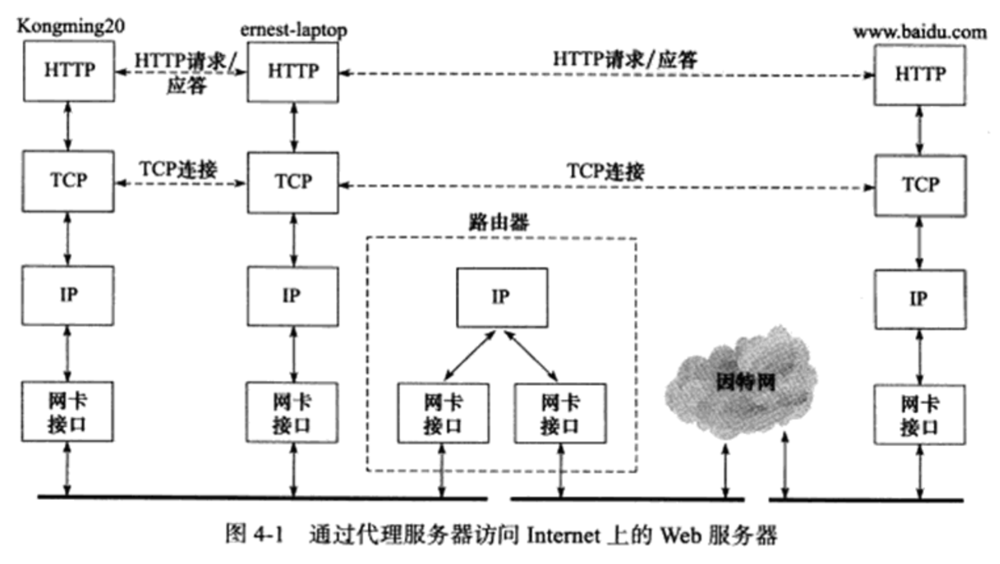

Internet上地Web服务器随处可以获得，我们通过浏览器访问任何一个网站都是在与Web服务器通信

Web客户端和服务器之间使用HTTP协议通信。

# 实例总图
我们按照如下方法来部署通信实例：在Kongming20上运行wget客户端程序，在ernest-laptop上运行squid代理服务器程序.客户端通过代理服务器的中转，获取Internet上的主机www.baidu.com 的首页文档 index.html* 如下图所示.

