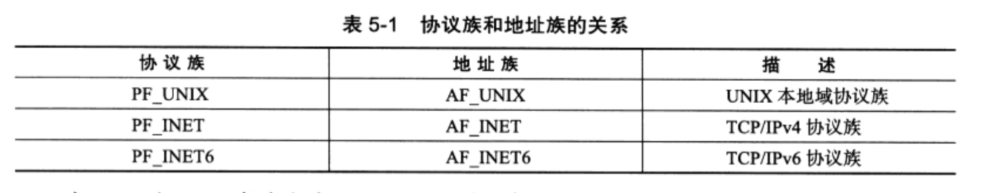
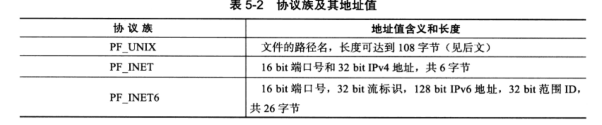
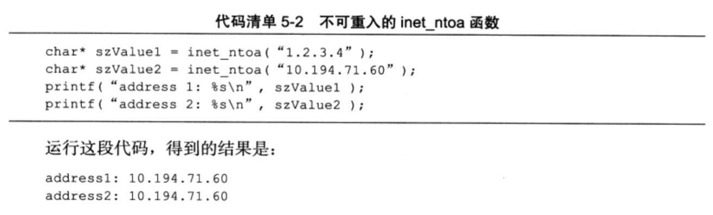
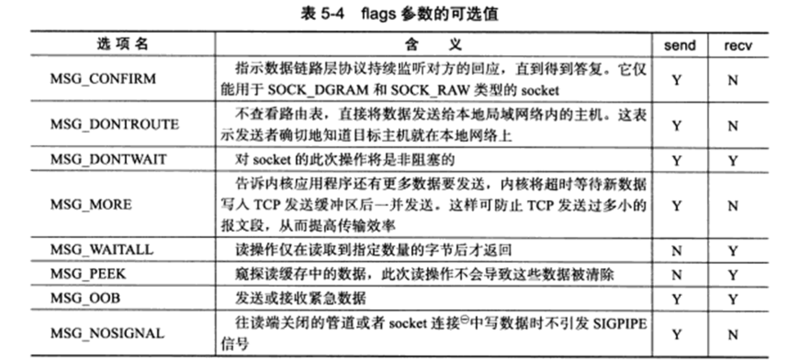

1. socket 地址 API。 socket 最开始的含义是一个 IP 地址和端口对 (ip, port)。它唯一的表示了使用TCP通信端的一端
2. socket 基础 API。 socket 的主要 API 都定义在 sys/socket.h 头文件中，包括socket、命名socket、监听socket、接受连接、发起连接、读写数据、获取地址信息、检测带外标记，以及读取和设置socket选项。
3. 网络信息APE Linux提供了一套网络信息APL以实现主机名和IP地址之间的转换,以及服务名称和端口号之间的转换。这些API都定义在netdb.h头文件中，我们将讨论其中几个主要的函数。


# socket 地址 API
要学习socket地址API,先要理解主机字节序和网络字节序。

## 主机字节序和网络字节序
当格式化的数据（比如32 bit整型数和16 bit短整型数）在两台使用不同字节序的主机之间直接传递时，接收端必然错误地解释之。解决问题的方法是:发送端总是把要发送的
数据转化成大端字节序数据后再发送，而接收端知道对方传送过来的数据总是采用大端字节序，所以接收端可以根据自身采用的字节序决定是否对接收到的数据进行转换（小端机转
换，大端机不转换）。因此大端字节序也称为网络字节序，它给所有接收数据的主机提供了一个正确解释收到的格式化数据的保证.

需要指出的是，即使是同一台机器上的两个进程（比如一个由C语言编写，另一个由JAVA编写）通信，也要考虑字节序的问题（JAVA虚拟机采用大端字节序）。

Linux 提供了如下 4 个函数来完成主机字节序和网络字节序之间的转换：
```c
#include <netinet/in.h>
unsigned long int htonl(unsigned long int hostlong);
unsigned short int htnos(unsigned short int hostshort);
unsigned long int ntohl(unsigned long int netlong);
unsigned short int ntohl(unsigned short int netshort);
```
它们的含义很明确，比如htonl表示“host to network long”，即将长整型（32 bit）的主机字节序数据转化为网络字节序数据。这4个函数中，长整型函数通常用来转换IP地址，短整型函数用来转换端口号（当然不限于此。任何格式化的数据通过网络传输时，都应该使用这些函数来转换字节序）。

## 通用 socket 地址
socket 网络编程接口中表示 socket 地址的是结构体 sockaddr， 其定义如下：
```
#include <bits/socket.h> 
struct sockaddr {
    sa_family_t sa_family;
    char sa_data[14];
}
```
sa_family 成员是地址族类型（sa_family_t)的变量。 地址族类型通常与协议族类型对应。常见的协议族（protocol family, 也称 domain)和对应的地址族如下：

宏PF_*和AF_*都定义在bits/socket.h头文件中，且后者与前者有完全相同的值，所以二者通常混用.

sa_data 成员存放 socket 地址值。但是, 不同的协议族的地址值具有不同的含义和长度，如下所示

由上表可知，14字节的sa_data 根本无法完全容纳多数协议族的地址值。因此，Linux 定义了下面这个新的通用 socket 地址结构体
```c
#include <bits/socket.h>
struct sockaddr_storage {
    sa_family_t sa_family;
    unsigned long int __ss_align;
    char __ss_padding[128-sizeof(__ss_align)];
}
```
这个结构体不仅提供了足够大的空间用于存放地址值，而且是内存对齐的（这是__ss_align成员的作用）。


## 专用 socket 地址
上面这两个通用socket地址结构体显然很不好用，比如设置与获取IP地址和端口号就需要执行烦琐的位操作。所以Linux为各个协议族提供了专门的socket地址结构体。

UNIX本地域协议族使用如下专用socket地址结构体：
```c
#include <sys/un.h>
struct sockaddr_un {
    sa_family_t sin_family;             /*地址族：AF_UNIX*/
    char sun_path[108];                 /*文件路径名*/
}
```
TCP/IP 协议族有sockaddr_in 和sockaddr_in6 两个专用socket 地址结构体，它们分别用 IPv4 和 IPv6
```c
//用于IPv4
struct in_addr {
    u_int32_t s_addr;                   /*IPv4 地址，要用网络字节序表示*/
}
struct sockaddr_in {
    sa_family_t sin_family;             /*地址族：AF_INET */
    u_int16_t sin_port;                 /*端口号，要用网络字节序表示*/
    struct in_addr sin_addr;            /*IPv4 地址结构体 */  
}

//用于IPv6
struct in6_addr {
    unsigned char sa_addr[16];         /*IPv6 地址，要用网络字节序表示*/
}
struct sockaddr_in6 {
    sa_family_t sin6_family;           /*地址族：AF_INET6 */
    u_int16_t sin6_port;               /*端口号， 要用网络字节序表示*/
    u_int32_t sin6_flowinfo;           /*流信息， 应设置为0*/
    struct in6_addr sin6_addr;         /*IPv6 地址结构体 */
    u_int32_t sin6_scope_id;           /*scope ID, 尚处于实验阶段*/
}
```

所有专用socket地址（以及sockaddr_storage）类型的变量在实际使用时都需要转化为通用socket地址类型sockaddr （强制转换即可），因为所有socket编程接口使用的地址参数的类型都是sockaddr.

## IP 地址转换函数
下面三个函数可用于用点分十进制字符串表示的 IPv4 地址和利用网络字节序整数表示的 IPv4 地址之间的转换
```c
#include <arpa/inet.h>
in_addr_t inet_addr(const char* strptr);
int inet_aton(const char* cp, struct in_addr *inp);
char* inet_ntoa(struct in_addr in);
```
inet_addr函数将用点分十进制字符串表示的IPv4地址转化为用网络字节序整数表示的IPv4地址。它失败时返回INADDR_NONEo

inet_aton函数完成和inet_addr同样的功能，但是将转化结果存储于参数inp指向的地址结构中。它成功时返回1,失败则返回0。

inet_ntoa函数将用网络字节序整数表示的IPv4地址转化为用点分十进制字符申表示的IPv4地址。但需要注意的是，该函数内部用一个静态变量存储转化结果，函数的返回值指向该静态内存，因此inet_ntoa是不可重入的。下图揭示了其不可重入性。

下面这对更新的函数也能完成和前面3个函数同样的功能，并且它们同时适用于IPv4地址和IPv6地址：
```c
#include <arpa/inet.h>
int inet_pton(int af, const char* src, void* dst);
const char* inet_ntop(int af, const void* src, char* dst, socklen_t cnt);
```
inet_pton函数将用字符串表示的IP地址src （用点分十进制字符串表示的IPv4地址或用十六进制字符串表示的IPv6地址）转换成用网络字节序整数表示的IP地址，并把转换结
果存储于dst指向的内存中。其中，af参数指定地址族，可以是AF_INET或者AF_INET6。met_pton成功时返回1,失败则返回0并设置errno.

inet_ntop函数进行相反的转换，前三个参数的含义与inet_pton的参数相同，最后一个参数cnt指定目标存储单元的大小。下面的两个宏能帮助我们指定这个大小（分别用于IPv4
和 IPv6）：
```c
#include<netinet/in.h>
#define INET_ADDRSTRLEN 16
#define INET6_ADDRSTRLEN 46
```
inet_ntop成功时返回目标存储单元的地址，失败则返回NULL并设置errno.

# 创建socket
UNIX/Linux 的一个哲学是：所有东西都是文件。 socket 也不例外， 它就是可读、可写、可控制、可关闭的文件描述符。下面的socket系统调用可创建一个socket：
```c
#include <sys/types.h>
#include <sys/socket.h>
int socket(int domain, int type, int protocol);
```
1. domain 参数告诉系统使用哪个底层协议族。对 TCP/IP 协议族而言，该参数应该设置为 PF_INET (Protocol Family of Internet, 用于Ipv4) 或 PF_INET6 (用于IPv6)； 对于UNIX本地域协议族而言，该参数应该设置为PF_UNIX.
2. type   参数指定服务类型。服务类型主要有SOCK_STREAM服务（流服务）和SOCK_DGRAM （数据报）服务。对TCP/IP协议族而言，其值取SOCK_STREAM表示传输层使用TCP协议，取SOCK_DGRAM表示传输层使用UDP协议。
3. protocol 参数是在前两个参数构成的协议集合下，再选择一个具体的协议。不过这个值通常都是唯一的（前两个参数已经完全决定了它的值）。几乎所有情况下，我们都应该把它设置为 0， 表示使用默认协议。

socket系统调用成功时返回一个socket文件描述符，失败则返回-1并设置errno.

# 命名 socket
创建 socket 时，我们给它指定了地址族，但是并未指定使用该地址族中的哪个具体 socket 地址。将一个 socket 与 socket 地址绑定称为给 socket 命名。在服务器程序中，我们通常要命名 socket, 因为只有命名后客户端才能知道该如何连接它。客户端则通常不需要命名 socket，而是采用匿名方式，即使用操作系统自动分配的 socket 地址。命名 socket 的系统调用是 bind, 其定义如下：
```c
#include <sys/types.h>
#include <sys/socket.h>
int bind(int sockfd, const struct sockaddr* my_addr, socklen_t addrlen);
```
bind将my_addr所指的socket地址分配给未命名的sockfd文件描述符，addrlen参数指出该socket地址的长度。

bind成功时返回0,失败则返回-1并设置errno.其中两种常见的errno是EACCES和
EADDRINUSE,它们的含义分别是：
1. EACCES, 被绑定的地址是受保护的地址，仅超级用户能够访问。比如普通用户将socket绑定到知名服务端口（端口号为0~1023）上时，bind将返回EACCES错误。
2. EADDRINUSE, 被绑定的地址正在使用中。比如将 socket 绑定到一个处于 TIME_WAIT 状态的 socket 地址。

# 监听 socket
socket被命名之后，还不能马上接受客户连接，我们需要使用如下系统调用来创建一个监听队列以存放待处理的客户连接：
```c
#include <sys/socket.h>
int listen(int sockfd, int backlog);
```
sockfd参数指定被监听的socket。backlog参数提示内核监听队列的最大长度。监听队列的长度如果超过backlog,服务器将不受理新的客户连接，客户端也将收到ECONNREFUSED错误信息。在内核版本2.2之前的Linux中，backlog参数是指所有处于半连接状态(SYN_RCVD)和完全连接状态(ESTABLISHED)的socket的上限。但自内核版本2.2之后，它只表示处于完全连接状态的socket的上限，处于半连接状态的socket的上限则由 /proc/sys/net/ipv4/tcp_max_syn_backlog 内核参数定义。backlog 参数的典型值是 5。

listen 成功时返回 0， 失败则返回 -1 并设置errno.
```c
#include <sys/socket.h>
#include <netinet/in.h>
#include <arpa/inet.h>
#include <signal.h>
#include <unistd.h>
#include <stdlib.h>
#include <assert.h>
#include <stdio.h>
#include <string.h>

static bool stop = false;
/* SIGTREM 信号的处理函数，触发时结束主程序中的循环 */
static void handle_term(int sig) {
    stop = true;
}

int main(int argc, char* argv[]) {
    signal(SIGTERM, handle_term);

    if (argc <= 3) {
        printf("usage: %s ip_address port_number backlog\n", basename(argv[0]));
        return 1;
    }
    const char* ip = argv[1];
    int port = atoi(argv[2]);
    int backlog = atoi(argv[3]);

    int sock = socket(PF_INET, SOCK_STREAM, 0);
    assert(sock >= 0);

    // 创建一个 IPv4 socket 地址
    struct sockaddr_in address
    bzero(&address, sizeof(address));
    address.sin_family = AF_INET;
    inet_pton(AF_INET, ip, &address.sin_port);
    address.sin_port = htons(port);

    int ret = bind(sock, (struct sockadd*)&address, sizeof(address))l
    assert(ret != -1);

    ret = listen(sock, backlog);
    assert(ret != -1);

    //循环等待
    while (!stop) {
        sleep(1);
    }
    //关闭socket
    close(sock);
    return 0;
}
```
完整连接最多有backlog + 1 个


# 接受连接
下面的系统调用从 listen 监听队列中接受一个连接：
```c
#include <sys/types.h>
#include <sys/socket.h>
int accept(int sockfd, struct sockaddr *addr, socklen_t *addrlen);
```

sockfd 参数是执行过 listen 系统调用的监听 socket。addr 参数用来获取被接受连接的远端 socket 地址，该 socket 地址的长度由 addrlen 参数指出。accept 成功时返回一个新的连接 socket, 该 socket 唯一地标识了被接受的这个连接，服务器可通过读写该 socket 来与被接受连接对应的客户端通信。accept 失败时返回 -1 并设置ernno

现在考虑如下情况：如果监听队列中处于 ESTABLISHED 状态的连接对应的客户端出现网络异常（比如掉线），或者提前退出，那么服务器对这个连接执行的 accept 调用是否成功？我们编写一个简单的服务器程序来测试之，如下：
```c
#include <sys/socket.h>
#include <netinet/in.h>
#include <arpa/inet.h>
#include <assert.h>
#include <stdio.h>
#include <unistd.h>
#include <stdlib.h>
#include <errno.h>
#include <string.h>

int main(int argc, char* argv[]) {
    if (argc <= 2) {
        printf("usage: %s ip_address port_number\n", basename(argv[0]));
        return 1;
    }
    const char *ip = argv[1];
    int port = atoi(argv[2]);

    struct sockaddr_in address;
    bzero(&address, sizeof(address));
    address.sin_family = AF_INET;
    inet_pton(AF_INET, ip, &address.sin_addr);
    address.sin_port = htons(port);
    
    int sock = socket(PF_INET, SOCK_STREAM, 0);
    assert(sock >= 0)

    int ret = bind(sock, (struct sockaddr*)&address, sizeof(address));
    assert(ret != -1);

    ret = listen(sock, 5);
    assert(ret != -1);
    sleep(20);
    struct sockaddr_int client;
    socklen_t client_addrlength = sizeof(client);
    int connfd = accept(sock, (struct sockaddr*)&client, &client_addrlength);
    if (connfd < 0) {
        printf("errno is: %d\n", errno);
    } else {
        //接受连接成功则打印出客户端的IP地址和端口号
        char remote[INET_ADDRESTRLEN];
        printf("connected with ip: %s and port: %d\n", inet_ntop(AF_INET, &client.sin_addr, remote, INET_ADDRSTRLEN), ntohs(client.sin_port));
        close(connfd);
    }
    close(sock);
    return 0;
}
```
由此可见，accept只是从监听队列中取出连接，而不论连接处于何种状态（如上面的ESTABLISHED状态和CLOSE_WAIT状态），更不关心任何网络状况的变化，


# 发起连接
如果说服务器通过 listen 调用来被动接受连接，那么客户端需要通过如下系统调用来主动与服务器建立连接
```c
#include <sys/types.h>
#include <sys/socket.h>

int connect(int sockfd, const struct sockaddr *serv_addr, socklen_t addrlen);
```
sockfd参数由socket系统调用返回一个socket, serv.addr参数是服务务器监听的socket地址，addrlen参数则指定这个地址的长度。

connect 成功时返回0. 一旦成功建立连接，sockfd 就唯一地标识了这个连接，客户端就可以通过读写 sockfd 来与服务器进行通信。connect 失败则返回 -1 并设置 errno.其中两种常见的 errno 是 ECONNREFUSED 和 ETIMEDOUT, 它们的含义如下：
1. ECONNREFUSED, 目标端口不存在
2. ETIMEDOUT,    连接超时

# 关闭连接
关闭一个连接实际上就是关闭该连接对应的socket,这可以通过如下关闭普通文件描述符的系统调用来完成：
```c
#include <unistd.h>
int close(int fd);
```
fd 参数是待关闭的 socket。不过，close 系统调用并非总是立即关闭一个连接，而是将 fd 的引用技术减 1. 只有当 fd 的引用技术减1. 只有当fd的引用计数为0时，才真正关闭连接。多进程程序中，一次 fork 系统调用默认将使父进程中打开的 socket 的引用计数加 1，因此我们必须在父进程和子进程中都对该 socket 执行 close 调用才能将连接关闭。

如果无论如何都要立即终止连接（而不是将socket的引用计数减1〉，可以使用如下的shutdown系统调用（相对于close来说，它是专门为网络编程设计的）：
```c
#include <sys/socket.h>
int shutdown (int sockfd, int howto);
```
sockfd参数是待关闭的socket, howto套败决定了 shutdown的行为,
1. SHUT_RD  关闭 sockfd 上读的这一半.应用程序不能再计对socket文件描述符执行读操作。并且该 socket 接受缓冲区中的数据都被丢弃。
2. SHUT_WR  关闭 sockfd 上写的这一半.sockfd 的发送缓冲区中的数据会在真正关闭连接之前全部发送出去，应用程序不可再对该socket文件描述符执行写操作.这种情况下，连接处于半关闭状态
3. SHUT_RDWR 同时关闭 sockfd 上的读和写

由此可见，shutdown 能够分别关闭 socket 上的读或写，或者都关闭。而 close 在关闭连接时只能将 socket 上的读和写同时关闭。shutdown 成功时返回0， 失败则返回 -1 并设置 errno

# 数据读写

## TCP 数据读写
对文件的读写操作read和write同样适用于socket。但是socket编程接口提供了几个专门用于socket数据读写的系统调用，它们増加了对数据读写的控制。其中用于TCP流数据读
写的系统调用是：
```c
#include <sys/types.h>
#include <sys/socket.h>
ssize_t recv(int sockfd, void *buf, size_t len, int flags);
ssize_t send(int sockfd, const void *buf, size_t len int flags);
```
recv读取sockfd上的数据，buf和len参数分别指定读缓冲区的位数和大小，flags的含义见后文，通常设置为0即可.recv成功时返回实际读取到的数据的长度，它可能小于
我们期望的长度len・因此我们可能要多次调用recv,才能读取到完整的数据.recv可能返回0,这意味着通信对方已经关闭连接了. recv出错时返回-1并设置errno

flags 参数提供了额外的控制

例子：发送带外数据：
```c
#include <sys/socket.h>
#include <netinet/in.h>
#include <arpa/inet.h>
#include <assert.h>
#include <stdio.h>
#include <unistd.h>
#include <string.h>
#include <stdlib.h>

int main(int argc, char* argv[]) {
    if (argc <= 2) {
        printf("usage: %s ip_address port_number\n", basename(argv[0]));
        return 1;
    }
    const char* ip = argv[1];
    int port = atoi(argv[2]);

    struct sockaddr_in server_address;
    bzero(&server_address, sizeof(server_address));
    server_address.sin_family = AF_INET;
    inet_pton(AF_INET, ip, &server_address.sin_addr);
    server_address.sin_port = htons(port);

    int sockfd = socket(PF_INET, SOCK_STREAM, 0);
    assert(sockfd >= 0); 
    if (connect(sockfd, (struct sockaddr*)&server_address, sizeof(server_address)) < 0) {
        printf("connection failed\n");
    } else {
        const char* oob_data = "abc";
        const char* normal_data = "123";
        send(sockfd, normal_data, strlen(normal_data), 0);
        send(sockfd, oob_data, strlen(oob_data), MSG_OOB);
        send(sockfd, normal_data, strlen(normal_data), 0);

        close(sockfd);
        return 0;
    }
}
```
接收带外数据
```c
#include <sys/socket.h>
#include <netinet/in.h>
#include <arpa/inet.h>
#include <assert.h>
#include <stdio.h>
#include <unistd.h>
#include <string.h>
#include <stdlib.h>

#define BUF_SIZE 1024

int main(int argc, char* argv[]) {
    if (argc <= 2) {
        printf("usage: %s ip_address port_number\n", basename(argv[0]));
        return 1;
    }
    const char* ip = argv[1];
    int port = atoi(argv[2]);

    struct sockaddr_in server_address;
    bzero(&server_address, sizeof(server_address));
    server_address.sin_family = AF_INET;
    inet_pton(AF_INET, ip, &server_address.sin_addr);
    server_address.sin_port = htons(port);

    int sockfd = socket(PF_INET, SOCK_STREAM, 0);
    assert(sockfd >= 0); 

    int ret = bind(sock, (struct sockaddr*)&address, sizeof(address));
    assert(ret != -1);

    ret = listen(sock, 5);
    assert(ret != -1);

    struct sockaddr_in client;
    socklen_t client_addrlength = sizeof(client)l
    if connfd = accept(sock, (struct sockaddr*)&client, &client_addrlength);
    if (connfd < 0) printf("errno is: %d\n", errno);
    else {
        char buffer[BUF_SIZE];
        memset(buffer, '\0', BUF_SIZE);
        ret = recv(connfd, buffer, BUF_SIZE - 1, 0);
        printf("got %d bytes of normal data '%s'\n", ret, buffer);

        ret = recv(connfd, buffer, BUF_SIZE - 1, 0);
        printf("got %d bytes of oob data '%s'\n", ret, buffer);

        ret = recv(connfd, buffer, BUF_SIZE - 1, 0);
        printf("got %d bytes of normal data '%s'\n", ret, buffer);
        close(connfd);
    }
    close(sock);
    return 0;
}
```
服务器的输出程序如下：
```
goc 5 bytes of normal data '123ab'
got 1 bytes of oob data 'c'
got 3 bytes of normal data '123'
```

## UDP 数据读写
socket 编程接口中用于 UDP 数据报读写的系统调用是：
```c
#include <sys/types.h>
#include <sys/socket.h>
ssize_t recvfrom(int sockfd, void* buf, size_t len, int flags, struct sockaddr* src_addr, socklen_t* addrlen);
ssize_t sendto(int sockfd, const void* buf, size_t len, int flags, const struct sockaddr* dest_addr, socklent_t addrlen);
```
recvfrom读取sockfd上的数据，buf和len参数分别指定读缓冲区的位置和大小.因为UDP通信没有连接的概念，所以我们每次读取数据都需要获取发送端的socket地址，即参数rc_addr所指的内容，addrlen参数则指定该地址的长度.

sendto往sockfd上写入数据，buf和len参数分别指定写缓冲区的位置和大小. dest_addr参数指定接收端的socket地址，addrlen参数则指定该地址的长度.

值得一提的是，recvfrom/sendto系统调用也可以用于面向连接（STREAM）的socket的数据读写，只需要把最后两个参数都设置为NULL以忽略发送端/接收端的socket地址（因
为我们已经和对方建立了连接，所以巳经知道其socket地址了）.


## 通用数据读写函数
socket 编程接口还提供了一对通用的数据读写系统调用。它门不仅仅能用于 TCP 流数据，也能用于 UDP 数据报：
```c
#include <sys/socket.h>
ssize_t recvmsg(int sockfd, struct msghdr* msg, int flags);
ssize_t recvmsg(int sockfd, struct msghdr* msg, int flags);
```
sockfd 参数指定被操作的目标 socket。msg 参数是 msghdr 结构体类型的指针，msghdr 结构体的定义如下：
```c
struct msghdr {
    void* msg_name;                     // socket地址
    socklen_t msg_namelen;              // socket地址的长度
    struct ivoc* msg_iov;               // 分散的内存块
    int msg_ivolen;                     // 分散的内存块的数量
    void* msg_control;                  //指向辅助数据的起使位置
    socklen_t msg_controllen;           // 辅助数据的大小
    int msg_flags;                      // 复制函数中的 flags 参数，并在调用过程中更新
}
```
msg_name成员指向一个socket地址结构变量.它指定通信对方的socket地址.对于面向连接的TCP协议，该成员没有意义，必须被设置为NULL.这是因为对数据流socket而言，对方的地址已经知道. msg_namelen成员则指定了 msg_ame所指socket地址的长度.


msg_iov 成员是 iovc 结构体类型的指针，iovec 结构体的定义如下：
```c
struct iovec {
    void *iov_base;    //内存起使地址
    size_t iov_len;    //这块内存的长度
}
```
由上可见，iovec结构体封装了一块内存的起始位置和长度.msg_iovlen指定这样的iovec结构对象有多少个。对于recvmsg而言，数据将被读取并存放在msg_iovlen块分散的内存中，这些内存的位置和长度则由msg_iov指向的数组指定，这称为分散读(scatter read)：对于sendmsg而言，msg_iovlen块分散内存中的数据将被一并发送，这称为集中写(gather write)

msg_control 和 msg_controllen 成员用于辅助数据的传送

msg_flags成员无须设定，匕会夏制recvmsg/sendmsg的flags参数的内容以影响数据读写过程• recvmsg还会在调用结束前，将某些更新后的标志设置到msg_flags中.recvmsg/sendmsg的flags参数以及返回值的含义均与send/recv的flags参数及返回值相同。


# 带外标记


# 地址信息函数
```c
#include <sys/socket.h>
int getsockname ( int sockfd, struct sockaddr* address, socklen_t* address_len );
int getpeername ( int sockfd, struct aockaddr* address, socklen_t* address len );
```


# socket 选项
```c
```