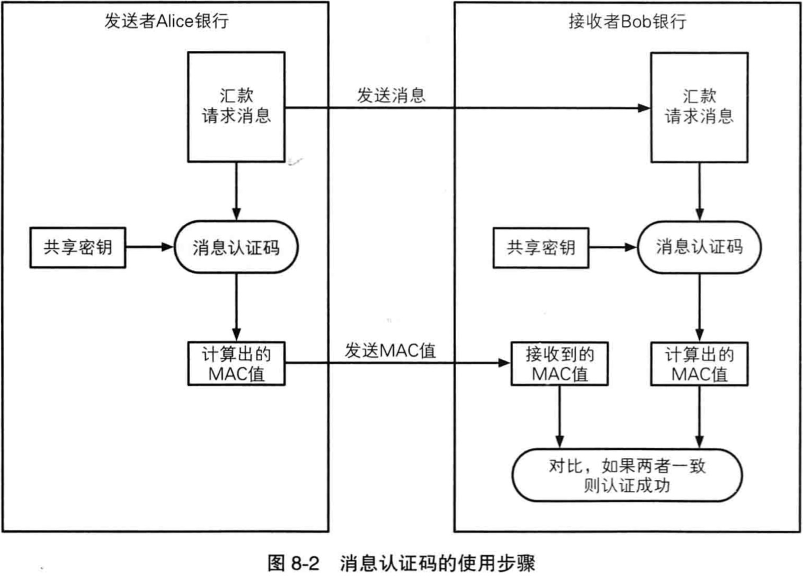
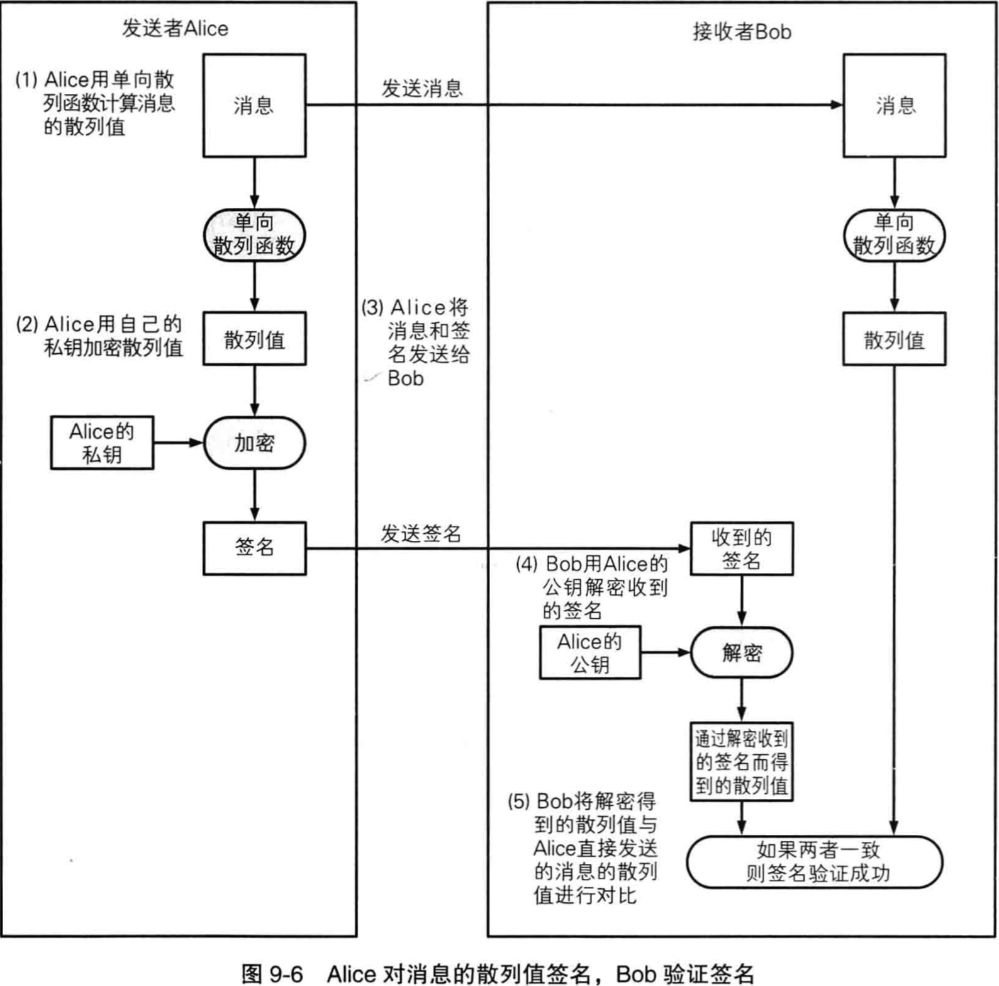

# SSL 与 TSL
1. SSL （Secure Socket Layer） 安全套接层，于 1994 年由网景公司设计，并于 1995 年发布了 3.0 版本
2. TSL （Transport Layer Security） 传输层安全性协议，是 IETF 在 SSL3.0 的基础上设计的协议。

# 从密码学角度理解 HTTPS
HTTPS 使用 TLS 保证安全，这里的“安全”分两部分，一是传输内容加密、二是服务端的身份认证
## TLS 工作流程

## 密码基础
### 伪随机数生成器
为什么叫伪随机数，因为没有真正意义上的随机数，具体可以参考 Random/TheadLocalRandom
它的主要作用在于生成对称密码的秘钥、用于公钥密码生成秘钥对

### 消息认证码
消息认证码主要用于验证消息的完整性与消息的认证，其中消息的认证指“消息来自正确的发送者”

消息认证码用于验证和认证，而不是加密

1. 发送者与接收者事先共享密钥
2. 发送者根据发送消息计算 MAC 值
3. 发送者发送消息和 MAC 值
4. 接收者根据自己计算的 MAC 值与收到的 MAC 对比
5. 如果对比成功，说明消息完整，并来自与正确的发送者
   
### 数字签名
消息认证码的缺点在于无法防止否认，因为共享密钥被 client, server 两端拥有，server可以伪造 client 发送给自己的消息（自己给自己发送消息），为了解决这个问题，我们需要它们有各自的密钥不被第二个知晓（这样也解决了共享密钥的配送问题）

数字签名和消息认证都不是为了加密，可以将单向散列函数获取散列值的过程理解为使用 md5 摘要算法获取摘要的过程

使用自己的私钥对自己所认可的消息生成一个该消息专属的签名，这就是数字签名，表明我承认该消息来自自己

注意：私钥用于加签，公钥用于解签，每个人都可以解签，查看消息的归属人

### 公钥密码
公钥密码也叫非对称密码，由公钥和私钥组成，它是最开始是为了解决秘钥的配送传输安全问题，即，我们不配送私钥，只配送公钥，私钥由本人保管

它与数字签名相反，公钥密码的私钥用于解密、公钥用于加密，每个人都可以用别人的公钥加密，但只有对应的私钥才能解开密文

client：明文 + 公钥 = 密文

server：密文 + 私钥 = 明文

注意：公钥用于加密，私钥用于解密，只有私钥的归属者，才能查看消息的真正内容

### 证书
全称公钥证书（Public-Key Certificate, PKC), 里面保存着归属者的基本信息，以及证书过期期间、归属者的公钥，并由认证机构（Certifaction Authority, CA)施加数字签名，表明，某个认证机构认定该公钥的确属于此人。

